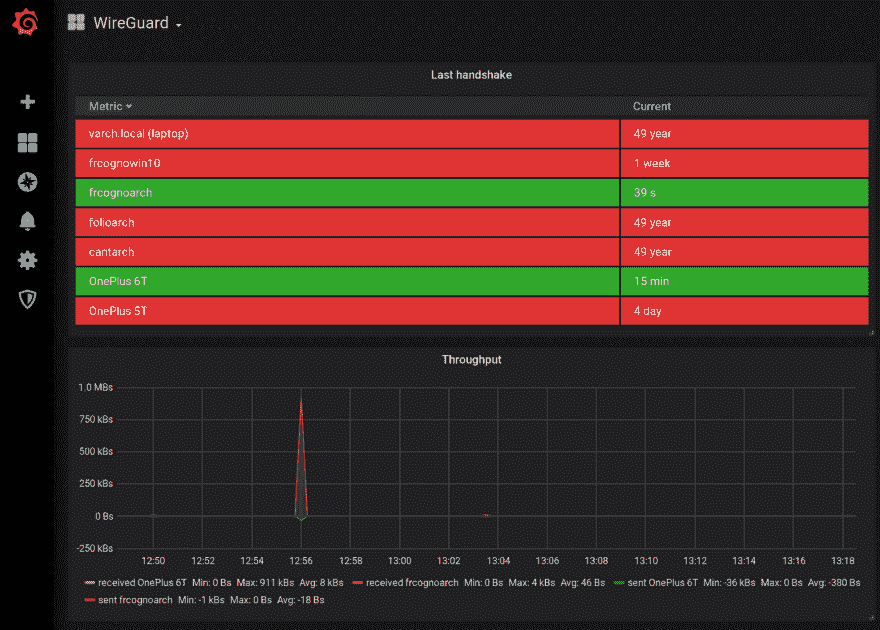
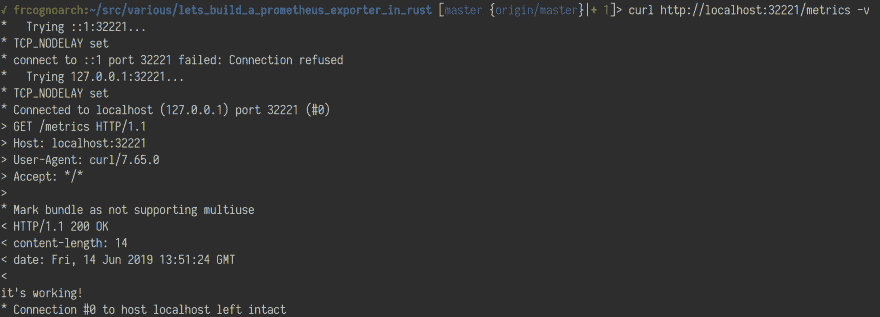
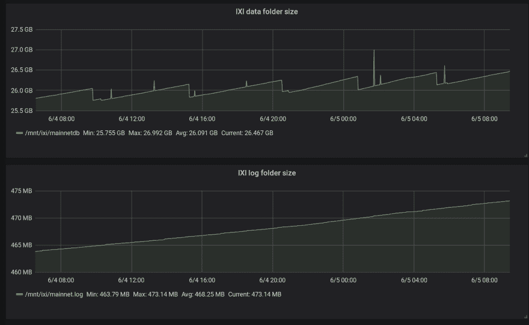

# 让我们在铁锈建造一个普罗米修斯出口器

> 原文：<https://dev.to/mindflavor/let-s-build-a-prometheus-exporter-in-rust-30pd>

## [T1】简介](#intro)

在本帖中，我们将在 Rust 中构建一个非常简单的 Prometheus exporter。Prometheus 是一个时间序列数据库，特别适用于存储和检索操作系统生命体征。它可以与 [Grafana](https://grafana.com/) 搭配使用，打造漂亮的仪表盘，如下图所示:

[](https://res.cloudinary.com/practicaldev/image/fetch/s--LT9KRQjd--/c_limit%2Cf_auto%2Cfl_progressive%2Cq_auto%2Cw_880/https://thepracticaldev.s3.amazonaws.com/i/49zzgumqwx1u72wbmuzz.png)

Prometheus 很特别，因为它不是接收事件来存储，而是自己继续检索它们。不过这并不神奇:Prometheus 只是调用一个预配置的 URI，并期望一个非常具体的纯文本输出。这非常优雅，因为这种架构将被监控的服务和监控器解耦，在二者之间添加了一个*导出器*服务。导出器的工作是将特定于服务的指标转换成 Prometheus 可以理解和存储的格式。

有很多现成的导出器可以让你监控服务器 CPU、DHCP 等...轻松地。但是因为这是开发人员的帖子，我们不会停留在*结合其他人写的*工具上。相反，我们将建立自己的出口商。这将是一个非常简单的导出器，但我想告诉你这是多么容易做到这一点，所以希望你可以自己实现一个导出器。

## 目标

我们希望关注文件夹的大小。Prometheus 可以每 60 秒存储一次文件夹大小，Grafana 可以漂亮地绘制出文件夹大小随时间的变化。它还允许我们创建警报:例如，如果文件夹增长超过阈值，我们可以通过电报得到通知。但是我们如何创建 Prometheus 需要的网站来存储文件夹大小呢？输入铁锈和一个助手箱:[普罗米修斯出口基地](https://github.com/MindFlavor/prometheus_exporter_base)。此外，作为一个奖励，作为 Rust，我们将确保内存/CPU 的足迹将会很低。

### 普罗米修斯出口基地

这个箱子是开源的，并且得到了麻省理工学院的许可(所以你可以自由地使用它),它被设计用来帮助你创建一个普罗米修斯出口器。它将处理 Prometheus 所要求的大部分样板文件(比如拒绝除了`GET`动词之外的任何内容，只回复`/metrics` URL)。它还提供了正确格式化输出的方法。所以首先我们需要通过将相关条目添加到 out `Cargo.toml`文件的`[Dependencies]`部分来导入它。这篇文章是用板条箱的`0.3.0`版本写的，所以如果你最终使用了一个新版本，你可能不得不考虑重大变化(如果有的话)。

文档非常简洁:[https://docs . RS/Prometheus _ exporter _ base/0 . 3 . 0/Prometheus _ exporter _ base/](https://docs.rs/prometheus_exporter_base/0.3.0/prometheus_exporter_base/)但是不要着急:我们所要做的就是调用 [`render_prometheus`](https://docs.rs/prometheus_exporter_base/0.3.0/prometheus_exporter_base/fn.render_prometheus.html) 方法。

它的签名是这样的:

[](https://res.cloudinary.com/practicaldev/image/fetch/s--AptuTdui--/c_limit%2Cf_auto%2Cfl_progressive%2Cq_auto%2Cw_880/https://thepracticaldev.s3.amazonaws.com/i/ppvhn1eaxtjs1583pm65.png)

多拗口啊！基本上，我们需要传递一个闭包，每个 GET 请求都会调用这个闭包。闭包应该返回一个字符串或一个错误。
是的，锈型系统可以忘乎所以。下面我们来逐一分解方法。

#### 绑定地址

```
addr: &SocketAddr, 
```

<svg width="20px" height="20px" viewBox="0 0 24 24" class="highlight-action crayons-icon highlight-action--fullscreen-on"><title>Enter fullscreen mode</title></svg> <svg width="20px" height="20px" viewBox="0 0 24 24" class="highlight-action crayons-icon highlight-action--fullscreen-off"><title>Exit fullscreen mode</title></svg>

这是我们的出口商将要监听的地址。我们可以通过自己选择的端口传递 0.0.0.0。例如这段代码会做:

```
let addr = ([0, 0, 0, 0], 32221).into(); 
```

<svg width="20px" height="20px" viewBox="0 0 24 24" class="highlight-action crayons-icon highlight-action--fullscreen-on"><title>Enter fullscreen mode</title></svg> <svg width="20px" height="20px" viewBox="0 0 24 24" class="highlight-action crayons-icon highlight-action--fullscreen-off"><title>Exit fullscreen mode</title></svg>

#### 选项

```
options: O
where
    O: Debug + Clone + Send + Sync + 'static 
```

<svg width="20px" height="20px" viewBox="0 0 24 24" class="highlight-action crayons-icon highlight-action--fullscreen-on"><title>Enter fullscreen mode</title></svg> <svg width="20px" height="20px" viewBox="0 0 24 24" class="highlight-action crayons-icon highlight-action--fullscreen-off"><title>Exit fullscreen mode</title></svg>

`options`可以是任何东西，它将在每次调用时传递回我们的闭包。`O`类型还必须是可克隆的、可调试的(意味着它必须在调试模式下可打印),并且还必须可以在线程间发送。它也必须持续到永远(T2 的一生)。我们不需要选项，所以我们为此创建了一个空类型。注意`derive`技巧是如何让它变得微不足道的:

```
#[derive(Debug, Clone)]
struct MyOptions {} 
```

<svg width="20px" height="20px" viewBox="0 0 24 24" class="highlight-action crayons-icon highlight-action--fullscreen-on"><title>Enter fullscreen mode</title></svg> <svg width="20px" height="20px" viewBox="0 0 24 24" class="highlight-action crayons-icon highlight-action--fullscreen-off"><title>Exit fullscreen mode</title></svg>

#### 闭合

```
perform_request: P
where
    P: FnOnce(Request<Body>, &Arc<O>) -> Box<dyn Future<Item = String, Error = Error> + Send + 'static> + Send + Clone + 'static, 
```

<svg width="20px" height="20px" viewBox="0 0 24 24" class="highlight-action crayons-icon highlight-action--fullscreen-on"><title>Enter fullscreen mode</title></svg> <svg width="20px" height="20px" viewBox="0 0 24 24" class="highlight-action crayons-icon highlight-action--fullscreen-off"><title>Exit fullscreen mode</title></svg>

这有点复杂。这意味着我们必须传递一个以`http Request`为参数的函数。第二个参数是前面提到的定制选项 struct `O`，包装在一个`Arc` ( `Arc`允许同时拥有底层 struct 的多个引用)。该函数必须返回一个`Future`:如果成功，它必须解析成一个`String`；如果失败，它必须解析成一个`failure::Error`。除了寿命之外，其他一系列特征通常不那么重要。这里的`'static`生存期值得一提:它的作用是限制闭包捕获的任何东西*永远存在。在实践中，这仅仅意味着我们要么没有捕获任何东西(更容易)，要么确保将所有权转移到闭包中。*

### 我方出口商

有了这些知识，我们就可以开始创建存根了。让我们把这个代码作为我们导出器的`main`函数:

```
fn main() {
    let addr = ([0, 0, 0, 0], 32221).into();
    println!("starting exporter on {}", addr);

    render_prometheus(&addr, MyOptions {}, |request, options| {
        Box::new({
            println!(
                "in our render_prometheus(request == {:?}, options == {:?})",
                request, options
            );

            ok("it's working!\n".to_owned())
        })
    });
} 
```

<svg width="20px" height="20px" viewBox="0 0 24 24" class="highlight-action crayons-icon highlight-action--fullscreen-on"><title>Enter fullscreen mode</title></svg> <svg width="20px" height="20px" viewBox="0 0 24 24" class="highlight-action crayons-icon highlight-action--fullscreen-off"><title>Exit fullscreen mode</title></svg>

它将编译，您将获得一个工作的 web 服务器，它在端口 32221 上侦听:

1.  将只允许 GET 动词。
2.  根据普罗米修斯规范，将只响应路径`/metrics`。
3.  一旦被调用就会运行我们的代码。现在，它只是在导出器的控制台窗口中打印一些内容，并向调用者返回一个固定的字符串。

我们试试吧！在我们的板条箱中发出`cargo run`之后，我们应该能够在另一个终端发出`curl http://localhost:32221/metrics -v`。因为这是一个标准的 HTTP GET，所以你可以用浏览器来检查它。

[](https://res.cloudinary.com/practicaldev/image/fetch/s--lyljUlsV--/c_limit%2Cf_auto%2Cfl_progressive%2Cq_auto%2Cw_880/https://thepracticaldev.s3.amazonaws.com/i/zz89n25xhkh8inmh0fpa.png)

对于仅仅几行蹩脚的代码来说还不错！

## 文件夹大小计算

我们的存根现在没有做任何有用的事情。我们希望它能够计算文件夹的大小。让我们为此写一个函数:

```
fn calculate_file_size(path: &str) -> Result<u64, std::io::Error> {
    let mut total_size: u64 = 0;
    for entry in read_dir(path)? {
        let p = entry?.path();
        if p.is_file() {
            total_size += p.metadata()?.len();
        }
    }

    Ok(total_size)
} 
```

<svg width="20px" height="20px" viewBox="0 0 24 24" class="highlight-action crayons-icon highlight-action--fullscreen-on"><title>Enter fullscreen mode</title></svg> <svg width="20px" height="20px" viewBox="0 0 24 24" class="highlight-action crayons-icon highlight-action--fullscreen-off"><title>Exit fullscreen mode</title></svg>

这个函数并不计算子文件夹的大小，但是对于我们的目的来说，它已经足够了。让我们从代码中调用它。首先将这一行添加到我们的`main`函数:

```
let future_log = done(calculate_file_size("/var/log")).from_err(); 
```

<svg width="20px" height="20px" viewBox="0 0 24 24" class="highlight-action crayons-icon highlight-action--fullscreen-on"><title>Enter fullscreen mode</title></svg> <svg width="20px" height="20px" viewBox="0 0 24 24" class="highlight-action crayons-icon highlight-action--fullscreen-off"><title>Exit fullscreen mode</title></svg>

注意这里的`done(...)` - `from_err()`舞蹈是未来组合子常见的舞蹈。现在，我们用刚刚创建的未来执行来替换`ok("it's working\n".to_owned())`行:

```
future_log.and_then(|total_size_log| {
    ok(format!("{}\n", total_size_log))
}) 
```

<svg width="20px" height="20px" viewBox="0 0 24 24" class="highlight-action crayons-icon highlight-action--fullscreen-on"><title>Enter fullscreen mode</title></svg> <svg width="20px" height="20px" viewBox="0 0 24 24" class="highlight-action crayons-icon highlight-action--fullscreen-off"><title>Exit fullscreen mode</title></svg>

这很简单！现在，如果我们再次运行导出器，我们应该会收到正确的答案，而不是静态字符串！不错！Firefox 截图如下:

[](https://res.cloudinary.com/practicaldev/image/fetch/s--G7F4-iIh--/c_limit%2Cf_auto%2Cfl_progressive%2Cq_auto%2Cw_880/https://thepracticaldev.s3.amazonaws.com/i/56x72mr0y3r3lcvec5au.png)

仅供参考，现在我们的代码是这样的:

```
#[derive(Debug, Clone)]
struct MyOptions {}

fn calculate_file_size(path: &str) -> Result<u64, std::io::Error> {
    let mut total_size: u64 = 0;
    for entry in read_dir(path)? {
        let p = entry?.path();
        if p.is_file() {
            total_size += p.metadata()?.len();
        }
    }

    Ok(total_size)
}

fn main() {
    let addr = ([0, 0, 0, 0], 32221).into();
    println!("starting exporter on {}", addr);

    render_prometheus(&addr, MyOptions {}, |request, options| {
        Box::new({
            println!(
                "in our render_prometheus(request == {:?}, options == {:?})",
                request, options
            );

            let future_log = done(calculate_file_size("/var/log")).from_err();
            future_log.and_then(|total_size_log| {
                ok(format!("{}\n", total_size_log))
            })
        })
    });
} 
```

<svg width="20px" height="20px" viewBox="0 0 24 24" class="highlight-action crayons-icon highlight-action--fullscreen-on"><title>Enter fullscreen mode</title></svg> <svg width="20px" height="20px" viewBox="0 0 24 24" class="highlight-action crayons-icon highlight-action--fullscreen-off"><title>Exit fullscreen mode</title></svg>

## 普罗米修斯顺从

这很好，但这并不意味着我们的输出符合普罗米修斯标准。为了做到这一点，我们应该遵循特定的格式。幸运的是，上面的助手箱也有一些方法来帮助我们。
我们只需要创建一个`PrometheusCounter`的实例。`new(...)`构造函数需要:

1.  计数器名称。这是由你来得到正确的，我向你推荐普罗米修斯的官方文件。我将在这篇文章中使用`folder_size`。
2.  计数器类型。同样，请参考普罗米修斯公司的文件。在这一点上，我同意`counter`。
3.  计数器帮助文本。这完全是可选的，但可能有助于其他人理解你的计数器是用来做什么的。

创建完成后，我们调用`render_header()`方法，这样板条箱将为我们的计数器输出所需的标题。代码会是这样的:

```
let pc = PrometheusCounter::new("folder_size", "counter", "Size of the folder");
let mut s = pc.render_header(); 
```

<svg width="20px" height="20px" viewBox="0 0 24 24" class="highlight-action crayons-icon highlight-action--fullscreen-on"><title>Enter fullscreen mode</title></svg> <svg width="20px" height="20px" viewBox="0 0 24 24" class="highlight-action crayons-icon highlight-action--fullscreen-off"><title>Exit fullscreen mode</title></svg>

这解决了头球。我们现在需要做的就是输出值。每个计数器可以选择具有一个或多个属性。例如，我们的 folder size 计数器可以有`path`属性:这样，在一个响应中就可以有同一个计数器的多个实例，每个实例表示一个不同的资源。我们的 crate 允许您将属性指定为元组切片:属性-值。对于我们的例子，我们可以使用这样一个向量:

```
let mut attributes = Vec::new();
attributes.push(("path", "/var/log/")); 
```

<svg width="20px" height="20px" viewBox="0 0 24 24" class="highlight-action crayons-icon highlight-action--fullscreen-on"><title>Enter fullscreen mode</title></svg> <svg width="20px" height="20px" viewBox="0 0 24 24" class="highlight-action crayons-icon highlight-action--fullscreen-off"><title>Exit fullscreen mode</title></svg>

现在我们可以调用`render_counter`函数来传递属性和值。像这样:

```
pc.render_counter(Some(&attributes), total_size_log); 
```

<svg width="20px" height="20px" viewBox="0 0 24 24" class="highlight-action crayons-icon highlight-action--fullscreen-on"><title>Enter fullscreen mode</title></svg> <svg width="20px" height="20px" viewBox="0 0 24 24" class="highlight-action crayons-icon highlight-action--fullscreen-off"><title>Exit fullscreen mode</title></svg>

我们需要做的就是将呈现的计数器添加到我们刚刚获得的头中，这样就完成了。因为我们已经有了可变的`String`的`s`，我们可以在那里追加(推送)正确格式化的`String`:

```
s.push_str(&pc.render_counter(Some(&attributes), total_size_log)); 
```

<svg width="20px" height="20px" viewBox="0 0 24 24" class="highlight-action crayons-icon highlight-action--fullscreen-on"><title>Enter fullscreen mode</title></svg> <svg width="20px" height="20px" viewBox="0 0 24 24" class="highlight-action crayons-icon highlight-action--fullscreen-off"><title>Exit fullscreen mode</title></svg>

## 结果

最后的代码是这样的:

```
use futures::future::{done, ok, Future};
use prometheus_exporter_base::{render_prometheus, PrometheusCounter};
use std::fs::read_dir;

#[derive(Debug, Clone)]
struct MyOptions {}

fn calculate_file_size(path: &str) -> Result<u64, std::io::Error> {
    let mut total_size: u64 = 0;
    for entry in read_dir(path)? {
    let p = entry?.path();
    if p.is_file() {
        total_size += p.metadata()?.len();
    }
    }

    Ok(total_size)
}

fn main() {
    let addr = ([0, 0, 0, 0], 32221).into();
    println!("starting exporter on {}", addr);

    render_prometheus(&addr, MyOptions {}, |request, options| {
    Box::new({
        println!(
        "in our render_prometheus(request == {:?}, options == {:?})",
        request, options
        );

        let future_log = done(calculate_file_size("/var/log")).from_err();
        future_log.and_then(|total_size_log| {
        let pc = PrometheusCounter::new("folder_size", "counter", "Size of the folder");
        let mut s = pc.render_header();

        let mut attributes = Vec::new();
        attributes.push(("path", "/var/log/"));
        s.push_str(&pc.render_counter(Some(&attributes), total_size_log));

        ok(s)
        })
    })
    });
} 
```

<svg width="20px" height="20px" viewBox="0 0 24 24" class="highlight-action crayons-icon highlight-action--fullscreen-on"><title>Enter fullscreen mode</title></svg> <svg width="20px" height="20px" viewBox="0 0 24 24" class="highlight-action crayons-icon highlight-action--fullscreen-off"><title>Exit fullscreen mode</title></svg>

结果是这样的:

[](https://res.cloudinary.com/practicaldev/image/fetch/s--EUYR7Vz6--/c_limit%2Cf_auto%2Cfl_progressive%2Cq_auto%2Cw_880/https://thepracticaldev.s3.amazonaws.com/i/f8gzy51jsn7whyimsrjo.png)

## 结论

一旦添加到 Prometheus 中，我们就可以创建像这样漂亮的仪表盘:

[](https://res.cloudinary.com/practicaldev/image/fetch/s--RrN8SCUs--/c_limit%2Cf_auto%2Cfl_progressive%2Cq_auto%2Cw_880/https://thepracticaldev.s3.amazonaws.com/i/bywc84s2k6eh68x4560s.png)

PS:我自己已经建立了几个导出器，所以如果你想看更多真实世界的例子，请参考[我的 GitHub 简介](https://github.com/mindflavor)！

快乐编码，
弗朗西斯科