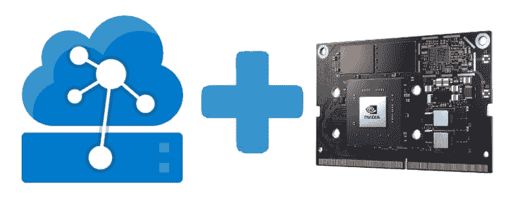
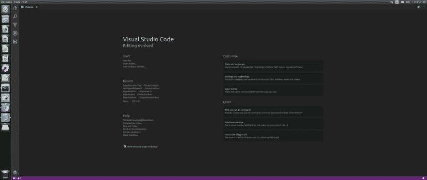

# 在 Nvidia Jetson 设备上开始物联网边缘开发

> 原文：<https://dev.to/azure/getting-started-with-iot-edge-development-on-nvidia-jetson-devices-2dfl>

[](https://res.cloudinary.com/practicaldev/image/fetch/s--NEoBwoGh--/c_limit%2Cf_auto%2Cfl_progressive%2Cq_auto%2Cw_880/https://i.imgur.com/PKxSQw6g.png)

# 简介

物联网不仅仅是闪光灯和读取传感器，它还是向大众交付人工智能工作负载的机制。当我们传统地想到物联网时，通常会想到带有物理传感器的专用硬件，这些传感器将读数报告给云服务进行处理。随着支持小尺寸 GPU 和 FPGA 的设备的出现，我们开始看到越来越多的繁重工作发生在设备本身上。这使我们能够减少数据外流，同时专注于从边缘处理数据中获得的重要结果。

当我们能够通过利用设备上的加速工作负载来减少对云处理的依赖时，我们就能够更快地获得和利用结果[，即使我们与互联网断开连接](https://docs.microsoft.com/en-us/azure/iot-edge/offline-capabilities?WT.mc_id=devto-blog-pdecarlo)。微软的[物联网边缘](https://docs.microsoft.com/en-us/azure/iot-edge/about-iot-edge?WT.mc_id=devto-blog-pdecarlo)平台正是为此类用例而设计的。在引擎盖下，物联网边缘通过使用容器化模块来实现代码到物联网设备的安全部署。这些模块可以包括流行的 Azure 服务的容器化形式，包括[无服务器功能](https://docs.microsoft.com/en-us/azure/iot-edge/tutorial-deploy-function?WT.mc_id=devto-blog-pdecarlo)、[流分析](https://docs.microsoft.com/en-us/azure/iot-edge/tutorial-deploy-stream-analytics?WT.mc_id=devto-blog-pdecarlo)、[机器学习模块](https://docs.microsoft.com/en-us/azure/iot-edge/tutorial-deploy-machine-learning?WT.mc_id=devto-blog-pdecarlo)、[定制视觉 AI 服务](https://docs.microsoft.com/en-us/azure/iot-edge/tutorial-deploy-custom-vision?WT.mc_id=devto-blog-pdecarlo)，甚至[使用 SQL Server 的本地存储](https://docs.microsoft.com/en-us/azure/iot-edge/tutorial-store-data-sql-server?WT.mc_id=devto-blog-pdecarlo)。物联网边缘平台基本上允许您使用您已经知道并喜欢的云服务，并在您的边缘环境中使用它们，以促进您期望在云中使用这些服务时获得的相同强大特性和功能。

# 入门

Nvidia 在其 [Jetson 系列设备产品](https://developer.nvidia.com/buy-jetson)中生产了许多适合物联网解决方案的设备。其中包括结实的 512 核[杰特森 AGX Xavier](https://amzn.to/2XMaSIL) ，中档 256 核[杰特森 TX2](https://amzn.to/2IMGmDV) ，以及入门级的 99 美元 128 核[杰特森 Nano](https://amzn.to/2WFE5zF) 。

要阅读本文，您需要以下设备之一:

*   杰特森·阿格克斯·泽维尔
*   [杰特森 TX2](https://amzn.to/2IMGmDV)
*   [杰特森纳米](https://amzn.to/2WFE5zF)

为了确保广泛的兼容性，本文中的所有内容都是在 NvidiA Jetson Nano 设备上创建和测试的。

# 在 Nvidia Jetson 设备上安装物联网边缘

物联网边缘的 ARM64 版本目前正在预览中提供，最终将正式上市。我们将利用 ARM64 构建来确保我们的物联网边缘解决方案获得最佳性能。

这些版本从 [1.0.8-rc1 发布标签](https://github.com/Azure/azure-iotedge/releases/tag/1.0.8-rc1)开始提供。要安装物联网边缘的 1.0.8-rc1 版本，请从 Nvidia Jetson 设备的终端运行以下命令:

```
# You can copy the entire text from this code block and 
# paste in terminal. The comment lines will be ignored.

# Download and install the standard libiothsm implementation
curl -L https://github.com/Azure/azure-iotedge/releases/download/1.0.8-rc1/libiothsm-std_1.0.8.rc1-1_arm64.deb -o libiothsm-std.deb && sudo dpkg -i ./libiothsm-std.deb

# Download and install the IoT Edge Security Daemon
curl -L https://github.com/Azure/azure-iotedge/releases/download/1.0.8-rc1/iotedge_1.0.8.rc1-1_arm64.deb -o iotedge.deb && sudo dpkg -i ./iotedge.deb

# Run apt-get fix
sudo apt-get install -f 
```

# 在 Nvidia Jetson 设备上提供物联网边缘运行时

要手动配置设备，您需要为其提供设备连接字符串，您可以通过在物联网中心注册新的物联网边缘设备来创建该字符串。你可以创建一个新的设备连接字符串来完成这个任务，方法是按照文档中的[在 Azure 门户](https://docs.microsoft.com/en-us/azure/iot-edge/how-to-register-device-portal?WT.mc_id=devto-blog-pdecarlo)中注册一个物联网边缘设备，或者通过[向 Azure-CLI](https://docs.microsoft.com/en-us/azure/iot-edge/how-to-register-device-cli?WT.mc_id=devto-blog-pdecarlo) 注册一个物联网边缘设备。

获得连接字符串后，打开配置文件:

```
sudo nano /etc/iotedge/config.yaml 
```

找到文件的预配部分，取消手动预配模式的注释。使用来自物联网边缘设备的连接字符串更新设备连接字符串的值。

```
provisioning:
  source: "manual"
  device_connection_string: "<ADD DEVICE CONNECTION STRING HERE>"

# provisioning: 
#   source: "dps"
#   global_endpoint: "https://global.azure-devices-provisioning.net"
#   scope_id: "{scope_id}"
#   registration_id: "{registration_id}" 
```

您还需要配置默认的物联网边缘代理配置，以获取 1.0.8-rc1 版本的代理。在配置文件中，向下滚动到代理部分，并将图像值更新为:

```
agent:
  name: "edgeAgent"
  type: "docker"
  env: {}
  config:
    image: "mcr.microsoft.com/azureiotedge-agent:1.0.8-rc1"
    auth: {} 
```

# 使用 Visual Studio 代码在 Nvidia Jetson 上开发物联网边缘模块

从技术上来说，IDE 不是必需的，但是为了获得最流畅的开发体验，强烈建议使用它。Visual Studio 代码是官方支持的 IDE，允许安装[物联网边缘扩展](https://marketplace.visualstudio.com/items?itemName=vsciot-vscode.azure-iot-edge&WT.mc_id=devto-blog-pdecarlo)来帮助开发。

值得注意的是，尽管 VS Code 为 Linux、Mac 和 Windows 提供了预构建的二进制文件，但它不提供适合 Nvidia Jetson 设备的 64 位 ARM 版本。不过这也没什么，因为 VS 代码是开源的，所以我们可以在设备本身上从源代码构建 IDE。这有点耗时，如果您希望快速启动并运行，不推荐这样做。如果你有兴趣这样做，你可能想看看 Nvidia 开发者论坛上的这个[主题](https://devtalk.nvidia.com/default/topic/1049448/quick-build-guide-for-visual-studio-code-on-the-nano/)。请记住，这些指示是一个移动的目标，今天有效的可能明天就无效了。

要使安装变得轻而易举，您可以利用预构建的。我发布的 deb 包可以让你立即开始。要安装带有扩展支持的 Code-OSS(Visual Studio 代码的开源版本)，请在 Jetson 设备的终端上运行以下命令:

```
curl -L https://github.com/toolboc/vscode/releases/download/1.32.3/code-oss_1.32.3-arm64.deb -o code-oss_1.32.3-arm64.deb

sudo dpkg -i code-oss_1.32.3-arm64.deb 
```

现在，您可以使用:
启动 IDE

```
code-oss 
```

[](https://res.cloudinary.com/practicaldev/image/fetch/s--quSu9vMJ--/c_limit%2Cf_auto%2Cfl_progressive%2Cq_auto%2Cw_880/https://i.imgur.com/TiyyxtR.png)

太棒了。现在，我们可以开始安装扩展来加速我们的物联网边缘开发。幸运的是，使用 [Azure 物联网工具扩展](https://marketplace.visualstudio.com/items?itemName=vsciot-vscode.azure-iot-tools&WT.mc_id=devto-blog-pdecarlo)，这变得非常容易。按照链接中的说明将扩展安装到您的环境中。完成后，你可以查看使用 Visual Studio 代码为 Azure IoT Edge 开发和调试模块的[的文档。](https://docs.microsoft.com/en-us/azure/iot-edge/how-to-vs-code-develop-module?WT.mc_id=devto-blog-pdecarlo)

需要注意的是，您需要确保将 IDE 平台设置设置为 ARM32v7。默认情况下，该选项设置为 AMD64。您可以在 IDE 的左下角找到此选项。更改这将确保您的物联网边缘模块使用其关联的 docker file . arm 32v 7:
[](https://res.cloudinary.com/practicaldev/image/fetch/s--BVFpg-Ja--/c_limit%2Cf_auto%2Cfl_progressive%2Cq_auto%2Cw_880/https://user-images.githubusercontent.com/1872137/55203738-73a5b880-5207-11e9-8af5-4b84ca95fee1.png)构建

截至发稿时，物联网边缘模块模板不支持 ARM64。创建模块后，您需要修改`deployment.template.json`来下拉适当的 ARM64 系统模块。为此，打开您的`deployment.template.json`文件并用下面粘贴的配置替换整个 systemModules 部分:

```
"systemModules": {
          "edgeAgent": {
            "type": "docker",
            "settings": {
              "image": "mcr.microsoft.com/azureiotedge-agent:1.0.8-rc1",
              "createOptions": {}
            }
          },
          "edgeHub": {
            "type": "docker",
            "status": "running",
            "restartPolicy": "always",
            "settings": {
              "image": "mcr.microsoft.com/azureiotedge-hub:1.0.8-rc1",
              "createOptions": {
                "HostConfig": {
                  "PortBindings": {
                    "5671/tcp": [
                      {
                        "HostPort": "5671"
                      }
                    ],
                    "8883/tcp": [
                      {
                        "HostPort": "8883"
                      }
                    ],
                    "443/tcp": [
                      {
                        "HostPort": "443"
                      }
                    ]
                  }
                }
              }
            }
          }
        }, 
```

# 在 Nvidia Jetson 上使用物联网边缘模拟器

你会注意到文档中提到使用[物联网边缘模拟器来调试物联网边缘模块](https://docs.microsoft.com/en-us/azure/iot-edge/how-to-vs-code-develop-module#debug-in-attach-mode-with-iot-edge-simulator-c-nodejs-java-azure-functions?WT.mc_id=devto-blog-pdecarlo)。这是可能的，但是如果现在没有一些额外的步骤，它将不会工作。

首先，我们需要使用 pip 安装`iotegehubdev`包，并让所有用户都可以使用它。这可以通过在终端中执行以下步骤来完成:

```
sudo apt install python-pip libffi-dev libssl-dev
sudo -H pip install --upgrade iotedgehubdev 
```

接下来，我们需要用兼容的`<edge-device-connection-string>`配置 iotedgehubdev 工具。您可以创建一个新的设备连接字符串来完成这一任务，方法是遵循在 Azure 门户网站中注册物联网边缘设备的[的文档，或者通过向 Azure-CLI](https://docs.microsoft.com/en-us/azure/iot-edge/how-to-register-device-portal?WT.mc_id=devto-blog-pdecarlo) 注册物联网边缘设备的[。建议在此过程中将设备命名为“iotegehubdev”。](https://docs.microsoft.com/en-us/azure/iot-edge/how-to-register-device-cli?WT.mc_id=devto-blog-pdecarlo)

最后，我们需要更新 iotedgehubdev 工具，以使用适当的物联网边缘代理和测试实用程序。当物联网 Edge ARM64 支持正式发布时，这应该不再是必需的，但目前是必需的。

编辑以下内容:

```
sudo nano /usr/local/lib/python2.7/dist-packages/iotedgehubdev/edgemanager.py 
```

修改以下参数:

```
EDGEHUB_IMG = 'mcr.microsoft.com/azureiotedge-hub::1.0.8-rc1'                                                          
TESTUTILITY_IMG = 'mcr.microsoft.com/azureiotedge-testing-utility:1.0.0-arm32v7' 
```

现在删除，`/usr/local/lib/python2.7/dist-packages/iotedgehubdev/edgemanager.pyc`以使用:
强制重新编译 python 模块

```
sudo rm /usr/local/lib/python2.7/dist-packages/iotedgehubdev/edgemanager.pyc 
```

当从 VS 代码调用时，物联网边缘解决方案模拟器现在应该可以正常工作。这是一种在本地设备上测试物联网边缘模块的好方法，无需创建部署配置。

[](https://res.cloudinary.com/practicaldev/image/fetch/s--s3vAYtdA--/c_limit%2Cf_auto%2Cfl_progressive%2Cq_auto%2Cw_880/https://i.imgur.com/PGbc8s7.png)

# 结论

我们已经表明，您可以从您的 Nvidia Jetson 设备开始使用 Linux、Mac 和 Windows 上可用的流行工具构建物联网边缘模块。这为在目标设备上使用本地开发环境创建 GPU 加速工作负载提供了可能性。请记住，这个故事才刚刚开始，随着我们看到微软和 Nvidia 在官方支持 ARM64 平台方面的改进，只会越来越好。例如，7 月份可能会为我们带来更好的 ARM64 物联网边缘支持，Nvidia 已经宣布计划在此期间更新 nvidia-docker 以支持 ARM64。

随着这些产品的成熟，您可以期待在我即将发表的文章中看到更多细节，这些文章将涵盖如何在物联网边缘模块中利用 GPU 加速。要查看 dev.to 上的相关内容，请查看[Nvidia arm 64 设备上的 DevOps CI / CD 管道入门](https://dev.to/azure/getting-started-with-devops-ci-cd-pipelines-on-nvidia-arm64-devices-4668)和[使用 Azure IoT Edge 的认知服务容器](https://dev.to/azure/using-cognitive-services-containers-with-azure-iot-edge-1e5a)。

下次见，黑客快乐！