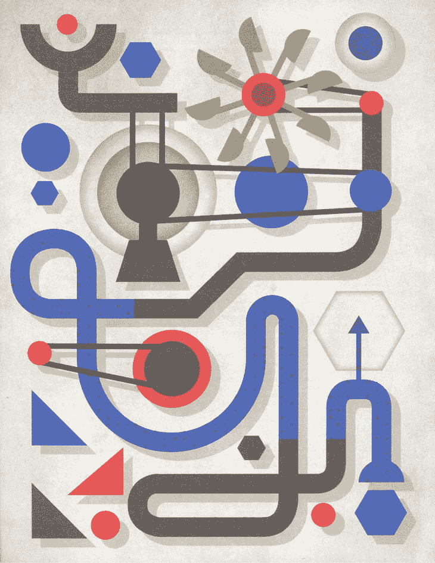

# 10 年的网页开发；10 节人生课。

> 原文：<https://dev.to/david_j_eddy/10-years-of-web-development-10-life-lessons-11i6>

来源于[我的博客](https://blog.davidjeddy.com)

十年前(2009 年)，经济衰退如火如荼。每周都会有另一家银行倒闭，数百万家庭进入止赎程序，而我开始了我的职业生涯，成为一名专业的网络开发人员。有了学位和一点业余爱好经验，我开始进入残酷的就业市场。

<figure> 

<figcaption>有人知道这是什么吗？</figcaption>

</figure>

我花了将近 6 个月的时间找到了我的第一个角色“jr web developer”。后来发现我是唯一可以创建工作提交表单的候选人。是的，4 年的学位是为了炫耀我在大学之前就知道的东西。在 SRE/DevOps 咨询公司工作了几年后，我很快就会成为一名支付处理器的基础工程师。以下是我在过去 10 年中在信息技术领域学到的 10 条经验。

*   知识是一种最好共享的资源。
*   最终用户总是正确的；相反，最终用户永远不会是正确的。
*   最终用户总会找到一种不同于预期的方式来使用你的程序。
*   如果你比房间里的其他人都更了解某个主题，你就是专家。
*   你是自己最好的冠军。没有人比你更了解你的优缺点。把自己放在你想去的地方。
*   每天学点新东西；结果是复合的。
*   将复杂的系统分解成单个的小部分。系统作为小部分更容易理解、操作和迭代。
*   忽略冒名顶替综合征的感受，没有人对一切都了如指掌。
*   一切都是抽象的。理解低层次意味着你自动理解 1/2 高层次的抽象。

<figure> 

<figcaption>这么多事情，这么复杂。</figcaption>

</figure>

所以你走吧。成功、失败、来之不易的战斗和轻易失败的战斗。提炼出 10 条经验教训。那么你呢，在过去的十年里你学到了什么可以分享吗？

Matthew Fournier 在 Unsplash 上拍摄的照片。