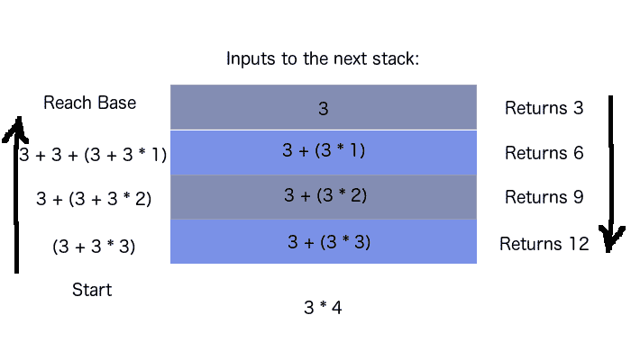

# 递归的定义是递归

> 原文：<https://dev.to/jckuhl/the-definition-of-recursion-is-recursion-4iai>

# 递归

在编程中，有两种类型的循环，递归和迭代。迭代是最常见的循环形式，使用基本的`while`和`for`循环或更复杂的生成器。然而递归是当一个函数在它自己的定义中被调用时。

当解决一个问题的算法以递减的模式重复相同的步骤时，递归就发生了，直到你达到可以打破递归的条件。

为了说明，让我们认为乘法可以通过递归加法来解决。

```
x * y = x + x(y-1) + x(y-2) + . . . x(y-n) where y-n > 1 
```

在任何形式的乘法中，x * y，乘法可以认为是 x 加 x 乘以 y 减 1。重复，直到 y 为 1。用实际数字来看看:

```
x = 3, y = 4
3 * 4
= 3 + 3 * 3
= 3 + 3 + 3 * 2
= 3 + 3 + 3 + 3 * 1
= 3 + 3 + 3 + 3
= 12 
```

注意它是如何递归的，因为随着 y 值的减小，你会一遍又一遍地重复同样的步骤。当 y 为 1 时，我们有我们的*基本情况*,在那里我们脱离递归。当这种情况发生时，递归结束，我们简单地把所有的 3 相加。

# 堆栈

那么这是如何通过编程实现的呢？每当你调用一个函数的时候，一个新的帧就会被添加到堆栈中。堆栈是内存中的一个区域，用来处理你的函数。当函数完成时，它的输出值(如果有的话)被返回给调用它的堆栈。这就是为什么关键字*返回*被命名为它是什么。我们将*返回到较低的堆栈框架。*

最下面是我们的问题，3 * 4。为了解决这个问题，我们在栈中增加一个新的帧，输入问题的下一步，就是 3 + **3 + 3 * 3** 的加粗部分。同时，当前帧将等待上面的帧返回。那个框架，然后会做同样的事情，制作一个新的框架，输入 3 + 3 + **3 + 3 * 2** 的加粗部分。同样，框架会等待上面的框架返回。这一直持续到我们到达基本情况。

> 如果没有基本情况，帧将相互堆叠，直到堆栈耗尽内存，这将导致*堆栈溢出*错误。

一旦我们到达基本情况，框架开始返回。顶部的框架将返回一个 3，并将其传递给它下面的框架，然后它可以完成计算并返回一个 6，以此类推，直到底部的框架最终收到它需要的返回值并返回一个 12。

[](https://res.cloudinary.com/practicaldev/image/fetch/s--a-U4GIh8--/c_limit%2Cf_auto%2Cfl_progressive%2Cq_auto%2Cw_880/https://thepracticaldev.s3.amazonaws.com/i/mz0ehvwg85akvvw29nc5.png)

在上图中，你可以看到整个过程的布局。我们从“start”开始向上，创建新的框架，直到我们到达基本情况，然后我们开始沿着堆栈向下回到底部，返回它上面的框架中的函数值。

# 实现

大多数语言都支持递归。由于 Python 是最容易阅读的语言之一，我将向您展示如何在编程中实现这一点。

首先要考虑的是，递归在哪里结束？这被称为*基础案例*。在上面的`3 * 4`的例子中，我们的基本情况是当我们到达`3 + 3 + 3 + 3 * 1`时。就`x * y`而言，是当`y = 1`。

如果 x 是 3:

```
3 * y
= 3 + 3 * (y - 1)
= 3 + 3 . . . + 3 * y: y = 1
= 3 + 3 . . . + 3 
```

当 y 为 1 时，递归完成，堆栈可以折叠到我们想要的值。

现在我们有了基本情况，我们还需要知道哪一部分是递归。这部分就是我们等式中`x + x + ... + x(y - 1)`的`x(y - 1)`部分。这是每一步都要重复的部分。x + x 的重复...+x 在堆栈崩溃时被解析。

这里是我们函数的最基本版本，用 python 写的:

```
def mult(x, y):
    if y == 1:
        return x
    return x + mult(x, y - 1) 
```

如果 y 是 1，那就是基本情况。因为`x * 1`是`x`，我们可以只返回`x`。否则，我们将把算法的递归部分`x(y-1)`加到 x 上，并返回该值。在这种情况下,`x(y-1)`翻译成`mult(x, y-1)`。

现在我们可以调用这个函数并试一试:

```
import sys

def mult(x, y):
    if y == 1:
        return x
    return x + mult(x, y - 1)

if __name__ == '__main__':
    x,y = [int(i) for i in sys.argv[1:]]
    print(mult(x,y)) 
```

这里我已经设置好了，所以我们可以在命令行中调用带有参数的函数。我们使用列表理解将这些参数转化为整数，并将其解包为变量 x 和 y，然后传递给`mult()`函数，并打印到屏幕上。

> 我们必须切片`sys.argv`,因为第 0 个值总是文件名，我们只需要第一个和第二个参数。

我们用`python3 multiply.py 3 4`调用，它将显示 12。

> 该命令在您的机器上可能会有所不同，这取决于 python 在您的路径中的安装和别名，以及您如何命名该文件。语法是`[Python] [filename.py] [x] [y]`

当我们输入 3 和 4 作为 x 和 y 时，`mult(3,4)`被调用并放入堆栈上的一个新帧中。这个函数反过来用`mult(3, 4-1)`调用自己，并将它压入堆栈。重复这个过程，直到`mult(3,1)`被调用，其中 y 是 1，并且满足基本情况。

这个最后的基本情况将返回一个`3`到它下面的帧。该框架中的函数现在终于可以完成它的 return 语句，并向它下面的框架返回值，以此类推，直至折叠到底部。我们最后得到的是`3 + 3 + 3 + 3`，也就是 12。

# 改善我们的功能

然而，我们的函数只适用于 y 的正值或零值。负值总是会导致堆栈溢出(或者在 Python 中，`RecursionError: maximum recursion depth exceeded in comparison`)

我们可以让我们的函数在负的情况下工作。逻辑是一样的，我们只需要改变一些符号，因为我们现在在数字线上从左到右，而对于正值，我们从右到左。`x`需要为负，而`y`需要增加到正 1，而不是减少到正 1。

```
3 * -4
= -3 + 3 * -3
= -3 - 3 + 3 * -2
= -3 - 3 - 3 + 3 * -1 
= -3 - 3 - 3 - 3
= -12 
```

或者在 Python 中，我们添加一个新的`if`语句:

```
 import sys

def mult(x, y):
    if y == 1:
        return x
    if y >= 1:
        return x + mult(x, y - 1)
    else:
        return -x + mult(x, y + 1)

if __name__ == '__main__':
    x,y = [int(i) for i in sys.argv[1:]]
    print(mult(x,y)) 
```

现在它也适用于负值。`x`中的负值由加减运算中负数的自然方式处理，所以我们不需要担心这种情况。插入任何整数，这个函数应该工作。

# 我们在哪里使用递归？

当然，这个函数是没用的，Python 和其他大多数编程语言，给我们提供了一个乘法运算符，我们不需要担心它的内部实现。

但是递归本身是有用的，只要你看到一个重复的模式，其中解决问题的步骤涉及一次又一次地重复算法的步骤，直到减少到某个基本情况。另一个例子是阶乘。

数学中的阶乘定义为:

```
x! = x * (x-1) * (x-2) ... * (x - [x-1])
5! = 5 * (5 -1) * (5 - 2) * (5 - 3) * (5 - 4) = 120
5! = 5 * 4 * 3 * 2 * 1 = 120 
```

而在 Python 中:

```
def fact(x):
    if x == 1:
        return x
    return x * fact(x - 1) 
```

这里你可以看到一个重复的模式，求解的步骤是相同的，并且朝着基本情况递减。这使得递归成为一个很好的解决工具。当您看到这种模式时，您就知道递归是一种可以用来实现解决方案的工具。

在大多数使用递归的情况下，也可以使用迭代。迭代通常更干净，更容易维护和理解，并且通常更具性能，这就是我更喜欢迭代的原因。然而，有时递归真的是最简单的解决方案，即使是对迭代而言。

以扫雷舰为例。在扫雷游戏中，当你点击一个空白方块时，旁边的所有方块，也是空白的，都需要被打开。这些方块依次需要找到它们的邻居，如果它们是空白的，它们需要被揭开。然后这些方块也需要找到它们的邻居，然后被揭开，如此等等，直到一个连续区域中的所有空白都被揭开。如果你注意到，算法的步骤被反复重复，每个方块需要找到它的邻居，每个邻居需要找到他们的邻居，这是算法的递归部分。当再也找不到空白的相邻方块时，就会遇到基本情况。

这里用递归来解决问题是最有意义的。这是我在 React 中实现扫雷游戏时解决的问题。可以在这里看一下: [ReactSweeper 上下文类](https://github.com/jckuhl/reactsweeper/blob/master/src/components/context/index.js)。在我们上下文中的`clearBlanks`方法内，是一个`getAllAdjacentBlanks`方法。这不是一个干净的方法，显然可以使用进一步的重构，但关键是你可以看到它如何有一个基本情况，如果`indicesToBeCleared`没有元素，否则递归情况，它调用自己在新发现的空白方块中传递。

关键是，在我可以看到重复模式的地方，我通常可以找到递归的解决方案，只要有一个基本情况，导致递归停止，然后折叠回我正在寻找的值。在乘法中，该值是两个数的乘积。在 factorial 中，它是一个数字的阶乘，而在`getAdjacentSquare`中，它是一个当点击一个空白时需要显示的所有方块的数组。

你看到这种重复模式的地方，就是你可以开始考虑递归的地方。但是要小心。使用循环和生成器的交互通常是更简单和更高效的解决方案，它们没有堆栈溢出错误的风险(尽管它们有无限循环的风险)。)