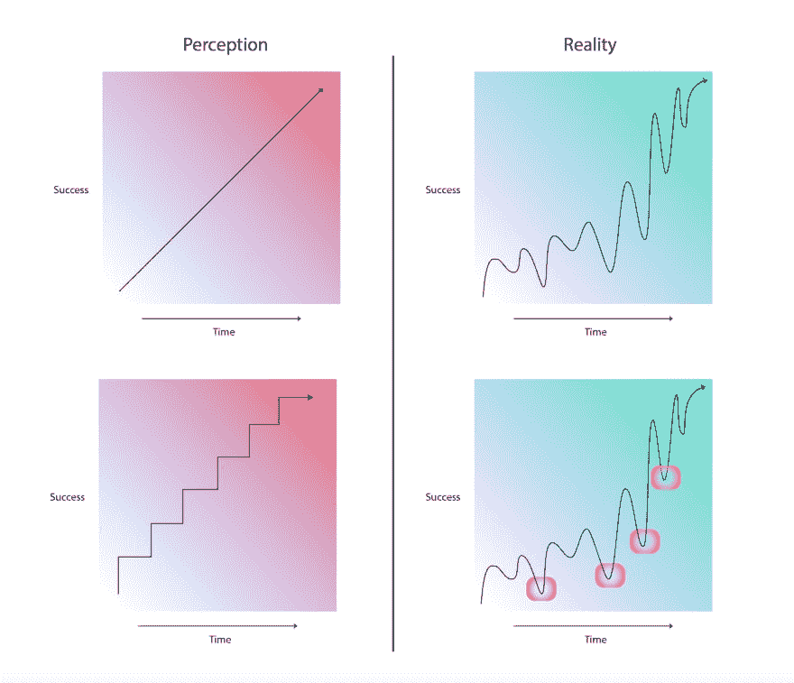
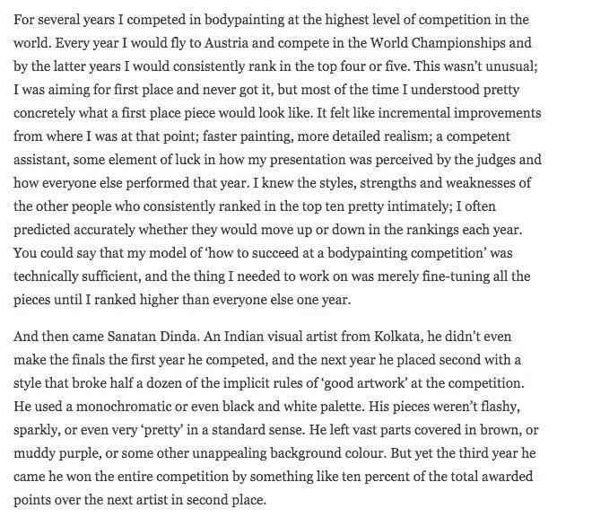

# 如何变得伟大？只要反复做好事

> 原文：<https://dev.to/stephsmithio/how-to-be-great-just-be-good-repeatably-bk5>

这篇文章最初发表在我的[博客](https://blog.stephsmith.io/how-to-be-great)上，我经常在那里写关于个人成长、远程工作、学习编码和技术领域的女性。

* * *

这些年来，我们都经历了相当多的成功和失败。随着我名下这两种经历越来越多，我开始思考哪些经历是真正“伟大”的，为什么。

有趣的是，我意识到这不是偶然的高潮，而是漫长的旅程；事件的顺序在每一个关键时刻看似微不足道，但却累积成重大收获。这让我进一步思考*伟大*的真正含义。我开始认识到这不是一夜之间的成功或卓越的闪现，而是一段时间内重复的习惯。

> 或许“伟大”只是“好”，但却是可重复的。

## 考虑这个

在进入本文的主体之前，我想澄清两件事:

*   伟大不是瞬间的
*   伟大是赢得的

变得伟大的第一步是认识到你可能还没有变得伟大。事实上，它来自于认识到在特定的时间没有伟大这种东西。相反，伟大是一段时间努力的反映，因为一个例子中的伟大可以归结为运气。

此外，“伟大”并不意味着比别人更优秀。它是关于可靠和自律的，最终是值得的。

很多人，理论上，都想“伟大”。事实上，每个月有 1000 人搜索“如何变得伟大”，260 人搜索“如何变得完美”，2400 人搜索“如何成为最好”，寻找如何从 0 到 1 的离散答案。然而，生活中的许多人实际上并不想在一段持续的时间内努力达到 1。他们在寻找在许多方面并不存在的“成功秘诀”。你知道什么能带来成功吗？努力工作带来成功。

所以在这篇文章开始之前，我恳求你们每个人考虑一下，如果伟大真的是一种非瞬间的努力的反映，问问自己这是不是你想要的生活。问问你自己，你是否愿意在一场持续的艰苦战斗中度过你的每一天、每一周、每一月、每一年。

如果你最终发现你不想这么做，那也没关系！这不会让你变得不像个人。至少你已经打破了那种认为你想做 X，但不明白为什么你还没有实现的模式。如果是这样的话，去享受你的网飞吧，毫无愧疚地放松一下。

记住这一点，让我们深入了解是什么真正让一个人变得“伟大”。

## 很难保持一致

人们有一种错觉，认为浮华会带来成功或恶名。这种观念来自媒体对离群值的关注，无论是偏离常规的事件还是人物。这不仅会鼓励人们为了出名而出名(想想伊丽莎白·霍姆斯)，还会让我们其他人相信(那些离群值的)相关性就是因果关系；换句话说，这些人的成功是由于他们与众不同的方式。但这里有另一个故事情节:通往“成功”的最可靠也是最好的方法是坚持不懈。

> "除非你和你钦佩的人一样努力，否则不要把他们的成功解释为运气。"——詹姆斯·克利尔《原子习惯》

需要明确的是，一致性不一定是最容易成功的方式，但它可以通过更高程度的确定性来实现，而不是希望彩票中奖或有人“发现”你。持续努力是一种更深思熟虑的方法，当以下陈述为真时，它会导致伟大:

1.  随着时间的推移，输入是一致的
2.  有意的输入导致预期的输出

### 一致性

> “一年三百六十天不到黎明就能起床的人，没有一个不使自己的家庭变得富有”——离群值

拿破仑山有一句名言是这样说的:*“如果你不能做伟大的事情，就用伟大的方式做小事情”*。实际上，我认为这句话应该是，*“如果你做不了大事，那就把小事做很多遍”。*

如果你没有“做大事”的机会，专注于持续取得小胜利。这些小事实际上不需要用一种伟大的方式去做，而是一种好的方式，可重复地做。事实上，我建议不要专注于完美，因为完美往往是成功者的大敌。

不可预测性有其闪光点，但实际上，要做到可预测的好要困难得多，因此也令人印象深刻。例如:

*   每当“想”的时候就很容易醒来。
*   很难坚持早上 6 点起床的习惯。
*   很容易从一个项目转到另一个项目，关注本月新的亮点。
*   多年来很难坚持一个副业项目，其中许多项目可能在很长一段时间内都不会盈利。
*   当你遇到障碍或下一个潜在的伴侣变得可用时，很容易放弃某人。
*   很难做到忠贞不渝，对一段感情投入几十年。

我们通常怀着美好的愿望开始生活。我们*打算*设定一个早晨的惯例，或者做一笔生意，直到有利可图，或者“永远爱一个人”。我们想象，当我们投资于某件事情时，我们自然会继续朝着正确的方向前进。如果有的话，事情会变得更容易，对不对？

描述的轨迹是我们在左边看到的。可预测的、线性的、直接反映投入的努力。

很少有成功看起来是这样的。生活是一系列微小的节点，看起来更像是右手边。在右侧更真实的图表中，有两个关键要素值得一提:

*   复利总是存在的。任何过程中的早期步骤都将更加艰难，但很难想象随后可能出现的复合效应。
*   有起有落。这似乎是显而易见的，但是当我们情绪低落的时候，我们经常会忘记这一点。我们在这些局部最小值(上面用红色突出显示的部分)退出，因为我们看不到下一个峰值就在拐角处。

> 凯西·奈斯塔特[@凯西](https://dev.to/casey)一个朋友刚刚发邮件给我，回复我的“燃尽”视频。想要分享；“对成功的沉迷让你感到不成功，因为在那个时刻你没有感受到工作中多巴胺的直接冲击。”2019 年 2 月 07 日下午 14:43

> 马尔西奥·诺韦利@马西奥诺维利@ CaseyNeistat 我们已经失去了欣赏延迟满足的能力，我们中的一些与完美主义作斗争的人，要么反复创造，直到我们“做对了”，从未真正对我们的工作感到满足，要么，我们避免一起创造，因为害怕失败。2019 年 2 月 07 日下午 14:49

由于所谓的[快乐跑步机](https://en.m.wikipedia.org/wiki/Hedonic_treadmill)或快乐适应，局部最小值在心理上特别费力。从本质上讲，当一个人在生活的各个方面取得新的成功时，他们的基线会改变以反映新的水平，因此，他们的期望和愿望也会重新建立。快乐没有净收益，因此，在情绪低落的时候保持“头脑冷静”变得更加困难。

这就是为什么对成功的特定追求可能会有问题，与其在生活中寻找不可持续的捷径，不如致力于持续的习惯，将成功作为副产品，而不是最终目标，这样更有效(也更健康)。

> “变得优秀的唯一方法是不断着迷于重复做同一件事。你得爱上无聊。”-原子习惯，詹姆斯清楚

在你走向伟大的旅途中，你需要爱上这个过程，它包括许多局部的最小值和最大值。保持一致并持续推进这两点，这将真正把你从那些简单的“好”中区分出来，让你成为少数几个“伟大”的人之一。

### 输入→输出

成就伟大的第二个重要方面是有目的地行动。你的行动和结果不会总是反映你的意图，但是当你走向“伟大”的时候，你应该对什么样的投入实际上产生了什么样的产出有一个更好的想法。你仍然会成为 mistakes﹣as 人，我们都是 do﹣but 人，你会更好地理解什么是最有可能解决的问题。例如，你的成功率可能是 30%，而有人盲目飞行的成功率是 5%。

让我们看一个简单的例子:

假设 X 公司有两个销售人员。销售人员 A 碰巧在第一周就达成了一笔 100 万美元的交易。然而，在接下来的 6 个月里，他很难找到任何实质性的工作。与此同时，销售人员 B 设法在第一个月开发了一个流程，只带来了 10 万美元，他能够按比例增加并逐月翻倍。

六个月后，这将是每一方产生的收入。

|  | 第一个月 | 第二个月 | 第三个月 | 第 4 个月 | 第五个月 | 第 6 个月 | 总数 |
| A | 100 万美元 | 5000 美元 | 1 万美元 | 0k 美元 | 两万美元 | 1.2 万美元 | 104.7 万美元 |
| B | 10 万美元 | 20 万美元 | 40 万美元 | 80 万美元 | 160 万美元 | 320 万美元 | 630 万美元 |

你可能在想…“那又怎样？这只是复利的一个经典例子。”

是啊！这正是问题的关键。生活中最美好的事情往往不是奇迹，而是经过深思熟虑的可持续的方法。同样的事情也适用于商业、婚姻以及任何具有可重复元素的事物。如果你花时间解决持续成功的问题，你将在未来几年收获这些好处。因此，即使在最不可量化的情况下，回想一下是什么让以前的失败变成了未来的成功。

随着时间的推移，考虑最好的公司。它们都不是一夜之间出现的，也没有一个拐点决定了这些公司的成功或恶名。有史以来“伟大”的公司和“不那么伟大”的公司之间的分界线是它们经受时间考验的能力。

你更愿意看到[融资 1 亿美元](https://www.crunchbase.com/organization/juicero)而[在 C 轮融资一年内破产](https://techcrunch.com/2017/09/01/rip-juicero-the-400-venture-backed-juice-machine/)还是【】花了近 8 年时间融资超过 3000 万美元并成为硅谷最赚钱、最受追捧的“独角兽”之一的 Zoom？

除了一致性，伟大来自于问正确的问题和反复学习什么样的输入驱动有利的输出，以及理想的**为什么**。“伟大”来自于一个确定的或研究过的过程，当遵循这个过程时，其结果在某种程度上是确定的。

“快速移动和打破事物”不是一种策略，除非你清楚地定义了一个学习的过程，以便在未来，你可以“快速移动和打破更少的相同事物”。

## 一种渐进的习惯

> “精神错乱的定义是一遍又一遍地做同样的事情，却期待不同的结果。”-阿尔伯特·爱因斯坦

要明白，为了实现你生活中想要的东西，你需要建立一个循序渐进的习惯。你真的需要变得善于保持体面。

有一点需要澄清:这种进步的习惯必须伴随着正确的输入。与把你引向错误方向的东西保持一致，会*不出所料地*把你引向错误的方向。因此，如果这是你不断前进的方式(不包括短时间的局部最小值)，旋转直到你确定什么是正确的输入。我最近偶然发现了一个概念[零加速度，但非零速度](https://jdreyespaez.site/zero-acceleration/)，它很好地概括了这个想法。

在你找到你想要双倍下注的路径之前，这种前进的习惯采取迭代的形式。我看到许多人被困在这个阶段，感觉自己无处可去。也许他们去拿了一年的学位，然后发现那是不对的。也许他们会去为一家公司多做两份工作，然后意识到那也是不对的。

如果你很难确定正确的路径，创建更多的优化节点。举个例子:如果你每年都在做出改变，那么你一生中可能只有 80 次可以做出改变。相反，试着每月甚至每周有意识地测试一些东西。试着做很多，然后当你找到通往“好”的道路时加倍下注。

你可能会问，“什么是好，好？”。问自己一个问题:“如果我在接下来的一年里每天都这样，我会在一个更好的地方吗？”如果答案是肯定的，你就有了一条通往“好”的道路。

一旦你找到了你的输入，那么你就处于一个很好的位置，通过有意识的练习，将这些输入转化为正确的习惯。你将处在一个从优秀向卓越转变的地方。

这个在迭代和一致性之间转换的过程是培养前进习惯的一部分。一旦你让这个习惯成为你的北极星，你就不再依赖于“一个大突破”或一家公司来“最终给你一个机会”。

最后，如果你正在读这条建议，并且想，“我以前听过这句话”，那么问问你自己你是否真的按照这条建议去做了。你上一次真正迭代和尝试新事物是什么时候？你上一次发现好东西并坚持多年是什么时候？

## 两步走出来

当你走向“伟大”的时候，请记住，它可能会慢慢发生，这没关系。

当我思考我生命的成长轨迹时，同样地，任何我亲近的人，变化总是慢慢发生。无论是一个亲密的家庭成员陷入严重的精神疾病，还是朋友们以接近独角兽的估值创建企业，没有什么事情是一夜之间发生的。更值得注意的是，几年前没有人会预料到这些结果。

从全局来看，我认为这是因为你只能看到两步。我这么说是什么意思？

我说人生中有 100 层快乐。当然，生活比这种观点更加复杂和动态，但是请耐心听我说一分钟。假设你在“第 57 层”。我认为完全理解甚至理解 21 级和类似的 89 级几乎是不可能的，除非你以前去过那里。即使你有，它也变成了难以完全内化的遥远记忆。记住，快乐跑步机几乎总是在运行。

为什么这很重要？每个人都希望提升他们的生活，并随之提升他们的幸福。对于我们来说，要达到这些顶级水平，我们不能指望这种情况*会在*发生。我们必须让自己接触到各种可能带来更好结果的输入，并训练自己识别什么在起作用。

而这正是持续改进的要点。因为我相信我们只能看到“两级之外”，如果没有缓慢但可重复的变化，我们就无法发现这些新的输入。我们必须探索 58，然后是 59，然后突然之间，61 将作为我们以前从未考虑过的新机会出现。

举一个更具体的例子，当我开始在办公室工作时，我根本无法完全想象远程工作。我知道它的存在，但我无法真正想象这种新的生活方式。甚至当我开始远程工作时，也花了数年的时间反复思考，才扩展到我现在称之为自己的生活方式。当然，可能还有更多层次需要探索，只是我还没有想象出来。

> “存在就是改变，改变就是成熟，成熟就是不断创造自己。”亨利·柏格森

这就是为什么不断地让自己置身于新的环境和人群中，并专注于缓慢但稳定的复合是有好处的。我认为迈克尔·尼尔森的这条推文抓住了我想要传达的东西。

> 迈克尔 _ 尼尔森@迈克尔 _ 尼尔森自从 6 个月前读到这篇文章，我开始觉得这是我读过的关于如何获得更多、在任何事情上都更好的六个最好的段落:(by @ autornslucence)03:52AM-2018 年 12 月 16 日

当你迭代的时候，试着提醒你自己，有一些你现在还不能概念化的新层次。不管你已经走了多远，要知道这些新的成功水平会在你朝着下一个或两个目标努力的时候出现。很快，你就会比你想象的高出 10 级。

## 停止投机

> “我看到过不切实际和不可思议的事情被完成。实现不可能的事情所需要的只是乐观的态度和拒绝放弃。”-破解密码的女人

《原子习惯》的 James Clear 提到了一项研究，在这项研究中，Jerrey Uelsmann 的佛罗里达大学摄影班的学生被分为两组。第一组是“数量”组，而第二组是“质量”组。前者将只根据他们提交的照片数量来评判，而后者将根据一张照片的优秀程度来评分。

实验的有趣结果是，最好的照片不是由质量组产生的，而是由数量组产生的。为什么？当质量组花时间去推测什么是完美的时候，数量组采取行动去测试什么是真正的伟大。

> “很容易陷入寻找最佳改变计划的困境:最快的减肥方法，锻炼肌肉的最佳方案，完美的减肥计划。我们太专注于找出最好的方法，以至于我们从来没有抽出时间来采取行动”——詹姆斯·克利尔，《原子习惯》

换句话说，对伟大的“探索”经常被误导，也许是因为我们想象中的伟大，实际上并没有那么伟大。不要猜测什么会让你变得伟大，走出去，开始做的事情。不要追求完美甚至伟大，而是寻找“好”的迹象，开始取得切实的进步。

> 萨希尔·拉文吉亚@ SHL建筑产品、写作、绘画都不是脑力劳动，都是体力劳动。通过阅读来提高就像看别人锻炼一样——这对你几乎没有任何好处。
> 
> 为了跑得更好，跑吧。
> 为了画得更好，画吧。
> 要写得更好，就写。
> 为了建造得更好，建造。2019 年 4 月 16 日下午 18:46

## 如何变得伟大？

所以如果你还在问这个问题，“我如何在生活中变得伟大？”，我会请你将这个问题重新定义为“我如何在生活中变得优秀”甚至“我如何变得体面”，并专注于培养这些习惯，并随着时间的推移不断重复。将这些习惯转变成你的基线。

请记住，当你变得伟大时，没有“神奇的时刻”，所以如果你正在寻找通往伟大的道路，停止寻找“伟大”，并认为你最有可能的道路只是专注于什么是好的。

如果你明白什么样的投入等于有利的产出，那么继续朝这个方向前进。当你超越局部最小值和最大值时，你很快就会击败在 X 时刻退出的 50%，在 Y 时刻退出的 75%，以及在 Z 时刻退出的 90%。很快，你就会成为一个伟大的人，曾经只是其他人中的“好”，但坚持下去，并在前进的道路上学到了一些东西。

记住，**伟大只是好，但可重复。**

* * *

这篇文章最初是受我的启发，我试图更深入地理解是什么“让人们变得伟大”，但最终却变成了对我最近经历的一些心理学的探究。在过去的几个月里，我认为我一直处于直接“成功”的局部最小值之一，但在写这篇文章时，我感到有动力继续推动我的下一个局部最大值，因为我知道将会有更多的两者向前发展。

如果你有兴趣了解更多关于习惯培养和长期进步的知识，我推荐以下书籍:

1.  [习惯的力量](https://amzn.to/2Xd1MUa)
2.  [原子习惯](https://amzn.to/31t6vQZ)
3.  [离群值](https://amzn.to/2Fcnn4K)
4.  [算法赖以生存的](https://amzn.to/2KiSWOv)

PS:在 Twitter 上加入对话[。](https://twitter.com/stephsmithio/status/1138816442336284672)

* * *

你可以在 [Twitter](https://twitter.com/stephsmithio) 上找到我，在这里阅读更多[，或者](https://blog.stephsmith.io)[订阅我的博客](https://mailchi.mp/3e320512ed0b/stephsmith)。