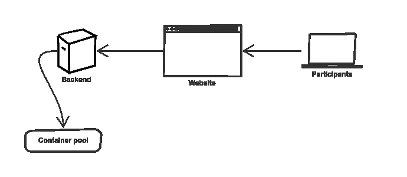

# 如何引导你的节点学校事件

> 原文：<https://dev.to/a0viedo/how-to-bootstrap-your-nodeschool-event-3cin>

多年来，布宜诺斯艾利斯 NodeSchool 的团队一直在尝试不同的设置，尝试各种工具，如 [C9](//c9.io) 、[可运行](http://runnable.com/)或[故障](https://glitch.com/)。在所有这些尝试中，我们旨在最大限度地减少参与者的设置时间，并避免他们进行任何类型的安装。我们正在寻找一种支持所有操作系统的替代方案，它不需要 GitHub 帐户，理想情况下不需要登录/注册。

这是一个关于如何配置[代码服务器](https://github.com/codercom/code-server)的修改 Docker 映像的教程，以使用基于 web 的 VSCode 编辑器，每个 workshop 都预安装在一个自托管实例上。为了更好地理解，我尝试将以下图表中的组件放在一起:

[](https://res.cloudinary.com/practicaldev/image/fetch/s--BjJ4Ie0d--/c_limit%2Cf_auto%2Cfl_progressive%2Cq_auto%2Cw_880/https://thepracticaldev.s3.amazonaws.com/i/d38xxiawfugyle250ge7.png)

# 1。配置您的实例

使用你选择的云提供商和你偏好的任何操作系统，只要它是基于*NIX 的(我还没有尝试在 Windows 的 WSL 上运行它，但应该也能工作)。它也可以在本地计算机上运行。
需求: [docker](http://docker.com/) ， [Node](http://nodejs.org/) ，一个 [Zeit](https://zeit.co/signup) 账号和[现在](https://zeit.co/now)安装完毕。

# 2。创建您的容器

SSH 到您的实例中，并定义一些将在接下来的步骤中使用的环境变量，确保您修改了环境变量`CONTAINERS_COUNT`以获得您需要的值:

```
export PUBLIC_IP=`curl https://ipinfo.io/ip`
export CONTAINERS_COUNT=thenumberyouwant 
```

<svg width="20px" height="20px" viewBox="0 0 24 24" class="highlight-action crayons-icon highlight-action--fullscreen-on"><title>Enter fullscreen mode</title></svg> <svg width="20px" height="20px" viewBox="0 0 24 24" class="highlight-action crayons-icon highlight-action--fullscreen-off"><title>Exit fullscreen mode</title></svg>

为您的容器创建一个模板文件夹。在我的例子中，我创建了一个`introduction.js`文件，这样项目就不为空:

```
$ mkdir -p nodeschool/template
$ echo "console.log('hello');" > nodeschool/template/introduction.js
$ ls nodeschool/template/
introduction.js 
```

<svg width="20px" height="20px" viewBox="0 0 24 24" class="highlight-action crayons-icon highlight-action--fullscreen-on"><title>Enter fullscreen mode</title></svg> <svg width="20px" height="20px" viewBox="0 0 24 24" class="highlight-action crayons-icon highlight-action--fullscreen-off"><title>Exit fullscreen mode</title></svg>

每个容器都应该有一个唯一的目录，以便参与者能够保存和编辑他们项目中的文件，而不会影响其他正在运行的项目。从您的模板创建目录运行:

```
$ for i in $(seq 1 $CONTAINERS_COUNT); do cp -a nodeschool/template. nodeschool/$i; done 
```

<svg width="20px" height="20px" viewBox="0 0 24 24" class="highlight-action crayons-icon highlight-action--fullscreen-on"><title>Enter fullscreen mode</title></svg> <svg width="20px" height="20px" viewBox="0 0 24 24" class="highlight-action crayons-icon highlight-action--fullscreen-off"><title>Exit fullscreen mode</title></svg>

之后，您可以使用命令:
创建容器

```
for i in $(seq 1 2 $(($CONTAINERS_COUNT*2))); do docker run -e "SERVE_PORT=$((8442+$i+1))" -e "URL=$PUBLIC_IP" -d -p 0.0.0.0:$((8442+$i)):8443 -p 0.0.0.0:$((8442+$i+1)):5000 --entrypoint "/bin/bash" -v "${PWD}/nodeschool-servers/$i:/root/project" a0viedo/code-server initialize; done 
```

<svg width="20px" height="20px" viewBox="0 0 24 24" class="highlight-action crayons-icon highlight-action--fullscreen-on"><title>Enter fullscreen mode</title></svg> <svg width="20px" height="20px" viewBox="0 0 24 24" class="highlight-action crayons-icon highlight-action--fullscreen-off"><title>Exit fullscreen mode</title></svg>

一旦所有的容器都启动了，您将需要运行以下命令从它们中提取配置:

```
docker ps -q | xargs -n1 -I{} sh -c 'docker logs {} | tail -10' | grep Password | cut -d' ' -f4 | START_PORT=8443 npx https://gist.github.com/a0viedo/6707a836b16621263a31e7bd149bb6d8 
```

<svg width="20px" height="20px" viewBox="0 0 24 24" class="highlight-action crayons-icon highlight-action--fullscreen-on"><title>Enter fullscreen mode</title></svg> <svg width="20px" height="20px" viewBox="0 0 24 24" class="highlight-action crayons-icon highlight-action--fullscreen-off"><title>Exit fullscreen mode</title></svg>

生成的`config.json`应该如下所示:

```
{  "list":  [  {  "port":  8443,  "password":  "arandompassword"  },  {  "port":  8444,  "password":  "anotherrandompassword"  }  ]  } 
```

<svg width="20px" height="20px" viewBox="0 0 24 24" class="highlight-action crayons-icon highlight-action--fullscreen-on"><title>Enter fullscreen mode</title></svg> <svg width="20px" height="20px" viewBox="0 0 24 24" class="highlight-action crayons-icon highlight-action--fullscreen-off"><title>Exit fullscreen mode</title></svg>

# 3。设置您的活动登录页面

在这一步，我们将配置一个网站，为每个参与者分配一个唯一的 URL 和密码。你需要一个 [Zeit](https://zeit.co/signup) 账号，并安装[now](https://zeit.co/now)(`npm i now -g`)。

首先，克隆[最小节点学校](https://github.com/a0viedo/minimal-nodeschool)仓库:

```
git clone https://github.com/a0viedo/minimal-nodeschool 
```

<svg width="20px" height="20px" viewBox="0 0 24 24" class="highlight-action crayons-icon highlight-action--fullscreen-on"><title>Enter fullscreen mode</title></svg> <svg width="20px" height="20px" viewBox="0 0 24 24" class="highlight-action crayons-icon highlight-action--fullscreen-off"><title>Exit fullscreen mode</title></svg>

获取为步骤 2 生成的`config.json`文件，并将其复制到“minimal-nodeschool”的目录中。最后，在目录中运行`now`，您应该会看到类似下面的内容:

```
$ now
> Deploying ~/Documents/dev/minimal-nodeschool under a0viedo
> Using project nodejs
> Synced 6 files (4.28KB) [2s]
> https://yourdeployment-hash.now.sh [v2] [2s]
┌ index.js           Ready               [17s]
└── λ index.js (2.86KB) [gru1]
┌ index.html         Ready               [1s]
└── index.html
┌ config.json        Ready               [1s]
└── config.json
> Ready! Aliased to https://yourdeployment.a0viedo.now.sh [in clipboard] [23s] 
```

<svg width="20px" height="20px" viewBox="0 0 24 24" class="highlight-action crayons-icon highlight-action--fullscreen-on"><title>Enter fullscreen mode</title></svg> <svg width="20px" height="20px" viewBox="0 0 24 24" class="highlight-action crayons-icon highlight-action--fullscreen-off"><title>Exit fullscreen mode</title></svg>

您可以更进一步，将您的部署 URL 命名为类似于`nodeschoolcity.now.sh`的名称，以便参与者更容易输入。查看[他们的文件](https://zeit.co/docs/v2/domains-and-aliases/aliasing-a-deployment)了解更多信息。

# 4。配置对服务器的访问

可以说这是较难自动化的步骤之一，因为每个云提供商将提供不同的方式来启用实例上的端口(或者在您使用本地计算机的情况下启用防火墙中的端口)。
如果您使用的是 AWS 的 EC2，您可以用这个命令打开一个安全组上的端口(您可以定义`CONTAINERS_COUNT`或者用您的值手动替换):

```
for i in $(seq 1 $((CONTAINERS_COUNT*2))); do aws ec2 authorize-security-group-ingress --group-name your-security-group-name --protocol tcp --port $((8442+$i)) --cidr 0.0.0.0/0; done 
```

<svg width="20px" height="20px" viewBox="0 0 24 24" class="highlight-action crayons-icon highlight-action--fullscreen-on"><title>Enter fullscreen mode</title></svg> <svg width="20px" height="20px" viewBox="0 0 24 24" class="highlight-action crayons-icon highlight-action--fullscreen-off"><title>Exit fullscreen mode</title></svg>

你可以走了！参与者可以通过在终端中运行`download`来下载他们当前的项目，打开显示的 URL 并点击`project.zip`文件。

# 最后的想法

运行 30 个容器消耗了大约 17gb 的内存，但是 CPU 消耗非常低(这并不坏！).
[T3】](https://res.cloudinary.com/practicaldev/image/fetch/s--RPest4WY--/c_limit%2Cf_auto%2Cfl_progressive%2Cq_auto%2Cw_880/https://imgur.com/qJRaxPV.png)