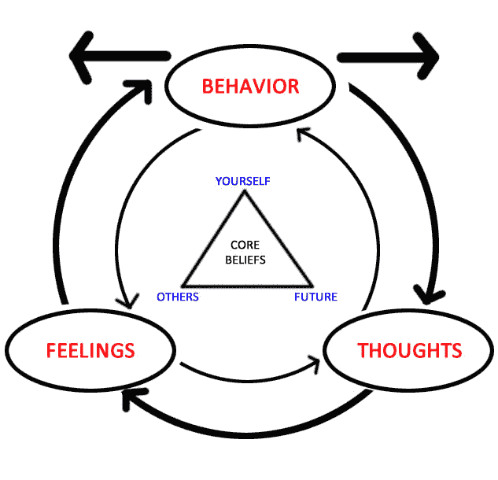

# 正在恢复的冒名顶替者

> 原文：<https://dev.to/flipflopsandrice/the-recovering-impostor-3kf4>

在这篇文章中，我讲述了我与臭名昭著的冒名顶替综合征作斗争的经历，只是最近才取得了一些小小的成功。

## TL；博士；医生

冒名顶替综合症，或与工作相关的焦虑，可以通过使用[认知行为疗法](https://en.wikipedia.org/wiki/Cognitive_behavioral_therapy)定期反映一个人的不安全感来非常有效地对抗。

## 背景

对我和许多其他人来说，冒名顶替综合症是一种与工作相关的焦虑和不安全感。

[维基百科](https://en.wikipedia.org/wiki/Impostor_syndrome)将其定义为:

> 冒名顶替综合征是一种心理模式，在这种模式中，一个人怀疑他或她的成就，并对被揭露为“骗子”有一种持续的内在恐惧(T2)

在这个定义中有几个有趣的术语完全涵盖了与这种形式的焦虑相关的感受:**怀疑**、**恐惧**和**暴露**。这些完美地描述了这种特定焦虑的向下螺旋的循环思维。

**🖼️局势**

我的秘密:我没有受过计算机科学教育。好吧，反正不是在学术层面上，这才是最重要的。所以我到处说我没有接受过计算机科学的教育。当然，这完全不对，任何教育水平都很重要，很多人会说经验更重要。但是你会发现这是一种趋势:轻视你的知识、技能和成就是主要症状。

我会把自己描述成一个自学成才、务实的人:实干家。我从 2007 年开始全职工作，并很快找到了初级开发人员的工作。这是`mysql_connect`的时候，IE6 还占主导地位。我不会深情地回头看它。2009 年的经济衰退来袭，我决定开始作为一名固定价格承包商工作，为我所在地区的中小企业实现流程现代化。有几年情况不错，我沉浸在自己的世界里，努力工作。突然，意想不到的财务挫折让我的公司分了开来，我决定回去做一名高级开发人员。

这个决定改变了一切。

当然，我和我的同事有过间接的接触，但是在一个团队中，和那些比我更聪明、更快、更好的人一起工作，对我的影响比我预想的要大。我在工作中交付代码或讨论技术概念时感到压力很大。他们知道的比我多，他们比我强，他们一定会怎么看我？我开始讨厌上班，打卡下班的时候感觉很开心。我开始养成了不说心里话，不暴露自己的习惯。

**💥影响**

这种自我判断的无限循环，这些年给了我难以置信的压力。有一半时间我甚至不能清醒地思考。我已经停止做兼职项目，不参与任何自由/开源软件，避免不必要的挑战。我是一名自由职业者:这种焦虑正在扼杀我的生产力和对工作的热爱，如果我不注意，它可能会开始损害我的收入。

## 分析

**🔍反射**

反思这一切，我的焦虑归结为:

*1。怀疑我的能力:*

*   由于走“自学路线”(无学历背景)。
*   在概念会谈中缺乏快速的理论知识。

*2。担心如果我的怀疑是真的会发生什么:*

*   不相信自己的能力。
*   自我判断，不相信自己:“我肯定我永远无法完全理解这一点”。

*3。活在我会暴露的假设下:*

*   我今天签入的代码可能是我被暴露的原因。
*   这个 API 架构讨论可能是我暴露的原因。

然而，有很多证据表明，我的焦虑(大部分)是没有根据的。我的同事和同事一致告诉我，我很有能力，是一笔真正的财富。短期合同被延长数月，有时甚至数年。我从来没有被解雇过(阅读:*曝光*)。

还有一个事实是，定义一个“好”开发人员的能力要多得多。善于与人相处，能够处理压力，能够兼顾利益相关者的需求，不完全💩。有很多人甚至会说，技术知识并不能让一个高级开发人员变得“高级”，实际上软技能才是最重要的。

多年来，我一直试图告诉自己以上所有的事情。你猜怎么着:我还在纠结。

**🧠认知行为疗法**

不要告诉自己有证据，不要对自己太苛刻，还有一个选择:CGT。

在我妻子精疲力尽后的恢复过程中，我学会了 CGT，或者说“*证明自己不是这样*”。她的症状出奇的相似。有一天她带着这个技巧回家，我很快开始看到这个概念的好处。

> ### CBT 的基本原则
> 
>  
> *来源:[【维基百科】](https://en.wikipedia.org/wiki/Cognitive_behavioral_therapy)*

这个概念是你回答一系列问题来挑战你的消极想法。这些挑战让你反思你的想法和事实之间的差异。之后，你应该对这些想法感觉(稍微)好一些。这项技术极大地帮助了我妻子的康复，目前我也开始效仿。

每当我面对对自己的恐惧或怀疑时，我会试着回答以下问题:

*   定义消极思想。
*   这种消极思想有多强？(0% - 100%)
*   这种消极思想有多准确？
*   评价支持和反对这种想法的证据。
*   原来的负面思想有多强(0% - 100%)

结果应该是否定的力量减弱了，因为你在评估它背后的推理。做这个练习一段时间后，我开始看到进步。我们不能在一天之内改变自己，尤其是如果一些事情已经积累了多年。但是坚持这个过程会产生比保持恐惧更好的结果。

**👜外卖**

*   意识到你的负面想法
*   挑战你的消极想法
*   保持一致
*   坚持下去，这可能是一条漫长的康复之路

但请记住，如果你最终感觉更好，这是值得的！

[https://www.youtube.com/embed/SJUhlRoBL8M](https://www.youtube.com/embed/SJUhlRoBL8M)