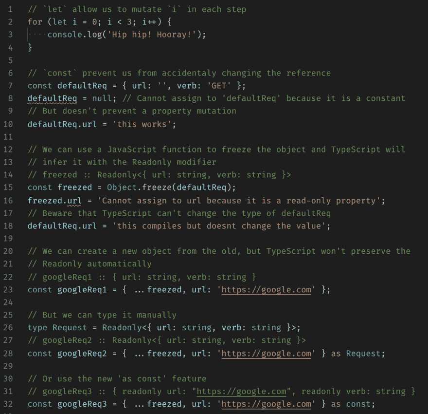
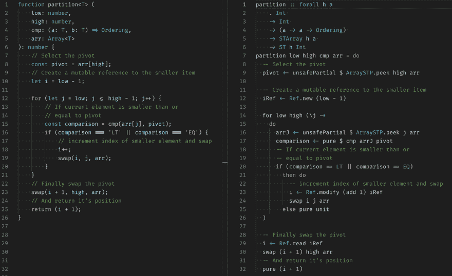

# 变异还是不变异，这是个问题

> 原文：<https://dev.to/bnevilleoneill/to-mutate-or-immutate-that-is-the-question-2f1m>

[](https://res.cloudinary.com/practicaldev/image/fetch/s--fjuoNG01--/c_limit%2Cf_auto%2Cfl_progressive%2Cq_auto%2Cw_880/https://thepracticaldev.s3.amazonaws.com/i/urfo9rqt2uix7qmf3ytc.png)

这是**并非所有编译器生来平等**系列的第二篇文章，在这篇文章中，我们比较了 *TypeScript* (TS)和 *PureScript (PS)* ，这两种静态类型语言编译成 *JavaScript (JS)* 。在[的第一篇文章](https://dev.to/bnevilleoneill/typescript-vs-purescript-not-all-compilers-are-created-equal-12i6-temp-slug-4466128)中，我们介绍了这两种语言，并解释了它们存在的原因。我们还讨论了限制如何为我们提供某些保证，从而增加我们对代码的信心。我们谈到的第一个限制是*纯度，*在这篇文章中，我们将讨论另一个限制:*不变性*。

世界总是在变化，如果一个软件应用程序试图表现真实世界的某个方面，它将不得不具有可变的状态。但是在应用程序的某个地方，我们需要对变化的值进行建模，这并不意味着程序中的所有值都应该被允许变化。我认为添加一个限制来处理不可变数据可以保证没有值会发生意外变化。

[](https://logrocket.com/signup/)

## 默认可变

默认情况下， *JavaScript* 和 *TypeScript* 都是可变的。我们可以使用一些语言特性来避免意外突变，但我们需要注意一些细节。

[](https://res.cloudinary.com/practicaldev/image/fetch/s--x6f2jPx_--/c_limit%2Cf_auto%2Cfl_progressive%2Cq_auto%2Cw_880/https://paper-attachments.dropbox.com/s_3FA8B4DB81C1702262F976E2E8FE755602BB0FE3E5BC08FB0DE427D74C5BB95C_1557523100642_Screen%2BShot%2B2019-05-10%2Bat%2B18.17.48.png)

值得一提的是，唯一的 *TypeScript* 特定语法是第 26 行的类型定义以及第 28 行和第 32 行的`as XXX`,其余的是由编译器验证的普通的旧的 *JavaScript* 。

当使用像 [Redux](https://redux.js.org/) 这样的库时，能够将一个值标记为只读真的很有帮助，这些库依赖于不可变的归约器才能正常工作。在普通的 *JavaScript* 中，忽略我们无意中改变一些数据的情况是如此普遍，以至于有一个[文档页面](https://redux.js.org/recipes/structuring-reducers/immutable-update-patterns#common-mistake-2-only-making-a-shallow-copy-of-one-level)解释了常见的错误和一些正确处理不可变数据结构的模式。通过使用 *TypeScript 的* `Readonly` *、* `ReadonlyArray` *和* [新的 const 断言](https://www.typescriptlang.org/docs/handbook/release-notes/typescript-3-4.html)(在 3.4 版本中发布)，我们可以将我们的思想从那个负担中解放出来，并将重量放在编译器上，相信它会引导我们获得更准确的代码。

但是 Redux 并不是我们从使用不可变值中获益的唯一地方。据说如果你不以 X 年前写的代码为耻，那这 X 年你什么都没学到(而我从 6 年前写的一个未完成的项目中学到了很多。[](https://res.cloudinary.com/practicaldev/image/fetch/s--I5CoQZTE--/c_limit%2Cf_auto%2Cfl_progressive%2Cq_auto%2Cw_880/https://s.w.oimg/core/emoji/12.0.0-1/72x72/1f605.png)

这是一款名为 [mddoc](https://github.com/hrajchert/mddoc) 的工具，旨在同步文档和代码，读取引用其他文件的文件，提取信息并创建由插件定制的网页。最大的问题之一是程序不同步骤之间的沟通。我选择使用一个我称之为`Metadata`的共享可变对象。

没有像 *TypeScript* 这样的工具，理解这个对象的结构是非常复杂的，它有几个嵌套的属性，并不都是相关的，有些有隐晦的名字，有些是后来从代码的不同部分分配的。

简单地共享一个对象并自由地改变它在开始时确实很有帮助，但是随着项目的增长，它变得很难管理。最终，我放弃了它，除了几个月前的一次小冲刺，通过将项目迁移到*打字稿*，我解决了不知道`Metadata`对象的结构的痛苦，并且[将一些问题](https://github.com/hrajchert/mddoc/blob/50d148519e3465c822ce6fdfa67f98386c249265/src/metadata-manager.ts#L113)揭示到[中，这些问题](https://github.com/hrajchert/mddoc/blob/50d148519e3465c822ce6fdfa67f98386c249265/src/metadata-manager.ts#L35)使得项目[难以维护](https://github.com/hrajchert/mddoc/blob/50d148519e3465c822ce6fdfa67f98386c249265/src/markdown-parser/markdown-file-reader.ts#L38)。

## 默认不可变

默认情况下，PureScript 是不可变的，这使得它非常适合处理纯函数。类似于`const`关键字，一旦我们为一个标识符设置了值，我们就不能更改它。

```
nine :: Int
nine = 9

-- Compiler error: The value nine has been defined multiple times
nine = 8 
```

一个好的副作用是语法更加清晰，因为我们不需要区分`let`和`const`。此外，一旦定义了属性值，就没有语法来更改它。我们能做的是通过简单地定义我们想要改变的属性，从旧对象创建一个新对象。这种模式如此普遍，以至于有一个叫做[记录更新](https://github.com/purescript/documentation/blob/master/language/Syntax.md#record-updates)的语法特性来帮助我们以一种简洁的方式表达这一点。

```
type Request = { url :: String, verb :: String }

-- We define a full object
defaultReq :: Request
defaultReq = { url: "", verb: "GET"}

-- And then use it to create a new one, with a changed property
googleReq :: Request
googleReq = defaultReq { url = "http://www.google.com" }
--          { url: "http://www.google.com", verb: "GET" } 
```

如果我们确实想处理可变数据，一个选择是使用 [ST](https://pursuit.purescript.org/packages/purescript-st/4.0.0/docs/Control.Monad.ST) 和 [STRef](https://pursuit.purescript.org/packages/purescript-st/4.0.0/docs/Control.Monad.ST.Ref) 类型。如文档所述，这些类型允许我们创建具有局部变异的计算，即变异不会“逃逸”到周围的计算中。我们可以组合和扩展计算，并最终运行它以获得一个值。一旦我们运行它，我们就失去了对可变数据的引用，因此有了“安全变异”。

下面的例子展示了我们如何使用这些类型来表示可变数据和它们的 *TypeScript* 副本。`mutable1`示例创建一个对新的可变对象的引用，初始值为 0，然后将该值读入`val`标识符，并将表达式`(val + 1)`的结果写入可变对象。`mutable2`示例使用带有匿名函数的 [modify](https://pursuit.purescript.org/packages/purescript-arrays/5.3.0/docs/Data.Array.ST#v:modify) 以更简洁的方式做同样的事情。`mutable3`展示了我们如何使用循环函数来很好地处理像`for`或`while`这样的突变。

[](https://res.cloudinary.com/practicaldev/image/fetch/s--Mlrm0q1i--/c_limit%2Cf_auto%2Cfl_progressive%2Cq_auto%2Cw_880/https://paper-attachments.dropbox.com/s_3FA8B4DB81C1702262F976E2E8FE755602BB0FE3E5BC08FB0DE427D74C5BB95C_1556999560419_Screen%2BShot%2B2019-05-04%2Bat%2B16.52.18.png)

在[之前的帖子](https://dev.to/bnevilleoneill/typescript-vs-purescript-not-all-compilers-are-created-equal-12i6-temp-slug-4466128)中，我们提到了一种能够增长的[语言的重要性，通过展示 *JavaScript 的*](https://www.youtube.com/watch?v=_ahvzDzKdB0) [管道操作符](https://developer.mozilla.org/en-US/docs/Web/JavaScript/Reference/Operators/Pipeline_operator)(仍在委员会讨论中)是由[apply lipped](https://pursuit.purescript.org/packages/purescript-prelude/4.1.1/docs/Data.Function#v:applyFlipped)函数在 *PureScript* 用户域中实现的。对象变异也是如此。在 *TypeScript、*中，我们需要特殊的语言修饰符，如`Readonly`、`ReadonlyArray`和`as const`，而在 *PureScript* 中，我们使用普通的用户域类型(`ST`)，它有一个[巧妙的](https://github.com/purescript/purescript-st/blob/master/src/Control/Monad/ST/Internal.js#L1)外部函数接口( [FFI](https://github.com/purescript/documentation/blob/master/guides/FFI.md) )。

## 代表抽象

在我们解释 ST 和 STRef 如何工作之前，让我们先介绍一个我们将在最后一节使用的例子，并用它来解释一些语言特性。下面是一个使用递归函数和不可变数组的简单实现 [QSort 算法](https://www.youtube.com/watch?v=Hoixgm4-P4M)。

[](https://res.cloudinary.com/practicaldev/image/fetch/s--_6V1u8Z2--/c_limit%2Cf_auto%2Cfl_progressive%2Cq_auto%2Cw_880/https://paper-attachments.dropbox.com/s_3FA8B4DB81C1702262F976E2E8FE755602BB0FE3E5BC08FB0DE427D74C5BB95C_1556831093351_Screen%2BShot%2B2019-05-02%2Bat%2B18.04.19.png) 

<figcaption>递归不可变 qsort 中 TS(左)和 PS(右)</figcaption>

我们需要做的第一件事是区分基本情况和递归，并将数组的`head`和`tail`分开。在 *TypeScript 中，*我们使用一个 *if 语句*用于第一部分，使用[析构赋值](https://developer.mozilla.org/en-US/docs/Web/JavaScript/Reference/Operators/Destructuring_assignment)用于第二部分。在 *PureScript* 中，我们使用了[松散](https://pursuit.purescript.org/packages/purescript-arrays/5.3.0/docs/Data.Array#v:uncons)函数，该函数向具有属性`head`和`tail`的对象返回一个`Maybe`值。然后使用[模式匹配](https://github.com/purescript/documentation/blob/master/language/Pattern-Matching.md#pattern-matching)，我们可以区分基本情况和递归，并为对象属性分配标识符。

对于第二部分，我们需要使用数组原生过滤器计算`small`、`mid`和`large`。在*类型脚本*中，我们只是在功能块中添加那些定义，并在`tail`上调用**过滤方法**，传递一个箭头函数。在 *PureScript* 中，我们需要使用一个表达式，所以我们必须使用 [let 或者 where 绑定](https://github.com/purescript/documentation/blob/master/language/Syntax.md#let-and-where-bindings)来代替块代码。然后我们用匿名的[λ](https://github.com/purescript/documentation/blob/master/language/Syntax.md#functions)和`tail`调用**过滤函数**。从命令式或 OOP 的角度来看，这些参数似乎是逆序的，但是正如这篇 Haskell 文章所示，这是为了更好地组合。最后，为了创建结果数组，我们使用了 TS 中的 *JavaScript 的* [spread 操作符](https://developer.mozilla.org/en-US/docs/Web/JavaScript/Reference/Operators/Spread_syntax)和 PS 中的 [append 方法](https://pursuit.purescript.org/packages/purescript-prelude/4.1.1/docs/Data.Semigroup#v:(%3C%3E))。

如果不引入抽象的概念，我们在静态类型语言中只能做到这一步。前面的函数只对数字进行升序排序，但是我们希望以任何顺序对任何东西进行排序。为此，我们提取了 compare 函数，并将其作为一个应该由用户提供的参数。为了加强类型正确性，我们在*类型脚本*中使用[泛型](https://www.typescriptlang.org/docs/handbook/generics.html)，在*纯脚本*中使用参数类型。

[](https://res.cloudinary.com/practicaldev/image/fetch/s--MO4TbesP--/c_limit%2Cf_auto%2Cfl_progressive%2Cq_auto%2Cw_880/https://paper-attachments.dropbox.com/s_3FA8B4DB81C1702262F976E2E8FE755602BB0FE3E5BC08FB0DE427D74C5BB95C_1556831628471_Screen%2BShot%2B2019-05-02%2Bat%2B18.13.13.png)

*TypeScript* 在函数参数之前的尖括号内定义泛型类型。受 Java 和的影响。NET 习惯使用像`T`这样的大写字母，或者至少是以大写字母开头的单词(即使[不要求](https://www.typescriptlang.org/play/#src=function%20id%3Ct%3E(a%3A%20t)%20%7B%0D%0A%20%20%20%20return%20a%3B%0D%0A%7D%0D%0A%0D%0Aconst%20num%20%3D%20id(9)%3B))。 *PureScript* ，受 *Haskell* 启发，使用[全称量词](https://en.wikipedia.org/wiki/Universal_quantification) `forall`声明类型参数。参数由空格分隔，并有一个点以区别于定义的其余部分。习惯上使用小写字母，如`a`。你可以使用单词，但与 TS 不同，它必须以小写字母开头。 *PureScript* 支持 unicode，所以你可以把`forall`替换成它的数学符号`∀`。

请注意，我们对`T`或`a`一无所知，所以我们不能对它们做太多，只是把它们传来传去。在这个例子中，我们基本上使用它们来确保 compare 函数接收两个与数组相同类型的值。在这两种语言中，我们都有一种方式来添加对类型的限制，这给了我们更多的权力来处理它，但这是另一篇文章的概念。

## 了解类型

让我们分析一下`mutable1`的例子，看看这些类型是如何组合在一起的。如果我们看一下`new`的[文档](https://pursuit.purescript.org/packages/purescript-st/4.0.0/docs/Control.Monad.ST.Ref#v:new)，我们可以看到下面的签名，我们可以把它分成四个部分。

```
new :: forall a r. a -> ST r (STRef r a)
-- 1) forall a r.
-- 2) a ->
-- 3) ST r (...)
-- 4) (STRef r a) 
```

首先，该函数定义了两个类型参数:`a`是可变值的类型，`r`是一个“幻影类型”，其唯一目的是限制变异的范围。那么这个函数只接收一个参数，类型为`a`的初始值。它返回一个绑定到幻影类型的可变计算`ST r (...)`。计算不是针对`a`类型的值，而是针对对值(`STRef r a`)的引用，该值也受幻影类型的约束。

[读取函数](https://pursuit.purescript.org/packages/purescript-st/4.0.0/docs/Control.Monad.ST.Ref#v:read)接收对一个值的引用，并向其返回一个可变计算。

```
read :: forall a r. STRef r a -> ST r a
-- 1) forall a r.
-- 2) STRef r a ->
-- 3) ST r a 
```

[写函数](https://pursuit.purescript.org/packages/purescript-st/4.0.0/docs/Control.Monad.ST.Ref#v:write)接收两个参数:要写的值和写在哪里。然后，该函数返回一个写入值的可变计算，因此我们不必再次读取或计算它。

```
write :: forall a r. a -> STRef r a -> ST r a
-- 1) forall a r.
-- 2) a ->
-- 3) STRef r a ->
-- 4) ST r a 
```

我们可以使用`do`符号将这些函数以一种“强制性的方式”粘合在一起。这种语言特性允许我们处理具有形状`M a`的类型，比如`Effect Unit`、`Array String`等，只要类型`M`满足某种限制，我们就不会在本文中提及。请放心，这些类型和许多其他类型都符合这一限制。根据底层类型的不同，`do`符号会做一些不同的事情。当与`Effect`一起使用时，我们可以一个接一个地调用同步有效计算。当与`Maybe`一起使用时，我们可以调用不同的计算，即*可能*产生一个值，或者*可能*为空，如果其中一个返回空，那么整个计算返回空。当与`Array`一起使用时，我们可以实现[数组理解](https://leanpub.com/purescript/read#leanpub-auto-array-comprehensions)，当与`ST`一起使用时，我们可以运行不同的计算来改变数据。

`do`中的每个表达式必须返回相同的`M`，但是可以有不同的`a`类型。那些不同的`a`可以使用`identifier ← expression`绑定到一个标识符，除了定义整个`do`表达式类型的最后一个表达式。

```
foo :: M Int
bar :: M String
zoo :: Int -> String -> M Boolean

what :: M Boolean
what = do
  int <- foo
  str <- bar
  zoo int str 
```

如果我们和`Maybe String`一起工作，我们可以用`Maybe`代替`M`，用`String`代替`a`。类似地，如果我们有`Array Number`，我们可以说`M = Array`和`a = Number`，但是当我们处理有多个类型参数的类型时会发生什么呢？如果我们有`Either String Number`，那么就有`M = Either String`和`a = Number`，这意味着所有的表达式都可以用不同的值(`a`)成功，但是如果它们失败了，它们就会以`String`失败。如果我们有`ST r Number`，那么就有`M = ST r`和`a = Number`。

如果我们回头看看`new`、`read`和`write`的类型，我们可以看到它们都返回一个`ST r something`，所以如果我们把它们放在一起，我们可以看到我们的 do 表达式的类型。

```
new :: forall a r. a -> ST r (STRef r a)
read :: forall a r. STRef r a -> ST r a
write :: forall a r. a -> STRef r a -> ST r a

myDoExpr :: forall r. ST r Int
myDoExpr = do
    -- ref :: STRef r Int
    ref <- Ref.new 0
    -- val :: Int
    val <- Ref.read ref
    -- ST r Int
    Ref.write (val + 1) ref 
```

最后，一旦我们建立了我们的计算，我们可以运行它，以获得值了。

```
run :: forall a. (forall r. ST r a) -> a
myDoExpr :: forall r. ST r Int

mutable1 :: Int
mutable1 = run myDoExpr 
```

注意，`run`函数在第一个参数中有一个`forall`，这个特性叫做 [Rank N types](https://github.com/purescript/documentation/blob/master/language/Types.md#rank-n-types) ，它负责避免泄漏变异。

然后，我们可以问一个千年问题:如果一个值在函数内部发生了变异，而外部没有人能够改变它，那么它会发出声音吗？我是说，它还是纯洁的吗？我会说是的，并指出即使是解决最简单的加法(1+1 ), ALU 也需要改变内部注册表，没有人会质疑它的纯度。

## 可变 QSort

在“表示抽象”一节中，我们研究了 QSort 算法的一个简单的不可变实现。现在让我们看看可变版本在两种语言中是什么样子的(从这个[伪代码](https://www.geeksforgeeks.org/quick-sort/)实现)。

[](https://res.cloudinary.com/practicaldev/image/fetch/s--EXPSz1og--/c_limit%2Cf_auto%2Cfl_progressive%2Cq_auto%2Cw_880/https://paper-attachments.dropbox.com/s_3FA8B4DB81C1702262F976E2E8FE755602BB0FE3E5BC08FB0DE427D74C5BB95C_1557613145961_Screen%2BShot%2B2019-05-11%2Bat%2B19.18.31.png)

<figcaption>TypeScript(左)和 PureScript(右)中的可变 QSort 算法</figcaption>

在 *TypeScript* 版本中，我们可以注意到`mutableQSortBy`接收并返回一个`ReadonlyArray`，但是在主体内部，递归函数`sort`使用了一个普通的可变数组。在第 17 行，我们做了唯一的拷贝，我们将`sort`放在适当的位置，一旦它返回，它将被标记为`ReadonlyArray`以避免进一步的变异。在 *PureScript* 中，我们做了类似的事情，在第 6 行中，with a[r](https://pursuit.purescript.org/packages/purescript-arrays/5.3.0/docs/Data.Array.ST#v:withArray)[ray](https://pursuit.purescript.org/packages/purescript-arrays/5.3.0/docs/Data.Array.ST#v:withArray)函数在不可变数组的副本上执行可变计算，该计算使用一个内部递归`sort`函数，该函数在作用域中引用了可变`arr`。

在这两种情况下，内部的`sort`使用了一个名为`partition`的辅助函数，它将选择一个支点，并将较低的元素`swap`到左边，较高的元素到右边。我们可以使用注释来查看算法的不同部分是如何相互关联的。

[](https://res.cloudinary.com/practicaldev/image/fetch/s--Fur7Zhrq--/c_limit%2Cf_auto%2Cfl_progressive%2Cq_auto%2Cw_880/https://paper-attachments.dropbox.com/s_3FA8B4DB81C1702262F976E2E8FE755602BB0FE3E5BC08FB0DE427D74C5BB95C_1557611826105_Screen%2BShot%2B2019-05-11%2Bat%2B18.56.32.png)

在`swap`函数中，实际执行数组突变的函数 *PureScript* 知道读取或写入随机索引的值会导致越界错误。所以我们可以使用一个返回一个值的`Maybe`的[安全 peek](https://pursuit.purescript.org/packages/purescript-arrays/5.3.0/docs/Data.Array.ST#v:peek) ，或者一个可能导致运行时异常的[不安全 peek](https://pursuit.purescript.org/packages/purescript-arrays/5.3.0/docs/Data.Array.ST.Partial#v:peek) 。我们使用后者，后者速度更快，因为我们不需要包装和打开值，但它要求我们使用`unsafePartial`来表明我们知道风险。

[](https://res.cloudinary.com/practicaldev/image/fetch/s--FhBdq17r--/c_limit%2Cf_auto%2Cfl_progressive%2Cq_auto%2Cw_880/https://paper-attachments.dropbox.com/s_3FA8B4DB81C1702262F976E2E8FE755602BB0FE3E5BC08FB0DE427D74C5BB95C_1556847755763_Screen%2BShot%2B2019-05-02%2Bat%2B22.37.33.png)

## 结论

在这篇文章中，我们已经看到了如何在 *TypeScript* 和 *PureScript* 中表示相同的可变和不可变算法，以及语言的默认设置如何改变了人类工程学。即使这是主观的，我也要说可变算法在 TypeScript 中看起来更自然，而不可变算法在 *PureScript* 中看起来更自然。

选择是否使用突变可以取决于不同的因素，但我个人尽量避免突变，只在方便大于风险的情况下使用。在[pure script-halo-real world](https://github.com/thomashoneyman/purescript-halogen-realworld/blob/d213795014a69af99dcb90cdbc8628d3f760c171/src/AppM.purs#L68)中可以找到一个有趣的例子，通过结合使用 [Ref 效果](https://pursuit.purescript.org/packages/purescript-refs/4.1.0/docs/Effect.Ref)(类似于 ST)和`ReaderT`类型，应用程序以一种“受控全局变量”的方式处理登录用户。如果觉得有用请评论分享。

* * *

### Plug: [LogRocket](https://logrocket.com/signup/) ，一款适用于网络应用的 DVR

### [T4】](https://logrocket.com/signup/)

LogRocket 是一个前端日志工具，可以让你回放问题，就像它们发生在你自己的浏览器中一样。LogRocket 不需要猜测错误发生的原因，也不需要向用户询问截图和日志转储，而是让您重放会话以快速了解哪里出错了。它可以与任何应用程序完美配合，不管是什么框架，并且有插件可以记录来自 Redux、Vuex 和@ngrx/store 的额外上下文。

除了记录 Redux 操作和状态，LogRocket 还记录控制台日志、JavaScript 错误、堆栈跟踪、带有头+正文的网络请求/响应、浏览器元数据和自定义日志。它还使用 DOM 来记录页面上的 HTML 和 CSS，甚至为最复杂的单页面应用程序重新创建像素级完美视频。

[免费试用](https://logrocket.com/signup/)。

* * *

帖子[是突变，还是不变，这是个问题](https://blog.logrocket.com/to-mutate-or-immutate/)首先出现在[博客](https://blog.logrocket.com)上。