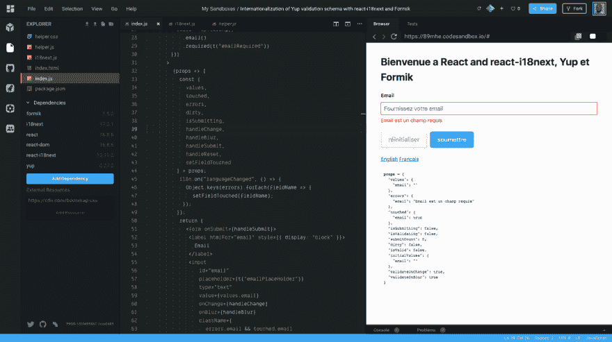

# How to internationalize a Yup validation schema in a React, Formik and react-i18next app

> 原文：[https://dev.to/codedivoire/how-to-internationalize-a-yup-validation-schema-in-a-react-formik-and-react-i18next-app-cj7](https://dev.to/codedivoire/how-to-internationalize-a-yup-validation-schema-in-a-react-formik-and-react-i18next-app-cj7)

[](https://res.cloudinary.com/practicaldev/image/fetch/s--F8xzXmA7--/c_limit%2Cf_auto%2Cfl_progressive%2Cq_auto%2Cw_880/https://cdn-images-1.medium.com/max/1600/1%2AyA6OFK69rm84jAAMEk9ZhA.png)
Internationalization of Yup validation schema with Formik and react-18next

Anybody that had to deal with internationalization (shortened as i18n) knows that it can be a real pain if not handled properly, but in the modern Javascript stack, there exists libraries that remove a lot of that pain and actually make it a breeze. One of these libraries is [i18next](https://www.i18next.com/). If you work with React, you can’t do better than its react-i18next port for the way it seamlessly exposes the i18next API using all of the major React constructs ([Hooks](https://react.i18next.com/latest/usetranslation-hook), [HOCs](https://react.i18next.com/latest/withtranslation-hoc), [Render Props](https://react.i18next.com/latest/translation-render-prop) and [Components](https://react.i18next.com/latest/trans-component)). [Formik](https://jaredpalmer.com/formik/) is form management library that promises to allow you to “build forms in React, without the tears” and I can say that indeed so far, my eyes have remained quite dry. Who says form also says validation, and Formik integrates easily with [Yup](https://github.com/jquense/yup), a JavaScript object schema validator and object parser. [Yup supports localization](https://github.com/jquense/yup/issues/159), but you have to
provide it with a custom locale object, and I felt that the translation functionality should be single handedly handled by i18next. This article will explore how you can sync the translation of the validation errors in Yup when the user changes the selected page language.

### The Bug

In the StackBlitz below, we have a basic setup of React, react-i18next, Formik and Yup. We display a form with a required email field defined in a Yup schema. This form can also be translated in French. To observe the bug in question in syncing the translation:

*   Click in the email field
*   Click outside
*   You should see a `Email is required` error.
*   Now click on the `Francais`link.
*   Everything on the page changes to the French translation except for the validation error.

[https://codesandbox.io/embed/react18next-yup-and-formik-basic-example-lbn26](https://codesandbox.io/embed/react18next-yup-and-formik-basic-example-lbn26)

I suspect this happens because validation schema is initiated when the component renders with the language set to English initially, and on changing the language, the validation is not re-ran, causing the message to stay in English.

### The Fix

Luckily the i18next exposes events, in particular the `languageChanged` event that we can listen to and update the validation so the validation message can be translated. I initially implemented in a global useEffect hook (that I will share later in this article) that listened for this event and re-ran the form validation , but [this issue on Github had a more elegant solution](https://github.com/jaredpalmer/formik/issues/1395), setting all field
with an error to be touched, which should trigger the field validation. The code in question is here:

```
 i18n.on('languageChanged', () => {
        Object.keys(errors).forEach(fieldName => {
            setFieldTouched(fieldName)
        })
    }) 
```

Here is a blitz of the working translation:

[https://codesandbox.io/embed/89mhe](https://codesandbox.io/embed/89mhe)

The `errors` object and `setFieldTouched` function here are the `form.errors` and `form.setFieldTouched` properties of the Formik `form` object passed in a prop. My requirements were different as I only wanted to show an error if the field had indeed been touched.

### Use a hook

In my particular case, I was dealing not only with field level validation bugs, but I also had nested forms where the same was happening. I created a global hook that takes in a Formik `form` object and sets only the fields that have an error as touched. Here is the code: