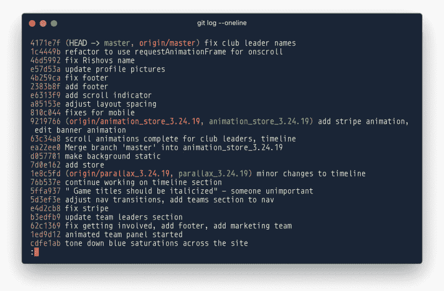
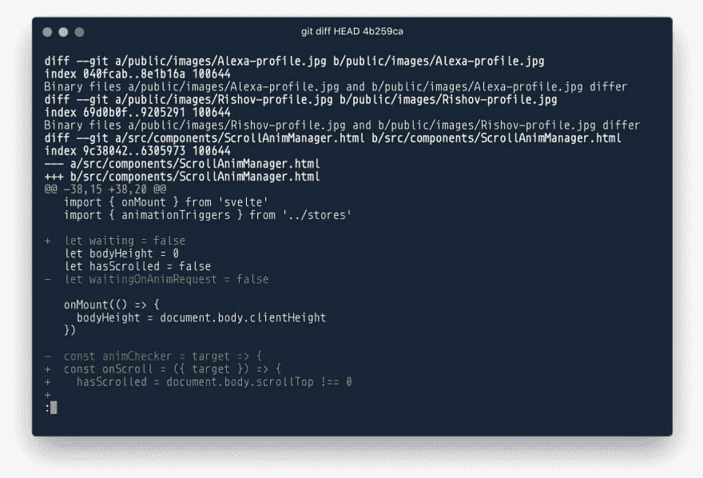
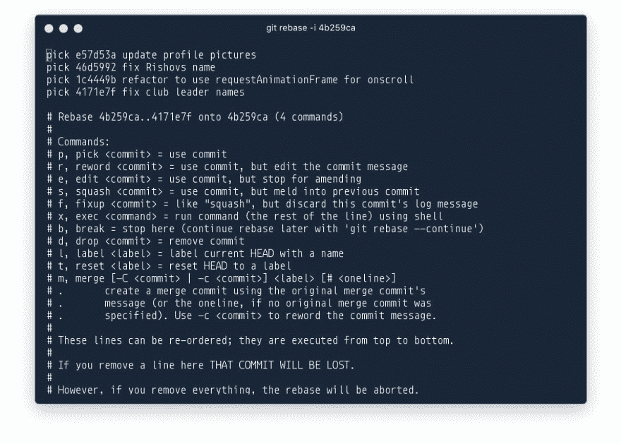

# 如何恢复您的 git 提交而不引起恐慌

> 原文：<https://dev.to/bholmesdev/how-to-revert-your-git-commits-without-panicking-4d1c>

## 第一步:深呼吸

克服你对你周围的代码库/世界正在崩溃的恐惧的最好方法是深呼吸。在疯狂地飞向键盘之前，只要通过鼻子进去就行了...从嘴里出来。

[](https://res.cloudinary.com/practicaldev/image/fetch/s--d_az3O92--/c_limit%2Cf_auto%2Cfl_progressive%2Cq_auto%2Cw_880/https://thepracticaldev.s3.amazonaws.com/i/icmotiqzlpbpgucj0rhi.jpg)

## 步骤 2:查看提交日志

在做任何你可能会后悔的事情之前，最好浏览一下最近所有的提交，以确定你正在回到哪里。最干净的方法是使用:

```
git log --oneline 
```

<svg width="20px" height="20px" viewBox="0 0 24 24" class="highlight-action crayons-icon highlight-action--fullscreen-on"><title>Enter fullscreen mode</title></svg> <svg width="20px" height="20px" viewBox="0 0 24 24" class="highlight-action crayons-icon highlight-action--fullscreen-off"><title>Exit fullscreen mode</title></svg>

[](https://res.cloudinary.com/practicaldev/image/fetch/s--HA5RIpK---/c_limit%2Cf_auto%2Cfl_progressive%2Cq_auto%2Cw_880/https://thepracticaldev.s3.amazonaws.com/i/sgohk5klbw8z2nxfjuey.png)

这将显示您的分支的所有提交历史，从最近的开始。它还显示分支点，以查看被合并的所有内容的历史。

还要注意每个提交左侧的字母数字字符串。这些是唯一标识给定提交的散列。一旦找到了代码爆炸的转折点，就复制提交的散列，然后继续下一步。

***注**:点击“q”键可以退出本日志。这是非常 [vim](https://vim.dev) 所以如果你被困在这里我不会怪你*😛

## 第三步:与最近一次提交进行比较

对照您的恢复点检查差异是验证您将要做出什么更改的一个很好的方法。为此，使用复制的散列并运行以下命令:

```
git diff HEAD COPIED_HASH^ 
```

<svg width="20px" height="20px" viewBox="0 0 24 24" class="highlight-action crayons-icon highlight-action--fullscreen-on"><title>Enter fullscreen mode</title></svg> <svg width="20px" height="20px" viewBox="0 0 24 24" class="highlight-action crayons-icon highlight-action--fullscreen-off"><title>Exit fullscreen mode</title></svg>

[](https://res.cloudinary.com/practicaldev/image/fetch/s--yvthhxpP--/c_limit%2Cf_auto%2Cfl_progressive%2Cq_auto%2Cw_880/https://thepracticaldev.s3.amazonaws.com/i/12cvckmewfkubzntuhky.png)

让我们来分解这个输出。首先，我们看到所有二进制文件被更改的日志，路径列为`a/file_path`和`b/file_path`。这些文件通常是编辑器/构建特定的文件(如在`.vscode`或`.circleci`目录中)和图像文件。在这种情况下，一些图像的分辨率被更新。

接下来，我们将看到每个修改后的文件中添加和删除的行的逐行分解。请注意，这是从将*从*我们最近的提交*更改为*我们正在恢复的提交的角度来看的。所以，所有绿色的东西都是在还原后添加的*，所有红色的东西都将被移除。*

还要注意结尾的`^`。这确保了我们向下区分到该提交散列的祖先。否则，diff 将提前停止一次提交。

如果你滚动到这里，一切看起来都很好，是时候删除那些提交了！

## 步骤 4 选项 1:运行提交恢复(推荐)

第一个选项是最明显的一个:对我们要恢复的提交散列运行`revert`命令。这很简单:

```
git revert COPIED_COMMIT_HASH.. 
```

<svg width="20px" height="20px" viewBox="0 0 24 24" class="highlight-action crayons-icon highlight-action--fullscreen-on"><title>Enter fullscreen mode</title></svg> <svg width="20px" height="20px" viewBox="0 0 24 24" class="highlight-action crayons-icon highlight-action--fullscreen-off"><title>Exit fullscreen mode</title></svg>

请注意，这样做将创建一个新的提交，意味着将所有更改还原到指定的提交。这样做很好，因为您应该能够推送您的更改，并按照预期拥有一个干净的更改日志。

值得警告的是，这将在 vi 中打开一个确认文件(假设您使用的是默认的 git 编辑器),用于回复每个提交的**。如果一切正常，输入“:wq”确认回复。**

您还可以添加`--no-commit`标志来存放每个恢复，而无需实际创建恢复提交。这在恢复多个深度提交时很有用，因为它允许您在最后提交一个大的恢复提交。否则，您将不得不为每一个单独提交一个还原提交。

尽管如此，你可能想要完全改变你的提交历史，这样看起来那些讨厌的提交从来没有出现过。为此，还有第二种选择...

## 选项 2:重定基准并放弃提交

***注意**:在选择此选项之前，请阅读本部分末尾的免责声明。*

您可以使用 rebase 直接修改提交历史，而不是进行还原提交。要启动该过程，请键入以下内容:

```
git rebase -i COPIED_COMMIT_HASH^ 
```

<svg width="20px" height="20px" viewBox="0 0 24 24" class="highlight-action crayons-icon highlight-action--fullscreen-on"><title>Enter fullscreen mode</title></svg> <svg width="20px" height="20px" viewBox="0 0 24 24" class="highlight-action crayons-icon highlight-action--fullscreen-off"><title>Exit fullscreen mode</title></svg>

[](https://res.cloudinary.com/practicaldev/image/fetch/s--_iOdE_1o--/c_limit%2Cf_auto%2Cfl_progressive%2Cq_auto%2Cw_880/https://thepracticaldev.s3.amazonaws.com/i/p8zgqcct0ncexpwzv2e0.png)

注意这里的`-i`标志。这是`--interactive`的简写，它允许您从头部到我们指定的提交散列分别编辑每个提交。

从这里开始，很容易放弃我们所有的提交。说明实际上就在注释中，但是作为一个 TLDR:对于列出的所有提交，将每个“pick”替换为“drop”。

...如果你想知道为什么你的 delete 键不起作用，那是因为 git 使用 [vi](https://vim.dev) 作为默认编辑器。你可以到[这里](https://www.kevinkuszyk.com/2016/03/08/git-tips-2-change-editor-for-interactive-git-rebase/)切换到你最喜欢的编辑器，但是如果你坚持使用 vi，这应该不会太难。

*   要开始编辑，请按“I”键并使用箭头键移动光标
*   将光标移到每个“pick”语句上，删除并用“drop”替换它
*   一旦所有的镐都被替换，点击“esc”
*   要确认重设基础，请键入“:wq”。这将保存您刚刚编辑的重设基础文件

如果您想随时中止，请删除注释部分上面列出的所有行(以“#”开头的行)，以强制 rebase 出错。如果你用的是 vi，只要反复按“d”就行了，直到线条消失🙃

如果您的终端窗口关闭或发生其他事情，重置将挂起未完成。要中止重设基础并重新开始，输入命令`git rebase --abort`。

如果一切顺利，你将正式改变历史！

[](https://i.giphy.com/media/M6VxE9CEHMDtK/giphy.gif)

### 免责声明

如果您已经将现在恢复的提交推送到远程分支，修改 git 历史可能会有问题。恢复后，你的分支会出现在遥控器后面，所以你不能再直接推送了。在这种情况下，您必须运行`git push --force-with-lease`。该标志将通过删除那些丢弃的提交，将您的历史记录强制保存到远程服务器上。`with-lease`作为一个错误检查，以确保您的其他提交与远程的一致。

您可能听说过在推送中使用`--force`不是最佳实践，因为它涉及到在远程重写提交历史。对于在同一分支机构工作的其他人来说，这可能是一个问题，因为他们的历史将不再与遥控器的历史一致。[有办法解决这个](https://stackoverflow.com/questions/9813816/git-pull-after-forced-update)，但是要确保其他人在遇到麻烦之前意识到你的原力推动！

## 包装完毕

希望到这结束时，你已经让你的分支回到正轨！主要是，在修改提交时，尤其是直接编辑 git 历史时，一定要确保您将要运行什么命令。这对于初学者和专家来说都是一项非常艰巨的任务，所以确保差异和查看提交日志是必须的！

实际上，我写这篇文章是因为我的工作经历了同样的过程，我想让我匆忙写下的笔记更清晰。希望这能帮助其他陷入同样困境的人😊

## 学点小东西？

非常好。如果你错过了，我发布了一个[我的“网络魔法”时事通讯](https://tinyletter.com/bholmesdev)来探索更多像这样的知识金块！

这个东西解决了 web 开发的[【首要原则】](https://www.swyx.io/first-principles-approach/)。换句话说，是什么让我们所有的 web 项目运转起来的所有 janky 浏览器 API、弯曲的 CSS 规则和半可访问的 HTML？如果你正在寻找超越框架的*，这是给你亲爱的网络巫师的🔮*

 *[立即在此订阅](https://tinyletter.com/bholmesdev)。我保证永远教，永远不会垃圾邮件❤️*