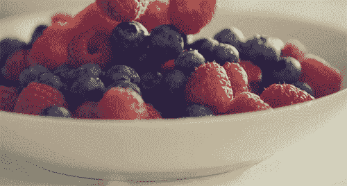
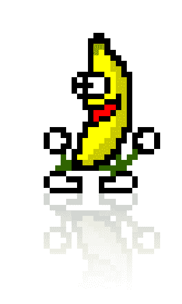
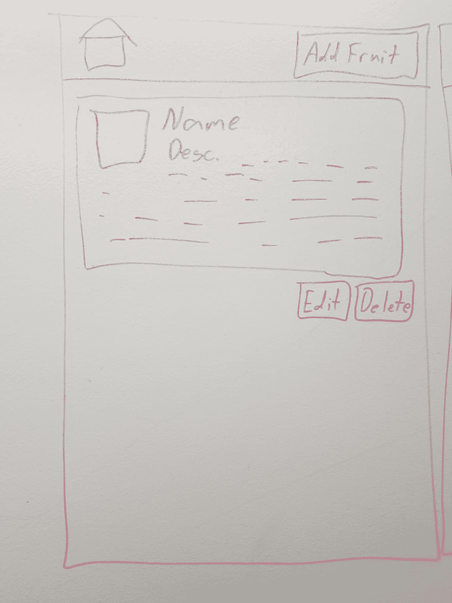

# 水果车:盗梦空间

> 原文：<https://dev.to/sleepycecy/fruit-cart-inception-1ne3>

水果车项目诞生于一个三小时的培训课程，创建一个严格测试驱动开发(TDD)风格的整个应用程序的愿望，以及，嗯，Jeff。杰夫是我这个项目的搭档。这是他的小蓝莓。

在本系列中，我将介绍使用 ReactJS 创建 SPA 的过程，react js 从 Java/Spring Boot API 和 Postgres 数据库获取信息。这完全是测试驱动的:我们的测试编写我们的代码，并且在过程中和功能一样重要。我们将使用 JUnit 和 Hamcrest 库，Jest 和 Enzyme，以及(最终)Selenium。

现在我并不打算创建一个可以一步一步重复的教程。我的目标是反思这个过程，巩固我所学到的东西。例如，难点是什么？我们要研究什么？哪些资源是有价值的，为什么？他们的痛点在哪里？我们希望我们拥有什么？

这是我们开始的地方:

# 盗梦

我是一个相当有条理的人，所以我喜欢知道我需要做什么，什么时候需要做，为什么需要做。否则我会发现自己处于一个我称之为“代码洞”的地方:一个除了文档、栈溢出帖子、Baeldung 页面和 DZone 教程之外什么也没有的互联网虫洞。当我出现的时候，我经常会忘记我最初在研究什么。

为了避免代码漏洞，我们将非常基本的 CRUD cart 分成了用户故事。这是一个简单的方法来确定我们到底想要发生什么。

我们最终用 5 个故事详细描述了 7 条 RESTful 路线(索引、显示、新建、创建、编辑、更新、销毁)，1 个故事用于导航，2 个卡片用于图片上传。下面是我们希望用户在购物车上做什么的概述:

当用户到达登录页面并且在
数据库中有水果时，他们应该看到所有这些
水果的列表(名称、描述)。否则，如果没有水果，他们会看到香蕉人和
被提示添加一个水果。

用户还应该看到一个导航栏，有“添加水果”和“主页”作为
选项；导航栏将出现在水果购物车
应用程序的任何“页面”上。每种水果的描述和名称都是一个链接，将用户引向特定水果的
展示页面(见下面的第 4 条)。

当用户点击导航栏中的“添加水果”消息或“添加水果”选项
时，它会带他们到一个带有名称和描述
字段的表单，并带有保存按钮。

在提交完成的水果表单时(即当用户点击
“保存”)，水果被创建，并且用户被带到该水果的显示页面
。

show 页面显示水果的名称和描述，还有一个按钮
用来编辑水果。

当用户点击“编辑”按钮时，他们被引导到编辑
表单，在名称和描述字段中有预先填写的信息。
他们编辑，然后提交表单来更新水果。然后
他们会被重定向到他们刚刚
编辑过的水果的最新显示页面。如果他们点击导航栏中的主页链接，他们
将被重定向到登录页面，现在有他们创建的任何新的或更新的
水果。

就是这样！额外的功能将包括上传和插入图像的能力，但这可能是 2.0 版本。

现在已经不是超级复杂了；没有登录或注销功能或社交媒体方面，但这不是重点。基础是关键:TDD 和 RESTful APIs，小 React 组件和最小依赖，Java 和 Spring Boot。体验才是重点。

接下来:登陆页面！让我们看看那些美丽的水果。🍉 🍌🍎 🍍 🍒