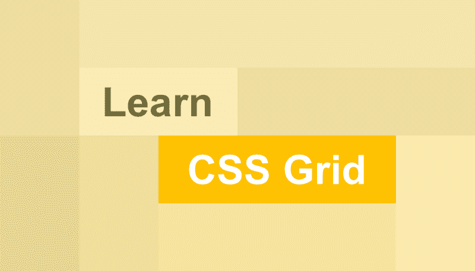

# 如何通过添加一行 CSS 来使你的 HTML 具有响应性

> 原文：<https://dev.to/scrimba/how-to-make-your-html-responsive-by-adding-a-single-line-of-css-29h>

[(https://medium.com/u/bbb3c7ccb0a0)](img/538e3b74fde603e56a7f09bb44fbf70f.png) ](https://res.cloudinary.com/practicaldev/image/fetch/s--GdkTlkWl--/c_limit%2Cf_auto%2Cfl_progressive%2Cq_auto%2Cw_880/https://cdn-images-1.medium.com/max/1200/1%2ABx0gNW69lAXaSRqRw0_8dw.jpeg) *照片由 [TJ Holowaychuk](https://medium.com/u/bbb3c7ccb0a0)* 拍摄

在这篇文章中，我将教你如何使用 CSS Grid 来创建一个超级酷的图像网格，它可以根据屏幕的宽度来改变列数。

而最美的部分:**响应度会加上一行 CSS。**

这意味着我们不必用难看的类名(即`col-sm-4`、`col-md-8`)来混淆 HTML，也不必为每个屏幕尺寸创建媒体查询。

> 我还创建了一个免费的 CSS 网格课程。[点击此处获得全部访问权限。](https://scrimba.com/g/gR8PTE?utm_source=dev.to&utm_medium=referral&utm_campaign=gR8PTE_single_line_responsive)

[ ](https://scrimba.com/g/gR8PTE?utm_source=dev.to&utm_medium=referral&utm_campaign=gR8PTE_single_line_responsive) *点击图片进入课程。*

现在让我们开始吧！

### 设置

对于本文，我们将继续使用我在第一篇 CSS 网格文章中使用的网格。然后我们会在文章末尾添加图片。下面是我们的初始网格:

[](https://res.cloudinary.com/practicaldev/image/fetch/s--Wamc6ec0--/c_limit%2Cf_auto%2Cfl_progressive%2Cq_auto%2Cw_880/https://cdn-images-1.medium.com/max/800/1%2AfJNIdDiScjhI9CZjdxv3Eg.png)

下面是 HTML:

```
<div class="container">  
  <div>1</div>  
  <div>2</div>  
  <div>3</div>  
  <div>4</div>  
  <div>5</div>  
  <div>6</div>  
</div> 
```

还有 CSS:

```
.container {  
    display: grid;  
    grid-template-columns: 100px 100px 100px;  
    grid-template-rows: 50px 50px;  
} 
```

> 注意:这个例子也有一些基本的样式，我不会在这里深入讨论，因为它与 CSS 网格无关。

如果这段代码让你困惑，我推荐你阅读我的[在 5 分钟内学会 CSS 网格](https://medium.freecodecamp.org/learn-css-grid-in-5-minutes-f582e87b1228)的文章，在那里我解释了布局模块的基础。

让我们从提高色谱柱的响应能力开始。

### 基本响应性以分数为单位

CSS Grid 带来了一个全新的值，叫做分数单位。分数单元的写法类似于`fr`，它允许你将容器拆分成任意多的分数。

让我们把每一列的宽度改为一个分数单位。

```
.container {  
    display: grid;  
    grid-template-columns: 1fr 1fr 1fr;  
    grid-template-rows: 50px 50px;  
} 
```

这里发生的事情是，网格将整个宽度分成三部分，每一列占一个单位。结果如下:

[](https://res.cloudinary.com/practicaldev/image/fetch/s--vlnJuOWk--/c_limit%2Cf_auto%2Cfl_progressive%2Cq_66%2Cw_880/https://cdn-images-1.medium.com/max/800/1%2AJgGPqT2AfFNDD8DhG2wPdQ.gif)

如果我们将`grid-template-columns`值改为`1fr 2fr 1fr`，第二列的宽度将是其他两列的两倍。总宽度现在是四个分数单位，第二个单位占其中的两个，而其他单位各占一个。这是它的样子:

[](https://res.cloudinary.com/practicaldev/image/fetch/s--gqkRQ6Tr--/c_limit%2Cf_auto%2Cfl_progressive%2Cq_66%2Cw_880/https://cdn-images-1.medium.com/max/800/1%2Acpfokc1HBgCwOTNhRU9SHg.gif)

换句话说，分数单位值使您可以非常容易地更改列宽。

### 高级响应能力

然而，上面的例子没有给出我们想要的响应，因为这个网格总是三列宽。我们希望网格根据容器的宽度改变列数。要做到这一点，你必须学习三个新概念。

#### 重复()

我们将从`repeat()`函数开始。这是指定列和行的更有效的方法。让我们使用 repeat():
将原始网格更改为

```
.container {  
    display: grid;  
    grid-template-columns: repeat(3, 100px);  
    grid-template-rows: repeat(2, 50px);  
} 
```

换句话说，`repeat(3, 100px)`等同于`100px 100px 100px`。第一个参数指定了需要多少列或多少行，第二个参数指定了它们的宽度，因此这将为我们提供与开始时完全相同的布局:

[](https://res.cloudinary.com/practicaldev/image/fetch/s--Wamc6ec0--/c_limit%2Cf_auto%2Cfl_progressive%2Cq_auto%2Cw_880/https://cdn-images-1.medium.com/max/800/1%2AfJNIdDiScjhI9CZjdxv3Eg.png)

#### 自动适应

然后是自动适应。让我们跳过固定数量的列，而是用`auto-fit`代替 3。

```
.container {  
    display: grid;  
    grid-gap: 5px;  
    grid-template-columns: repeat(auto-fit, 100px);
    grid-template-rows: repeat(2, 100px);  
} 
```

这会导致以下行为:

[](https://res.cloudinary.com/practicaldev/image/fetch/s--X1RrSuLA--/c_limit%2Cf_auto%2Cfl_progressive%2Cq_66%2Cw_880/https://cdn-images-1.medium.com/max/800/1%2AvLZ9RD3dt0Q3hCieYfRuMg.gif)

网格现在根据容器的宽度改变列数。

> 它只是试图将尽可能多的 100 像素宽的列放入容器中。

然而，如果我们将所有列硬编码为精确的 100px，我们将永远得不到我们想要的灵活性，因为它们很少能加起来达到全宽。正如你在上面的 gif 上看到的，网格经常在右边留出空白。

#### minmax()

为了解决这个问题，我们需要的最后一个要素叫做`minmax()`。我们就简单的用`minmax(100px, 1fr)`代替 100px。这是最终的 CSS。

```
.container {  
    display: grid;  
    grid-gap: 5px;  
    grid-template-columns: repeat(auto-fit, minmax(100px, 1fr));
    grid-template-rows: repeat(2, 100px);  
} 
```

> 注意，所有的响应都发生在一行 CSS 中。

这会导致以下行为:

[](https://res.cloudinary.com/practicaldev/image/fetch/s--OUAkdiaw--/c_limit%2Cf_auto%2Cfl_progressive%2Cq_66%2Cw_880/https://cdn-images-1.medium.com/max/800/1%2A1FOrkyNbaabo3_LJxcdDbg.gif)

如你所见，这非常有效。`minmax()`功能定义了大于或等于最小**和小于或等于最大**的尺寸范围。

所以列现在总是至少 100 像素。但是，如果有更多的可用空间，网格会简单地将这些空间平均分配给每个列，因为这些列会变成一个分数单位，而不是 100 px。

#### 添加图片

现在最后一步是添加图像。这与 CSS 网格无关，但我们还是来看看代码。

我们将从在每个网格项目中添加一个图像标签开始。

```
<div></div> 
```

为了使图像适合项目，我们将它设置为与项目本身一样宽和一样高，然后使用`object-fit: cover;`。这将使图像覆盖它的整个容器，如果需要，浏览器将裁剪它。

```
.container > div > img {  
    width: 100%;  
    height: 100%;  
    object-fit: cover;  
} 
```

其结尾如下:

[](https://res.cloudinary.com/practicaldev/image/fetch/s--YgkURvak--/c_limit%2Cf_auto%2Cfl_progressive%2Cq_66%2Cw_880/https://cdn-images-1.medium.com/max/800/1%2AjCNANupl0ECRzF6cOLuWNw.gif)

就是这样！您现在已经知道了 CSS Grid 中最复杂的概念之一，所以给自己一点鼓励吧。

#### 浏览器支持

在结束之前，我还需要提一下浏览器支持。在写这篇文章的时候， [92%的全球网站流量支持 CSS 网格](https://caniuse.com/#feat=css-grid)。

我相信 CSS 网格是前端开发人员未来的必备技能。很像 CSS Flexbox 在过去几年里发生的事情。

> 因此，如果你对正确学习这个主题感兴趣，可以看看我的 [CSS 网格课程](https://scrimba.com/g/gR8PTE?utm_source=dev.to&utm_medium=referral&utm_campaign=gR8PTE_single_line_responsive)。

感谢阅读！我的名字叫 Per，我是一个创建交互式编码截屏的工具 [Scrimba](http://scrimba.com?utm_source=dev.to&utm_medium=referral&utm_campaign=gR8PTE_single_line_responsive) 的联合创始人。如果你想保持联系，请在[推特](https://twitter.com/perborgen)和 [Instagram](https://www.instagram.com/perborgen/) 上关注我。