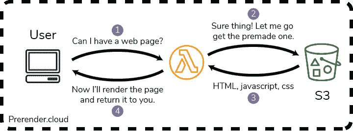

# 2019 年无服务器 React 应用的 SEO 权威指南

> 原文：<https://dev.to/codemochi/a-definitive-guide-to-seo-with-a-serverless-react-application-in-2019-po8>

在本帖中，我们将介绍构建 React 应用程序的许多选项，该应用程序将被搜索引擎和社交媒体网站正确抓取。这并不完全详尽，但它侧重于无服务器的选项，这样您就不必管理一队 ec2 或 Docker 容器。

当您开始在 React 中构建全栈 web 应用程序时，一个经常被忽略的方面是 SEO，因为您有如此多的其他组件要构建以使网站正常工作，以至于直到最后都很容易忘记它。棘手的是，你甚至不能说它不起作用，直到你把你的网站提交给谷歌，然后一周后回来，当你搜索你的网站时，它抓取了你的网站，发现你美丽的元标签没有出现。左边显示的是 Google 搜索结果，而右边显示的是基于您设置的动态标签的预期结果。

[](https://res.cloudinary.com/practicaldev/image/fetch/s--nf8X2Gei--/c_limit%2Cf_auto%2Cfl_progressive%2Cq_auto%2Cw_880/https://www.codemochi.com/static/c8778aa3a849608df65815fa31b6e486/2c525/seo.png)

造成这种情况的原因源于用`create-react-app`生成器启动站点的常见设计模式，所以让我们来看一下。创建样板文件后，您可以使用 React 头盔添加页面标题和 meta 标签。下面是一个典型静态页面的 React 头盔组件的样子:

```
const seo = {
  title: 'About',
  description: 'This is an awesome site that you definitely should check out.',
  url: 'https://www.mydomain.com/about',
  image: 'https://mydomain.cimg/home/logo.png',
}

<Helmet
  title={`${seo.title} | Code Mochi`}
  meta={[
    {
      name: 'description',
      property: 'og:description',
      content: seo.description,
    },
    { property: 'og:title', content: `${seo.title} | Code Mochi` },
    { property: 'og:url', content: seo.url },
    { property: 'og:image', content: seo.image },
    { property: 'og:image:type', content: 'image/jpeg' },
    { property: 'twitter:image:src', content: seo.image },
    { property: 'twitter:title', content: `${seo.title} | Code Mochi` },
    { property: 'twitter:description', content: seo.description },
  ]}
/> 
```

当从静态数据中提取出`seo`时，就没有问题了——谷歌将抓取所有数据。当`seo`依赖于从服务器获取数据时，我们遇到了麻烦。如果我们想创建一个博客页面，而不是静态的 about 页面，那么我们可以使用 GraphQL 或 REST 从 api 中提取数据。在这种情况下，`seo`最初会是空的，在我们从服务器接收数据后会被填充。下面是使用 React Apollo 后博客页面的样子:

```
const BlogPage = ({ match }) => {
    <Query variables={{name: match.params.title}} query={BLOG_QUERY}>
        {({ data, loading }) => {
            const blog = _.get(data, 'blog');
            if (loading || !blog) return <Loading />;
            const { seo } = blog;

            return (
                <div>
                    <Helmet
                        title={`${seo.title} | Code Mochi`}
                        meta={[
                            { name: 'description', property: 'og:description', content: seo.description },
                            { property: 'og:title', content: `${seo.title} | Code Mochi` },
                            { property: 'og:url', content: seo.url },
                            { property: 'og:image', content: seo.image },
                            { property: 'og:image:type', content: 'image/jpeg' },
                            { property: 'twitter:image:src', content: seo.image },
                            { property: 'twitter:title', content: `${seo.title} | Code Mochi` },
                            { property: 'twitter:description', content: seo.description },
                        ]} />
                    <div>
                        //Code for the Blog post.
                    </div>
                </div>
            )
        }
    </Query> }
export default withRouter(BlogPage); 
```

最初，当加载数据时，`<BlogPage>`将简单地返回`<Loading />`组件。只有当加载完成时，我们才移动到代码块的主要部分，所以在那之前不会调用`<Helmet>`组件。理想情况下，我们希望 Google crawler 在页面上等待足够长的时间，直到数据被加载，但不幸的是，这不是我们所能控制的。

有几种方法可以解决这个问题，它们都有各自的利弊。我们将首先回顾一些概念:

**服务器端渲染**

[](https://res.cloudinary.com/practicaldev/image/fetch/s--UfGBLVtp--/c_limit%2Cf_auto%2Cfl_progressive%2Cq_auto%2Cw_880/https://www.codemochi.com/static/2f5b19eb3cd15964d8b87e4c63e3aaae/3b8ee/ssr.png)

这是你有一个运行你的前端网站的服务器。当服务器收到一个页面请求时，它会在向您发送 HTML、js 和 css 之前首先呈现页面。任何需要从 api 获取的数据都将由前端服务器自己获取，页面将在任何内容交付给用户的浏览器之前呈现。这将确保在到达用户之前，博客页面的所有标题和 meta 标签都已呈现。由于 Google web crawler 的行为就像一个用户，它接收到的页面会预先填充正确的标题和元标签，因此它们会被正确地接收。

**静态站点渲染**

[](https://res.cloudinary.com/practicaldev/image/fetch/s--fOaqq3L2--/c_limit%2Cf_auto%2Cfl_progressive%2Cq_auto%2Cw_880/https://www.codemochi.com/static/050ec360a824f1c487301c0c792be377/3b8ee/staticsite.png)

这是你的网站上的每一页将在建立你的网站时预先呈现的地方。这与服务器端呈现不同，因为不是服务器在请求时主动呈现页面，而是所有可能的站点页面都被预先呈现并可用，而不需要任何进一步的构建。这种方法特别适用于静态托管解决方案，如 AWS S3，因为不需要主动运行的服务器。

这是渲染的两个主要类别，但这两种方法有几种解决方案:

**Next.js**

Next.js 是 React 的服务器端渲染框架。它会根据用户的请求即时呈现页面。它可以在两种模式下运行:

**选项 1。主动运行服务器。**

这将在 EC2 实例上运行 Next.js，或者可能作为 Docker 容器运行。

**优点:**

*   运行 Next.js 的标准方式。

**缺点:**

*   即使服务器没有被使用，也要为它的运行付费。最低每月 15 美元。
*   需要随着站点需求的上升和下降来管理服务器实例的伸缩。这就是 Docker、Kubernetes 和一系列托管服务发挥作用的地方，事情在这一点上变得非常复杂。好处是，在这一点上，你的网站可能足够成功，如果你不想处理这个问题，你可以付钱给 DevOps 人员来处理这个问题。
*   目前不兼容 AWS 放大器。

**选项 2。作为λ函数。**

Next.js 最近推出了一个名为`serverless`的新模式，你可以通过 AWS 或使用 Zeit 的 now 服务将每个单独的页面构建为 lambda 函数。

**优点:**

*   无服务器-你只需为你所使用的付费。可能会在免费层，直到你有成百上千的用户(显然取决于使用模式)。
*   轻松放大和缩小。

**缺点:**

*   需要注意有效载荷的大小，不能加载太多的 npm 包。
*   如果网站有一段时间没有被访问，初始加载时间会很慢。这些所谓的冷启动是基于你的页面的复杂性和你所拥有的依赖关系。
*   每个页面都是你的网站的完整拷贝，所以每次有人浏览的时候都会被下载(但是之后会缓存在用户的浏览器中)。
*   目前不兼容 AWS 放大器。

盖茨比

Gatsby 是 React 的静态站点呈现框架。它在构建期间呈现页面，因此所有可能的页面都已经呈现为单独的 html 文件，甚至在上传到服务器之前就可以下载了。这个网站实际上是用这种方法渲染的！

**优点:**

*   快得惊人:不需要渲染，所以页面加载速度非常快。Google PageSpeed Insights 会喜欢你的网站，因为它太快了。
*   非常适合 SEO——所有的标题和元标签都是在构建期间生成的，所以 Google 阅读起来没有任何问题。
*   AWS 放大器兼容。

**缺点:**

*   对于在构建时并不知道所有可能的页面组合的动态站点来说，这可能是不好的。一个例子可能是拍卖网站或用户生成内容的地方。
*   没有好的方法在构建期间创建所有可能的页面，因为来自 api 的数据将来可能会改变。
*   需要额外的欺骗来处理静态内容和动态内容，因为有些 api 调用在构建时发生，有些在运行时发生。

Gatsby 可以呈现 dynamics routes，但是由于页面是由客户端生成的，而不是在服务器上生成的，因此不会用正确的元标记和标题填充它们。但是，静态内容仍然会加载。举例来说，如果你有一个市场网站，谷歌可以获取该网站静态部分的标签，如`home`页面或`posts`页面，但它不能获取单个帖子页面`posts/:id`的标签，因为它的标题和标签需要来自服务器的数据来填充。

**Prerender.cloud**

[](https://res.cloudinary.com/practicaldev/image/fetch/s--pL8uAjVe--/c_limit%2Cf_auto%2Cfl_progressive%2Cq_auto%2Cw_880/https://www.codemochi.com/static/7aa1eaa8917cc6a62bec7715d37ebc11/3b8ee/prerender.png)

这是一个位于应用程序前面的服务，它在将内容发送回客户端或 Google web crawler 之前预先呈现内容。我以前用过这项服务，效果很好- [PocketScholar](https://www.pocketscholar.com) ，我以前开发的一个科学应用程序使用了这项技术。

**优点:**

*   它将按需预渲染任何网页，所以它像 Next.js 一样，但它将与现有的 create-react-app 或静态生成的网站(如 Gatsby 或 create-react-app 的`build static`选项)一起工作。
*   您自己使用 AWS 帐户上的云形成堆栈来部署它。
*   兼容 AWS 放大器。
*   你从一个静态的 s3 桶为你的站点提供服务，所以当你得到更多的用户时，它将无限扩展，你只需要为你所使用的付费。

**缺点:**

*   这是一项基于你的网络应用程序每月收到的请求数量来付费的服务。最初是免费的，但 600-20，000 次请求的费用是每月 9 美元。
*   它没有消除 AWS lambda 存在的冷启动——如果 lambda 在过去 25 分钟左右没有被使用，它可能需要几秒钟才能加载一个网站。

**结论**

有几种方法来处理 React 和 SEO，每种方法都有其优点和缺点。下面是一个重点表格:

| 利益 | 创建-反应-应用 | Prerender .云 | 盖茨比（姓） | 动态路线的盖茨比 | Next.js | Next.js 无服务器模式 |
| --- | --- | --- | --- | --- | --- | --- |
| 为您使用的东西付费 | X | X | X | X |  | X |
| 无缝扩展 | X | X | X | X |  | X |
| 快速初始加载时间 |  |  | X | X | X | X |
| *惊人的*快速的初始加载时间 |  |  | X | X | X |  |
| 呈现动态和静态内容 | X | X |  | X | X | X |
| 创建新页面和路线，无需重新构建 | X | X |  |  | X | X |
| 网络爬虫/社交媒体可废弃(静态) | X | X | X | X | X | X |
| 网络爬虫/社交媒体可废弃(动态) |  | X | * | * | X | X |
| AWS 放大器兼容 | X | X | X | X |  |  |

* Gatsby 动态路由不会设置元数据或标题，因为它需要从服务器获取数据。

从 Create React App (CRA)开始，我们可以看到，虽然它是无服务器的，这使得可伸缩性和成本变得容易，但它对于任何动态内容的 SEO 目的都是失败的。Prerender.cloud 是一个放在 CRA 应用程序前面的好选择，因为它增加了搜索引擎和社交媒体共享目的的渲染功能，但它有一个缺点，即 lambda 功能的冷启动，如果该网站在过去 25 分钟内没有被访问，它会变得有点慢。

盖茨比很适合静态网站，它在速度方面胜出。它将允许您拥有动态路线，但不允许您从这些路线的 SEO 中受益，因为当在用户的浏览器上呈现这些路线时，它需要从服务器获取数据。

Next.js 非常适合动态和静态路由，但是您以前必须管理一个正在运行的服务器实例。Next.js 的无服务器模式是所有世界中最好的一点，虽然比 Gatsby 慢，但页面可以动态呈现，因此所有相关的标签都将填充上它们对网络爬虫的正确值。这种方法唯一潜在的缺点是，AWS Amplify 目前[不支持](https://github.com/aws-amplify/amplify-js/issues/1613)next . js，因此您不能将其用于自动化部署管道、身份验证或 App Sync GraphQL 端点。

从那里来的还有更多！
[点击这里给我们您的电子邮件，我们会在发布新内容时通知您。](https://gmail.us20.list-manage.com/subscribe?u=37f38485b2c7cff2f3d9935b5&id=e3bc056dde)我们尊重您的电子邮件隐私，我们绝不会向您发送垃圾邮件，您可以随时退订。

最初发布于 [Code Mochi](https://www.codemochi.com/blog/2019-06-12-guide-to-seo-with-serverless-react/) 。