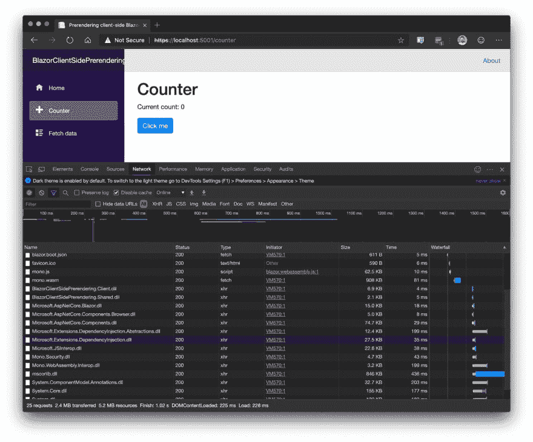
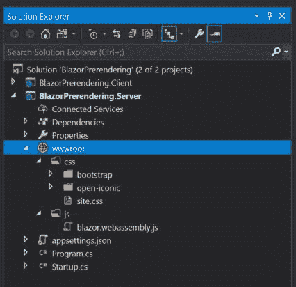

# 预渲染客户端 Blazor 应用程序

> 原文：<https://dev.to/chrissainty/prerendering-a-client-side-blazor-application-bf6>

[](https://res.cloudinary.com/practicaldev/image/fetch/s--9RneJjA8--/c_limit%2Cf_auto%2Cfl_progressive%2Cq_auto%2Cw_880/https://chrissainty.com/conteimg/2019/06/code-1076536_1920.jpg)

虽然预渲染现在是服务器端 Blazor 应用程序的默认设置，但我最近才发现(在过去的 48 小时内)客户端 Blazor 应用程序也可以利用这一点。在这篇文章中，我将向您展示如何设置客户端 Blazor 应用程序进行预渲染。

> 本文的示例项目可以在 [GitHub](https://github.com/chrissainty/ClientSideBlazorPrerendering) 上找到。

## 什么是预渲染？

预渲染是一个过程，其中网页的所有元素都在服务器上编译，静态 HTML 提供给客户端。这种技术用于帮助 SPAs(单页应用程序)提高他们的 SEO(搜索引擎优化)。另一个好处是，网站的加载速度似乎快得多。

对于 Blazor 应用程序来说，这意味着所请求的页面将在服务器上构建并编译成静态 HTML。这个静态 HTML 将包含标准客户端 Blazor 模板中的`blazor.webassembly.js`文件。当客户端收到这个静态 HTML 时，它将被正常处理和呈现。

[](https://res.cloudinary.com/practicaldev/image/fetch/s--Yqv9Yekk--/c_limit%2Cf_auto%2Cfl_progressive%2Cq_auto%2Cw_880/https://chrissainty.com/conteimg/2019/06/blazor-client-side-prerender.jpg)

当执行`blazor.webassembly.js`文件时，mono 运行时将与应用程序 dll 一起下载，您的应用程序将运行。此时，所有静态的预呈现元素都将被交互式组件所取代，应用程序将变成交互式的。

[](https://res.cloudinary.com/practicaldev/image/fetch/s--3MuqDVVE--/c_limit%2Cf_auto%2Cfl_progressive%2Cq_auto%2Cw_880/https://chrissainty.com/conteimg/2019/06/blazor-client-side-prerender-interactive.jpg)

现在，这听起来像是在您的应用程序变得可用之前还有很多事情要做。但这一切都发生在非常短的时间内，大多数最终用户都无法察觉。

## 预渲染的取舍

在我们看如何启用预渲染之前，我想指出使用它有一些权衡。

您将无法再将 Blazor 应用程序部署为静态文件。我们马上会看到，预渲染需要一个 razor 页面，这意味着需要一个. NET 运行时。虽然这可能不是一个大问题，但我想确保您意识到了这一点。

另一个代价是，您必须管理任何 JavaScript 调用，以解决预呈现问题。如果你试图在一个组件的`OnInit`或`OnInitAsync`方法中执行 JavaScript 互操作，那么你会得到一个异常。当使用预渲染时，所有的 JavaScript interop 调用都应该移动到`OnAfterRenderAsync`生命周期方法中。只有在页面完全呈现后，才会调用此方法。

## 启用预渲染

我们将从一个独立的 Blazor 应用程序开始，逐步实现预渲染。我已经使用 dotnet CLI 创建了一个新的独立 Blazor 应用程序。您也可以在 Visual Studio 中使用该模板。

```
dotnet new blazor -o BlazorPrerendering.Client 
```

<svg width="20px" height="20px" viewBox="0 0 24 24" class="highlight-action crayons-icon highlight-action--fullscreen-on"><title>Enter fullscreen mode</title></svg> <svg width="20px" height="20px" viewBox="0 0 24 24" class="highlight-action crayons-icon highlight-action--fullscreen-off"><title>Exit fullscreen mode</title></svg>

如果您希望在已经使用“托管”模板的客户端 Blazor 应用程序上启用预渲染。然后，您可以在我们进行的过程中添加一些配置。

### 添加主机项目

我们要做的第一件事是添加一个新的空的 ASP.NET 核心 Web 应用程序。同样，我使用的是 dotnet CLI，但是如果您愿意，也可以使用 Visual Studio 中的模板。

```
dotnet new web -o BlazorPrerendering.Server 
```

<svg width="20px" height="20px" viewBox="0 0 24 24" class="highlight-action crayons-icon highlight-action--fullscreen-on"><title>Enter fullscreen mode</title></svg> <svg width="20px" height="20px" viewBox="0 0 24 24" class="highlight-action crayons-icon highlight-action--fullscreen-off"><title>Exit fullscreen mode</title></svg>

我们的解决方案现在应该是这样的。

[](https://res.cloudinary.com/practicaldev/image/fetch/s--XHlSn8T1--/c_limit%2Cf_auto%2Cfl_progressive%2Cq_auto%2Cw_880/https://chrissainty.com/conteimg/2019/06/solution-structure.JPG)

然后，我们需要添加一个从服务器项目到客户端项目的项目引用，以及几个 NuGet 包。我们还需要添加一些额外的资源来加载 Blazor。服务器包。所以最简单的做法就是直接编辑`csproj`文件。

```
<Project Sdk="Microsoft.NET.Sdk.Web">

  <PropertyGroup>
    <TargetFramework>netcoreapp3.0</TargetFramework>
    <RestoreAdditionalProjectSources>
      https://dotnet.myget.org/F/aspnetcore-dev/api/v3/index.json;
      https://dotnet.myget.org/F/blazor-dev/api/v3/index.json;
    </RestoreAdditionalProjectSources>
    <LangVersion>7.3</LangVersion>
  </PropertyGroup>

  <ItemGroup>
    <PackageReference Include="Microsoft.AspNetCore.Blazor.Server" Version="3.0.0-preview5-19227-01" />
    <PackageReference Include="Microsoft.AspNetCore.Mvc.NewtonsoftJson" Version="3.0.0-preview5-19227-01" />
  </ItemGroup>

  <ItemGroup>
    <ProjectReference Include="..\BlazorPrerendering.Client\BlazorPrerendering.Client.csproj" />
  </ItemGroup>

</Project> 
```

<svg width="20px" height="20px" viewBox="0 0 24 24" class="highlight-action crayons-icon highlight-action--fullscreen-on"><title>Enter fullscreen mode</title></svg> <svg width="20px" height="20px" viewBox="0 0 24 24" class="highlight-action crayons-icon highlight-action--fullscreen-off"><title>Exit fullscreen mode</title></svg>

一旦完成，您的项目文件应该看起来像上面的代码。

### 配置主机

现在我们的项目已经设置好了，我们将对服务器项目`Startup.cs`进行一些更改。

首先，将以下代码添加到`ConfigureServices`方法中。

```
public void ConfigureServices(IServiceCollection services)
{
    services.AddMvc().AddNewtonsoftJson();
    services.AddResponseCompression(opts =>
    {
        opts.MimeTypes = ResponseCompressionDefaults.MimeTypes.Concat(
            new[] { "application/octet-stream" });
    });
} 
```

<svg width="20px" height="20px" viewBox="0 0 24 24" class="highlight-action crayons-icon highlight-action--fullscreen-on"><title>Enter fullscreen mode</title></svg> <svg width="20px" height="20px" viewBox="0 0 24 24" class="highlight-action crayons-icon highlight-action--fullscreen-off"><title>Exit fullscreen mode</title></svg>

我们还需要添加一个 using 语句。

```
using Microsoft.AspNetCore.ResponseCompression; 
```

<svg width="20px" height="20px" viewBox="0 0 24 24" class="highlight-action crayons-icon highlight-action--fullscreen-on"><title>Enter fullscreen mode</title></svg> <svg width="20px" height="20px" viewBox="0 0 24 24" class="highlight-action crayons-icon highlight-action--fullscreen-off"><title>Exit fullscreen mode</title></svg>

然后用下面的代码替换`Configure`方法中的代码。

```
public void Configure(IApplicationBuilder app, IWebHostEnvironment env)
{
    app.UseResponseCompression();

    if (env.IsDevelopment())
    {
        app.UseDeveloperExceptionPage();
        app.UseBlazorDebugging();
    }

    app.UseHttpsRedirection();

    app.UseStaticFiles();

    app.UseRouting();

    app.UseEndpoints(endpoints =>
    {
        endpoints.MapDefaultControllerRoute();
        endpoints.MapFallbackToPage("/_Host");
    });

    app.UseBlazor<Client.Startup>();
} 
```

<svg width="20px" height="20px" viewBox="0 0 24 24" class="highlight-action crayons-icon highlight-action--fullscreen-on"><title>Enter fullscreen mode</title></svg> <svg width="20px" height="20px" viewBox="0 0 24 24" class="highlight-action crayons-icon highlight-action--fullscreen-off"><title>Exit fullscreen mode</title></svg>

我们将在服务器项目的根目录下添加一个名为`wwwroot`的文件夹。在这个文件夹中，我们还需要创建另一个名为`js`的文件夹。然后在`js`文件夹中，我们将创建一个名为`blazor.webassembly.js`的文件，并将[复制到这个代码](https://github.com/chrissainty/ClientSideBlazorPrerendering/blob/master/src/BlazorPrerendering.Server/wwwroot/js/blazor.webassembly.js)中。

一旦完成，我们需要将客户端项目`wwwroot`文件夹中`css`文件夹的内容复制到服务器项目`wwwroot`文件夹中。一旦这些都完成了，事情应该是这样的。

[](https://res.cloudinary.com/practicaldev/image/fetch/s--o7pJpeld--/c_limit%2Cf_auto%2Cfl_progressive%2Cq_auto%2Cw_880/https://chrissainty.com/conteimg/2019/06/prerendering-folder-structure.JPG)

最后，我们需要在服务器项目的根目录下创建一个名为`Pages`的文件夹，并使用下面的代码创建一个名为`_Host.cshtml`的文件。

```
@page "/"
@namespace BlazorPrerendering.Server.Pages
@using BlazorPrerendering.Client
@addTagHelper *, Microsoft.AspNetCore.Mvc.TagHelpers

<!DOCTYPE html>
<html>
<head>
    <meta charset="utf-8" />
    <meta name="viewport" content="width=device-width, initial-scale=1.0" />
    <title>Prerendering client-side Blazor</title>
    <base href="~/" />
    <environment include="Development">
        <link rel="stylesheet" href="css/bootstrap/bootstrap.min.css" />
    </environment>
    <environment exclude="Development">
        <link rel="stylesheet" href="https://stackpath.bootstrapcdn.com/bootstrap/4.3.1/css/bootstrap.min.css"
              asp-fallback-href="css/bootstrap/bootstrap.min.css"
              asp-fallback-test-class="sr-only" asp-fallback-test-property="position" asp-fallback-test-value="absolute"
              crossorigin="anonymous"
              integrity="sha384-ggOyR0iXCbMQv3Xipma34MD+dH/1fQ784/j6cY/iJTQUOhcWr7x9JvoRxT2MZw1T" />
    </environment>
    <link href="css/site.css" rel="stylesheet" />
</head>
<body>
    <app>@(await Html.RenderStaticComponentAsync<App>())</app>

    <script src="~/js/blazor.webassembly.js"></script>
</body>
</html> 
```

<svg width="20px" height="20px" viewBox="0 0 24 24" class="highlight-action crayons-icon highlight-action--fullscreen-on"><title>Enter fullscreen mode</title></svg> <svg width="20px" height="20px" viewBox="0 0 24 24" class="highlight-action crayons-icon highlight-action--fullscreen-off"><title>Exit fullscreen mode</title></svg>

## 测试预渲染

我们现在应该能够启动服务器项目并启动应用程序了。一旦应用程序加载完毕，测试预渲染最简单的方法就是在浏览器中禁用 JavaScript。然后重新加载页面，如果页面加载，那么预渲染工作。

要在 Chrome 或 Edgeium 中实现这一点，打开开发工具并按下`ctrl+shift+p`或`cmd+shift+p`，这取决于您的操作系统。开始输入 javascript，您应该会看到禁用 javascript 的选项。

[](https://res.cloudinary.com/practicaldev/image/fetch/s--CdB-EBxO--/c_limit%2Cf_auto%2Cfl_progressive%2Cq_auto%2Cw_880/https://chrissainty.com/conteimg/2019/06/chrome-dev-tools.jpg)

你应该还能在应用中导航，但是你会发现组件不能交互。继续并再次启用 JavaScript(只需重复禁用的步骤，但现在选项将是*启用 JavaScript* )并刷新页面，您现在应该再次拥有一个交互式应用程序。

## 总结

预渲染是一个非常有用的工具，我们现在可以在服务器端和客户端 Blazor 上使用它，这很好。在这篇文章中，我展示了如何通过使用托管服务器项目来启用客户端 Blazor 应用程序的预渲染。