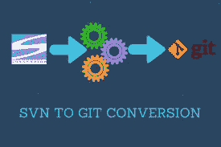

# 从 SVN 轻松迁移到 Gitlab 存储库

> 原文：<https://dev.to/jaiswalparesh/easy-move-from-svn-to-gitlab-repository-13f1>

在本文中，我们将看到如何将我们的库从 SVN (Subversion)迁移到 Gitlab。但是在开始之前，我们先简单介绍一下

什么是 SVN(颠覆)？
GIT 是什么？
SVN 和 GIT 有什么区别？

好了，现在让我们向前看，看看我们的清单。

什么是 SVN(颠覆)？
所以，SVN 也被称为 Apache Subversion，是一个在开源许可下发布的软件版本和修订控制系统。
它使用 subversion 来维护当前文件和您以前的文件，如源代码、网页和文档。

注:如果你想了解更多关于 SVN 的情况，你可以查看以下链接
**ref link:【https://www.perforce.com/blog/vcs/what-svn】**

**GIT 是什么？**
因此，根据 GIT 官方网站
Git 是一个免费的开源分布式版本控制系统，旨在快速高效地处理从小到大的项目。

Git 易于学习，占用空间小，性能快如闪电。它比 Subversion、CVS、Perforce 和 ClearCase 等配置管理工具具有更便宜的本地分支、方便的中转区和多工作流等特性。

注:如果你想了解更多关于 GIT 的信息，可以查看以下链接
**ref link:**[https://www.atlassian.com/git/tutorials/what-is-git](https://www.atlassian.com/git/tutorials/what-is-git)
[https://GIT-SCM . com/book/en/v2/Getting-Started-What-is-GIT % 3F](https://git-scm.com/book/en/v2/Getting-Started-What-is-Git%3F)

SVN 和 GIT 有什么区别？

**去中心化:** GIT 是去中心化的，SVN 本质上是中心化的。
在 GIT 中，你可以有一个本地副本(即存储库)，所以每当我们移动我们的更改时，那些将首先存储在本地，然后移动到中央存储库。而在 SVN，它指向中央存储库。

对于一些开发人员来说，GIT 很难学，因为它有很大的概念，而 SVN 的概念很少，很容易学。

无法处理二进制文件: Git 在处理大型二进制文件时会变得很慢，而 SVN 可以轻松处理大型二进制文件。

内部目录: Git 创建。git 文件夹，而。在 svn 的情况下，将为每个文件夹创建 SVN。

用户界面:Git 本身没有很好的用户界面，但是 SVN 有很好的用户界面。

**网络访问:**网络访问对于 GIT 操作不是强制性的，但是在 svn 中，需要网络访问来执行 SVN 操作。

**全局版本号:** Git 没有全局版本号，而 svn 有全局版本号。

现在我们复习一下这个，让我们看看将我们库从 SVN 迁移到 Gitlab 有多容易。

将 SVN 迁移到 Gitlab 的分步命令

*   Install git

*$ sudo apt-get 安装 git*

*   Install git-svn

*$ sudo apt-get 安装 git-svn*

*   通过 git-svn 命令克隆 SVN 存储库。

*$ git svn 克隆你的 _ SVN _ 网址*

*   在同一目录中添加 Gitlab url。

*$ git remote add gitlab YOUR_GITLAB_URL*

*   最后，将您的 SVN 存储库推送到 Gitlab。

*$ git push—set—上游 gitlab 主机*

如果你想深入了解 SVN 到 Gitlab 的迁移，你可以点击下面的链接。

[https://docs.gitlab.com/ee/user/project/import/svn.html](https://docs.gitlab.com/ee/user/project/import/svn.html)