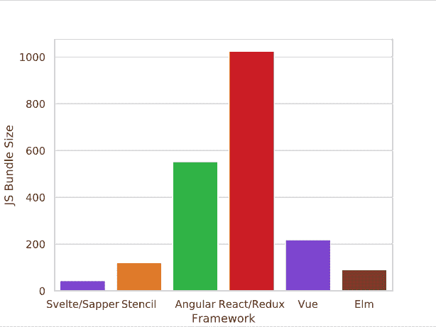
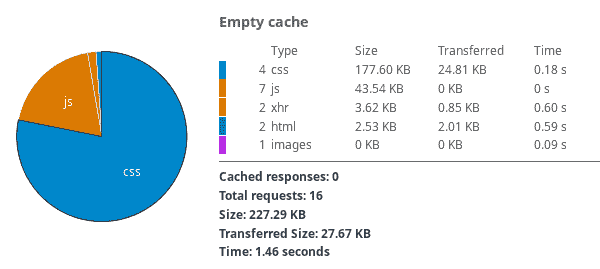
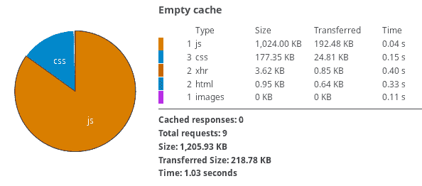

# 比较 Svelte 和 Stencil JS 框架

> 原文：<https://dev.to/pianomanfrazier/comparing-svelte-and-stencil-js-frameworks-12e5>

写博客是探索一些新的和不熟悉的技术的好借口。在这篇文章中，我将探索两个新的 JavaScript 框架， [Stencil](https://stenciljs.com/) 和 [Svelte](https://svelte.dev/) 。

写这篇文章的时候。Svelte 的版本是 3.4.4，Stencil 的版本是 1.0.0。这两个项目似乎都是基于 GitHub 活动而积极进行的。

两个框架都是 web 编译器框架。也就是说，他们接受一些源输入，然后用 JavaScript、HTML 和 CSS 生成一些缩小的优化版本。

## 模板

模板由 Ionic 框架团队创建和维护。重点是使用 web 标准，比如定制 web 组件，而不是特定框架或构建工具的观点。

因为它生成标准的 web 组件，所以这些组件可以在任何 JavaScript 框架中使用。它利用了现代浏览器 API，如[自定义元素](https://developer.mozilla.org/en-US/docs/Web/Web_Components/Using_custom_elements)。它支持 IE11 及以上版本。

Stencil 还提供对 TypeScript 和 JSX 的支持。下面是一个组件示例。

[示例组件](https://stenciljs.com/docs/my-first-component)。打字稿+ JSX = TSX

```
import { Component, Prop } from '@stencil/core';
@Component({
  tag: 'my-first-component',
})
export class MyComponent {
  // Indicate that name should be a public property on the component
    @Prop() name: string;
  render() {
    return (
      <p>
        My name is {this.name}
      </p>
    );
  }
} 
```

<svg width="20px" height="20px" viewBox="0 0 24 24" class="highlight-action crayons-icon highlight-action--fullscreen-on"><title>Enter fullscreen mode</title></svg> <svg width="20px" height="20px" viewBox="0 0 24 24" class="highlight-action crayons-icon highlight-action--fullscreen-off"><title>Exit fullscreen mode</title></svg>

用法

```
<my-first-component name="Max"></my-first-component> 
```

<svg width="20px" height="20px" viewBox="0 0 24 24" class="highlight-action crayons-icon highlight-action--fullscreen-on"><title>Enter fullscreen mode</title></svg> <svg width="20px" height="20px" viewBox="0 0 24 24" class="highlight-action crayons-icon highlight-action--fullscreen-off"><title>Exit fullscreen mode</title></svg>

参见[学习资源](https://stenciljs.com/resources)获取更多指南和教程。

## 身材苗条

似乎自从第三版以来，它已经存在了很长时间。苗条身材的一些特征是:

*   没有虚拟 DOM
*   无运行时(所有工作都在编译时完成)

`.svelte`文件与 Vue 单个文件组件非常相似。一个`.svelte`文件可以有 3 个部分:一个带有业务逻辑的脚本标签，一个带有 CSS 的样式标签，最后是标记。

标记或模板部分不同于 Vue 组件，因为您不需要根级别的元素。

下面是一个组件示例。我浏览了他们文档中的教程，并将所有我觉得有用或有趣的部分合并到一个紧凑的示例中。

```
<script>
  import Nested from './Nested.svelte';
  let msg = 'A string with <strong>HTML</strong>';
  let things = ['dog', 'cat', 'bear', 'frog'];
  let count = 0;
  function handleClick() {
  count += 1;
}
 // reactive statement
 // code is run when count changes
 $: console.log(`the count is ${count}`);
</script>
<style>
  button {
    color: white;
    background-color: blue;
  }
</style>
<p>{@html msg}</p>
<button on:click={handleClick}>
  Clicked {count} {count === 1 ? 'time' : 'times'}
</button>
{#if count > 10}
  <p>count &gt; 10</p>
{:else if count > 5}
  <p>count &gt; 5</p>
{:else}
  <p>count &lt; 5</p>
{/if}
<ul>
  {#each items in item}
    <li>{item}</li>
  {/each>
</ul>
<Nested title="nested"/> 
```

<svg width="20px" height="20px" viewBox="0 0 24 24" class="highlight-action crayons-icon highlight-action--fullscreen-on"><title>Enter fullscreen mode</title></svg> <svg width="20px" height="20px" viewBox="0 0 24 24" class="highlight-action crayons-icon highlight-action--fullscreen-off"><title>Exit fullscreen mode</title></svg>

```
<!-- Nested.svelte -->
<script>
  // export props and give it a default (optional)
  export let title = 'Title';
</script>
<p>{title}</p> 
```

<svg width="20px" height="20px" viewBox="0 0 24 24" class="highlight-action crayons-icon highlight-action--fullscreen-on"><title>Enter fullscreen mode</title></svg> <svg width="20px" height="20px" viewBox="0 0 24 24" class="highlight-action crayons-icon highlight-action--fullscreen-off"><title>Exit fullscreen mode</title></svg>

Svelte 使用以下构建工具。

*   到达
*   网络包
*   包裹

对于生成更大的项目，类似于 Vue CLI，参见 [Sapper](https://sapper.svelte.dev/) 。它支持路由、服务器端呈现和代码分割。

## 捆绑尺寸比较

我认为将这些框架的输出与真实世界的应用程序进行比较会很有趣。我访问了每个实现的演示页面，并在我的浏览器开发工具(Firefox)的 network 选项卡中比较了网络统计数据。

<figure>[](https://res.cloudinary.com/practicaldev/image/fetch/s--s0exbM1q--/c_limit%2Cf_auto%2Cfl_progressive%2Cq_auto%2Cw_880/https://pianomanfrazier.com/img/new-web-tech-2019/compare.svg) 

<figcaption>**现实世界 App**</figcaption>

</figure>

| 结构 | JS 文件的数量 | JS 包大小(KB) | % |
| --- | --- | --- | --- |
| 苗条的 | seven | Forty-three point five four | four |
| 蜡纸 | Ten | One hundred and twenty point zero six | Twelve |
| **其他框架** |  |  |  |
| 有角的 | eight | Five hundred and fifty-one point nine seven | Fifty-four |
| 反应/还原 | one | One thousand and twenty-four | One hundred |
| 某视频剪辑软件 | six | Two hundred and eighteen point one three | Twenty-one |
| 榆树 | one | Ninety point five two | nine |

## 来自开发工具的网络图

<figure>[](https://res.cloudinary.com/practicaldev/image/fetch/s--2uYuobnG--/c_limit%2Cf_auto%2Cfl_progressive%2Cq_auto%2Cw_880/https://pianomanfrazier.com/img/new-web-tech-2019/svelte-network-performance.png) 

<figcaption>苗条的资产规模</figcaption>

</figure>

<figure>[](https://res.cloudinary.com/practicaldev/image/fetch/s--mHQZ6UfU--/c_limit%2Cf_auto%2Cfl_progressive%2Cq_auto%2Cw_880/https://pianomanfrazier.com/img/new-web-tech-2019/stencil-network-performance.png) 

<figcaption>模版资产大小</figcaption>

</figure>

<figure>[](https://res.cloudinary.com/practicaldev/image/fetch/s--ghZUZkkn--/c_limit%2Cf_auto%2Cfl_progressive%2Cq_auto%2Cw_880/https://pianomanfrazier.com/img/new-web-tech-2019/angular-network-performance.png) 

<figcaption>角资产大小</figcaption>

</figure>

<figure>[](https://res.cloudinary.com/practicaldev/image/fetch/s--S-fsvXLA--/c_limit%2Cf_auto%2Cfl_progressive%2Cq_auto%2Cw_880/https://pianomanfrazier.com/img/new-web-tech-2019/react-network-performance.png) 

<figcaption>反应过来资产规模</figcaption>

</figure>

<figure>[](https://res.cloudinary.com/practicaldev/image/fetch/s--mpT6fCGe--/c_limit%2Cf_auto%2Cfl_progressive%2Cq_auto%2Cw_880/https://pianomanfrazier.com/img/new-web-tech-2019/vue-network-performance.png) 

<figcaption>Vue 资产规模</figcaption>

</figure>

<figure>[](https://res.cloudinary.com/practicaldev/image/fetch/s--FAgoF0xw--/c_limit%2Cf_auto%2Cfl_progressive%2Cq_auto%2Cw_880/https://pianomanfrazier.com/img/new-web-tech-2019/elm-network-performance.png) 

<figcaption>榆树资产规模</figcaption>

</figure>

一个很好的未来辅助项目将是为 RealWorld 应用程序的所有实现生成这些统计数据。在抓取了项目的 REAMDE 之后，您可以使用类似 Selenium 的东西来点击每个演示页面并收集所有的统计数据。

## 结论

新一代 JS 框架似乎更关注包的大小。我以为没有什么能打败榆树的捆大小。斯维特证明我错了。

简单看了一下这两个框架之后，我会用 Svelte 来代替 Vue。它似乎提供了一个类似的 API。

如果我关心与 JS 社区共享我的组件，并且需要它跨任何 JS 框架工作，我会使用 Stencil。