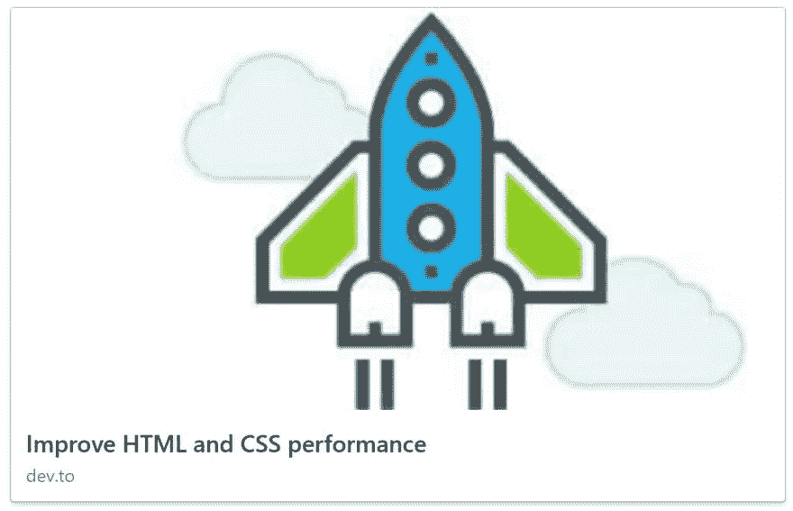
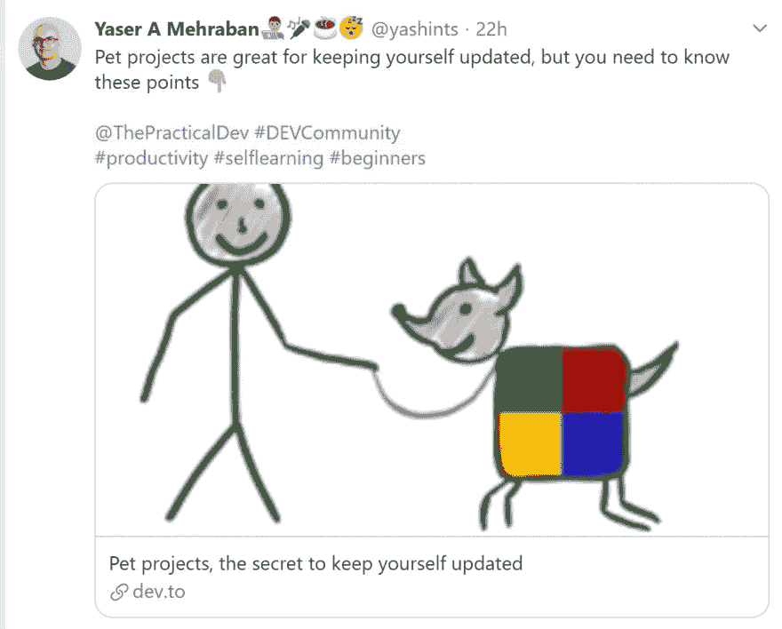
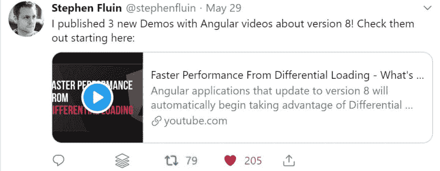

# 让我们来谈谈 SEO，你应该知道的 10 个技巧

> 原文：<https://dev.to/yashints/let-s-talk-seo-10-tips-you-should-know-4n6k>

对于大多数公司来说，排名第一就像是对他们业务的祝福。然而，大多数 web 开发人员并不知道应该做些什么来达到这一点。

在这篇文章中，我们通过 10 个简单的步骤来提高排名，而不是付钱给搜索引擎来帮我们。你准备好了吗，🧐？

## HTML 标签告诉搜索引擎什么？

某些 HTML 标签告诉搜索引擎如何正确地阅读你的文档，并根据特定的关键字对其进行索引。换句话说，当他们抓取网页时，他们会用一些关键词对你的网页进行分类，当用户搜索这些关键词时，这些关键词就会出现。

其中一些标签也改善了访问者在这些搜索引擎中查看您的内容的方式。除此之外，社交媒体还使用内容标签来展示你的文章，例如👇🏽。

液体错误:内部

让我们看看这些标签是什么。

## 1。标题标签

也许最重要的标签之一是标题。这被用作你的页面的标签，并定义了像 Google 和 Bing 这样的搜索引擎如何看到你的页面并在他们的搜索结果中显示它。

在大多数情况下，这个标签反映了文章/页面本身的标题。这并不是一个坏习惯，但是你会错过一些在像 Google 这样的搜索引擎上大赚一笔的机会。

接下来的问题是，它必须和关键字一样吗？答案是绝对不会。然而，最好确保你没有让读者感到困惑😉。但是这给了机会去扩展你的页面与搜索引擎的相关性。无论如何，标题应该是简短的，所以有不同但相关的标签使得它可以被更广泛的搜索到。

一个普通的标题标签如下所示:

```
Your Title Text for Search Engines 
```

Enter fullscreen mode Exit fullscreen mode

听起来很简单，对吗？虽然看起来很简单，但以下是你写标题时必须考虑的几点:

*   仅使用一个标题标签
*   尝试创建一个独特的标题
*   不要使用你的标题关键字作为你的元标签
*   使其与内容相关
*   最好控制在 60 个字符以内
*   尽量不要使用停用词
*   最后显示品牌
*   让它具有可读性
*   如果相关，使用日期、数字和问题

这里有一个例子，我的一篇文章在谷歌上是第一个结果😍：

[](https://res.cloudinary.com/practicaldev/image/fetch/s--Mz1UDMdv--/c_limit%2Cf_auto%2Cfl_progressive%2Cq_auto%2Cw_880/https://thepracticaldev.s3.amazonaws.com/i/n04xwodyu402pmy0up9q.jpg)

## 2。元描述标签

正如我上面提到的，拥有描述标签真的有助于让你的页面在标题之外被更广泛的搜索到。

```
<meta name="description" content="Key HTML tags to have better SEO."/> 
```

Enter fullscreen mode Exit fullscreen mode

例如，上面是一个标签，有人试图突出“关键 HTML 标签”和“更好的 SEO”短语，并显示在搜索结果中。

**注意:**截至 2019 年，[谷歌已经宣布](https://webmasters.googleblog.com/2017/06/better-snippets-for-your-users.html)你不应该太关注这些，因为他们会首先考虑内容。

## 3。标题标签

你不应该低估标题标签。它们通常用于分解内容，以便于阅读。想象一下，在一个巨大的段落中阅读我的文章，而不是这些精心分割的片段。

据发现，大约%55 的用户最多会花 [15 秒浏览你的文本](https://blog.bufferapp.com/55-visitors-read-articles-15-seconds-less-focus-attention-not-clicks)。就 SEO 而言，大多数搜索引擎使用标题标签来帮助确定内容片段，并创建[特色丰富的片段](https://www.greengeeks.com/blog/2017/02/14/why-should-you-want-your-site-to-be-in-the-google-featured-snippet/)。

这些标签如下:

*   `<h1></h1>`–通常用于网页标题。
*   `<h2></h2>`–突出显示后面内容的主题。
*   `<h3></h3>`–反映与主题相关的要点。
*   `<h4></h4>`–支持来自`<h3>`的点。
*   `<h5></h5>`–不常使用，但非常适合`<h4>`的支撑点

## 4。图像的 Alt 标签

这通常是图像标签最重要的部分，不仅仅是为了 SEO，也是为了可访问性。不幸的是，搜索引擎无法确定显示的是什么图像。这时`alt`标签就派上用场了。

例如:

```
 
```

Enter fullscreen mode Exit fullscreen mode

搜索引擎不会知道这张图片显示的是可爱的小狗还是猫。因此添加`alt`标签将有助于他们理解它，并将其用于分类。

```
 
```

Enter fullscreen mode Exit fullscreen mode

上述标签将正确地帮助搜索引擎识别图像是什么。例如，当有人试图使用谷歌图片搜索一只可爱的小狗时，这将有助于显示这张图片。

## 5。超链接

虽然看起来不像，但是超链接是至关重要的，不仅对外部内容如此，对你自己的内容也是如此。举个例子，当我在 [Dev community](//dev.to) 上发布我的关于 web 性能的系列文章的第一篇时，我的网站上有其他文章的链接。这导致我的网站流量激增，基本上帮助我的自然流量上升，也帮助搜索引擎将这些文章链接在一起。

[](https://res.cloudinary.com/practicaldev/image/fetch/s--G9uk_XLY--/c_limit%2Cf_auto%2Cfl_progressive%2Cq_auto%2Cw_880/https://thepracticaldev.s3.amazonaws.com/i/2ogq9m2e7sv8ysht8f1i.jpg)

就其核心而言，它们就像是你在为其他内容投票，所以要用在你感兴趣的地方，并确保链接的内容是相关的。

```
<a href="https://dev.to/yashints/pet-projects-the-secret-to-keep-yourself-updated-51e0">
  My previous post about pet projects
</a> 
```

Enter fullscreen mode Exit fullscreen mode

如果出于某种原因，你不想让搜索引擎与你链接的内容建立联系，考虑使用`rel=nofollow`。这告诉搜索引擎不要将你当前的文章与链接目标链接起来。换句话说，你不会帮助提高一个外部网站的域权限。

```
<a href="https://dev.to/yashints/pet-projects-the-secret-to-keep-yourself-updated-51e0"
  rel="nofollow">
  My previous post about pet projects
</a> 
```

Enter fullscreen mode Exit fullscreen mode

## 6。打开图形标签

这些标签非常适合在社交媒体上显示你的页面的格式。你可能以前见过，但这是我的帖子出现在 LinkedIn 上的方式👇🏽：

[](https://res.cloudinary.com/practicaldev/image/fetch/s--yVY2-stH--/c_limit%2Cf_auto%2Cfl_progressive%2Cq_auto%2Cw_880/https://thepracticaldev.s3.amazonaws.com/i/6p0q08sugoxzus393rv5.jpg)

下面是一个开放图形标签的例子:

```
<meta name="og:title" property="og:title" content="The Title of Your Article"/> 
```

Enter fullscreen mode Exit fullscreen mode

现在，如果这篇文章在像脸书这样的网站上被分享，这个社交网站将直接从这个标签中获取标题。正如你从我上面展示的 tweet 中看到的，open graph 也支持描述和图像之类的东西。如果你的网页在社交媒体上分享，它只是给你定制选项。

## 7。机器人标签

如果你想阻止你的页面/文章被索引，这个标签是有用的。这些可以阻止来自 Google 或 Bing 等网站的爬虫访问这些内容。你现在可能会问为什么要这样做？

有些文章对排名的影响可能不是最大的。有很多原因可以解释你为什么想要这样做，但是假设你有一篇质量差的文章，你想在它出现在任何搜索引擎结果之前得到一些用户的意见。

```
<meta name="robots" content="noindex, nofollow" /> 
```

Enter fullscreen mode Exit fullscreen mode

## 8。规范标签

一个[规范标签](https://moz.com/learn/seo/canonicalization)对于组织你的内容和区分一个网页相对于一个重复网页的优先级是非常有用的。给你举个例子，我总是喜欢先在[我的网站](https://yashints.dev)上发布帖子，然后再发布到其他地方。

我这样做有几个原因。最重要的一点是，在像 [Dev.to](//dev.to) 这样的平台上，覆盖范围可能会更大。然而，我想让搜索引擎知道这个帖子不是一个单独的帖子，事实上它是首先在我的网站上发布的内容的副本。换句话说，这是一种告诉搜索引擎一个特定的 URL 代表了一个页面的主副本的方式。

您应该使用此标签的另一个原因是，搜索引擎可能会使用以下任何 URL 形式对您的网站进行爬网:

*   [http://www.yashints.dev](http://www.yashints.dev)
*   [https://www.yashints.dev](https://www.yashints.dev)
*   [http://yashints.dev](http://yashints.dev)
*   [http://yashints.dev/index.html](http://yashints.dev/index.html)
*   [http://yashints.dev/index.html?param=value](http://yashints.dev/index.html?param=value)

对一个人来说，所有这些 URL 都代表一个页面。然而，对于爬虫来说，这些 URL 中的每一个都是独一无二的`page`。即使在这个有限的例子中，我们也可以看到主页有五个副本。然而，实际上，这只是您可能遇到的变化的一小部分。

```
<link rel="canonical" href="http://yashints.dev/index.html?param=value"/> 
```

Enter fullscreen mode Exit fullscreen mode

因此，通过在我的主页上放置上述标签，我可以告诉搜索引擎，这个 URL 代表的是同一个页面，而不是一个单独的页面。

这里有一篇很好的文章深入探讨了规范标签。

## 9。响应网站元标签

我们先来看一个事实，中国超过 80%的流量来自移动设备。在澳大利亚，这个数字是%56。这些数字向我们展示了关注响应式设计的重要性。

出于同样的原因，让搜索引擎知道这个网站有响应式设计也很重要。如果用户通过移动设备进行搜索，这将确保页面是表面的。

```
<meta name="viewport" content="width=device-width, initial-scale=1"/> 
```

Enter fullscreen mode Exit fullscreen mode

上面的标签是你需要让搜索引擎知道你的网站是移动友好的最低要求。值得注意的是，谷歌把重点放在手机友好型网站上。如果你没有现成的东西，人们可以通过手持设备查看，它会反映你在搜索中的排名。

## 10。推特卡片

除了开放的图形标签， [Twitter](//twitter.com) 还有[自己的标签](https://developer.twitter.com/en/docs/tweets/optimize-with-cards/overview/markup)。现在推文可以超过历史性的 140 个字符，这些卡片是一个很好的扩展，允许你的推文在普通文本中脱颖而出。

### 下面是其中的几个:

#### 总结

```
<meta name="twitter:card" content="summary" />
<meta name="twitter:site" content="@flickr" />
<meta name="twitter:title" content="Small Island Developing States Photo Submission"/>
<meta name="twitter:description" content="View the album on Flickr."/>
<meta name="twitter:image" content="https://farm6.staticflickr.com/5510/14338202952_93595258ff_z.jpg"/> 
```

Enter fullscreen mode Exit fullscreen mode

示例:

[](https://res.cloudinary.com/practicaldev/image/fetch/s--_rBeqITk--/c_limit%2Cf_auto%2Cfl_progressive%2Cq_auto%2Cw_880/https://thepracticaldev.s3.amazonaws.com/i/4rmc3abwim6cotx3r5kr.jpg)

#### 玩家

```
<meta name="twitter:card" content="player"/>
<meta name="twitter:title" content="Bison in Yellowstone"/>
<meta name="twitter:site" content="@BrightcoveLearn"/>
<meta name="twitter:description" content="Bison walking in Yellowstone National Park."/>
<meta name="twitter:player" content="https://solutions.brightcove.com/bcls/twittercards/bison.html"/>
<meta name="twitter:player:width" content="360"/>
<meta name="twitter:player:height" content="200"/>
<meta name="twitter:image" content="https://solutions.brightcove.com/bcls/twittercards/bison.jpg"/> 
```

Enter fullscreen mode Exit fullscreen mode

示例:

[](https://res.cloudinary.com/practicaldev/image/fetch/s--P_duHs6P--/c_limit%2Cf_auto%2Cfl_progressive%2Cq_auto%2Cw_880/https://thepracticaldev.s3.amazonaws.com/i/gomp7643fipu71764dpf.jpg)

有关这些标签的更多信息，请访问它们的官方文档。

## 所以没有关键词标签？

你可能想知道为什么我没有提到关键字标签。这是因为谷歌等大多数搜索引擎使用内容对页面进行分类。因此，拥有它们并不会增加多少价值，事实上，它们只会给你的页面增加额外的重量。

## 总结

你现在知道了 10 个技巧来改善你的有机生活并节省一些钱。所以去酒吧或咖啡店，负责任地消费吧😉。

我忘记提到的另一个技巧是关于使用 SPA 框架的人。如果你想让你的网站有一个好的`SEO`,你需要定义一些关键路径(如主页)并创建一个服务器端的页面渲染图，它将被客户端的正常路径所取代。通过这种方式，爬虫将能够索引您静态生成的文件，而您的最终用户仍然可以从客户端的快速交互中获益。

直到下一个帖子👋🏼。