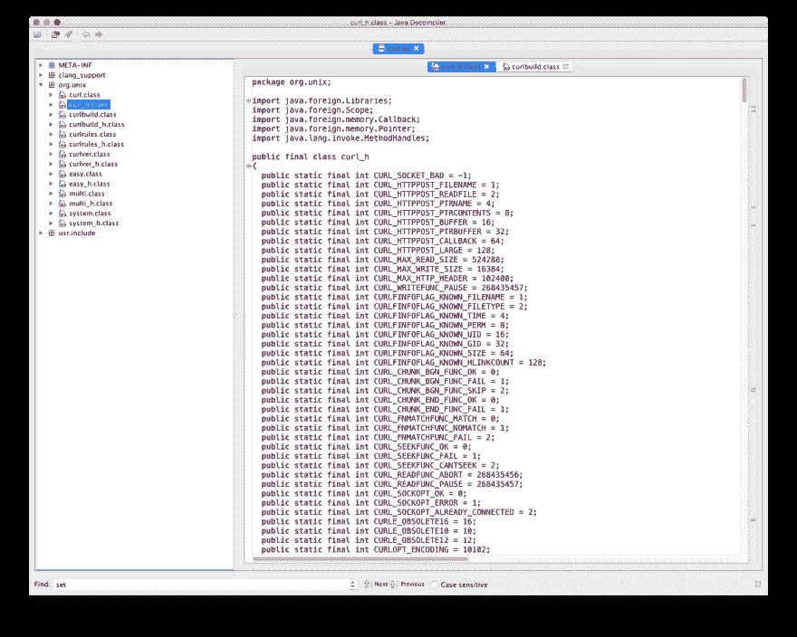

# OpenJDK 13 中的 Java 和本机代码

> 原文：<https://dev.to/petarov/java-and-native-code-in-openjdk-13-18em>

# 目录

*   [简介](#intro)
*   [动手](#hands-on)
    *   [libCurl 应用](#libcurl)
    *   [libssh 2 应用](#libssh)
*   [最终想法](#outro)
*   [参考文献](#refs)

# 简介

上周，我观看了一场非常酷的 GOTO 会议，与甲骨文软件工程总监 Mikael Vidstedt 进行了交谈，他在会上介绍了许多即将推出和正在开发的 Java 特性。其中一个项目，T2 项目，引起了我的特别兴趣。

> GOTO Conferences@ GOTO con[# Java](https://twitter.com/hashtag/Java)去年的变化比前五年都大。
> 
> 在本次 [#GOTOchgo](https://twitter.com/hashtag/GOTOchgo) 访谈中了解这些变化以及 Java 的未来，与 [@gsaab](https://twitter.com/gsaab) 和[@ MikaelVidstedt](https://twitter.com/MikaelVidstedt)
> 
> [youtu.be/vJrHHe3IbQs?li…](https://t.co/QcX8MnEQZL)2019 年 6 月 12:30[](https://twitter.com/intent/tweet?in_reply_to=1136248991254028289)[T35】4](https://twitter.com/intent/retweet?tweet_id=1136248991254028289)[](https://twitter.com/intent/like?tweet_id=1136248991254028289)

*免责声明:巴拿马计划仍处于早期开发阶段，因此本文内容可能无法反映其当前状态。*

Project Panama 在早期的 JDK 13 版本中可用，是 Java 和本地代码之间的桥梁。这有什么用？在某些用例中，一部分功能可以作为用 C 或 C++编写的库来使用，而需求是将它集成到 Java 应用程序中。当前的解决方案是使用 Java 本地接口(JNI)[【2】](#refs)，这可能需要大量的工作，并且也很容易出错。您需要很好地掌握原生库的内部，然后编写所有需要的实现，将 Java 接口与原生代码连接起来。根据我的经验，调用可能在以后某个时间点发生变化的本机库函数以及管理堆内存分配对于 JNI 来说可能是一个真正的挑战。引用 Mikael 在视频中说的话:

> 这里有多少人写过 JNI 或者 JNI？我们为你感到难过！

这就是巴拿马发挥作用的地方。它提供了新的工具和 API 来简化 Java 和本机代码之间的连接。它基本上可以归结为以下步骤:

1.  使用 **jextract** 工具从现有的 C 头文件生成 Java 绑定(接口)。
2.  使用 **java.foreign** API 通过 jextracted Java 接口调用 C 函数。

这使您能够专注于编写应用程序的核心逻辑，而不是摆弄粘合代码和集成细节。

# 事必躬亲

巴拿马计划的文档页面已经提供了大量的例子。我将快速浏览一下如何桥接和运行一个 *libCurl* Java 应用程序，然后我将展示一个更详细的例子——一个我基于 *libSSH2* 编写的简单 SSH 客户端。

我在 macOS 上运行这些例子，但是经过一些调整，您也应该能够在 Linux 安装上运行它们。

## The libCurl App

如何使用原生 Curl 库的实现下载网页？首先，我们需要获取并解压缩 Panama [OpenJDK build](http://jdk.java.net/panama/) 档案。

让我们打开一个 shell，将`JAVA_HOME`环境变量设置为 OpenJDK 构建归档文件的解压位置。

```
export JAVA_HOME=/opt/jdk-13.jdk 
```

现在我们需要生成 Java 接口，将 Java 代码绑定到本地库的粘合代码。这将产生一个`curl.jar`文件:

```
$JAVA_HOME/bin/jextract -t org.unix -L /usr/lib -lcurl \
  --record-library-path /usr/include/curl/curl.h \
  -o curl.jar 
```

当我们检查 JAR 文件时，我们可以看到所有的 Curl API 调用，以及依赖绑定。Curl API 可以通过新的 **java.foreign** Java API 获得。

[](https://res.cloudinary.com/practicaldev/image/fetch/s--qB9AbWUL--/c_limit%2Cf_auto%2Cfl_progressive%2Cq_auto%2Cw_880/https://thepracticaldev.s3.amazonaws.com/i/5j56upyw7yz643tiwefx.png)

现在举个简单的例子。这里有一段 Java 代码，它获取一个网页并在屏幕上显示其内容。

```
import java.lang.invoke.*;
import java.foreign.*;
import java.foreign.memory.*;
import org.unix.curl.*;
import org.unix.curl_h;
import static org.unix.curl_h.*;
import static org.unix.easy_h.*;

public class Main {
   public static void main(String[] args) {
       try (Scope s = curl_h.scope().fork()) { 
           curl_global_init(CURL_GLOBAL_DEFAULT);
           Pointer<Void> curl = curl_easy_init();
           if(!curl.isNull()) {
               Pointer<Byte> url = s.allocateCString(args[0]);
               curl_easy_setopt(curl, CURLOPT_URL, url);
               int res = curl_easy_perform(curl);
               if (res != CURLE_OK) {
                 System.err.println("Error fetching from: " + args[0] + " ERR: " + Pointer.toString(curl_easy_strerror(res)));
                 curl_easy_cleanup(curl);
               }
           }
           curl_global_cleanup();
       }
    }
} 
```

这里需要指出几件事。注意我们不能直接将 Java `String`传递给`curl_easy_setopt()`调用。这个调用接受一个内存地址指针作为`url`参数，所以我们首先需要使用`Scope`进行动态内存分配操作，并传递一个`Pointer`接口实例。正如你可能在 Panama tech 文档[【5】](#refs)中发现的，`Pointer`接口在复杂的类似 C 语言的指针操作方面很有帮助，比如指针算法、类型转换、内存解引用等等。`Scope`管理动态分配内存的运行时生命周期。

好了，现在有了这些知识，你能扩展这个代码把一个 Curl 获取的网页的内容写到一个文件流中吗？

## libssh 2 App

下面是一个更完整的示例应用程序，它利用*lib SSH 2*[【4】](#refs)来实现一个简单的 SSH 客户端。

##  [佩塔罗夫](https://github.com/petarov) / [爪哇-巴拿马-ssh2](https://github.com/petarov/java-panama-ssh2)

### 通过巴拿马项目使用 libssh2 的 Java SSH 客户端

<article class="markdown-body entry-content container-lg" itemprop="text">

# 爪哇-巴拿马-ssh2

一个简单的 Java SSH2 客户端，使用本地库和 JDK 13 项目

注意:这是一个实验项目。稳定性得不到保证。

## 安装

该客户端已经在 macOS 和 Linux 上进行了测试。它应该也可以在 Windows 上运行，但是，在这个方向上还没有做任何工作。欢迎公关！

安装`libssh2`。

*   macOS - `brew install libssh2`
*   CentOS - `yum install libssh2.x86_64 libssh2-devel.x86_64`

获得最新的巴拿马 [JDK 建造](http://jdk.java.net/panama/)。

打开控制台外壳，配置`JAVA_HOME`变量指向 JDK 13 号。

从本地 libssh2 头文件生成所需的 Java 接口:

```
./gen_bindings.sh 
```

## 奔跑

要编译和运行，请使用:

```
./run.sh [-p|-k] hostname port username [path to ssh keys] 
```

*   `-p`使用密码登录。系统会提示您输入密码。
*   `-k`使用公钥登录。您需要指定您的键的路径，例如`~/.ssh`。

## 许可证

…

</article>

[View on GitHub](https://github.com/petarov/java-panama-ssh2)

如果你想试一试，并调整它在 Windows 上运行，我将非常感谢一个公关。

# 最后的想法

我在与巴拿马合作时了解到或一直在思考的几点。

*   这个`Scope`相当强大。你可以分配回调指针，结构，数组。布局和布局类型的概念值得我花更多的时间去充分探索和掌握。
*   毫不奇怪，使用本地库编写 Java 代码更加广泛，需要格外小心，尤其是在不要忘记调用库所需的清理 API 调用时。
*   大多数本地库中的 I/O 需要一个文件描述符，这在 Java[【6】](#refs)中并不容易获得。然而，这与 **java.foreign** API 没有直接关系。
*   一些库定义了不带参数的 C++风格的函数原型，而不是 C 风格的`Void`参数类型。国外文献[【3】](#refs)有一个使用 TensorFlow C API 时关于这个案例的例子。
*   我还没有探索是否有可能将巴拿马与 Go 或 Rust 创建的本地库一起使用。那会很酷。

感谢阅读！🍻

# 参考文献

1.  [GOTO 2019 巴拿马项目部分](https://www.youtube.com/watch?v=vJrHHe3IbQs&t=2172)
2.  [Java 本地接口](https://en.wikipedia.org/wiki/Java_Native_Interface)
3.  [巴拿马外国文件](https://hg.openjdk.java.net/panama/dev/raw-file/4810a7de75cb/doc/panama_foreign.html)
4.  libSSH2 -实现 SSH2 协议的客户端 C 库
5.  [巴拿马活页夹文件 v3](https://cr.openjdk.java.net/~mcimadamore/panama/panama-binder-v3.html)
6.  [将 Java 套接字文件描述符传递给 C 二进制文件的最有效方式](https://stackoverflow.com/q/11455803/10364676)