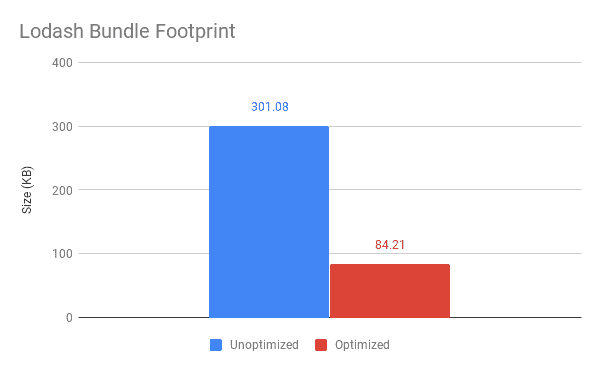

# 如果您将 Lodash 与 Angular 配合使用，如何使您的包更小

> 原文：<https://dev.to/johnphamous/how-to-make-your-bundle-size-smaller-if-you-re-using-lodash-with-angular-55lh>

如果您在 Angular 项目中使用 Lodash，您可能会导入 Lodash 附带的所有内容。如果您只使用 Lodash 中的一些方法，那么您将向用户交付未使用的代码。

```
import { keyBy, uniqueId } from 'lodash'; 
```

Enter fullscreen mode Exit fullscreen mode

通过使用命名导入，您会认为您只是在导入`keyBy`和`uniqueId`的代码。在撰写本文时，Lodash 不是使用 ES 模块编写的，因此您的 bundler 不能为您进行树抖动。

## 预期收益

[](https://res.cloudinary.com/practicaldev/image/fetch/s--6Qhjr7vW--/c_limit%2Cf_auto%2Cfl_progressive%2Cq_auto%2Cw_880/https://i.imgur.com/UaW5shD.png)

在我们的案例中，我们将 Lodash 的足迹减少了 112.6%。这些数据是通过生成产品构建并查看 Gzipped 大小而生成的。

你的减幅会不一样。这将取决于您在应用程序中使用了多少 Lodash 方法。

## 基线

让我们在使用`webpack-bundle-analyzer`进行优化之前检查一下我们的包大小。

```
ng build --stats-json
npx webpack-bundle-analyzer dist/stats.json 
```

Enter fullscreen mode Exit fullscreen mode

最后一个命令将在`http://127.0.0.1:8888/`启动网络服务器监听。在那里你可以查看你的包的统计数据。

## 优化

安装将 Lodash 函数导出为 ES 模块的`lodash-es`。

```
npm i lodash-es
npm i -D @types/lodash-es 
```

Enter fullscreen mode Exit fullscreen mode

我们需要将命名导入改为默认导入。

```
- import { keyBy, uniqueId } from 'lodash'; + import keyBy from 'lodash/keyBy';
+ import uniqueId from 'lodash/uniqueId'; 
```

Enter fullscreen mode Exit fullscreen mode

进行这些更改会导致 Typescript 对您大喊大叫，因为它找不到类型和模块。为了解决这个问题，我们可以在 out `tsconfig.json`中添加以下选项。

```
{  "allowSyntheticDefaultImports":  true,  "baseUrl":  "./",  "typeRoots":  [  "node_modules/@types",  "manual_typings"  ],  "paths":  {  "lodash/*":  [  "node_modules/@types/lodash-es/*"  ],  },  } 
```

Enter fullscreen mode Exit fullscreen mode

现在，您应该运行您的测试，以确保没有任何损坏。

* * *

就是这样！防止您或其他人导入所有 Lodash 的一个额外步骤是添加一个 TSLint 规则，该规则不允许从 Lodash 进行命名导入。

```
"import-blacklist":  [true,  "lodash"] 
```

Enter fullscreen mode Exit fullscreen mode