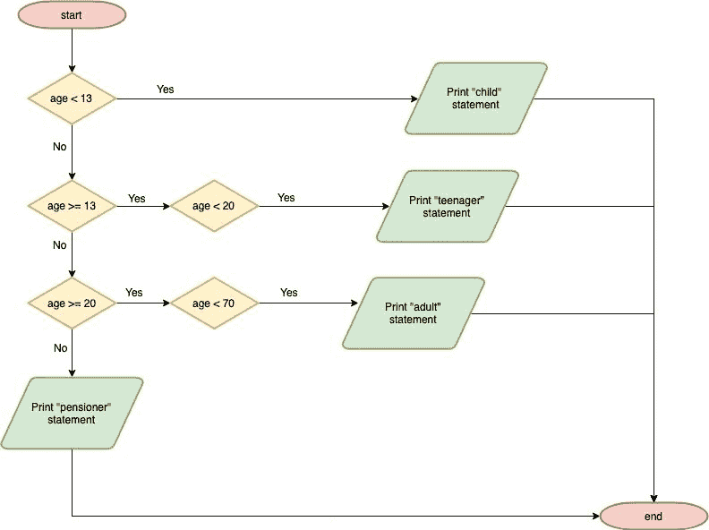
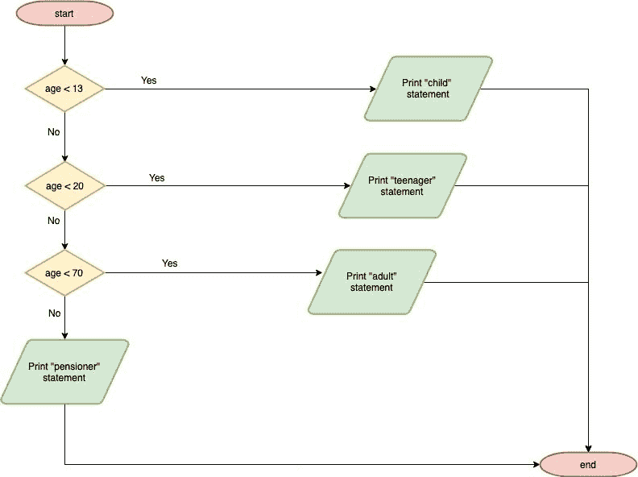

# 围棋中的条件句(挑战答案)

> 原文：<https://dev.to/codetips/conditionals-in-go-challenge-answer-4o58>

[](https://res.cloudinary.com/practicaldev/image/fetch/s--L-cr2j_S--/c_limit%2Cf_auto%2Cfl_progressive%2Cq_auto%2Cw_880/https://images.unsplash.com/photo-1513151233558-d860c5398176%3Fixlib%3Drb-1.2.1%26q%3D80%26fm%3Djpg%26crop%3Dentropy%26cs%3Dtinysrgb%26w%3D1080%26fit%3Dmax%26ixid%3DeyJhcHBfaWQiOjExNzczfQ)

在上一篇文章(Go 中的[条件句)的结尾，我们说有可能进一步优化`if/else if/else`语句，并给你指出如何优化的挑战。如果你没有尝试过；我们马上就要给你答案了，所以现在是时候去试试了。](https://www.codetips.co.uk/languages/go/conditionals-in-go/)

作为参考，下面是我们说过可以优化的`if/else if/else`语句:

```
if age < 13 {
  log.Println("I am considered a child")
} else if age >= 13 && age < 20 {
  log.Println("I am considered a teenager")
} else if age >= 20 && age < 70 {
  log.Println("I am considered an adult")
} else {
  log.Println("I am considered a pensioner")
} 
```

它可以进一步优化，因为我们仍然在做比我们需要的更多的检查。下图显示了该条件语句的流程:

[](https://res.cloudinary.com/practicaldev/image/fetch/s--9KHWPQqQ--/c_limit%2Cf_auto%2Cfl_progressive%2Cq_auto%2Cw_880/https://www.codetips.co.uk/conteimg/2019/06/conditionals-in-go-challenge-answer.jpg)

例如，我们检查`age`是否小于十三(`age < 13`)，如果是，我们打印“child”语句并结束条件语句。如果不是，我们接着检查年龄是否大于或等于 13(`age >= 13`)。

这个额外的步骤是不必要的，因为我们已经检查了年龄是否小于 13，如果不是，那么它必须等于或大于 13。

了解了这一点，我们可以将条件语句的流程简化如下:

[](https://res.cloudinary.com/practicaldev/image/fetch/s--oBG_EkPN--/c_limit%2Cf_auto%2Cfl_progressive%2Cq_auto%2Cw_880/https://www.codetips.co.uk/conteimg/2019/06/conditionals-in-go-challenge-answer-simplified.jpg)

因此我们的`if/else if/else`语句变成了:

```
if age < 13 {
  log.Println("I am considered a child")
} else if age < 20 {
  log.Println("I am considered a teenager")
} else if age < 70 {
  log.Println("I am considered an adult")
} else {
  log.Println("I am considered a pensioner")
} 
```

如果这还不清楚，请随时[联系我们](https://www.codetips.co.uk/contact-us/)，我们将尽我们所能帮助您。

* * *

[CodeTips](https://www.codetips.co.uk) 致力于帮助零经验或很少经验的初学者学习编码。

我们确实会交叉发布到其他网站以获得更广泛的受众，但是为什么不订阅我们的时事通讯并把最新的文章直接发到你的邮箱里呢？

此内容的原始来源是[代码提示](https://www.codetips.co.uk)。原始内容保持最新，但其他来源可能不是最新版本。