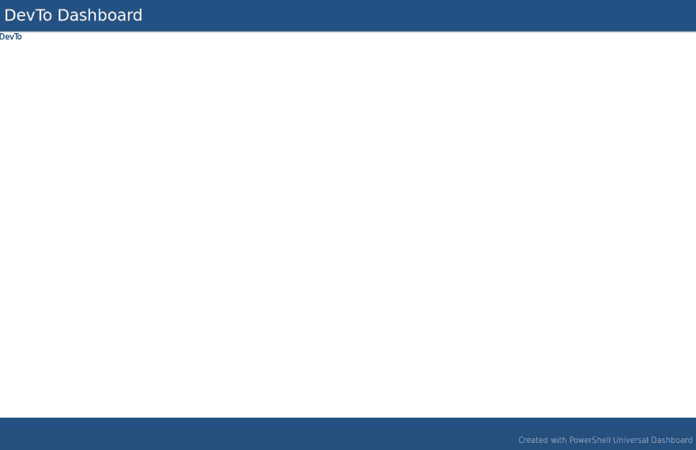
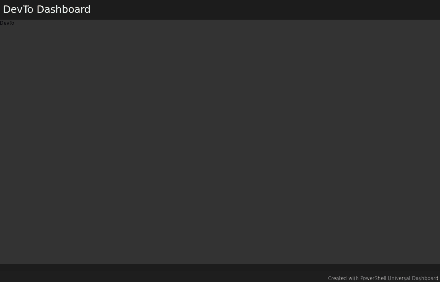

# PowerShell 通用仪表板:制作交互式仪表板

> 原文：<https://dev.to/jcoelho/powershell-universal-dashboard-making-interactive-dashboards-9kl>

# PowerShell 通用仪表盘

PowerShell Universal Dashboard 是一个非常酷的 PowerShell 模块，也是我见过的最有趣的开源项目之一。
它允许你只使用 PowerShell 命令，为你的 It 系统创建基于网络的、漂亮的、交互式的仪表板。
它非常适合设置监控仪表板来跟踪您的系统。

> 每个系统管理员都梦想在自己的办公室里有一个大屏幕，可以看到他们系统的状态。

[](https://i.giphy.com/media/nxuFTiUbYR3SE/giphy.gif)

## 我们来造一个吧

让我们言归正传，设置一个简单的仪表盘，这样我们就可以了解这个工具了。
<sub>**(接下来你需要 PowerShell 5+，并按照[的指示安装](https://docs.universaldashboard.io/getting-started)该模块。)**<sub>T7】</sub></sub>

创建一个`dashboard.ps1`文件，并添加以下代码:

```
$dashboard  =  New-UDDashboard  -Title  "DevTo Dashboard"  -Content{  New-UDHeading  -Text  "DevTo"  }  Start-UDDashboard  -Dashboard  $dashboard  -Port  1000  -AutoReload 
```

<svg width="20px" height="20px" viewBox="0 0 24 24" class="highlight-action crayons-icon highlight-action--fullscreen-on"><title>Enter fullscreen mode</title></svg> <svg width="20px" height="20px" viewBox="0 0 24 24" class="highlight-action crayons-icon highlight-action--fullscreen-off"><title>Exit fullscreen mode</title></svg>

这里，我们正在创建仪表板对象，并向其添加标题。
如果在执行该文件后一切正常，您应该得到以下输出:

```
Name       Port Running
---------       ---- -------
Dashboard2 1000    True 
```

<svg width="20px" height="20px" viewBox="0 0 24 24" class="highlight-action crayons-icon highlight-action--fullscreen-on"><title>Enter fullscreen mode</title></svg> <svg width="20px" height="20px" viewBox="0 0 24 24" class="highlight-action crayons-icon highlight-action--fullscreen-off"><title>Exit fullscreen mode</title></svg>

您的仪表板应该在 [http://localhost:1000](http://localhost:1000) 上可用:

[](https://res.cloudinary.com/practicaldev/image/fetch/s--lOZnvCPO--/c_limit%2Cf_auto%2Cfl_progressive%2Cq_auto%2Cw_880/https://thepracticaldev.s3.amazonaws.com/i/rqco7vwsux6857nv8yth.png)

现在让我们让它更酷，并添加一个不同的主题，我特别喜欢内置的 Azure 主题:

```
$theme  =  Get-UDTheme  -Name  'Azure'  $dashboard  =  New-UDDashboard  -Title  "DevTo Dashboard"  -Theme  $theme  -Content{  New-UDHeading  -Text  "DevTo"  }  ... 
```

<svg width="20px" height="20px" viewBox="0 0 24 24" class="highlight-action crayons-icon highlight-action--fullscreen-on"><title>Enter fullscreen mode</title></svg> <svg width="20px" height="20px" viewBox="0 0 24 24" class="highlight-action crayons-icon highlight-action--fullscreen-off"><title>Exit fullscreen mode</title></svg>

现在酷多了，对吧？
[T3】](https://res.cloudinary.com/practicaldev/image/fetch/s--Z8M0CLCN--/c_limit%2Cf_auto%2Cfl_progressive%2Cq_auto%2Cw_880/https://thepracticaldev.s3.amazonaws.com/i/hh00mjohwrc2s1vqzkic.png)

## 监控

PowerShell Universal Dashboard 有一个名为 [monitor](https://docs.universaldashboard.io/components/monitors) 的组件，它是一种特殊类型的图表，可以随着时间的推移跟踪数据。例如，您可以使用它来绘制 CPU 或内存的使用情况。

```
$theme  =  Get-UDTheme  -Name  'Azure'  $dashboard  =  New-UDDashboard  -Title  "DevTo Dashboard"  -Theme  $theme  -Content{  New-UdMonitor  -Title  "CPU (% processor time)"  -Type  Line  -DataPointHistory  20  -RefreshInterval  10  -ChartBackgroundColor  '#80FF6B63'  -ChartBorderColor  '#FFFF6B63'  -Endpoint  {  try  {  Get-Counter  '\Processor(_Total)\% Processor Time'  -ErrorAction  SilentlyContinue  |  Select-Object  -ExpandProperty  CounterSamples  |  Select-Object  -ExpandProperty  CookedValue  |  Out-UDMonitorData  }  catch  {  0  |  Out-UDMonitorData  }  }  }  Start-UDDashboard  -Dashboard  $dashboard  -Port  1000  -AutoReload 
```

<svg width="20px" height="20px" viewBox="0 0 24 24" class="highlight-action crayons-icon highlight-action--fullscreen-on"><title>Enter fullscreen mode</title></svg> <svg width="20px" height="20px" viewBox="0 0 24 24" class="highlight-action crayons-icon highlight-action--fullscreen-off"><title>Exit fullscreen mode</title></svg>

基本上，我们在这里做的是使用 [Get-Counter cmdlet](https://docs.microsoft.com/en-us/powershell/module/microsoft.powershell.diagnostics/get-counter?view=powershell-5.1) 从 Windows 性能监控工具中获取实时数据，然后通过`Out-UDMonitorData`将这些信息转换为监控器可读的数据。

**Un*x 用户**:这个特定的命令只能在 **Windows** 上运行，所以你需要找到一个不同的策略来获取你的 CPU 数据。
也许可以尝试使用`sysstat`包中的`mpstat`命令，然后用 Powershell 解析数据。

## 图表

另一个真正有用的组件是[图表](https://docs.universaldashboard.io/components/data-visualizations/charts)。你可以将各种数据显示在**条**、**线**、**圆环图**或**饼图**中。它们非常易于定制和使用，因为它们是用 [Chart.js 库](https://www.chartjs.org/docs/latest/)构建的。

例如，您可以使用圆环图来显示您使用的和可用的磁盘空间:

```
$theme  =  Get-UDTheme  -Name  'Azure'  $dashboard  =  New-UDDashboard  -Title  "DevTo Dashboard"  -Theme  $theme  -Content{  New-UDChart  -Title  "Disk Space"  -Type  Doughnut  -RefreshInterval  $refreshRate  -Endpoint  {  try  {  Get-CimInstance  -ClassName  Win32_LogicalDisk  |  Where-Object  {$_.DriveType  -eq  '3'}  |  Select-Object  -First  1  -Property  DeviceID,Size,FreeSpace  |  ForEach-Object  {  @([PSCustomObject]@{  Label  =  "Used Space"  Data  =  [Math]::Round(($_.Size  -  $_.FreeSpace)  /  1GB,  2);  },  [PSCustomObject]@{  Label  =  "Free Space"  Data  =  [Math]::Round($_.FreeSpace  /  1GB,  2);  })  |  Out-UDChartData  -DataProperty  "Data"  -LabelProperty  "Label"  -BackgroundColor  @("#80FF6B63","#8028E842")  -HoverBackgroundColor  @("#80FF6B63","#8028E842")  -BorderColor  @("#80FF6B63","#8028E842")  -HoverBorderColor  @("#F2675F","#68e87a")  }  }  catch  {  0  |  Out-UDChartData  -DataProperty  "Data"  -LabelProperty  "Label"  }  }  }  Start-UDDashboard  -Dashboard  $dashboard  -Port  1000  -AutoReload 
```

<svg width="20px" height="20px" viewBox="0 0 24 24" class="highlight-action crayons-icon highlight-action--fullscreen-on"><title>Enter fullscreen mode</title></svg> <svg width="20px" height="20px" viewBox="0 0 24 24" class="highlight-action crayons-icon highlight-action--fullscreen-off"><title>Exit fullscreen mode</title></svg>

现在，您可以在仪表板上连接监视器和图表。这是你的仪表板现在应该看起来的样子。很酷的匈奴人？😃

[](https://res.cloudinary.com/practicaldev/image/fetch/s--CyNfS1An--/c_limit%2Cf_auto%2Cfl_progressive%2Cq_auto%2Cw_880/https://thepracticaldev.s3.amazonaws.com/i/yf24d0vspd7h7shh8zeo.png)

**Un*x 用户**:同样，这只适用于 Windows，但是你可以很容易地解决这个问题，并将其应用于 Un*x 系统。

现在你知道了！一个很酷很好看的仪表板。现在给你自己弄一个大屏幕挂在墙上并显示出来。

## 探索

这些例子只是这个框架所能做的一小部分。您还可以构建简单的 REST API，动态旋转多个页面，填写输入表单和许多其他组件。

你能做的最好的事情是自己检查，他们有很好的文档。

我希望您和我一样觉得这个工具有趣且有用。

**你觉得这个 PowerShell 模块怎么样？如果你用过这个工具，请在评论中告诉我如何使用:)**