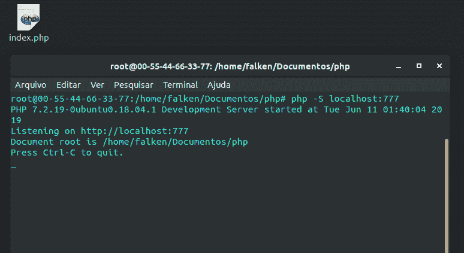
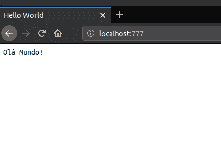

# 创建简单 PHP 服务器

> [https://dev . to/Fred _ melo _ 07/creating-simple-server-PHP-3 in](https://dev.to/fred_melo_07/criando-simples-server-php-3nin)中

要旋转 php，您需要将. PHP 文件放在本地服务器上，例如，这样我们就可以在浏览器中查看该文件。当我们开始 PHP 学习时，我们被告知使用 Apache、xamp、WAMP、LAMP 等工具。计划时间会变得有点无聊，因为您总是需要加载这些工具中的一个，只是突然停止测试文件…

启动器可能不知道，安装 php 时，还提供了一个工具，因为它允许您在操作系统提示符下使用 PHP(仅适用于 PHP)创建服务器。

要在 Windows 中执行此操作，必须将 PHP 添加到 path 环境变量中。在 Linux 上，PHP 最好由终端安装，这样就可以在 shell 中轻松访问。

正确配置后，我们可以在任何操作系统文件夹/目录中创建服务器。假设/documents/PHP 目录存在，并且我们在此目录中创建了一个名为 index.php 的文件。要运行此文件，您需要打开提示，浏览到我们正在使用的示例文件夹，然后运行以下命令:

php -S 本地主机:777

其中 777 是我选择的端口，但只要此端口未被其他系统工具使用，您就可以自由选择。执行此操作后，只需转到浏览器并键入 localhost:777，它包含与在提示符命令中传递的端口相同的端口。这将自动将 index.php 文件上载到创建服务器的目录(index.php 文件始终是默认的 php 上载文件)。

如果目录中有一个名称不是 index.php 的文件，并且您要将其上载到浏览器中，则必须传递 URL localhost:777/filename . PHP，其中< number | | | >是要上载到浏览器中的文件的名称。

php 服务器可以在任何位置创建，这非常好，这与 LAMP 等工具不同，lamp 用于在特定位置创建服务器。

在 Linux 上，您必须以超级用户身份抬起 php 服务器。

希望这些提示有助于您在浏览器中测试脚本时更加方便！

下次见！