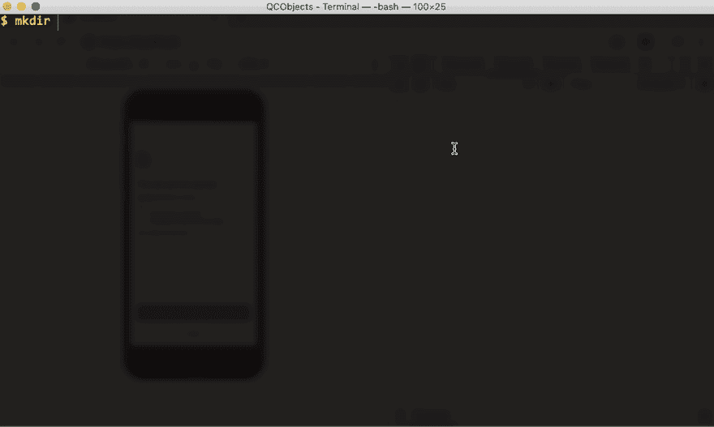

# 使用 QCObjects 加速移动页面

> 原文：<https://dev.to/qcobjects/accelerated-mobile-pages-with-qcobjects-4l5i>

AMP 是一个 web 组件框架，可以轻松创建用户至上的网站。

QCObjects 在一个更安全、更快速、更容易学习的运行时组件范围内集成了许多工具，那么为什么不使用它来制作一个引人注目的加速移动页面，该页面也可以设计成 N 层架构，并且所有这些都使用纯 javascript 呢？

QCObjects 能为 AMP 带来的附加值:

有组织的代码结构，快速渲染，友好的语法，配置安全加密，同步动画效果，动态存储缓存控制，组件树架构，运行时堆栈组件和...

简单快捷的步骤:

要使用 QCObjects 创建您的第一个 AMP 应用程序，您只需在控制台中键入:

```
> npm i qcobjects-cli 
```

然后，为你的应用程序创建一个目录并输入:

```
> mkdir mynewapp && cd mynewapp 
```

最后，使用 cli 工具
生成新的 AMP 模板

```
> sudo qcobjects create mynewapp --amp 
```

完成了。

2.-通过 HTTP2 提供服务

一旦创建了应用程序，就可以使用与 cli 工具一起安装的 qcobjects-server 工具来服务它。转到应用程序目录并键入:

```
> qcobjects-server 
```

然后按回车键。

然后，转到 web 浏览器并导航至:

[https://localhost](https://localhost)

以下是完整的示例:

[](https://res.cloudinary.com/practicaldev/image/fetch/s--Zk5yT8UN--/c_limit%2Cf_auto%2Cfl_progressive%2Cq_66%2Cw_880/https://qcobjects.dev/doc/img/QCObjects-CLI-AMP.gif)

请在评论中告诉我如何改进这篇文章！

干杯！