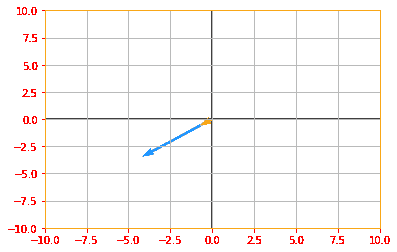
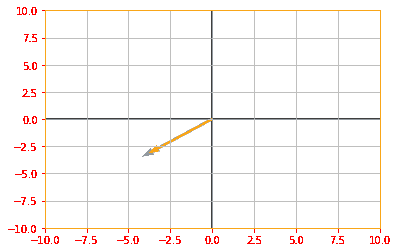

# Eigendecomposition with Tensorflow 2.0

> 原文：[https://dev.to/mmithrakumar/eigendecomposition-with-tensorflow-2-0-14e1](https://dev.to/mmithrakumar/eigendecomposition-with-tensorflow-2-0-14e1)

We can represent a number, for example 12 as 12 = 2 x 2 x 3\. The representation will change depending on whether we write it in base ten or in binary but the above representation will always be true and from that, we can conclude that 12 is not divisible by 5 and that any integer multiple of 12 will be divisible by 3.

Similarly, we can also decompose matrices in ways that show us information about their functional properties that are not obvious from the representation of the matrix as an array of elements. One of the most widely used kinds of matrix decomposition is called **eigendecomposition**, in which we decompose a matrix into a set of eigenvectors and eigenvalues.

An **eigenvector** of a square matrix **A** is a nonzero vector *v* such that multiplication by **A** alters only the scale of *v*, in short, this is a special vector that doesn't change the direction of the matrix when applied to it:

**Av = λv**

The scale λ is known as the **eigenvalue** corresponding to this eigenvector.

```
# Let's see how we can compute the eigen vectors and values from a matrix e_matrix_A = tf.random.uniform([2, 2], minval=3, maxval=10, dtype=tf.float32, name="matrixA")
print("Matrix A: \n{}\n\n".format(e_matrix_A))

# Calculating the eigen values and vectors using tf.linalg.eigh, if you only want the values you can use eigvalsh eigen_values_A, eigen_vectors_A = tf.linalg.eigh(e_matrix_A)
print("Eigen Vectors: \n{} \n\nEigen Values: \n{}\n".format(eigen_vectors_A, eigen_values_A))

# Now lets plot our Matrix with the Eigen vector and see how it looks Av = tf.tensordot(e_matrix_A, eigen_vectors_A, axes=0)
vector_plot([tf.reshape(Av, [-1]), tf.reshape(eigen_vectors_A, [-1])], 10, 10)

Matrix A:
[[5.450138 9.455662]
 [9.980919 9.223391]]

Eigen Vectors:
[[-0.76997876 -0.6380696 ]
 [ 0.6380696  -0.76997876]]

Eigen Values:
[-2.8208985 17.494429 ] 
```

Enter fullscreen mode Exit fullscreen mode

[](https://res.cloudinary.com/practicaldev/image/fetch/s--Syl5dk-Y--/c_limit%2Cf_auto%2Cfl_progressive%2Cq_auto%2Cw_880/https://raw.githubusercontent.com/adhiraiyan/DeepLearningWithTF2.0/master/notebooks/figures/ch02/output_65_1.png)

If *v* is an eigenvector of **A**, then so is any rescaled vector *sv* for **s ⋹ R, s ≠ 0**.

```
# Lets us multiply our eigen vector by a random value s and plot the above graph again to see the rescaling sv = tf.multiply(5, eigen_vectors_A)
vector_plot([tf.reshape(Av, [-1]), tf.reshape(sv, [-1])], 10, 10) 
```

Enter fullscreen mode Exit fullscreen mode

[](https://res.cloudinary.com/practicaldev/image/fetch/s--ndmjQ95f--/c_limit%2Cf_auto%2Cfl_progressive%2Cq_auto%2Cw_880/https://raw.githubusercontent.com/adhiraiyan/DeepLearningWithTF2.0/master/notebooks/figures/ch02/output_67_0.png)

Suppose that a matrix **A** has *n* linearly independent eigenvectors **v^(1),..., v^(n)** with corresponding eigenvalues **λ_(1),..., λ_n**. We may concatenate all the eigenvectors to form a matrix **V** with one eigenvector per column: **V = [v^1 ,..., v^n ]**. Likewise, we can concatenate the eigenvalues to form a vector **λ = [λ_1,..., λ_n]^T**. The **eigendecomposition** of **A** is then given by

**A = V diag(λ)V^(-1)**

```
# Creating a matrix A to find it's decomposition eig_matrix_A = tf.constant([[5, 1], [3, 3]], dtype=tf.float32)
new_eigen_values_A, new_eigen_vectors_A = tf.linalg.eigh(eig_matrix_A)

print("Eigen Values of Matrix A: {} \n\nEigen Vector of Matrix A: \n{}\n".format(new_eigen_values_A, new_eigen_vectors_A))

# calculate the diag(lamda) diag_lambda = tf.linalg.diag(new_eigen_values_A)
print("Diagonal of Lambda: \n{}\n".format(diag_lambda))

# Find the eigendecomposition of matrix A decomp_A = tf.tensordot(tf.tensordot(eigen_vectors_A, diag_lambda, axes=1), tf.linalg.inv(new_eigen_vectors_A), axes=1)

print("The decomposition Matrix A: \n{}".format(decomp_A))

Eigen Values of Matrix A: [0.8377223 7.1622777]

Eigen Vector of Matrix A:
[[-0.5847103   0.81124216]
 [ 0.81124216  0.5847103 ]]

Diagonal of Lambda:
[[0.8377223 0.       ]
 [0.        7.1622777]]

The decomposition Matrix A:
[[-3.3302479 -3.195419 ]
 [-4.786382  -2.7909322]] 
```

Enter fullscreen mode Exit fullscreen mode

Not every matrix can be decomposed into eigenvalues and eigenvectors. In some cases, the decomposition exists but involves complex rather than real numbers.

In this book, we usually need to decompose only a specific class of matrices that have a simple decomposition. Specifically, every real symmetric matrix can be decomposed into an expression using only real-valued eigenvectors and eigenvalues:

**A = Q λ Q^T**

where **Q** is an orthogonal matrix composed of eigenvectors of **A** and λ is a diagonal matrix. The eigenvalue **λ_{i,i}** is associated with the eigenvector in column *i* of **Q**, denoted as **Q_{:, i}**. Because **Q** is an orthogonal matrix, we can think of **A** as scaling space by **λ_i** in direction **v^(i)**.

```
# In section 2.6 we manually created a matrix to verify if it is symmetric, but what if we don't know the exact values and want to create a random symmetric matrix new_matrix_A = tf.Variable(tf.random.uniform([2,2], minval=1, maxval=10, dtype=tf.float32))

# to create an upper triangular matrix from a square one X_upper = tf.linalg.band_part(new_matrix_A, 0, -1)
sym_matrix_A = tf.multiply(0.5, (X_upper + tf.transpose(X_upper)))
print("Symmetric Matrix A: \n{}\n".format(sym_matrix_A))

# create orthogonal matrix Q from eigen vectors of A eigen_values_Q, eigen_vectors_Q = tf.linalg.eigh(sym_matrix_A)
print("Matrix Q: \n{}\n".format(eigen_vectors_Q))

# putting eigen values in a diagonal matrix new_diag_lambda = tf.linalg.diag(eigen_values_Q)
print("Matrix Lambda: \n{}\n".format(new_diag_lambda))

sym_RHS = tf.tensordot(tf.tensordot(eigen_vectors_Q, new_diag_lambda, axes=1), tf.transpose(eigen_vectors_Q), axes=1)

predictor = tf.reduce_all(tf.equal(tf.round(sym_RHS), tf.round(sym_matrix_A)))
def true_print(): print("It WORKS. \nRHS: \n{} \n\nLHS: \n{}".format(sym_RHS, sym_matrix_A))
def false_print(): print("Condition FAILED. \nRHS: \n{} \n\nLHS: \n{}".format(sym_RHS, sym_matrix_A))

tf.cond(predictor, true_print, false_print)

Symmetric Matrix A:
[[4.517448  3.3404353]
 [3.3404353 7.411926 ]]

Matrix Q:
[[-0.8359252 -0.5488433]
 [ 0.5488433 -0.8359252]]

Matrix Lambda:
[[2.3242188 0.       ]
 [0.        9.605155 ]]

It WORKS.
RHS:
[[4.5174475 3.340435 ]
 [3.340435  7.4119253]]

LHS:
[[4.517448  3.3404353]
 [3.3404353 7.411926 ]] 
```

Enter fullscreen mode Exit fullscreen mode

The eigendecomposition of a matrix tells us many useful facts about the matrix. The matrix is singular if and only if any of the eigenvalues are zero. The eigendecomposition of a real symmetric matrix can also be used to optimize quadratic expressions of the form **f(x) = x^T Ax** subject to **|x|_2 = 1**.

The above equation can be solved as following, we know that if *x* is an Eigenvector of **A** and λ is the corresponding eigenvalue, then **Ax = λ x**, therefore **f(x) = x^T Ax = x^T λ x = x^T x λ** and since **|x|_2 = 1** and **x^T x =1**, the above equation boils down to **f(x) = λ**

Whenever *x* is equal to an eigenvector of **A, f** takes on the value of the corresponding eigenvalue and its minimum value within the constraint region is the minimum eigenvalue.

A matrix whose eigenvalues are all positive is called **positive definite**. A matrix whose eigenvalues are all positive or zero valued is called **positive semidefinite**. Likewise, if all eigenvalues are negative, the matrix is **negative definite**, and if all eigenvalues are negative or zero valued, it is **negative semidefinite**. Positive semidefinite matrices are interesting because they guarantee that **∀ x, x^T Ax ≥ 0**. Positive definite matrices additionally guarantee that **x^T Ax = 0 ⇒ x=0**.

[](https://res.cloudinary.com/practicaldev/image/fetch/s--HpPIVNEO--/c_limit%2Cf_auto%2Cfl_progressive%2Cq_auto%2Cw_880/https://raw.githubusercontent.com/adhiraiyan/DeepLearningWithTF2.0/master/notebooks/figures/fig0207a.PNG)

* * *

This is section Seven of the Chapter on Linear Algebra with Tensorflow 2.0 of the Book [Deep Learning with Tensorflow 2.0](https://www.adhiraiyan.org/DeepLearningWithTensorflow.html).

You can read this section and the following topics:

02.01 — Scalars, Vectors, Matrices, and Tensors
02.02 — Multiplying Matrices and Vectors
02.03 — Identity and Inverse Matrices
02.04 — Linear Dependence and Span
02.05 — Norms
02.06 — Special Kinds of Matrices and Vectors
02.07 — Eigendecomposition
02.08 — Singular Value Decomposition
02.09 — The Moore-Penrose Pseudoinverse
02.10 — The Trace Operator
02.11 — The Determinant
02.12 — Example: Principal Components Analysis

at [Deep Learning With TF 2.0: 02.00- Linear Algebra](https://www.adhiraiyan.org/deeplearning/02.00-Linear-Algebra). You can get the code for this article and the rest of the chapter [here](https://github.com/adhiraiyan/DeepLearningWithTF2.0). Links to the notebook in Google Colab and Jupyter Binder is at the end of the [notebook](https://www.adhiraiyan.org/deeplearning/02.00-Linear-Algebra).