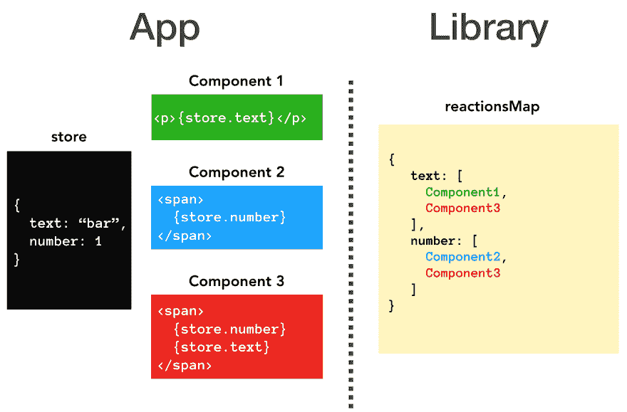

# 用 40 行代码构建自己的类似 MobX 的状态管理库

> 原文：<https://dev.to/michalczaplinski/build-your-own-mobx-like-state-management-library-in-40-lines-of-code-43i6>

⚠️ **注意:这篇文章假设读者对 react** 非常熟悉。你不需要成为专家，如果你以前用过，我保证你会做得很好🙂。

如果你喜欢视频版本，看看这篇博文所基于的我的 [meetup talk](https://youtu.be/S2x4WrbVYEk?t=5167) (不幸的是，视频质量不是很好)。还有，这是来自 https://czaplinski.io/blog/make-your-own-mobx/的[的横帖！](https://czaplinski.io/blog/make-your-own-mobx/)

### 有什么大不了的？

您是否一直在使用 MobX 或类似的状态管理库，并且想知道当您的一些数据发生变化时，它是如何“知道”如何以及何时更新您的组件的？看看下面这个直接来自 MobX [文档](https://mobx.js.org/refguide/observer-component.html)的代码示例:

```
import {observer} from "mobx-react";

var timerData = observable({
  secondsPassed: 0
});

setInterval(() => {
  timerData.secondsPassed++;
}, 1000);

@observer class Timer extends React.Component {
  render() {
    return (
      <span>
        Seconds passed: {this.props.timerData.secondsPassed} 
      </span>
    )
  }
};

ReactDOM.render(<Timer timerData={timerData} />, document.body); 
```

react *实际上*是如何知道`secondsPassed`的变化应该触发重新渲染的呢？好了，不要再想了，因为今天我将向您展示如何创建您自己的状态管理库，它将覆盖 90%的用例！当然，另外的 10%是众多边缘情况、奇怪的浏览器错误、向用户提供有用的错误信息等等的原因。我们并没有让它准备好投入生产，只是试图逆向工程状态管理的工作方式，并在这个过程中学习一些东西！我们走吧！

#### 说明:

*   我们使用 react 作为一个视图库，但是没有理由它不能与其他基于组件的库(Vue，Angular，无论什么)一起工作🙂).
*   它只能与 react 的类组件一起工作。没有技术上的原因为什么它不能与功能组件一起工作，但是我们试图尽可能地保持最小的实现。使*和*与函数组件一起工作实际上会花费两倍的代码(继续阅读，更多细节见下文)
*   我们将只允许每个应用程序一个数据存储。这意味着我们必须将所有状态存储在一个 JS 对象中。同样，这是我为了关注核心算法而设置的任意限制。

### 我们的 API

库作者应该问自己的第一个问题是:“我希望我的 API 是什么样的？”。理想情况下，我们希望将用户需要学习的概念数量保持在绝对最低水平。考虑到这一点，受[反应简单状态](https://github.com/solkimicreb/react-easy-state/)的启发，我希望我们的库只包含两个函数:`store`和`view`:

*   函数包装了一个包含我们状态的对象。
*   `view`函数包装一个 react 组件，并使其*对状态变化做出反应*。

让我们称我们的图书馆为`observablabla`。这是使用`observablabla`的“Hello World”应用程序的外观:

```
import React from "react";
import { store, view } from "observablabla";

const state = store({ text: "Hello World!" });

class Hello extends React.Component {
  render() {
    return <div> {state.text} </div>
  }
}; 
```

然而，在我们继续实际构建这个东西之前，我们需要走一点弯路，理解 javascript [代理](https://developer.mozilla.org/en/docs/Web/JavaScript/Reference/Global_Objects/Proxy)是如何工作的，因为它们是让我们的组件*对我们的`store`变化做出反应*的秘方。如果你已经熟悉它们的感觉，可以直接跳到[实现](#implementation)。

### 代理人

ES2015 标准将代理添加到 javascript 中，但与[类](https://developer.mozilla.org/en-US/docs/Web/JavaScript/Reference/Statements/class)或[箭头函数](https://developer.mozilla.org/en-US/docs/Web/JavaScript/Reference/Functions/Arrow_functions)不同，它们并没有被广泛讨论，所以如果你从未听说过它们，不要难过🙂。

它们允许你定制一个对象的行为。我们这样说是什么意思？您可能熟悉 [getters](https://developer.mozilla.org/en-US/docs/Web/JavaScript/Reference/Functions/get) 和 [setters](https://developer.mozilla.org/en-US/docs/Web/JavaScript/Reference/Functions/set) ，它们允许您定义在查找(getters)或设置(setters)对象属性时调用的自定义函数。代理就像类固醇上的 getters 和 setters。它们允许你修改一个对象行为的每一个方面，而不仅仅是属性的设置和获取。让我们用一个简单的代码例子来看看这意味着什么:

```
const target = {
  number: 42,
};

const handler = {};

const proxy = new Proxy(target, handler);
proxy.number;  // 42 
```

这是“你好世界！”代理——**目标**和**代理**对象在结构上是相同的。因而:

```
JSON.stringify(proxy) === JSON.stringify(target) // true 
```

我们可以通过给我们的`handler`对象添加**陷阱**来让我们的代理变得更有趣一点。陷阱只是定制`get`、`set`、`delete`操作等行为的常规方法。让我们修改代码示例:

```
// highlight-range{7-9}
const target = {
  number: 42,
};

const handler = {
  // `obj` is the proxied object, `prop` is the property being accessed.
  get: (obj, prop) => {
    return obj[prop] + 1;
  },
};

const proxy = new Proxy(target, handler);

target.number; //=>  This is still 42
proxy.number;  //=>  This now returns 43 ! 
```

我们最初的对象是未修改的，但是现在当我们使用我们的`proxy`对象时，它“代理”通过`get`陷阱访问的每个属性。我们现在可以对`set`操作:
做同样的事情

```
// highlight-range{5-8}
const handler = {
  get: (obj, prop) => {
    return obj[prop] + 1;
  },
  set: (obj, prop, value) => {
    obj[prop] = value;
    obj.greeting = `Hello, ${value}!`;
  },
};

proxy.name = "Michal";
proxy.name;       //=>  Michal
proxy.greeting;   //=>  Hello, Michal! 
```

如果代理仍然不为你点击，读者，继续阅读[这篇文章](https://ponyfoo.com/articles/es6-proxies-in-depth)，我会在这里等待🙂。

### 实现

好了，现在我们明白了代理是如何工作的，我们该如何实现它呢？让我们看一个图表:

[](https://res.cloudinary.com/practicaldev/image/fetch/s--Qus24V_1--/c_limit%2Cf_auto%2Cfl_progressive%2Cq_auto%2Cw_880/https://thepracticaldev.s3.amazonaws.com/i/8s47fwl0wb4pc5nkl4jt.png)

你可以想象绿色、蓝色和红色的框对应着各自 react 组件的渲染方法。**商店**只是一个包装有`store`功能的普通对象。每当这个存储中的某个值被更新时，我们希望**重新呈现**使用该状态的每个组件。我们如何做到这一点？

答案在右手边！我们希望我们的库在商店中可用的每个属性和当属性改变时应该重新呈现的组件列表之间建立映射。我们将把这个映射存储在一个名为`reactionsMap`的变量中。所以，在我们的图中，每当`store.text`更新的时候，`Component1`和`Component3`应该重新渲染，但是*不是* `Component3`。

有了这些知识，我们就可以开始勾画这个库的实现了:

```
// highlight-range{3-6}
const reactionsMap = {};

// It will point to a component instance that is being rendered. 
// We are going to use it later on 🙂
let currentlyRenderingComponent;

// The handler currently does nothing so far...
const handler = {
  get: function(target, key) {
    return target[key];   
  },
  set: function(target, key, value) {
    target[key] = value;
    return true;
  }
};

// For now, this just does nothing
export function store(object) {
  return new Proxy(object, handler);
}

// And this also does not do anything yet...
export function view(MyComponent) {
  return MyComponent;
} 
```

让我们首先用额外的功能来扩充`view`函数...

```
// highlight-range{19-28}
const reactionsMap = {};
let currentlyRenderingComponent;

const handler = {
  get: function(target, key) {
    return target[key];   
  },
  set: function(target, key, value) {
    target[key] = value;
    return true;
  }
};

export function store(object) {
  return new Proxy(object, handler);
}

export function view(MyComponent) {
  return class Observer extends MyComponent {
    ID = `${Math.floor(Math.random() * 10e9)}`;

    render() {
      currentlyRenderingComponent = this;
      const renderValue = super.render();
      currentlyRenderingComponent = undefined;
      return renderValue;
    }
  };
} 
```

我们正在使用类继承来扩展`MyComponent`的功能。我们的`view`函数只有在我们将一个类组件作为参数传递给它时才会起作用。如果我们正在编写一个“严肃”的库，我们可以添加代码来检查`MyComponent`是否是一个函数，如果是，就自动将它包装在一个类中([，这是 MobX 在](https://github.com/mobxjs/mobx-react/blob/master/src/observer.js#L339:L341)的幕后实际做的事情)，但是我们现在不打算这么做，原因只是想让事情变得简单。

我们分配给组件的`ID`将在以后被用到。现在，只要知道我们需要它，这样我们就可以跟踪组件的身份。

有趣的事情发生在`render`函数的内部**。试着想象一下，当我们呈现一个用我们的`view`函数包装的组件时，采取了什么步骤。我们**设置**和**取消设置** `currentlyRenderingComponent`的原因是，我们可以跟踪哪个组件正在被渲染以及何时被渲染。为什么我们需要这样做？**

通过查看`store`函数的更新实现:
，这一点将变得很清楚

```
// highlight-range{2-23}
const handler = {
  get: function(target, key) {
    // If there is no component currently rendering it means that 
    // we have accessed the store from outside of a react component. 
    // We can just return the value for the given key
    if (typeof currentlyRenderingComponent === "undefined") {
      return target[key];
    }
    // In case we don't track the `key` yet, start tracking it
    // and set its value to currently rendering component 
    if (!reactionsMap[key]) {
      reactionsMap[key] = [currentlyRenderingComponent];
    }
    // We already track the `key`, so let's check 
    // if we track the currentlyRendering component for that key.
    const hasComponent = reactionsMap[key].find(
      comp => comp.ID === currentlyRenderingComponent.ID
    );
    if (!hasComponent) {
      reactionsMap[key].push(currentlyRenderingComponent);
    }
    return target[key];
  },
  set: function(target, key, value) {
    target[key] = value;
    return true;
  }
};

export function store(object) {
  return new Proxy(object, handler);
} 
```

我们的新实现有一个新的有趣的副作用:每当我们访问我们商店的一些属性时，它检查什么组件是**当前正在呈现的**。使用这个聪明的技巧，我们可以通过简单地检查每个被访问的商店属性的值来构建我们的`reactionsMap`。

很好，现在我们已经建立了我们的反应图(将在第一次渲染时发生)。但是我们仍然需要一种方法来告诉 react 在我们的商店中添加新的属性时更新组件。记住，我们只想更新**使用**更新属性的组件。嗯，我们只是使用来自我们`reactionsMap` :
的数据

```
// highlight-range{21-25}
const reactionsMap = {};
let currentlyRenderingComponent;

const handler = {
  get: function(target, key) {
    if (typeof currentlyRenderingComponent === "undefined") {
      return target[key];
    }
    if (!reactionsMap[key]) {
      reactionsMap[key] = [currentlyRenderingComponent];
    }
    const hasComponent = reactionsMap[key].find(
      comp => comp.ID === currentlyRenderingComponent.ID
    );
    if (!hasComponent) {
      reactionsMap[key].push(currentlyRenderingComponent);
    }
    return target[key];
  },

  set: function(target, key, value) {
    reactionsMap[key].forEach(component => component.forceUpdate());
    target[key] = value;
    return true;
  }
};

export function store(object) {
  return new Proxy(object, handler);
}

export function view(MyComponent) {
  return class Observer extends MyComponent {
    ID = `${Math.floor(Math.random() * 10e9)}`;

    render() {
      currentlyRenderingComponent = this;
      const renderValue = super.render();
      currentlyRenderingComponent = undefined;
      return renderValue;
    }
  };
} 
```

至此，我们实际上已经完成了实施！🎉

你可以在 [Codesandbox](https://codesandbox.io/s/v191wkn77) 上查看一个实时版本，并对其进行测试。

如果你喜欢这个，你可以在 twitter 上关注我，了解更多关于 JS 的事情。如果你讨厌它，你可以在[推特](https://twitter.com/c_z_a_p_l_a)上关注我，告诉我为什么它很糟糕😛。说真的，我总是超级高兴听到你的想法，没有评论太小或太傻！如果你发现任何错误，让我知道。这个帖子的来源就在这里:[https://github . com/michalczaplinski/michalczaplinski . github . io](https://github.com/michalczaplinski/michalczaplinski.github.io)

最后但同样重要的是，我想对 [MobX](https://github.com/mobxjs/mobx/) 和 [react-easy-state](https://github.com/mobxjs/mobx/) 这两个令人敬畏的状态管理库以及这篇文章的主要灵感表示感谢。