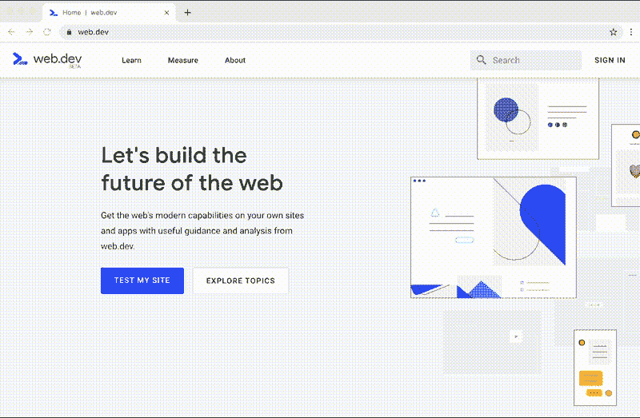
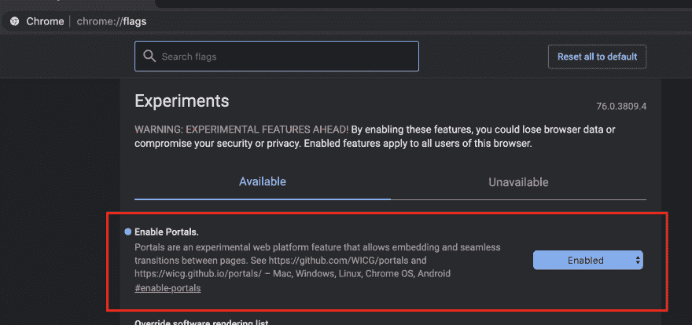
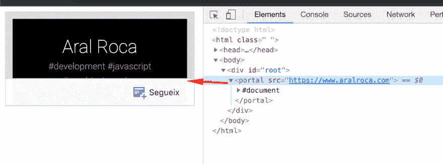
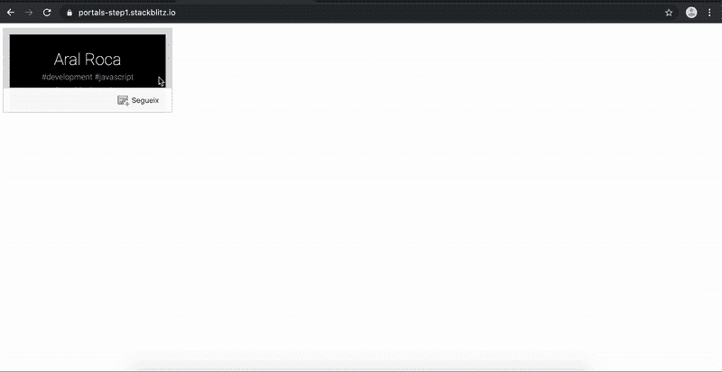
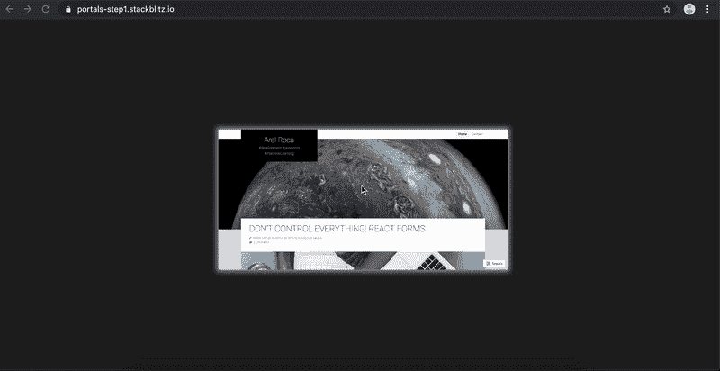
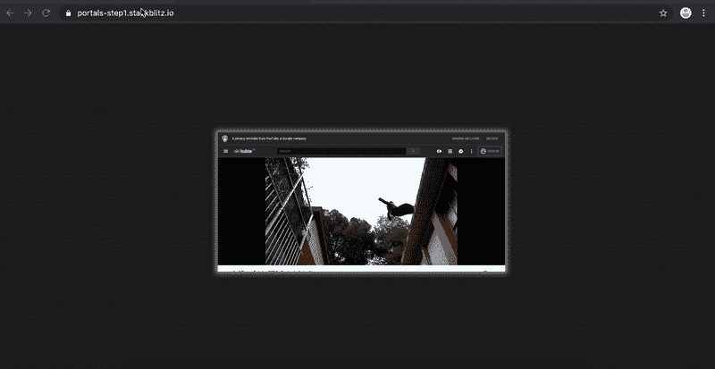

# 使用 React 探索 HTMLPortalElement

> 原文：<https://dev.to/aralroca/exploring-htmlportalelement-with-react-1m56>

HTMLPortalElement 是一个新的 HTML 元素的草案，与 iframe 非常相似，但最大的区别是它允许通过使用页面转换导航到“iframe”的内容。

[](https://res.cloudinary.com/practicaldev/image/fetch/s--cMf8yJtL--/c_limit%2Cf_auto%2Cfl_progressive%2Cq_66%2Cw_880/https://aralroca.files.wordpress.com/2019/06/portal-preview-demo.gif)

要了解更多信息，我建议阅读以下参考资料:

*   [https://wicg . github . io/portals/# the-portalactivateevent-interface](https://wicg.github.io/portals/#the-portalactivateevent-interface)
*   [https://web.dev/hands-on-portals](https://web.dev/hands-on-portals)
*   [https://github.com/WICG/portals/blob/master/explainer.md](https://github.com/WICG/portals/blob/master/explainer.md)

在本文中，我将解释如何使用这个未来的特性用 React 做一个“Hello world”演示。

## 入门指南

首先，要使用这个草稿功能，你需要 Chrome Canary。一旦你有了它，激活门户的标志:

[](https://res.cloudinary.com/practicaldev/image/fetch/s--TZm0HkBO--/c_limit%2Cf_auto%2Cfl_progressive%2Cq_auto%2Cw_880/https://aralroca.files.wordpress.com/2019/06/portal-flag.png)

接下来，我们将测试门户。记住门户需要在我们应用程序的顶层(不像 iframes 那样)。

**Hello world with HTMLPortalElement and React:**

```
import React, { useState, useEffect, useRef } from 'react';
import { render } from 'react-dom';

function PortalExample() {
  if (!window.HTMLPortalElement) {
    return 'HTMLPortalElement is not supported in your browser.'
  }

  return (
    <portal
      src="https://www.aralroca.com"
    />
  );
}

render(<PortalExample />, document.getElementById('root'));

```

与使用 iframe 相比，我们会得到类似的结果:

[](https://res.cloudinary.com/practicaldev/image/fetch/s--d14FaBDd--/c_limit%2Cf_auto%2Cfl_progressive%2Cq_auto%2Cw_880/https://aralroca.files.wordpress.com/2019/06/clipboard-june-8-2019-3_52-pm.png)

然而，我们需要一个漂亮的过渡来导航到这个页面的内容。我们怎么能得到这个？

## 导航到门户

正如我所说的，门户和 iframes 之间有很大的区别；有了门户，我们可以导航到内容。为了做到这一点，该元素具有函数 **activate** 以转到页面。

```
<portal
  src="https://www.aralroca.com"
   // navigate to content
  onClick={({ target }) => target.activate()} 
/>

```

现在我们可以导航到内容。虽然没有任何过渡...然而:

[](https://res.cloudinary.com/practicaldev/image/fetch/s--EgTBASDb--/c_limit%2Cf_auto%2Cfl_progressive%2Cq_66%2Cw_880/https://aralroca.files.wordpress.com/2019/06/navigating.gif)

## 添加页面过渡

我们不是在 **onClick** 事件上调用 **activate** 函数，而是使用 **onClick** 事件添加一个额外的 css 类进行转换。然后，我们将使用 **onTransitionEnd** 事件来控制 css 转换何时完成。之后，我们将调用**激活**功能**。**

因此，我们的 css 转换将缩放门户，直到门户适合页面的所有内容(宽度和高度 100%)。

反应代码:

```
import React, { useState } from 'react';
import { render } from 'react-dom';

import './style.css';

function PortalExample() {
  const [transition, setTransition] = useState(false)

  if (!window.HTMLPortalElement) {
    return 'HTMLPortalElement is not supported in your browser.'
  }

  return (
    <portal
      src="https://www.aralroca.com"
      className={`portal ${transition ? 'portal-reveal' : ''}`}
      onClick={() => setTransition(true)}
      onTransitionEnd={(e) => e.propertyName === 'transform' && e.target.activate()}
    />
  );
}

render(<PortalExample />, document.getElementById('root'));

```

样式:

```
body {
  background-color: #212121;
}

.portal {
  position: fixed;
  width: 100%;
  cursor: pointer;
  height: 100%;
  transition: transform 0.4s;
  box-shadow: 0 0 20px 10px #999;
  transform: scale(0.4);
}

.portal.portal-reveal {
  transform: scale(1.0);
}

```

最后，我们在门户中获得页面转换:

[](https://res.cloudinary.com/practicaldev/image/fetch/s--aNi00E6I--/c_limit%2Cf_auto%2Cfl_progressive%2Cq_66%2Cw_880/https://aralroca.files.wordpress.com/2019/06/page-transition.gif)

代号:[https://github.com/aralroca/HTMLPortalElement-react-example](https://github.com/aralroca/HTMLPortalElement-react-example)

## 门户的优势

门户是将页面作为 iframe 加载的一个新提议，它允许以漂亮的过渡导航到内容，并改善用户体验。

它们对于视频/音频预览非常有用，因此您可以导航到内容页面，而无需随时停止观看/收听媒体。

[](https://res.cloudinary.com/practicaldev/image/fetch/s--Tv0_tsV---/c_limit%2Cf_auto%2Cfl_progressive%2Cq_66%2Cw_880/https://aralroca.files.wordpress.com/2019/06/preview.gif)

当然，这里我们用的是不同的原点(YouTube)。然而，如果我们使用相同的源，我们可以在任何时候与门户通信，并在门户被激活后显示美丽的预览或加载其余的内容。

## 结论

门户仍然是一个提议，也许我们在未来看不到它。无论如何，如果它最终存在，预览内容将是有用的，尤其是对媒体而言。

[https://www.youtube.com/embed/_4VkeU7E6oA](https://www.youtube.com/embed/_4VkeU7E6oA)

## 参考资料:

*   [https://wicg . github . io/portals/# the-portalactivateevent-interface](https://wicg.github.io/portals/#the-portalactivateevent-interface)
*   [https://web.dev/hands-on-portals](https://web.dev/hands-on-portals)
*   [https://github.com/WICG/portals/blob/master/explainer.md](https://github.com/WICG/portals/blob/master/explainer.md)