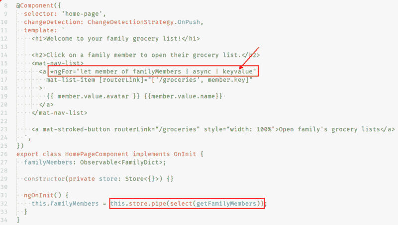
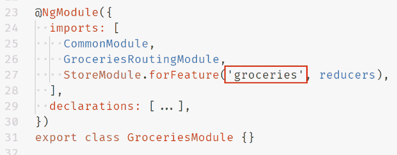
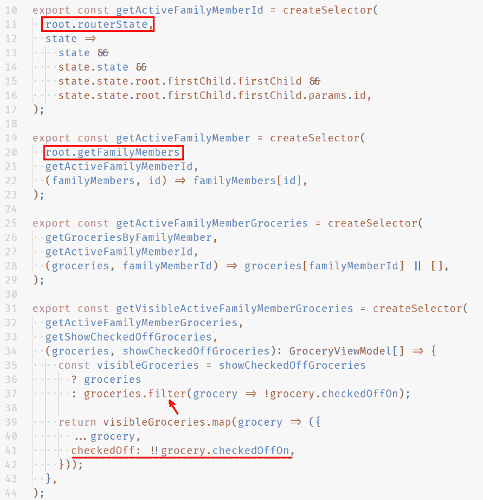
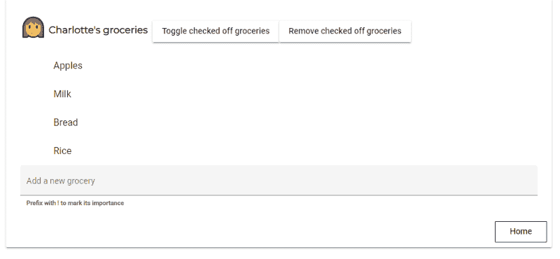

# 在模块之间共享数据是微不足道的

> 原文：<https://dev.to/angular/sharing-data-between-modules-is-peanuts-3p36>

### 问题

当您构建应用程序时，您将创建不同的功能模块，并考虑到可维护性和小内存占用。这样你的模块就有了一个清晰的边界，只有在需要的时候才会被加载。

但是有时您需要来自另一个模块的一些信息(数据)来构建您的视图(组件)。这是一个我最近开始经常看到的问题。在这篇文章中，我将特别给出这个问题的答案。

### NgRx 选择器:基础知识

在使用 NgRx 的应用程序中，整个应用程序状态作为一个(通常是深度嵌套的)对象存储在存储中，也称为状态树。当你引导你的应用程序时，这个状态树开始会很小，随着越来越多的模块被加载到应用程序中，它会变得越来越大。

状态树是应用程序真实性的唯一来源。数据一旦存储，就可以在应用程序中使用。为了访问组件中的状态以构建视图，使用了选择器。

选择器是一个[纯函数](https://medium.com/javascript-scene/master-the-javascript-interview-what-is-a-pure-function-d1c076bec976)，它将状态作为参数，并返回存储状态的一部分。选择器可以根据可用数据计算派生数据，而不只是返回存储在存储中的数据。这允许您只存储基本的，保持状态树尽可能紧凑。另一个重要的部分是选择器可以被组合，即:一个选择器可以接受一个或多个其他选择器作为它的输入

> 如果您熟悉使用数据库，可以将选择器与查询进行比较

因为选择器是纯函数，所以它们可以使用一种称为记忆化的优化技术，这意味着只有当它的一个参数改变时才会执行。

参见 [Alex Okrushko](https://twitter.com/AlexOkrushko) 的演讲 [NgRx:选择器比你想象的更强大](https://www.youtube.com/watch?v=E7GKnjGCXzU)了解更多信息和一些更高级的概念。

### 解

为了构建这个解决方案，我们将创建一个小应用程序，在这个应用程序中，整个家庭可以填写每个家庭成员的食品杂货。

* *根状态

* *在根模块中，我们有我们的家庭成员，我们还将使用 [@ngrx/router-store](https://github.com/ngrx/platform/blob/master/docs/router-store/README.md) 来跟踪路由器的状态。整个根状态如下所示:

```
export interface State {
  family: {
    familyMembers: {
      [id: string]: {
        id: string
        name: string
        avatar: string
      }
    }
  }
} 
```

<svg width="20px" height="20px" viewBox="0 0 24 24" class="highlight-action crayons-icon highlight-action--fullscreen-on"><title>Enter fullscreen mode</title></svg> <svg width="20px" height="20px" viewBox="0 0 24 24" class="highlight-action crayons-icon highlight-action--fullscreen-off"><title>Exit fullscreen mode</title></svg>

导致:

```
{  "family":  {  "familyMembers":  {  "dad":  {  "id":  "dad",  "name":  "Bob",  "avatar":  "👨"  },  "daughter":  {  "id":  "daughter",  "name":  "Emily",  "avatar":  "👧"  },  ...  }  },  "router":  {...}  } 
```

<svg width="20px" height="20px" viewBox="0 0 24 24" class="highlight-action crayons-icon highlight-action--fullscreen-on"><title>Enter fullscreen mode</title></svg> <svg width="20px" height="20px" viewBox="0 0 24 24" class="highlight-action crayons-icon highlight-action--fullscreen-off"><title>Exit fullscreen mode</title></svg>

#### 根选择器

简单地说，第一步是创建**选择器**来选择家庭成员以创建登录页面。

[](https://res.cloudinary.com/practicaldev/image/fetch/s--bi6F6a1I--/c_limit%2Cf_auto%2Cfl_progressive%2Cq_auto%2Cw_880/https://timdeschryver.dev/posts/sharing-data-between-modules-is-peanuimg/1.png)

在组件内部，使用创建的`getFamilyMembers`选择器从商店中检索家庭成员列表。因为这是一个可观察值，所以我们必须使用`async`管道来获取家庭成员列表的值。请注意，我们还使用了角 6.1 `keyvalue`管。这是唯一需要的，因为状态是以规范化的方式存储的，并且只是从状态树中提取。我们还可以将对象转换成选择器中的数组，这样就不需要`keyvalue`管道了。

[](https://res.cloudinary.com/practicaldev/image/fetch/s--cu17CMFm--/c_limit%2Cf_auto%2Cfl_progressive%2Cq_auto%2Cw_880/https://timdeschryver.dev/posts/sharing-data-between-modules-is-peanuimg/2.png)

产生以下主页:

[](https://res.cloudinary.com/practicaldev/image/fetch/s--VTiRESsW--/c_limit%2Cf_auto%2Cfl_progressive%2Cq_auto%2Cw_880/https://timdeschryver.dev/posts/sharing-data-between-modules-is-peanuimg/3.png)

#### 特征状态

因为这是一个食品杂货应用程序，所以功能状态将由食品杂货和一个可见性过滤器组成，以显示或隐藏检查过的食品杂货。我们将延迟加载这个模块，这意味着在初始加载期间不会加载代码，但是一旦用户导航到杂货页面，就会加载代码。

> 这也意味着 NgRx 代码最初不会被加载。换句话说，此时您不能从惰性加载的模块中选择数据。此外，当一个动作被分派时，reducers 和 effects 不会被调用。

加载特征模块时，NgRx 会将特征的减速器附加到当前减速器上。这导致以下状态树:

```
{  "family":  {...},  "router":  {...},  "groceries":  {  "groceries":  {  "ids":  [],  "entities":  {}  },  "visibility":  {  "showCheckedOffGroceries":  false  }  }  } 
```

<svg width="20px" height="20px" viewBox="0 0 24 24" class="highlight-action crayons-icon highlight-action--fullscreen-on"><title>Enter fullscreen mode</title></svg> <svg width="20px" height="20px" viewBox="0 0 24 24" class="highlight-action crayons-icon highlight-action--fullscreen-off"><title>Exit fullscreen mode</title></svg>

#### 功能模块

杂货状态作为`groceries`添加到状态树中，因为这是我定义它的方式。

[](https://res.cloudinary.com/practicaldev/image/fetch/s--i5pyKhkM--/c_limit%2Cf_auto%2Cfl_progressive%2Cq_auto%2Cw_880/https://timdeschryver.dev/posts/sharing-data-between-modules-is-peanuimg/4.png)

#### 特性选择器

现在我们知道了特性状态是什么样子，我们可以编写选择器来选择数据。

[](https://res.cloudinary.com/practicaldev/image/fetch/s--8IHjNAcz--/c_limit%2Cf_auto%2Cfl_progressive%2Cq_auto%2Cw_880/https://timdeschryver.dev/posts/sharing-data-between-modules-is-peanuimg/5.png)

注意，我们使用`createFeatureSelector`来选择`groceries`的状态。这里我们再次需要传递`groceries`作为参数，从状态树中选择杂货切片。还要注意选择所有食品杂货的`fromGroceries.selectAll`方法，这是一个内置选择器，带有 [@ngrx/entity](https://github.com/ngrx/platform/tree/master/docs/entity) 。

这样，我们就可以创建第一个返回派生数据的选择器了。我们将使用`getGroceries`选择器并返回按家庭成员分组的食品杂货，这使得以后更容易查找特定家庭成员的食品杂货。

[](https://res.cloudinary.com/practicaldev/image/fetch/s--acCa_Ayv--/c_limit%2Cf_auto%2Cfl_progressive%2Cq_auto%2Cw_880/https://timdeschryver.dev/posts/sharing-data-between-modules-is-peanuimg/6.png)

* *为特定于家庭成员的杂货店页面创建选择器

* *使用我们的州和杂货店选择器，我们可以为家庭成员创建杂货店页面。该页面可通过`/groceries/:id`进入，例如`/groceries/mom`。在这种情况下，为了显示母亲的食品杂货，我们必须从 URL 中提取家庭成员 id，从商店中选择家庭成员，最后从商店中选择家庭成员的食品杂货。

在我们继续之前，稍微回顾一下:我们在根模块中定义了家庭成员状态和路由器状态，在杂货功能模块中定义了杂货状态。但是因为我们所有的应用程序状态都是在一个状态树中定义的，所以我们可以简单地从我们的根中导入选择器，并和我们在杂货模块中创建的选择器一起使用它们。我喜欢把后者称为基数选择器。

是时候编写创建杂货页面所需的选择器了。

[](https://res.cloudinary.com/practicaldev/image/fetch/s--uht2re6R--/c_limit%2Cf_auto%2Cfl_progressive%2Cq_auto%2Cw_880/https://timdeschryver.dev/posts/sharing-data-between-modules-is-peanuimg/7.png)

请注意，我们还根据食品杂货是否被勾选来过滤它们。我们还添加了一个额外的`checkedOff`布尔属性，与可空日期相比，使它在我们的视图中更容易操作。

有了这些选择器，我们可以在组件中使用`getActiveFamilyMember`和`getVisibleActiveFamilyMemberGroceries`并构建如下视图:

[](https://res.cloudinary.com/practicaldev/image/fetch/s--mR4c_zLo--/c_limit%2Cf_auto%2Cfl_progressive%2Cq_auto%2Cw_880/https://timdeschryver.dev/posts/sharing-data-between-modules-is-peanuimg/8.png)

* *为全家的杂货页面创建选择器

* *再举一个例子，我还将向您展示创建显示全家所有杂货的页面所需的选择器。

就像之前一样，根模块的`getFamilyMembers`选择器被使用，基础选择器`getGroceriesByFamilyMember`也被使用。

[](https://res.cloudinary.com/practicaldev/image/fetch/s--C4V-99Ew--/c_limit%2Cf_auto%2Cfl_progressive%2Cq_auto%2Cw_880/https://timdeschryver.dev/posts/sharing-data-between-modules-is-peanuimg/9.png)

我们不需要更多，所以我们可以创建我们的家庭视图:

[](https://res.cloudinary.com/practicaldev/image/fetch/s--EGy-c4g6--/c_limit%2Cf_auto%2Cfl_progressive%2Cq_auto%2Cw_880/https://timdeschryver.dev/posts/sharing-data-between-modules-is-peanuimg/10.png)

### 重述

正如你在上面的例子中已经看到的，如果使用了选择器，在模块之间共享数据是微不足道的。这带来了额外的好处:

*   它很快，选择器是记忆的
*   你可以保持你的状态紧凑，有可能在选择器中获得数据
*   您可以重用选择器，因为选择器是可组合的
*   组件不再与状态树紧密耦合，这使得修改状态树结构更加容易

请记住，如果一个特性模块被延迟加载，为了选择数据，该模块必须已经被加载。

如果想看项目，可以看一下 [GitHub repo](https://github.com/timdeschryver/ngrx-family-grocery-list) ，或者在 [StackBlitz](https://stackblitz.com/github/timdeschryver/ngrx-family-grocery-list) 里玩玩。

非常感谢[内特·拉平斯基](https://twitter.com/nate_lapinski)、[麦克斯·巫师 K](https://twitter.com/maxkoretskyi) 、[亚历克斯·奥克鲁什科](https://twitter.com/AlexOkrushko)和[托德·帕尔默](https://medium.com/u/11477bb8a02e)审阅这篇文章。

### 如果你想了解更多，这里有更多的资源

[参数化选择器](//./posts/parameterized-selectors)

[正常化状态](//./posts/normalizing-state)

[高级 NgRx](https://slides.com/gerardsans/angularsp-advanced-ngrx#/)

### 您知道您还可以创建自己的定制选择器工厂吗

[https://twitter.com/gerardsans/status/1037359745466884096](https://twitter.com/gerardsans/status/1037359745466884096)