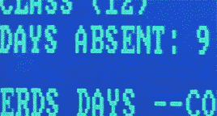

# Linux 命令行界面入门

> 原文：<https://dev.to/iam_timsmith/getting-started-with-the-linux-command-line-interface-2695>

作为开发人员，通过学习一些命令可以打开一个新的功能世界。今天，我将介绍一些基本命令，帮助您入门。

我最近参加了一个讲座，将 Linux 命令行比作哈利波特中的魔法。尽管我带着一点怀疑的态度参加了这次演讲，但我最终对这个类比的效果印象深刻。他谈到他们都非常强大，但当你不知道自己在做什么时，他们会非常危险。他甚至谈到了“黑魔法防御术”，这相当于在你被黑客攻击时使用命令行来查找信息。

我提出这一点是因为命令行对于不熟悉它的人来说可能非常吓人，但是在学习了一些简单的命令之后，它将改变你的生活。我发现自己几乎可以使用命令行来做任何事情，因为在很多情况下，它比使用 GUI 或图形用户界面更快、更容易。

## 什么是命令行界面？

如果你曾在 80 年代的电影或关于黑客的电影中看到有人使用电脑，你可能会看到命令行界面。我知道你在想什么:“好吧，我看过了。这告诉我什么。”简而言之，命令行或终端是一种通过文本而不是 GUI 与计算机本身进行交互的方式。通常，当使用命令行时，你可以访问 GUI 能做的所有事情，甚至更多，因为你直接与计算机通信，而 GUI 受限于开发人员放入应用程序的内容。

老实说，当我开始使用命令行做不同的事情时，我感觉自己像个黑客。如果你喜欢，可以利用“后门”做事情，这是非常酷的。我现在就告诉你如何使用后门。

## 如何访问命令行界面？

如果你在一台 Windows 机器上，你需要安装一些允许你在你的机器上使用这些命令的软件，因为 Windows 不支持这些现成的。我不使用 Windows，但是我听说过关于 [cmdr](https://cmder.net/) 的好消息。如果你用的是 Linux 或者 Mac，你可以打开一个叫终端的程序。

当应用程序加载时，通常会有黑色背景和白色文本，反之亦然。有一些文本和一个闪烁的光标在等待你的命令。不要被这个黑屏吓倒。真的一点都不恐怖。现在你的终端已经准备好了，我们来看看一些常见的命令怎么样？

## 常用命令

这里有一个常用命令的列表，以及一些关于如何使用它们的信息。我不会涵盖关于它们的每一个细节(因为其中一些有很多选项)，但这将足以开始。

### 找到你的位置

Pwd(打印工作目录的缩写)会显示你在计算机中的位置。这个命令除了给出你的当前位置之外，实际上什么也不做。

### 查看文件夹中的一切

另一个有用的命令是`ls`，它是 list 的缩写。通过键入`ls`并按回车键，您将看到工作文件夹中所有文件和目录的输出。这对于查看那里有什么以及弄清楚事物是如何组织的非常有用。

### 导航到别的地方

“更改目录”的缩写，cd 可以让你快速方便地在你的计算机目录中移动。您可以一次移动一个或多个目录，这取决于您想要做什么。如果你看下面的终端代码，你可以看到第一行是`cd ..`。这两个句点告诉计算机向上一个目录，所以我们从样式到桌面。下一行告诉计算机将目录更改为 styles 文件夹(位于桌面上)。

如果您不知道当前目录中有哪些可用的路径，第三行是一个方便的工具。在代码中，我在 styles 目录中，所以我键入`cd`并按 tab 键几次，它打印出 styles 文件夹中所有可用的文件和目录供我使用。最后一行只显示了如何用一行代码从桌面目录一直导航到组件目录(在样式内部)。很酷，对吧？

### 新建一个文件夹

Mkdir 是“make directory”的缩写，你猜对了，它创建一个新目录。这个命令在创建多个或嵌套目录时非常有用。在下面的示例中，第一行创建了一个名为 directory1 的新目录。首先，告诉命令行您想要创建一个目录，然后列出您想要创建的目录名，用空格分隔。如果目录名中需要空格，只需用引号将目录名括起来。

示例中的下一行创建了两个名为 directory2 和 directory3 的目录。最后，第三行创建一个名为 directory4 的文件夹，其中包含一个名为 sub1 的子文件夹。

如果我们查看当前目录，除了已经存在的内容之外，我们现在还应该看到以下结构:

*   董事 1/
*   董事 2/
*   董事 3/
*   董事 4/
    *   sub1/

不难看出，如果需要创建大量文件夹，这是一个省时的工具。想象一下，创建 10 个文件夹需要多少次鼠标点击，而不是在终端中创建一行代码！

### 创建新文件

与 mkdir 类似的是 touch，尽管这个命令的目的可能不那么明显。Touch 是一个创建新文件的命令，与 mkdir 的工作方式非常相似。您可以在目录中创建文件，随意命名它们(带扩展名)，甚至可以一次创建多个文件(仍然用空格分隔)。像 mkdir 命令一样，这可以节省大量时间。尤其是当你开始一个新的项目，并且需要创建一堆文件来启动和运行这个项目的时候。

下面的示例显示了在当前目录中创建的一个名为 file1.txt 的文件，在 directory1 中创建的一个名为 file2.txt 的文件，以及创建的另外两个名为 file3.txt 和 file4.txt 的文件。

添加上面的文件后，我的工作目录结构看起来像这样:

*   董事 1/
    *   文件 2.txt
*   董事 2/
*   董事 3/
*   董事 4/
    *   sub1/
*   文件 1.txt
*   文件 3.txt
*   文件 4.txt

### 删除文件或文件夹

好了，我已经介绍了如何创建文件夹和文件。如果我想删除一个文件怎么办？我也可以从命令行这样做吗？你打赌！要删除一个文件，您将使用`rm`命令，后跟您想要删除的文件的名称，用空格分隔。如果您需要删除一个文件夹，这个命令是完全一样的，除了您必须在文件夹名称前添加一个`-r`标志，告诉终端递归地执行这个命令。下面的示例演示了其中的每一项:

删除这些文件和文件夹后，我的当前目录如下所示:

*   董事 1/
    *   文件 2.txt
*   董事 3/
*   董事 4/
    *   sub1/

### 将文件或文件夹复制到新位置

我要展示的下一个命令是 copy 命令。这又是一个简短的例子，因为你只需输入`cp`，然后输入你想要复制的文件的位置，再输入你想要复制到的位置。复制目录需要`-r`标志，就像`rm`命令一样，它表示应该递归地完成。下面的示例演示了将文件从当前目录复制到另一个目录，以及将一个目录复制到一个目录。应该注意的是，您要复制到的位置的文件名不需要与现有的文件名匹配。你可以把它叫做任何你想要的新文件。

我的目录结构现在看起来像这样:

*   董事 1/
    *   文件 2.txt
*   董事 3/
    *   sub1/
    *   文件 3.txt
*   董事 4/
    *   sub1/

### 移动文件或文件夹

在不同的情况下，你想移动文件，而不是简单地复制它。你可以把文件复制到新的位置，然后用`rm`删除旧的文件，但是这有点麻烦。幸运的是，我们有 move 命令可以做到这一点。就像`cp`一样，你可以使用`mv`将文件移动到电脑上的不同位置。您也可以使用此命令在没有任何附加标志的情况下移动文件夹。该命令的格式也与`cp`完全相同。以下示例显示了如何移动文件和文件夹。

我的目录结构现在看起来像这样:

*   董事 1/
    *   sub1/
*   董事 3/
    *   sub1/
    *   文件 3.txt
*   董事 4/
    *   文件 2.txt

### 搜索文件中的一些文本

我今天要讲的最后一个命令是我在过去几个月里才开始使用的。它叫做`grep`，是 **g** 全局搜索 a **r** 正则 **e** xpression 和 **p** rint 的简称。所有这些意味着什么？它基本上意味着搜索一些文本。我想坦白说。您可以使用许多标志来真正定制您的搜索，所以我将告诉您我使用的标志。这是非常基本的，但是到目前为止对我很有用。

当我使用 grep 时，我使用标志`-Rnaio`,它按照我想要的方式搜索并显示我想要的输出。这实际上是 5 面独立的旗帜，但它们可以合并成一面，是的...案件在这里很重要。让我来分解一下它们各自的功能:

*   在目录中递归搜索，即当前目录中的所有目录
*   **n** -将行号添加到结果中，以便更容易在文件中找到文本
*   一个 -处理一个二进制文件，就像它是文本一样。这对正在编辑所述二进制文件的程序员特别有用。
*   **我**——忽略大小写。这增加了搜索结果，因为它不在乎内容是大写还是小写。
*   **o** -只显示与我们的输入相匹配的那部分行。这有助于防止结果出现文字墙。

下面的例子包含 grep 命令、前面提到的标志、一串点和单词 demonstration。什么？单词前后的点充当通配符，返回单词前后的 5 个字符，这有助于为我提供一点上下文。如果你仔细看，你会注意到末尾还有一个空格和一个点。这也是一个通配符，告诉 grep 在当前目录中的所有目录中进行搜索。如果你只想搜索一个特定的文件夹，你可以把这个最后的点改成你感兴趣的文件夹的名字。

结果出现在 grep 命令的正下方，您可以看到，基于我使用的标志，我们得到了文件名(`./directory4/file1.txt:`)，后跟行号(1:)。行号后面是文本搜索的结果，包括我们的搜索词前后的 5 个字符。

## 让事情变得更简单

虽然这些命令不需要太多的时间和精力，但是一遍又一遍地写同样的东西可能会很乏味。尤其是当你不得不试着用 grep 或者类似的东西记住你想要的标志的时候。幸运的是，有一种方法可以大大简化这个过程。

为此，请导航到您的个人文件夹。以下命令将带您到达那里:

进入主文件夹后，运行以下命令在编辑器中打开`.bashrc`文件。如果该文件不存在，您可能需要使用上面的`touch`命令创建它。

`.bashrc`文件可能为空，也可能不为空。无论哪种方式，你都可以在它的末尾添加一些会影响终端的东西，也可以创建快捷方式或“别名”。今天我们将讨论如何创建别名。我最常用的是 grep 命令，这样我就不必记住这些标志了。将以下文本添加到您的`.bashrc`文件并保存。关闭终端，然后重新打开，尝试新命令。

现在，您可以只编写`search`和 grep 命令的其余部分，而不是键入带有所有这些标志的 grep 命令。我将使用与之前相同的搜索，但使用新的别名:

如您所见，使用新的`search`命令返回与 grep 命令相同的结果，因为我们已经创建了这个别名。可以为任何文本或命令创建别名，这使事情变得更容易。我为 shells、我经常访问的目录等等创建了别名。目标是让你的生活变得更容易，为你一直做的事情起一个简单的名字。

## 结论

如您所见，使用终端并不需要花费太多时间。我们上面提到的命令以及别名应该可以让你在大多数日常工作中取得成功。当然，还有更高级的命令和标志可以使用，但这些都是基本的，应该让你的脚湿。

如果您在终端中使用这些或其他命令，请告诉我。你可以在推特上联系到我，电话是 [@iam_timsmith](https://www.twitter.com/iam_timsmith) 。