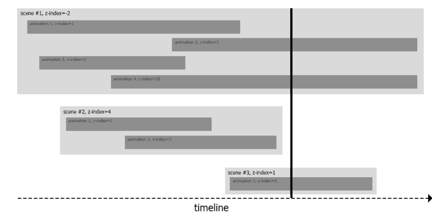

# 用 python 创建视频编辑工具(第 1 部分)

> 原文：<https://dev.to/paulplanchon_/creating-a-video-editing-tool-in-python-part-1-of-many-5a5c>

提前为我糟糕的写作技巧道歉，我是法国人，还在学习莎士比亚的语言

我将向你介绍的软件仍在开发中，不能正常使用。我还在开发中。我只想和你分享我的想法

我一直是一个视频爱好者:观看它们，享受它们，创造它们...我也是一个受好奇心驱使的人。因此，几个月前，当我挑战自己用 Python 开发一个视频编辑软件时，我两个世界发生了碰撞。

这个挑战是由发现使用代码创造事物的新方法的好奇心驱动的。但这也是帮助我理解 3blue1brown 的 manim 软件如何工作的一种方式。事实上，我总是被 [3B1B](https://www.youtube.com/channel/UCYO_jab_esuFRV4b17AJtAw) 的工作所困扰。我认为是纯粹和优雅的，当我知道所有的视频都是用 python 创作的时候，我失去了理智。所以我花了一些时间试图理解这个软件。并开始编写自己的渲染软件，加入自己的想法。

我的软件灵感来源于 [3B1B 软件](https://github.com/3b1b/manim)，我试图让软件更接近 premiere pro 那样的“真实软件”。 [Manim](https://github.com/3b1b/manim) 只需按照代码的流程进行渲染即可。但是我试图实现一个基于时间轴的渲染系统。

## 渲染软件

VidTex(我正在创建的视频+LaTeX / video+technologie 软件的名称)的主要思想是用户编写电影，然后 VidTex 进行渲染，没有什么是实时的。要使用该软件，您必须创建一个包含至少一个文件`movie_main.py`的文件夹。这个文件包含了电影的所有场景。场景由动画组成。

当你开始渲染时，VidTex 打开文件`movie_main.py`并提取`movie`场景(使用`importlib`)。用户在一个名为`prepare`的函数中编写了所有的电影。在这个函数中，用户调用电影使用的所有场景，并告诉 VidTex 它们何时必须在电影中呈现。例如，下面的代码告诉 VidTex 电影只有一个持续 60 帧的场景(帧速率在配置文件中设置)。

```
def prepare(self):
    self.add_to_timeline(FirstScene, 0, 60, dtype="frames") 
```

`FirstScene`对象是一个`Scene`，就像电影一样，你必须`prepare`场景:你添加动画而不是添加场景到时间线。所以一个场景的`prepare`函数应该是这样的:

```
def prepare(self):
    self.add_to_timeline(Animation1(anim_args**), 0, 60, z-index=-2)
    self.add_to_timeline(Animation2(anim_args**), 10, 55)
    self.add_to_timeline(Animation3(anim_args**), 2, 30, z-index=1) 
```

当您触发渲染过程时，VidTex 将寻找`Movie`类并尝试渲染第一帧(按开始时间排序，如果在`t`没有场景，帧`t`为黑色)。

## 了解基于时间轴的渲染

当 VidTex 启动渲染过程时，它将调用时间轴，并请求所有需要在第`t`帧显示的场景。有点递归，所有被调用的场景都将在第`scene["start_time"] - t`帧进行渲染。每个动画都有一个缓冲区，所有的动画缓冲区都被添加到创建的场景帧缓冲区中，后者在结束时被添加到创建的主帧缓冲区中。添加到缓冲区是由场景/动画的`z-index`决定的(你越靠近`z-index`越大)。

这就是应该如何理解电影场景和动画结构的工作原理。

[](https://res.cloudinary.com/practicaldev/image/fetch/s--xR1CdH9J--/c_limit%2Cf_auto%2Cfl_progressive%2Cq_auto%2Cw_880/https://thepracticaldev.s3.amazonaws.com/i/2xm7ruai95tgqv442xm2.png)

时间线类似于“正常的”视频编辑程序。有一种表述:

[](https://res.cloudinary.com/practicaldev/image/fetch/s--h32Kjbtm--/c_limit%2Cf_auto%2Cfl_progressive%2Cq_auto%2Cw_880/https://thepracticaldev.s3.amazonaws.com/i/emnky56vsj12stvm9ng1.png)

所以在光标所在的时间，距离`scene 1`最远的动画是`animation 2`。如果有不透明的动画，以`scene 3`为例，`scene 1`的`animation 2`将不会显示。VidTex 的时间线与 premier pro 的工作方式相同，在 effect 的时间线之后。你只需要用代码写出来。

## 为什么是 VidTex？

正如我之前所说的，这是我两种激情碰撞的一种方式。但它也是程序员需要的工具。例如，你希望能够创建你的模拟电影。事实上，动画与电影的其余部分是分离的，这意味着您可以在动画中运行物理模拟，并使用 VidTex 进行渲染。但是渲染物理模拟时，你可以添加一个文本叠加，或者用另一个视频来解释发生了什么。没有人想一直处理 FFMPEG 管道来创建简单的视频。

## 为未来

目前，VidTex 只能渲染非常基本的动画(称为图元)。我仍在大量研究代码。但是这个想法是有一些基本的动画和一个动画管理器，你可以从网上下载动画并把它们添加到你的电影中。

我会尽力让你了解 VidTex 的最新情况，如果你对阅读 VidTex 的错误和不太干净的代码感兴趣，你可以在这里查看。