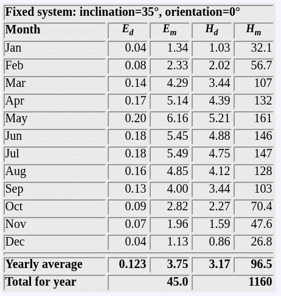

# 监控温室的硬件选择

> 原文：<https://dev.to/rossdrew/hardware-choices-in-monitoring-a-greenhouse-4b8g>

### 我们需要什么？

用于离网温室遥测树莓 Pi 设置的电源系统。事实证明，这其实很容易，即使对于像我这样的电力门外汉。

#### 我们需要力量

首先，提高 Pi 的效率。我通过 VNC 远程桌面控制我的 Pi，但我很快会把它转移到 headless。我不会使用 HDMI，所以禁用该电路是有意义的，让我们节省它使用的 25mA:

```
/user/bin/tvservice -o 
```

<svg width="20px" height="20px" viewBox="0 0 24 24" class="highlight-action crayons-icon highlight-action--fullscreen-on"><title>Enter fullscreen mode</title></svg> <svg width="20px" height="20px" viewBox="0 0 24 24" class="highlight-action crayons-icon highlight-action--fullscreen-off"><title>Exit fullscreen mode</title></svg>

然后我就不需要闪光灯了，于是又省了 10mA(各 5mA):

```
echo 0 | sudo tee /sys/class/leds/led0/brightness
echo 0 | sudo tee /sys/class/leds/led1/brightness 
```

<svg width="20px" height="20px" viewBox="0 0 24 24" class="highlight-action crayons-icon highlight-action--fullscreen-on"><title>Enter fullscreen mode</title></svg> <svg width="20px" height="20px" viewBox="0 0 24 24" class="highlight-action crayons-icon highlight-action--fullscreen-off"><title>Exit fullscreen mode</title></svg>

我见过 Pi 功率估计(HDMI 和灯都关了)高达 2 瓦/小时。我想要额外的能量，因为我不相信任何基于苏格兰天气的数据。让我们看看 24 小时运行它能得到多少回报。

#### 我们能切断电网吗？

使用[欧洲委员会的数据](http://re.jrc.ec.europa.eu/pvgis/apps4/pvest.php)我们可以看到，在夏季(4 月-9 月)使用 [50W 太阳能电池板](https://www.amazon.co.uk/gp/product/B01FKJUNFC/ref=ppx_yo_dt_b_asin_title_o01_s00?ie=UTF8&psc=1)，我们可以希望每天产生 130-200Wh 的电能，年最低值为 40Wh(下表中的 E <sub>d</sub> )。我的位置有点尴尬(朝东，有一个阴影截止点)，所以我会在那个数字下面的某个地方。

[](https://res.cloudinary.com/practicaldev/image/fetch/s--2BmGojO2--/c_limit%2Cf_auto%2Cfl_progressive%2Cq_auto%2Cw_880/https://thepracticaldev.s3.amazonaws.com/i/0suebwl0v3mcxjxzcssx.png)

所以我几乎可以在整个冬天运行这个系统。如果太阳能发电分散在 24 小时内，我们知道不是这样。我选择的面板的一个好处是，它带有一个控制器，省得我摆弄电子设备和弄乱电源电路。

#### 所以我们晚上需要电力

我们需要 48Wh 来为 Pi 供电(24 小时 2Wh ),我们在短时间内获得了 130+的电量，其余的就没有了。我们需要把它展开。所以电池。将会:

*   给我们成长的空间
*   将支持大量放电/充电

所以，让我们说 [80AH](https://www.tayna.co.uk/leisure-batteries/hankook/dc24/?gclid=EAIaIQobChMIy4Csj7nU6wIVOYBQBh12wQHGEAQYASABEgIQQPD_BwE) ，这看起来是我愿意支付的最高价格。这相当于 960 瓦时(80Ah x 12V)或连续 20 天的树莓派。
这也是一个深度循环(意味着它将安全地运行在相当低的水平)，因此有一个相当大的缓冲区用于电力问题和额外的电力负荷进行扩张。

### 就这样

它工作了，已经在我家连续运行了 3 天，在我的温室里运行了 1 天。我得到了比我预期的更多的太阳能充电时间，所以我有更多的电力，我不知道该怎么办。

现在要想些别的事情来处理这一切。

[](https://res.cloudinary.com/practicaldev/image/fetch/s--eofzq_Us--/c_limit%2Cf_auto%2Cfl_progressive%2Cq_auto%2Cw_880/https://thepracticaldev.s3.amazonaws.com/i/hlbvtvoaj7rw0g048gln.jpeg)

### 接下来

我也在寻找能让我监控和记录太阳能充电和消耗电池的产品或技术。