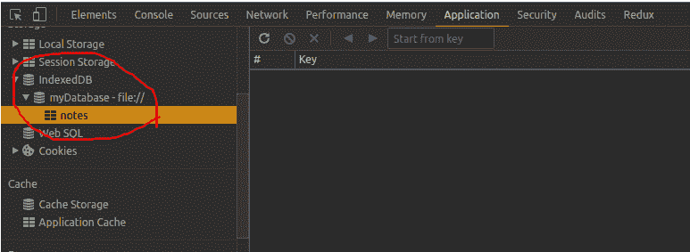
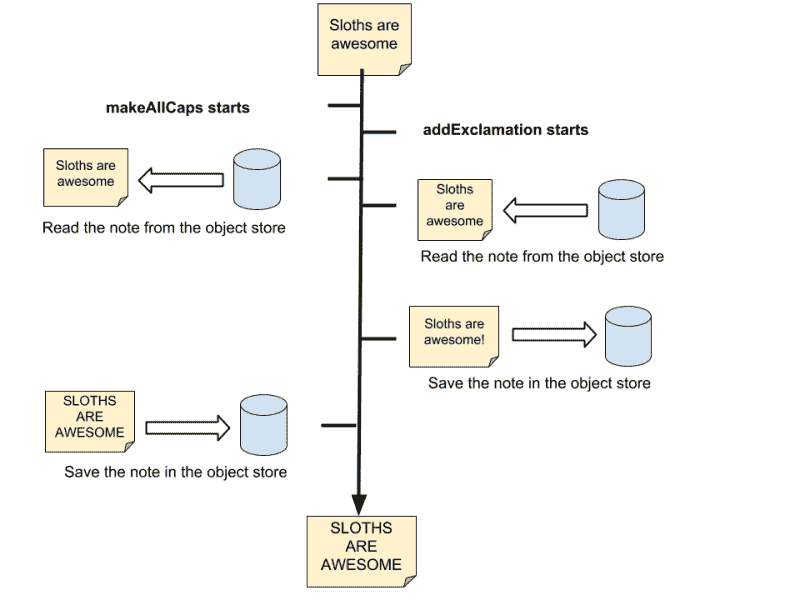

# 使用 IndexedDB 构建基本的 web 应用程序

> 原文：<https://dev.to/andyhaskell/build-a-basic-web-app-with-indexeddb-38ef>

IndexedDB 是一个 NoSQL 数据库，你可以在任何主流浏览器上使用它来存储大量数据，并像在 MongoDB 这样的数据库中一样进行查询。如果你正在制作一个存储大量数据的 web 应用程序或浏览器扩展，并且你想要多种方法来查询这些数据，IndexedDB 就是它的用武之地！

在本教程中，我们将制作一个简单的无框架便笺 web 应用程序，作为使用 IndexedDB 应该知道的概念的概述。为了更深入地了解，Mozilla Developer Network 的使用 IndexedDB 的[是另一个很好的概述，我还推荐](https://developer.mozilla.org/en-US/docs/Web/API/IndexedDB_API/Using_IndexedDB)[https://www . freecodecamp . org/news/a-quick-but-complete-guide-to-indexed db-25f 030425501/](https://dev.tothis%20tutorial%20from%20FreeCodeCamp)，它更侧重于 API 方法。

你可以在这里找到本教程的代码[，在这里](https://github.com/andyhaskell/indexeddb-tutorial/tree/master/1-intro-tutorial)你可以找到本教程关于向你的 IDB 代码添加测试覆盖的第 2 部分[。](https://dev.to/andyhaskell/testing-your-indexeddb-code-with-jest-2o17)

## 为什么要在我的 web app 中使用 IndexedDB？

正如我前面所说的，选择 IndexedDB 而不是本地存储的两个原因是:

*   没有大小限制；如果你的应用需要处理大量数据，而不仅仅是本地和会话存储的几兆字节，IndexedDB 可以让你存储大量数据。
*   结构化存储；您可以将对象存储在 IndexedDB 对象存储中，并使用它们的字段来查询它们。

这些也是你在服务器上存储数据的优势，所以如果你的项目有后台，你总是可以把数据存储在那里。但是如果你正在制作一个离线优先的 web 应用或者一个没有后台的应用，IndexedDB 是一个很好的选择。例如，我正在开发一个浏览器扩展来制作一个可视化的、交互式的网页历史的标签图。为此，我希望能够存储大量标签，按时间顺序检索它们，并且该应用程序没有 web 后端，因此 IndexedDB 是一个完美的选择！

## 制作我们的数据库

好了，让我们开始制作我们的应用程序吧！首先，创建一个名为 indexeddb-tutorial 的文件夹，在一个名为`db.js`的文件中，添加这段代码，这将创建我们的数据库！

```
let db;
let dbReq = indexedDB.open('myDatabase', 1);

dbReq.onupgradeneeded = function(event) {
  // Set the db variable to our database so we can use it! 
  db = event.target.result;

  // Create an object store named notes. Object stores
  // in databases are where data are stored.
  let notes = db.createObjectStore('notes', {autoIncrement: true});
}
dbReq.onsuccess = function(event) {
  db = event.target.result;
}

dbReq.onerror = function(event) {
  alert('error opening database ' + event.target.errorCode);
} 
```

要运行 JavaScript，将这段代码放在名为 index.html 的文件中，并在 Chrome:
中打开它

```
<!DOCTYPE html>
<html>
  <head>IndexedDB note store</head>
  <body>
    <div id="app"><h1>Coming soon</h1></div>
    <script src="db.js"></script>
  </body>
</html> 
```

现在在 Chrome 中，进入**开发者工具**，点击**应用**标签，然后点击左边栏的 **IndexedDB** ，可以看到数据库已经创建好了！

[](https://res.cloudinary.com/practicaldev/image/fetch/s--t2uCodS7--/c_limit%2Cf_auto%2Cfl_progressive%2Cq_auto%2Cw_880/https://thepracticaldev.s3.amazonaws.com/i/aj7wlmaizb5ez6cy0kst.png)

酷！我们有一个名为`myDatabase`的**数据库**，还有一个名为`notes`的**对象存储**(一个条目集合，类似于一个 SQL 表或 MongoDB 中的一个集合)。但是，仅仅是创建数据库和商店就需要很多代码。那里发生了什么事？

在前几行

```
let db;
let dbReq = indexedDB.open('myDatabase', 1); 
```

我们打开了名为 myDatabase 的数据库版本 1，但是`indexedDB.open`没有返回数据库，它返回了对数据库的**请求**，因为 IndexedDB 是一个**异步** API。IndexedDB 代码在后台运行，所以如果我们做一些事情，比如存储成千上万的项目，你的 web 应用程序的其余部分不会停止运行它的 JavaScript，等待它完成。所以在剩下的代码中，我们用**事件监听器** :
监听数据库何时准备好

```
dbReq.onupgradeneeded = function(event) {
  db = event.target.result;
  let notes = db.createObjectStore('notes', {autoIncrement: true});
} 
```

`myDatabase`以前不存在，所以它是自动创建的，然后触发`onupgradeneeded`事件。在 onupgradeneeded 回调中，并且只有在那个回调中，我们才能创建数据库的对象存储。所以首先，使用`db = event.target.result`，我们设置变量`db`来保存我们的数据库。然后，我们创建一个名为`notes`的对象存储。

```
dbReq.onsuccess = function(event) {
  db = event.target.result;
} 
```

在这里，`onsuccess`在`onupgradeneeded`完成后触发，如果我们刷新页面并再次打开数据库，它也会触发。同样，我们运行`db = event.target.result`来获取我们的数据库，这样我们就可以使用它了。

```
dbReq.onerror = function(event) {
  alert('error opening database ' + event.target.errorCode);
} 
```

最后，如果任何 IndexedDB 请求出错，它的`onerror`事件就会触发，因此您可以按照自己认为合适的方式处理错误。我们只是要做一个`alert`。

## 把一些数据放入数据库

我们有自己的数据库，但是没有数据我们做不了什么。让我们写一个函数来添加便利贴！

```
function addStickyNote(db, message) {
  // Start a database transaction and get the notes object store
  let tx = db.transaction(['notes'], 'readwrite');
  let store = tx.objectStore('notes');

  // Put the sticky note into the object store
  let note = {text: message, timestamp: Date.now()};
  store.add(note);

  // Wait for the database transaction to complete
  tx.oncomplete = function() { console.log('stored note!') }
  tx.onerror = function(event) {
    alert('error storing note ' + event.target.errorCode);
  }
} 
```

为了看到这一点，让我们将对我们函数的一组三个调用放到我们的`dbReq.onsuccess`中，这样一旦数据库准备就绪，它们就运行:

```
dbReq.onsuccess = function(event) {
  db = event.target.result;

  // Add some sticky notes
  addStickyNote(db, 'Sloths are awesome!');
  addStickyNote(db, 'Order more hibiscus tea');
  addStickyNote(db, 'And Green Sheen shampoo, the best for sloth fur algae grooming!');
} 
```

现在在你的浏览器中刷新 index.html，再次进入开发者工具中的**应用> IndexedDB** ，点击对象存储，让我们看看我们的数据！

[](https://res.cloudinary.com/practicaldev/image/fetch/s--lyc2CZIM--/c_limit%2Cf_auto%2Cfl_progressive%2Cq_auto%2Cw_880/https://thepracticaldev.s3.amazonaws.com/i/cjendv4p4240jt11smpl.png)

现在我们已经存储了一些数据！如您所见，我们在 notes 对象存储中的便笺是作为 JavaScript 对象存储的。那么代码中发生了什么呢？

```
let tx = db.transaction(['notes'], 'readwrite');
let store = tx.objectStore('notes'); 
```

首先，我们在数据库上启动一个**事务**，将数据写入我们的`notes`对象存储，然后我们从该事务中检索对象存储。

```
let note = {text: message, timestamp: Date.now()};
store.add(note); 
```

我们将便笺表示为一个 JavaScript 对象，并通过调用函数`store.add`将其存储在对象存储中。

```
tx.oncomplete = function() { console.log('stored note!') }
tx.onerror = function(event) {
  alert('error storing note ' + event.target.errorCode);
} 
```

最后，就像我们的开放式数据库请求一样，这个事务有事件侦听器；我们用事务的`oncomplete`和`onerror`侦听器来侦听存储注释的操作是完成还是出错。

关于我们的便利贴，另一件值得注意的事情是，每张便利贴都有一个递增的数字。所以如果你在这三个音符之后存储另一个音符，它的键就是 4。那些数字是从哪里来的？在 IndexedDB 中，对象存储中的所有对象都有一个**键**来标识它们，当我们用下面的代码行创建对象存储时:

`let notes = db.createObjectStore('notes', {autoIncrement: true});`

`autoIncrement`选项表示我们希望存储中的每个对象都有一个递增的键。如果通过唯一的名称存储和检索对象更有意义，也可以用字符串键进行对象存储(例如，一个 UUID 可以是对象存储的字符串键，或者如果有一个树懒的对象存储，可以通过将每只树懒发出的吱吱声的字符串编码作为键来识别它们)。

[https://www.youtube.com/embed/aaqzPMOd_1g](https://www.youtube.com/embed/aaqzPMOd_1g)

现在让我们将这个`addStickyNote`函数添加到我们实际的 web 应用程序中，这样用户就可以点击提交便笺了。我们需要一个文本框来提交注释，所以在 id 为`app`的 div 中，添加这些标签:

```
<div id="textbox">
  <textarea id="newmessage"></textarea>
  <button onclick="submitNote()">Add note</button>
</div> 
```

并将该函数添加到 db.js 中，该函数在用户每次提交注释时运行:

```
function submitNote() {
  let message = document.getElementById('newmessage');
  addStickyNote(db, message.value);
  message.value = '';
} 
```

现在去掉对`dbReq.onsuccess`中的`addStickyNote`的调用，然后如果我们去 index.html 并在我们的文本区中键入一些东西，当我们点击提交时，我们将看到笔记被存储在 IndexedDB 中！

在我们继续之前，我将向您展示如何检索数据以便我们可以显示它，但是，让我们绕道来谈谈使用 IndexedDB 的一个核心概念，事务！

## 交易为王在 IndexedDB

正如您在我们的上一个示例中看到的，为了访问我们的`notes`对象存储，我们必须运行`db.transaction`来创建一个**事务**，它是一个或多个对数据库的**请求**的集合。IndexedDB 中的一切都是通过事务发生的。因此，存储便笺、打开数据库和检索笔记都是发生在事务内部的请求。

在同一个事务中也可以有多个请求，例如，如果您在同一个对象存储中存储了许多项，那么所有的 store.add 请求都可以在同一个事务中发出，比如:

```
function addManyNotes(db, messages) {
  let tx = db.transaction(['notes'], 'readwrite');
  let store = tx.objectStore('notes');

  for (let i = 0; i < messages.length; i++) {
    // All of the requests made from store.add are part of
    // the same transaction
    store.add({text: messages[i], timestamp: Date.now()});
  }

  // When all of these requests complete, the transaction's oncomplete
  // event fires
  tx.oncomplete = function() {console.log('transaction complete')};
} 
```

就像请求有`onsuccess`和`onerror`事件处理程序一样，事务有`oncomplete`、`onerror`和`onabort`事件处理程序，我们可以分别用它们来响应事务的完成、出错或回滚。

但是，将每个请求放在一个事务中，我们到底能得到什么呢？请记住，IndexedDB 是一个异步 API，因此可能会有许多请求同时进行。假设我们在便签店里有一张便签，上面写着“树懒很棒”，我们提出了一个请求，要求将便签全大写，另一个请求是在便签上添加一个感叹号。如果没有交易，我们可能会面临这样的局面:

[](https://res.cloudinary.com/practicaldev/image/fetch/s--nDE9P9D7--/c_limit%2Cf_auto%2Cfl_progressive%2Cq_auto%2Cw_880/https://thepracticaldev.s3.amazonaws.com/i/0kc2mtuag1kalksavh6x.png)

我们开始`makeAllCaps`和`addExclamation`动作，它们都取回了未修改的“树懒很棒”笔记。`addExclamation`先用感叹号保存便笺。`makeAllCaps`花的时间更长，也省了“树懒很牛逼”的纸条，没有感叹号。`makeAllCaps`更新彻底清除了`addExclamation`的更新！

然而，对于事务，我们得到了**并发控制**。**一次只有一个事务可以创建、修改或删除对象存储中的项目**，因此 IndexedDB 中实际发生的情况看起来更像这样:

[](https://res.cloudinary.com/practicaldev/image/fetch/s--r7mmJpSI--/c_limit%2Cf_auto%2Cfl_progressive%2Cq_auto%2Cw_880/https://thepracticaldev.s3.amazonaws.com/i/ipqobuo50g20la4ll55u.png)

`makeAllCaps`事务首先开始，但是由于`addExclamation`使用与 makeAllCaps 相同的对象存储，所以它直到 makeAllCaps 完成后才开始。所以 makeAllCaps 结束，all caps 读取全部大写的注释，然后两次编辑都通过！🎉

这也意味着，如果一条路是一个对象商店，一个扫街工和一个画线工正在运行而没有事务，那么画线工可能会在扫街工移动一个分支之前进行绘画，你会得到这样的结果:

[](https://res.cloudinary.com/practicaldev/image/fetch/s--xUg50cvp--/c_limit%2Cf_auto%2Cfl_progressive%2Cq_auto%2Cw_880/https://thepracticaldev.s3.amazonaws.com/i/81v4bzhdfolwwywrac1x.jpeg)

但是有了 IndexedDB 运行的事务，扫街的人可以扫掉路上的树枝，画线的人可以画线，这样树懒就可以安全地去骑车了！

[](https://res.cloudinary.com/practicaldev/image/fetch/s--p9c-nrDw--/c_limit%2Cf_auto%2Cfl_progressive%2Cq_auto%2Cw_880/https://thepracticaldev.s3.amazonaws.com/i/j1rl67zym4l4x34ayys1.jpeg)

在我们继续之前，需要知道的另一件事是，如果添加、修改或删除数据，同一对象存储上的事务一次只发生一个**；换句话说，它们是`readwrite`事务，是这样创建的:**

`let tx = db.transaction(['notes', 'someOtherStore'], 'readwrite');`

这里我们做了一个读写事务，并说它影响了`notes`和`someOtherStore`。因为它是 readwrite，所以在任何其他涉及这些对象存储的事务完成之前，它不能启动。

虽然读写事务是一次一个，但也有`readonly`个事务；你可以**让任意多的用户**同时与同一个对象库对话，因为我们不需要阻止他们弄乱彼此的数据！你把它们做成这样:

```
// These transactions can all do their thing at the same time, even with
// overlapping object stores!
let tx = db.transaction(['notes', 'someOtherStore'], 'readonly');
let tx2 = db.transaction(['notes'], 'readonly');
let tx3 = db.transaction(['someOtherStore'], 'readonly'); 
```

## 检索一张便笺条

现在我们知道了事务是如何工作的，只读事务是如何工作的，让我们从便笺存储中检索便笺，以便显示它们。如果我们只从数据库中获取一个项目，我们将使用对象存储的`get`方法，就像这样:

```
// Set up an object store and transaction
let tx = db.transaction(['notes'], 'readonly');
let store = tx.objectStore('notes');

// Set up a request to get the sticky note with the key 1
let req = store.get(1);

// We can use the note if the request succeeds, getting it in the
// onsuccess handler
req.onsuccess = function(event) {
  let note = event.target.result;

  if (note) {
    console.log(note);
  } else {
    console.log("note 1 not found")
  }
}

// If we get an error, like that the note wasn't in the object
// store, we handle the error in the onerror handler
req.onerror = function(event) {
  alert('error getting note 1 ' + event.target.errorCode);
} 
```

我们进行一个事务，用键 1 请求 note store 中的 note 以获得我们的请求，然后我们或者在请求的`onsuccess`处理程序中使用检索到的 note，或者如果我们得到一个错误，我们在`onerror`处理程序中处理一个错误。注意，如果便利贴不存在，`onsuccess`仍然会开火，但是`event.target.result`会是`undefined`。

该模式感觉类似于我们打开数据库的处理程序；我们启动请求，然后在`onsuccess`处理程序中获得结果，或者在`onerror`处理程序中处理错误。但是我们不仅仅想要一个笔记，我们想要显示所有的笔记。所以我们需要得到所有这些，为此我们使用了一个**光标**。

## 用光标检索数据并显示您的便笺

检索对象存储中的所有项目有这样一个时髦的语法:

```
function getAndDisplayNotes(db) {
  let tx = db.transaction(['notes'], 'readonly');
  let store = tx.objectStore('notes');

  // Create a cursor request to get all items in the store, which 
  // we collect in the allNotes array
  let req = store.openCursor();
  let allNotes = [];

  req.onsuccess = function(event) {
    // The result of req.onsuccess in openCursor requests is an
    // IDBCursor
    let cursor = event.target.result;

    if (cursor != null) {
      // If the cursor isn't null, we got an item. Add it to the
      // the note array and have the cursor continue!
      allNotes.push(cursor.value);
      cursor.continue();
    } else {
      // If we have a null cursor, it means we've gotten
      // all the items in the store, so display the notes we got.
      displayNotes(allNotes);
    }
  }

  req.onerror = function(event) {
    alert('error in cursor request ' + event.target.errorCode);
  }
} 
```

运行该函数，下面是所有发生的步骤:

```
let tx = db.transaction(['notes'], 'readonly');
let store = tx.objectStore('notes'); 
```

在函数的开始，我们在`notes`对象存储上创建一个只读事务。然后我们得到商店，然后用`store.openCursor()`方法，我们得到一个请求。这意味着我们再次用请求的`onsuccess`和`onerror`处理程序处理请求的结果。

在 onsuccess 处理程序中，事件的结果是一个 **IDBCursor** ，其中包含光标持有的便笺的`key`，以及作为光标的`value`的便笺本身。

```
let cursor = event.target.result;
if (cursor != null) {
  allNotes.push(cursor.value);
  cursor.continue();
} else { 
```

在 if 语句中，如果光标不为空，这意味着我们有另一个便笺，所以我们将光标的`value`添加到我们的便笺数组中，并通过调用`cursor.continue`继续检索便笺。

```
} else {
  displayNotes(allNotes);
} 
```

但是如果光标为空，就没有更多要检索的注释，所以我们通过将注释传递给一个`displayNotes`函数来显示注释。

嗯，这个`cursor.continue()`感觉有点像 while 循环，但是没有循环或者控制流。我们到底要怎么循环？这一行会给你一个提示:

`req.onsuccess = function(event) {`

原来每次调用`cursor.continue()`时，都会触发一个事件，并将光标和下一个项目发送给 onsuccess 处理程序。因此，在每个`onsuccess`中，我们收集另一个便笺，直到我们成功到达光标为空的地方。这就是我们用游标迭代数据的方式。

现在要显示这些便笺，在 index.html，在文本框 div 之后，在文本框下面添加一个 div 来存储我们的便笺:

`<div id="notes"></div>`

并在 db.js 中添加这个函数来显示注释:

```
function displayNotes(notes) {
  let listHTML = '<ul>';
  for (let i = 0; i < notes.length; i++) {
    let note = notes[i];
    listHTML += '<li>' + note.text + '  ' + 
      new Date(note.timestamp).toString() + '</li>';
  }

  document.getElementById('notes').innerHTML = listHTML;
} 
```

该函数只是将每个笔记转换成一个`<li>`标签，并用老式的 JavaScript 将它们显示为一个列表。

现在我们有了一个显示所有便笺的函数，让我们在几个地方添加它。当我们第一次打开应用程序时，我们希望能够看到我们所有的便笺，所以当数据库第一次打开时，我们应该调用`dbReq.onsuccess` :
中的`getAndDisplayNotes`

```
dbReq.onsuccess = function(event) {
  db = event.target.result;
  // Once the database is ready, display the notes we already have!
  getAndDisplayNotes(db);
} 
```

当您添加一个便笺条时，您应该能够立即看到它，所以在`addStickyNote`中，让我们将完成回调上的事务更改为调用`getAndDisplayNotes` :

```
tx.oncomplete = function() { getAndDisplayNotes(db); } 
```

现在在 Chrome 中重新打开页面，尝试添加更多注释。应该是这样的！

[](https://res.cloudinary.com/practicaldev/image/fetch/s--cubjUAiU--/c_limit%2Cf_auto%2Cfl_progressive%2Cq_auto%2Cw_880/https://thepracticaldev.s3.amazonaws.com/i/rjiz79hncm90br0xwfg1.png)

现在，最后一件事，让我们创建一个模式，首先查看最新的笔记，并看看为什么这被称为 IndexedDB！

## 索引，将索引放入 IndexedDB

我们已经有了这个便笺存储，并且我们正在存储带有时间戳的便笺，因此我们应该能够检索某个时间范围内的所有便笺(就像过去 10 分钟内的所有便笺)或者能够首先检索最新的便笺，这应该是有意义的，对吗？

我们可以，但是为了能够通过时间戳字段进行查询，我们需要给 notes 对象存储中的那个字段一个**索引**。一旦我们有了那个索引，我们就可以通过它进行查询。但是请记住，对数据库结构的任何更改都需要发生在数据库请求的`onupgradeneeded`处理程序中，所以我们需要更新数据库的版本来创建索引，就像这样:

```
// We update the version of the database to 2 to trigger
// onupgradeneeded
let dbReq = indexedDB.open('myDatabase', 2);
dbReq.onupgradeneeded = function(event) {
  db = event.target.result;

  // Create the notes object store, or retrieve that store if it
  // already exists.
  let notes;
  if (!db.objectStoreNames.contains('notes')) {
    notes = db.createObjectStore('notes', {autoIncrement: true});
  } else {
    notes = dbReq.transaction.objectStore('notes');
  }

  // If there isn't already a timestamp index in our notes object
  // store, make one so we can query notes by their timestamps
  if (!notes.indexNames.contains('timestamp')) {
    notes.createIndex('timestamp', 'timestamp');
  }
} 
```

首先，我们将数据库的版本更新为 2，这表明数据库的结构正在发生变化，因此触发了`onupgradeneeded`事件。

现在我们有了一个版本升级，其中 notes 对象存储以前已经存在，所以我们检查是否已经存在一个带有`db.objectStoreNames`的 notes 存储:

`if (!db.objectStoreNames.contains('notes')) {`

如果存储对象已经存在，我们用`dbReq.transaction.objectStore`检索它:

`notes = dbReq.transaction.objectStore('notes');`

最后，我们添加一个带有`createIndex`的索引:

`notes.createIndex('timestamp', 'timestamp');`

第一个参数是我们索引的名称，第二个是索引的 **keyPath** 。索引本身实际上是一个对象存储，因此索引中的所有项都有一个键。因此，如果给一个索引一个 keyPath `timestamp`，那么对象存储中每个对象的时间戳将是它的键。

此外，还有可选的第三个 options 对象参数。假设我们的笔记有标题，并且我们想要要求一个笔记不能被存储，如果它与另一个笔记有相同的标题。我们可以这样做，创建一个独特的标题索引，如下所示:

`notes.createIndex('title', 'title', {unique: true});`

要查看我们的新索引，一旦您更新了`onupgradeneeded`，刷新了 Chrome 中的 index.html(您可能需要退出 Chrome 才能看到更改)，再次进入开发工具>应用程序> IndexedDB，您应该能够在 notes 对象存储中看到新的时间戳索引:

[](https://res.cloudinary.com/practicaldev/image/fetch/s--OGbBl7an--/c_limit%2Cf_auto%2Cfl_progressive%2Cq_auto%2Cw_880/https://thepracticaldev.s3.amazonaws.com/i/rcnrybdhd2nd0jhktar1.png)

如您所见，笔记现在按照它们的时间戳作为主键列出。事实上，作为一个对象存储，索引拥有与普通对象存储相同的`get`和`openCursor`方法。例如，我们可以通过调用以下命令来请求列表中的第一个笔记:

`tx.objectStore('notes').index('timestamp').get(1533144673015);`

好吧。现在我们有了一个很酷的新索引，让我们给我们的 web 应用程序添加一个模式来翻转我们显示笔记的顺序。首先，在 db.js 中，添加一个全局 bool 变量:

```
let reverseOrder = false; 
```

然后在 getAndDisplayNotes 中，我们只需要更新我们的请求，这样我们就可以使用时间戳索引，并且可以选择从哪个方向读取便笺。

```
let tx = db.transaction(['notes'], 'readonly');
let store = tx.objectStore('notes');

// Retrieve the sticky notes index to run our cursor query on; 
// the results will be ordered by their timestamp
let index = store.index('timestamp');

// Create our openCursor request, on the index rather than the main
// notes object store. If we're going in reverse, then specify the
// direction as "prev". Otherwise, we specify it as "next".
let req = index.openCursor(null, reverseOrder ? 'prev' : 'next'); 
```

在`store.index()`中，我们用我们请求的名称检索索引，就像我们如何从事务中检索对象存储一样。现在，我们可以在该索引上定义一个游标请求，以获取按时间戳排序的笔记。

`index.openCursor`有两个可选参数。第一个，如果它不为空，让我们指定我们想要检索的项目的范围。例如，如果我们只想要过去一个小时的便笺，我们可以这样打开光标:

```
let anHourAgoInMilliseconds = Date.now() - 60 * 60 * 1000;

// IDBKeyRange is a global variable for defining ranges to query
// indices on
let keyRange = IDBKeyRange.lowerBound(anHourAgoInMilliseconds);
let req = index.openCursor(keyRange, 'next'); 
```

第二个参数是我们希望检索条目的顺序，可以是`'prev'`或`'next'`，所以我们通过传入`reverseOrder ? 'prev' : 'next'`来指定我们的方向。

最后，让我们看看这一点在行动中；在 index.html，增加另一个功能。这将用于翻转我们显示的笔记的顺序:

```
function flipNoteOrder(notes) {
  reverseOrder = !reverseOrder;
  getAndDisplayNotes(db);
} 
```

为了使用我们用户界面中的 flipNoteOrder 功能，在 index.html 中再添加一个按钮来翻转音符的顺序。

```
<button onclick="flipNoteOrder()">Flip note order</button> 
```

如果你刷新 Chrome，你的 flip 按钮现在应该可以工作了！

[](https://res.cloudinary.com/practicaldev/image/fetch/s--7izvkaU3--/c_limit%2Cf_auto%2Cfl_progressive%2Cq_auto%2Cw_880/https://thepracticaldev.s3.amazonaws.com/i/j3x1j4pi3r271e4qluxn.png)

酷！现在我们可以改变我们看到笔记的顺序了！现在您已经看到了 IndexedDB 的基础知识。还有其他一些我们没有看到的功能，比如删除对象、在 IndexedDB 中存储二进制数据和多字段索引，但这应该是用 IndexedDB 构建 web 应用程序的一个很好的起点。

正如你所看到的，尽管基本的 IndexedDB API 很强大，但它并不符合人体工程学。我不知道你怎么想，但是对我来说，这些 on event 监听器感觉不方便推理，并且那些处理程序在我第一次弄清楚如何给出 IndexedDB 代码测试覆盖率时也花了一些心思。此外，我们应该如何给这个 API 自动化测试覆盖呢？

在我接下来的几个教程中，我将向您展示如何重构这段代码以使其可测试，然后在接下来的教程中，我将展示如何重构它以使其更易于使用！直到下一次，

[](https://res.cloudinary.com/practicaldev/image/fetch/s--sbqaII59--/c_limit%2Cf_auto%2Cfl_progressive%2Cq_auto%2Cw_880/https://thepracticaldev.s3.amazonaws.com/i/kkf5rf3hzfxluwd6iov2.jpeg)

### 偷懒！

本教程的第 2 部分是关于索引测试覆盖率的

[正在编写本教程的第 3 部分]