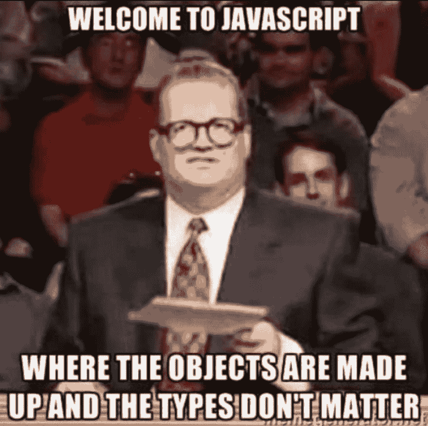

# 为什么‘5’+0 等于 50？

> 原文：<https://dev.to/vetswhocode/why-does-5-0-equal-50-5bh8>

类型强制的常见 JS noob 错误，以及如何避免它们

[](https://res.cloudinary.com/practicaldev/image/fetch/s--29vBEaZw--/c_limit%2Cf_auto%2Cfl_progressive%2Cq_auto%2Cw_880/https://cdn-images-1.medium.com/max/1024/1%2ANn6gQKbJqjfqQe6RbkSHpQ.png)

### 一篇简短的序言:

最近，我们的头头[杰罗姆·哈达威](https://twitter.com/JeromeHardaway)发布了一些代码挑战，目的是让每个人每天早上都热身，让我们的新部队为 9 月开始的队列做好准备。

这些本来就不是什么难题，只是早上唤醒大家大脑的一点小意思。

[](https://res.cloudinary.com/practicaldev/image/fetch/s--qyXkkpQA--/c_limit%2Cf_auto%2Cfl_progressive%2Cq_auto%2Cw_880/https://cdn-images-1.medium.com/max/357/1%2AolTzK29TYEM3awxjahbOkQ.png)

<figcaption>[Vets Who Code](http://vetswhocode.io)是一个非营利组织，我们免费培训 Vets，让他们成为坏蛋反应开发者，并帮助他们在该行业找到工作。上面的照片是杰罗姆，穿着他在军队时常见的现代制服。(我当然是开玩笑的。他 10 年前才从空军退役，很有幽默感——至少我希望如此，那些枪不是 PS 过的)。</figcaption>

然而，我的大脑不喜欢早上被叫醒。我在家工作，经常工作到很晚，直到凌晨。通常，我会在第一次晨会前一个小时起床。

当《站立》播出时，我的大脑仍在试图吸收我前两杯[死亡之愿咖啡](https://deathwishcoffee.com/)中的咖啡因(不是付费的宣传，我只是喜欢他们的高辛烷值酿造，他们值得宣传)。

然而，如果他们提供赞助，我会接受。我喜欢钱(和/或免费咖啡)。*(见脚注 1)

唤醒我的大脑比它准备好的更早，我暴躁的屁股变得有一种想要撕碎大便的欲望。我知道这违背了在家工作的最佳实践。我承认，和许多其他人一样，我努力保持这种生活方式所需的纪律和动力。我正在努力，但是仍然有一些早晨我还没有完全到达那里。正是当我处于这种状态时，我开始注意到一些常见的错误，这些错误出现在相当多的提交材料中。请记住，提交这些材料的人还没有开始我们的计划，他们正在等待轮到他们，所以我真的不应该对他们这么严厉。然而，尽早学习这些东西对他们最有利，所以记住这一点，让我们开始吧…

### 一道例题:

*写一个 JS 函数，计算两个给定数字的和。

如果任一参数或两个参数之和等于 50，则返回 _ _true*

听起来很简单，对吗？乍一看，这样的事情似乎还过得去:

```
function fiftyOrSumOfFifty (num1, num2) {
 if (num1 == 50 || num2 == 50) {
 return true;
 }
 else if (num1 + num2 == 50) {
 return true;
 }
 else {
 return false;
 }
} 
```

**注意:**这不是取自某个特定学生的代码，我并没有试图在后甲板上叫任何人出来。更确切地说，这是我见过的最常见的解决方案，在格式方面做了一些清理…这并不奇怪，真的。事实上，学生们除了为被该项目录取而做的准备工作之外，几乎没有任何事先指导，我实际上很高兴看到这样的事情，即使有这样的问题。

如果你给它正确的参数，它甚至可以工作…

```
console.log(fiftyOrSumOfFifty(25, 25)) // returns `true`
console.log(fiftyOrSumOfFifty(25, 0)) // returns `false`
console.log(fiftyOrSumOfFifty(50, 0)) // returns `true`
console.log(fiftyOrSumOfFifty(4, 50)) // returns `true` 
```

[](https://res.cloudinary.com/practicaldev/image/fetch/s--S5i3OaYY--/c_limit%2Cf_auto%2Cfl_progressive%2Cq_auto%2Cw_880/https://cdn-images-1.medium.com/max/834/1%2AmNdFP43_sl6B6CSpXUCcJQ.png) 

<figcaption>没错。</figcaption>

然而，就像我之前告诉你的，我的奶精的甜味和那令人敬畏的咖啡因嗡嗡声(再次感谢，死亡愿望！)还没有克服我早晨恐惧的痛苦，我决定开始喂它它可能不喜欢的 params。这导致了常见的 JS noob 第一号错误:

1.  **不考虑参数类型**

JS 是一种弱类型语言。与强制允许参数类型 [<sup id="a1">1</sup>](#f1) 的强类型语言相反，JS 允许你将任何旧的东西放入参数中，如果可以的话，它会很乐意给你一个答案。然而，这个答案可能不是我们想要的。例如，在上面的代码中，如果我们向函数 fiftyOrSumOfFifty 输入一个字符串，会发生什么情况？

```
console.log(fiftyOrSumOfFifty('50', 0)) // returns `true`
// and...
console.log(fiftyOrSumOfFifty('5', '0')) // also returns `true`
console.log(fiftyOrSumOfFifty('5', 0)) // also returns `true` 
```

[](https://res.cloudinary.com/practicaldev/image/fetch/s--saLHOwR0--/c_limit%2Cf_auto%2Cfl_progressive%2Cq_66%2Cw_880/https://cdn-images-1.medium.com/max/250/1%2AHZFuB76i-I4qV6GGW0HXlg.gif) 

<figcaption>什么……什么？</figcaption>

所以，事情是这样的:正如我之前所说的，JS 不在乎你是否给它输入了错误类型的参数。因为它是一种松散类型的语言，所以它可以接受任何参数。

任何事情。

如果你愿意，你可以给它一个整型、浮点型、字符串型、布尔型、数组型，或者什么都不给(null ),如果它能够用那个适合你写的代码的参数做一些事情，JS 将返回一些东西，而不会抛出一个错误。在上面的第一个例子中，我们提交了一个字符串，我们提交了一个值，它可以被强制转换为等于 50 的类型，因此返回 true。这实际上导致了下一个常见的错误，我们一会儿就会讲到。它与这一个有关，但是以一种更具体的方式。在第三个字符串示例中，我们提交了字符串“5”和整数“0”。为什么这个返回 true？因为你可以在字符串上使用+操作符，而且它会工作。

*它只是不会将两个参数[<sup id="a3">3</sup>](#f3)T5】相加。*

当您在一对字符串上使用+操作符时，它*将字符串*连接起来；也就是说，它将第二个直接粘贴到第一个的尾端。在示例函数中，这意味着最终，因为两个参数都不等于 50，所以这些参数被传递给求和运算，因为我们已经为其中一个参数提供了一个字符串，所以求和运算现在变成了串联运算，并且“5”+0 的计算结果为“50”。

为什么第二个例子和第三个例子一样，我们提交两个不同类型的参数？因为 JS 利用了一个叫做

*的招式压制*...如果在像+这样的操作中传递两个不同类型的变量，它会尝试将其中一个变量转换为有意义的第一个类型，这意味着这两个变量都被视为字符串，0 作为“0”附加到“5”上，结果是“50”，这将返回 true。

但是等一下……如果+运算符将其转换为字符串，为什么那个

‘50’(一个字符串，也就是文本)，求值等于 50(一个数字)？

那不应该！

嗯，是也不是……我马上就要说到这一点了，不要这么不耐烦。

首先，还记得我告诉过你，你也可以将数组放入参数中吗？嗯，有一种方法可以绕过我前面提到的整个字符串连接，那就是将参数解析为浮点数(例如:parseFloat('15') //返回 15)...然而，当您对数组执行此操作时，有趣的事情发生了:

```
console.log(parseFloat(['50', 25])) // returns... 50??? WTH!!! 
```

当你在数组上使用 parseFloat 时，它只解析数组中的第一项！奇怪的事永远不会停止吗？这让我很惊讶，我只是在打这篇文章的时候才发现这种奇怪，因为老实说，我以前从未想过尝试将数组解析为浮点数。这样做实际上是闻所未闻的，[甚至在 MDN 的文档中也没有提及](https://developer.mozilla.org/en-US/docs/Web/JavaScript/Reference/Global_Objects/Number/parseFloat)。这说明你每天都能学到新东西。我决定完全避开这个问题，如果其中一个参数是数组(例如: [Array.isArray(num1)](https://developer.mozilla.org/en-US/docs/Web/JavaScript/Reference/Global_Objects/Array/isArray) ...)，我会返回 false。

不管怎样，回到类型强制…

1.  **=== > ==**

示例函数使用== ('double-equals ')运算符计算等式，该运算符*推断类型*。这意味着，就像+运算符强制变量的类型并将其功能从“求和”更改为“连接”一样，双等于运算符查看两个变量并对自己说:*“嘿，这些东西中的一个不像另一个...但也许有可能，如果他们有相同的类型？咱们试试那个！”*

[](https://res.cloudinary.com/practicaldev/image/fetch/s--kam391Cl--/c_limit%2Cf_auto%2Cfl_progressive%2Cq_auto%2Cw_880/https://cdn-images-1.medium.com/max/998/1%2AwumtkNDr9qIOfSFXN9AE5w.png)

由于`'50'`可以被解析为`50`，`'50' == 50`评估为真。这实际上是一个非常容易犯的错误，尤其是如果从另一种语言转到 JS，因为大多数其他编程语言不使用双等于操作符——大多数其他语言中的`==`操作符的功能很像 JS 中的`===`(三等于)操作符，并且会执行严格的等价性评估...也就是说，一个字符串永远不会等于一个数字，无论字符串中的文本有多相似。在其他语言中，`===`操作符不一定以同样的方式工作；例如，在 Ruby 中，`===`可以用来比较类型 [<sup id="a9">9</sup>](#f9)

```
String === 'bacon' # evaluates to `true` 
```

…因此，一个来自 Ruby 的 JS 新手可能不会想到它会像 JS 中那样运行

，甚至不会意识到它的存在。在 Ruby 中，`==`做`===`在 JS 中做的事情。如果你是这门语言的新手，这是可以原谅的，但是使用`==`来检查等价性是一种习惯，在培训新的 JS 开发人员时应该迅速改掉，以免他们养成坏习惯。使用这个操作符会产生太多的副作用。当检查相等性时，应该使用`===`(三倍等于)而不是`==`，因为它不执行任何类型转换 [<sup id="a2">2</sup>](#f2) 。

说到应该尽快改掉的坏习惯:

1.  **过多的条件和返回，或“重构失败”**

这可以归因于缺乏经验。重构代码以提高效率最终会成为一种习惯，但这是一种必须学习和自我强化的习惯。给定的示例使用一个 if 来检查一个条件，如果该条件返回 true，则返回 true，然后使用 else if 来检查另一个语句，如果该语句返回 true，则返回 true，最后，如果所有其他语句都失败，则使用 else 语句返回 false。想一想那句话。条件本身已经返回了一个布尔值。我们根本不需要条件句。通过应用`||`(逻辑“或”<sup id="a6">6</sup>(# 6))运算符，我们可以:

```
return (condition1) || (condition2) || (condition3) 
```

...并且完全避免使用条件语句。

### 包装完毕:

这是我对这个问题的第一个解决方案；它允许字符串参数返回 true，只要它们可以解析为浮点数并传递条件。我选择这样做是因为 JS 主要是为 web 服务的，如果您正在进行 DOM 操作，那么在您解析它之前，它都是文本(或者使用数字输入，我猜；如果你想要全部的真相，我想多了)。然而，它不允许数组、未定义的或空的，或者我想到的除了数字和字符串之外的任何其他数据类型计算为 true:

```
const numOrSumFifty = (num1, num2) =\> !anyArr(num1, num2) && any50(num1, num2)

const any50 = (num1, num2) =\> {
 return numIs50(num1) || numIs50(num2) || numIs50(sum(num1, num2))
}

const anyArr = (num1, num2) =\> Array.isArray(num1) || Array.isArray(num2)

const numIs50 = num =\> parseFloat(num) === 50

const sum = (num1, num2) =\> parseFloat(num1) + parseFloat(num2) 
```

然而，如果我选择了不允许字符串参数(这可能是我首先应该做的；毕竟，过度工程本身就是一种反模式)，这个函数可以很容易地归结为简单得多的东西:

```
const numOrSumFifty =
 (num1, num2) =\> num1 === 50 || num2 === 50 || num1 + num2 === 50 
```

[](https://res.cloudinary.com/practicaldev/image/fetch/s--2kb-zm9E--/c_limit%2Cf_auto%2Cfl_progressive%2Cq_auto%2Cw_880/https://cdn-images-1.medium.com/max/808/1%2A2bc_aP-TStF7HJ-X3ucb1A.png) 

<figcaption>重构代码后，我对过去的自己有何感想。</figcaption>

还记得我说过的重构失败吗？孩子们，要经常检查自己。

我在 repl.it [<sup id="a8">8</sup>](#f8) 中编写了我的函数作为 Jest [<sup id="a7">7</sup>](#f7) 示例，而不是简单的 JS 示例，这样我就可以为函数编写测试套件(你可以在这里找到第一个，在这里找到‘无字符串参数’示例)。我邀请您为 fork 中的套件编写自己的测试，并尝试破坏我的函数。如果你能想到一个我还没有想到的案例，我会很乐意更新我的代码，并把这个发现归功于你；我爱同行评议！我们没有人是无可指责的，如果我做错了什么，我宁愿知道并且能够改正，而不是被蒙在鼓里。

至此，我希望我已经阐明了作为 JS 开发新手(如果不小心的话，甚至是专业人员也可能犯的一些错误)在 Javascript 的松散类型方面经常会犯的一些错误。下次见！

*参考文献:*

1.  [**强弱型**](https://en.wikipedia.org/wiki/Strong_and_weak_typing) | [↩](#a1)
2.  [**松等同性**](https://developer.mozilla.org/en-US/docs/Web/JavaScript/Equality_comparisons_and_sameness) | [↩](#a2)
3.  [**算术运算符**](https://developer.mozilla.org/en-US/docs/Web/JavaScript/Reference/Operators/Arithmetic_Operators#Examples) | [↩](#a3)
4.  [**parse float**](https://developer.mozilla.org/en-US/docs/Web/JavaScript/Reference/Global_Objects/Number/parseFloat)|
5.  [**isarray**](https://developer.mozilla.org/en-US/docs/Web/JavaScript/Reference/Global_Objects/Array/isArray)|[↩](#a5)
6.  [**逻辑运算符**](https://developer.mozilla.org/en-US/docs/Web/JavaScript/Reference/Operators/Logical_Operators) | [↩](#a6)
7.  [**Jest:令人愉快的 Javascript 测试**](https://jestjs.io/) | [↩](#a7)
8.  [**repl . it**](https://repl.it/)|
9.  [**Ruby 运算符相等比较**](http://www.zenruby.info/2016/05/ruby-operators-equality-comparison.html) | [↩](#a9)

* * *