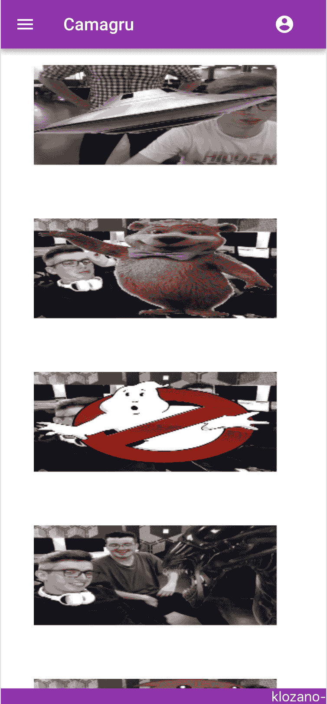
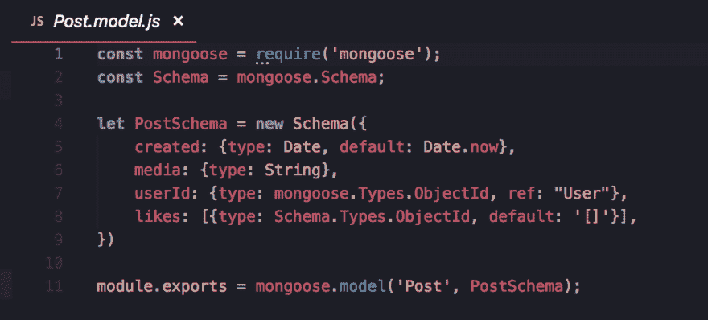

# Four tips for building your first Fullstack app (from a beginner's perspective)

> 原文：[https://dev.to/kevlozano/four-tips-for-building-your-first-fullstack-app-from-a-beginner-s-perspective-53e7](https://dev.to/kevlozano/four-tips-for-building-your-first-fullstack-app-from-a-beginner-s-perspective-53e7)

Hey y'all. I'm Kev, a student at [42 Silicon Valley](https://www.42.fr).

For one of the projects in school I had to build an Instagram-like web app. That means the next features:

*   User sign up / login
*   Email sending / link validation
*   Taking pictures with webcam or uploading
*   Using stickers
*   Upload pictures to public gallery
*   Be able to see, comment, like all pictures.

Here are some pictures of the final thing:

So for newbie that's a lot. I was able to finish it in 3 weeks and this are the main problems I faced (and how I tackled them). FYI: I used the MERN stack for this project.

## Meditate on where to start

Frontend? Backend? Database? I didn't know. I watched a lot of tutorials on Youtube and they all seemed to begin with the Frontend so that's what I did. Buuuuuut, I didn't like it. Maybe someone with more experience can prove me wrong but because I was using hardcoded data to test the components the design was not exactly what I needed.

When I finished the backend and started to deal with api calls and dynamic data (how many comments, how many likes) I had to tweak the frontend to make it work (double work). So next time I'll start with the backend.

## Think about how to structure your data

I used MongoDB, so non-relational. The freedom is good, working with objects in React/Javascript is easy, but that comes with a cost. You have to design your own documents.

What I was trying to do (users, images, comments) was very common so there were a lot of examples for it. I ended up using this schema:

## Try to use less packages

Working with Node is great but it appears everyone wants to solve every little problem with a new package that takes the same time to learn than to actually learn how to do it with vanilla (standard) javascript.

Its easy to fall into that pitfall, making your dependencies crazy and your file sizes huge. It was easier for me to google vanilla javascript solutions than to use Node packages (for the basic stuff). Especially as a beginner I want to learn how to do it, not only how a package works.

## You think you know asynchronous until you deal with it.

Coming from C and algorithms to webdev is not hard exactly, but its just so very different. I knew Node was asynchronous, I thought I knew promises, but I didn't really understood the ramifications of that until I actually had to deal with api calls and passing them to the frontend.

Think asynchronous from the beginning and everything will be easier.

### Anyways...

That was my experience and what I wish I knew before I started. Hopefully the second goes more smoothly.

What are your tips for new developers?