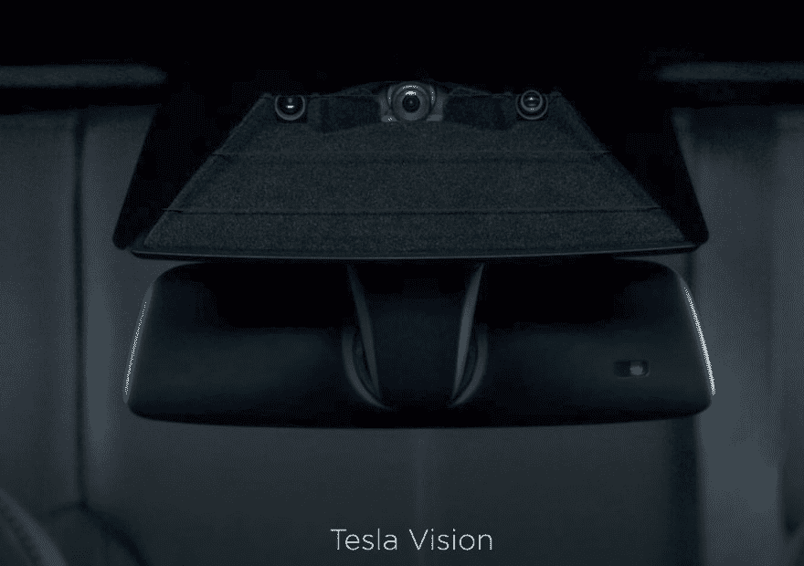
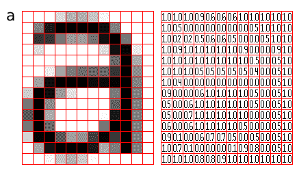
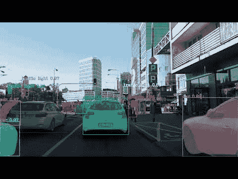

# 计算机视觉:看世界的新方式

> 原文：<https://dev.to/teosoft7/computer-vision-a-new-way-to-see-the-world-3ndn>

特斯拉的自动驾驶仪是如何工作的？汽车如何识别信号、其他车辆、行人、车道等？基本上，特斯拉使用车辆上的几个摄像头来了解汽车周围的障碍物。它使汽车能够检测交通，行人，路标，车道标志，以及任何其他可能在车辆前方的东西。这些信息用于帮助汽车自动驾驶。特斯拉正在使用其自主开发的全自动驾驶(FSD)计算机来处理图像处理和识别。

这项技术来自一种叫做计算机视觉的人工智能(AI)技术。计算机视觉是机器视觉的科学和技术。作为一门科学学科，计算机视觉涉及构建从图像和/或视频中获取信息的人工系统的理论和技术。

那么，计算机视觉是如何识别图像/视频中的物体的呢？它涉及许多任务，包括识别存在什么对象、在 2D 和 3D 中定位对象、确定对象和场景的属性、表征对象之间的关系以及提供场景的语义描述。

从数据科学的角度来说，计算机视觉的任务是一种验证一个对象是否在目标数据集上的分类问题。(垃圾邮件检测也是同样的问题！)由于图像/视频数据的基本特征，该模型可能相当复杂。分类模型由算法和用于训练算法的数据集组成。我们可以使用最先进的算法，比如用神经网络进行分类。

让我们思考一下分类模型是如何工作的，尤其是数据集。

通常，计算机视觉算法处理视频和/或图像。计算机中图像的数据结构可以根据其分辨率用 n×m 矩阵表示。例如，全高清图像的分辨率是 1920×1080，它可能有 200 万像素，我们可以把它放入矩阵中。如果我们将每个值设置为 2 个字节，矩阵的大小可能约为 7.6MB。并且视频是图像的组合，通常，我们每秒使用 30 帧(图像)。这意味着，超过 200 兆字节的数据可以用来分析 1 秒钟的视频。(这是一个图像/视频处理的简化示例，在真实世界中会有很大不同。)由于这些困难，数据集必须是轻便和清晰的。训练数据的数量也很重要。在宇宙中，有成千上万的物体。如果它太大，这意味着它需要巨大的计算能力来进行计算机视觉分析。把超级计算机放进汽车是不可能的。

微软 COCO(上下文中的常见对象，[http://cocodataset.org/#home](http://cocodataset.org/#home))数据集是一个新的大规模数据集，用于检测和分割日常生活中自然环境中的对象。COCO 数据集有 91 种对象类型，在 328k 图像中共有 250 万个标记实例。

图像可以按照 a)图标对象图像，b)图标场景图像，c)非图标图像来分类。大多数用于对象识别的数据集都集中在图像分类、对象包围盒定位或具有图标图像的语义像素级分割上。但是 COCO 数据集侧重于分割单个对象实例，即使它位于非图标图像上。

这是一个用 COCO 数据集进行物体检测的例子。

#### 结论

人眼是人体中最复杂的器官之一。世界上有很多关于计算机视觉的研究正在进行，计算机视觉可以理解的技能水平正在快速提高。有了计算机视觉，有一天我希望我们能有另一只眼睛。

*来源*

*   *微软 COCO:上下文中的通用对象([https://arxiv.org/abs/1405.0312](https://arxiv.org/abs/1405.0312))*
*   *用掩模 RCNN 和 Coco 数据集进行目标检测([https://youtu.be/dviGTND6a6s](https://youtu.be/dviGTND6a6s))*