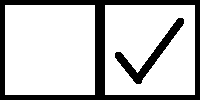

# 样式复选框:我知道的历史；我知识的进化

> 原文：<https://dev.to/takaneichinose/styling-checkbox-history-that-i-know-evolution-of-my-knowledge-3l>

# 我的开始

几年前，当我还是一个编程初学者的时候，我还没有学会`transform`关键字、`&:checked`伪类和`+`或`~`选择器，我试图设计一个类似下面这些代码行的复选框:

```
<!-- HTML Code -->

<input type="checkbox" class="checkbox"> 
```

<svg width="20px" height="20px" viewBox="0 0 24 24" class="highlight-action crayons-icon highlight-action--fullscreen-on"><title>Enter fullscreen mode</title></svg> <svg width="20px" height="20px" viewBox="0 0 24 24" class="highlight-action crayons-icon highlight-action--fullscreen-off"><title>Exit fullscreen mode</title></svg>

```
/* CSS Code */

.checkbox {
  color: black;
  background-color: white;
  border: solid 5px black;
  width: 100px;
  height: 100px;
} 
```

<svg width="20px" height="20px" viewBox="0 0 24 24" class="highlight-action crayons-icon highlight-action--fullscreen-on"><title>Enter fullscreen mode</title></svg> <svg width="20px" height="20px" viewBox="0 0 24 24" class="highlight-action crayons-icon highlight-action--fullscreen-off"><title>Exit fullscreen mode</title></svg>

大小可以，但是其他属性不行。那次我很惊讶，我想:“我可以很容易地设计文本框和选择框的样式，但是我不能设计复选框的样式。我该怎么办？”。

* * *

# 寻找解决方案

当我试图在一个流行的搜索引擎上搜索解决方案时，我发现了一个有趣的教程；使用图像和 jQuery 来完成这个任务。

### 解

我记得，我应该这样做。

首先，让我们得到我们的资源。

[](https://res.cloudinary.com/practicaldev/image/fetch/s--WADTG0x1--/c_limit%2Cf_auto%2Cfl_progressive%2Cq_auto%2Cw_880/https://thepracticaldev.s3.amazonaws.com/i/ofzi8e5l9xo6x2pfn66t.png)

是的，在那个时候，我们真的依赖图像精灵，因为 CSS 没有强大到足以执行这些事情。

下载  。我觉得用最新的 jQuery 就可以了。性能是有区别的，但是源代码是一样的。

### 源代码

```
<!-- HTML Code -->

<label class="label">
  <input type="checkbox" class="checkbox"/>
</label> 
```

<svg width="20px" height="20px" viewBox="0 0 24 24" class="highlight-action crayons-icon highlight-action--fullscreen-on"><title>Enter fullscreen mode</title></svg> <svg width="20px" height="20px" viewBox="0 0 24 24" class="highlight-action crayons-icon highlight-action--fullscreen-off"><title>Exit fullscreen mode</title></svg>

```
/* CSS Code */

.label {
  background-image: url(https://your-image-link-here.example.com);
  width: 100px;
  height: 100px;
  display: inline-block;
}

.label input[type="checkbox"] {
  display: none;
} 
```

<svg width="20px" height="20px" viewBox="0 0 24 24" class="highlight-action crayons-icon highlight-action--fullscreen-on"><title>Enter fullscreen mode</title></svg> <svg width="20px" height="20px" viewBox="0 0 24 24" class="highlight-action crayons-icon highlight-action--fullscreen-off"><title>Exit fullscreen mode</title></svg>

```
// Javascript Code

$(document).ready(function () {
  $('.checkbox').change(function () {
    if ($(this).prop('checked')) {
      $(this).parent().css('background-position', '100px 0px');
    }
    else {
      $(this).parent().css('background-position', '0px 0px');
    }
  });
}); 
```

<svg width="20px" height="20px" viewBox="0 0 24 24" class="highlight-action crayons-icon highlight-action--fullscreen-on"><title>Enter fullscreen mode</title></svg> <svg width="20px" height="20px" viewBox="0 0 24 24" class="highlight-action crayons-icon highlight-action--fullscreen-off"><title>Exit fullscreen mode</title></svg>

### 结果

[https://codepen.io/takaneichinose/embed/qGzPde?height=600&default-tab=result&embed-version=2](https://codepen.io/takaneichinose/embed/qGzPde?height=600&default-tab=result&embed-version=2)

看起来很好，但我不知道，性能方面。

* * *

# 经过学习

在我开始学习现有的更新技术后，我发现有一个更好的解决方案来解决这个小问题。

在阅读了很多文章(或教程)并练习了很多次之后，我发现图片并不是复选框样式的必要元素。

### 解数 2

#### 纯 CSS 方式

虽然这还不是我学到的最好的方法，但至少我不再需要使用 Javascript (jQuery)来设计复选框样式。

我们所要做的就是使用 CSS，使用`&:checked`伪类和`+`或`~`选择器，然后我们可以得到同样的结果。

### 源代码

```
<!-- HTML Code -->

<label class="label">
  <input class="checkbox" type="checkbox"/>
  <span></span>
</label> 
```

<svg width="20px" height="20px" viewBox="0 0 24 24" class="highlight-action crayons-icon highlight-action--fullscreen-on"><title>Enter fullscreen mode</title></svg> <svg width="20px" height="20px" viewBox="0 0 24 24" class="highlight-action crayons-icon highlight-action--fullscreen-off"><title>Exit fullscreen mode</title></svg>

```
/* CSS Code */

.label {
  width: 100px;
  height: 100px;
  display: inline-block;
}

.label input[type="checkbox"] {
  display: none;
}

.label input[type="checkbox"]:checked ~ span {
  background-position: 100px 0px;
}

.label span {
  background-image: url(https://your-image-link-here.example.com);
  width: 100%;
  height: 100%;
  display: block;
} 
```

<svg width="20px" height="20px" viewBox="0 0 24 24" class="highlight-action crayons-icon highlight-action--fullscreen-on"><title>Enter fullscreen mode</title></svg> <svg width="20px" height="20px" viewBox="0 0 24 24" class="highlight-action crayons-icon highlight-action--fullscreen-off"><title>Exit fullscreen mode</title></svg>

### 结果

[https://codepen.io/takaneichinose/embed/argGrP?height=600&default-tab=result&embed-version=2](https://codepen.io/takaneichinose/embed/argGrP?height=600&default-tab=result&embed-version=2)

这张也是好的，但是我不想再用图像了。

* * *

# 学而优则仕

尽管如此，我对以前的解决方案不满意(因为我不想仅仅使用图像来做这些)，我等待更新的技术，然后，尝试研究更好的解决方案。

许多人也使用这个解决方案，所以我想我会在这里坚持一段时间。我认为这是复选框样式的“现代”方式。

### 解数 3

#### 纯 CSS 和无资源的方法

是的，我们不再需要使用图像等其他资源。我们所需要的是 CSS，而不是别的，来完成这项工作。

首先，对于我们来说，要获得“检查图像”，我们只需准备好`span`标签，并将其塑造成您的偏好，然后使用`transform: rotate(<x>deg)`来获得“检查图像”错觉。

然后，与解决方案 2 一样，我们只需获得相邻或兄弟元素来设置那个`span`标签的显示。

### 源代码

```
<!-- HTML Code -->

<label class="label">
  <input class="checkbox" type="checkbox"/><span></span>
</label> 
```

<svg width="20px" height="20px" viewBox="0 0 24 24" class="highlight-action crayons-icon highlight-action--fullscreen-on"><title>Enter fullscreen mode</title></svg> <svg width="20px" height="20px" viewBox="0 0 24 24" class="highlight-action crayons-icon highlight-action--fullscreen-off"><title>Exit fullscreen mode</title></svg>

```
/* CSS Code */

.label {
  background-color: white;
  width: 100px;
  height: 100px;
  border: solid 5px black;
  display: inline-block;
  box-sizing: border-box;
}

.label input[type="checkbox"] {
  display: none;
}

.label input[type="checkbox"]:checked + span {
  display: block;
}

.label span {
  width: 80%;
  height: 40%;
  display: none;
  border-bottom: solid 15px black;
  border-left: solid 15px black;
  box-sizing: border-box;
  transform: rotate(-45deg) translateX(-10%) translateY(55%);
} 
```

<svg width="20px" height="20px" viewBox="0 0 24 24" class="highlight-action crayons-icon highlight-action--fullscreen-on"><title>Enter fullscreen mode</title></svg> <svg width="20px" height="20px" viewBox="0 0 24 24" class="highlight-action crayons-icon highlight-action--fullscreen-off"><title>Exit fullscreen mode</title></svg>

### 结果

[https://codepen.io/takaneichinose/embed/MdMqNV?height=600&default-tab=result&embed-version=2](https://codepen.io/takaneichinose/embed/MdMqNV?height=600&default-tab=result&embed-version=2)

在我看来其实更容易。此外，与相比，更容易设置复选框的过渡样式；如果你用图像。

* * *

我希望你喜欢我的小故事。感谢您的阅读。

* * *

# 结论

我们在发展中需要学习的东西实在是太多了。有太多的事情，我们以为我们已经知道了，但最终，有一个比我们现在知道的更好的。这就是为什么，我们不应该停止练习。这很重要。也许，我现在知道的“最佳解决方案”中，隐藏着更好的解决方案。或者也许不是现在，而是将来。

* * *

# 免责声明

在那段时间里，我不知道“帕格”、“SCSS”和“巴别”。这些只是我的 Codepen 中的默认编译器，对我来说更方便。