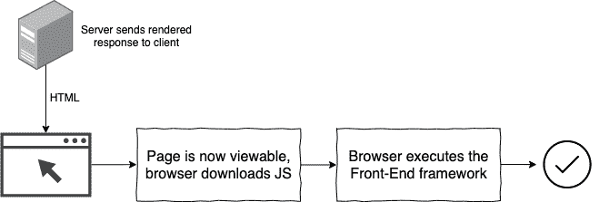

# Understanding Server Side Rendering

> 原文：[https://dev.to/christopherkade/understanding-server-side-rendering-3lk5](https://dev.to/christopherkade/understanding-server-side-rendering-3lk5)

> What is Server Side Rendering (SSR) ?

That's often a tricky question for a lot of people, where answers range from "it's good for static websites" to "I used it for my blog". But what is it **really**? Let's cover that together, including its pros & cons and some useful links.

## What is Server Side Rendering?

Before we dive head-first into an explanation, let's briefly recap the current context for a lot of modern web applications.

### Single Page Applications (SPA)

In our current web ecosystem, with our multitude of Front-End libraries and frameworks, a server will often respond with something like this when requested a page:

```
<!DOCTYPE html>
<html lang="en">
  <head>
    <meta charset="utf-8">
    <link rel="shortcut icon" href="/favicon.ico">
    React App
  </head>
  <body>
    <div id="root"></div>
    <script src="/app.js"></script>
  </body>
</html> 
```

Enter fullscreen mode Exit fullscreen mode

Where the `<div id="root"></div>` element will have pages injected into it using Javascript as the user navigates through the application.

This implies that all of the website's Javascript needs to be downloaded to the browser before being able to display anything. Meaning that a slow internet connection could have a great impact on the initial load time of your application. But, once loaded, the subsequent pages load fast and the website can be super interactive.

### Server Side Rendering (SSR)

On the other hand, when navigating to the same page, a server-rendered approach would have the server send your browser a readable HTML file with the page's content. When you'd navigate to another page, the same process would occur again.

[](https://res.cloudinary.com/practicaldev/image/fetch/s--NUAKA72Q--/c_limit%2Cf_auto%2Cfl_progressive%2Cq_auto%2Cw_880/https://user-images.githubusercontent.com/15229355/59100904-a9fa6500-8927-11e9-9470-a82a348a2249.png)

## Why should I use it?

There are many advantages to SSR, to name just a few:

### 🔎 Better SEO

Google's crawlers have a limited capacity to execute Javascript for a website before indexing it, meaning that the content of your page might have trouble being referenced. SSR on the other hand renders the page fully, meaning better SEO all around.

### 🏎 Faster first meaningful paint

As stated earlier, SSR won't have you download the website's Javascript fully, meaning a faster initial load speed. Which is great for individuals with older hardware or slower connections. Depending on your target audience this may be an important factor.

### ✅ Great for static websites

SSR is great for websites that are static, such as blogs, documentation, portfolios and landing pages where interactivity is usually limited.

### 👥 Social media optimization

Whenever someone shares your application on Facebook or Twitter, a preview of it will be displayed, including a title, description and an image.

## Any drawbacks?

Of course there are some drawbacks, it all depends on the type of application you're developing.

### 📈 More server requests

Each new page requires a new server request. Although these are short and usually lightweight, it's important to keep it in mind.

### 🐌 Slower page rendering

SPAs injects and renders each page faster as the Javascript is initially loaded when accessing the website for the first time. Since SSR fetches the whole page, the rendering will be somewhat slower.

### 🕹 Less interactivity

Imagine if Trello or Gmail were using SSR, you'd have to reload the page completely at each user interaction, which impacts the overall experience.

## Useful links

Here are some of my recommended links:

To build Vue.js server-rendered applications: [Nuxt.js](https://nuxtjs.org/).

To build React server-rendered applications: [Gatsby.js](https://www.gatsbyjs.org/), [Next.js](https://nextjs.org/).

This great [explanation](https://youtu.be/GQzn7XRdzxY?t=46) of SSR by the Firebase team.

I hope you enjoyed this article and learned a couple of things along the way.

Feel free to follow me on Twitter [@christo_kade](https://twitter.com/christo_kade) for any updates on my future articles. I also share a lot of interesting stuff about JS & CSS overall ✨

> Like that article's banner? Check out a [banner generator](https://christopherkade.com/banner-generator/) I made for DEV!