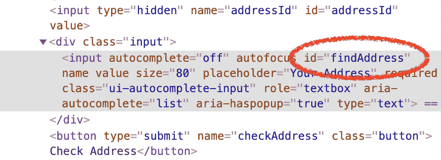

# 自动阅读表单结果🤖铬

> 原文：<https://dev.to/samthor/automate-reading-form-results-with-chrome-24li>

所以，我有一个即将到来的互联网升级，我想检查它的“即将到来”的状态。因为——好吧，100/40 和我现在拥有的比起来没什么可轻视的——我相当兴奋，当然，我每隔几天就会查看一下状态页面。🇫️5️⃣🇫️5️⃣🇫️5️⃣

让我们自动完成这个，这样我就可以保持理智了。这种事情有两种选择，我都想经历。

## 1。发送原始 HTTP 请求

首先，我打开了“检查我的地址”页面，打开了 Chrome 的 DevTools(或者我猜 Edgium 的 DevTools 也是),打开了网络标签。我找到了我的地址并提交了表格。让我们看看请求。

[](https://res.cloudinary.com/practicaldev/image/fetch/s--y2v4DpjY--/c_limit%2Cf_auto%2Cfl_progressive%2Cq_auto%2Cw_880/https://thepracticaldev.s3.amazonaws.com/i/iekp99l17adjj074saja.png)

有些 API 是公开使用的。不过，我在这个问题上花了一些时间，这很麻烦:需要设置一个有效的 cookie，而这很难做到。😡

让我们变得懒惰，使用 Chrome 的无头模式！

## 2。使用 Chrome 和木偶师

不需要我们自己去匹配 HTTP 请求，您只需要*假装*是一个真实的用户，通过编程来完成表单流程。让我们开始:

```
$ yarn add puppeteer
$ npm i puppeteer 
```

<svg width="20px" height="20px" viewBox="0 0 24 24" class="highlight-action crayons-icon highlight-action--fullscreen-on"><title>Enter fullscreen mode</title></svg> <svg width="20px" height="20px" viewBox="0 0 24 24" class="highlight-action crayons-icon highlight-action--fullscreen-off"><title>Exit fullscreen mode</title></svg>

并创建一个微小的脚本(`run.js`)来开始:

```
const puppeteer = require('puppeteer');

(async () => {
  const browser = await puppeteer.launch({headless: false});
  const page = await browser.newPage();
  await page.goto('https://www.google.com/', {waitUntil: 'networkidle2'});
}); 
```

<svg width="20px" height="20px" viewBox="0 0 24 24" class="highlight-action crayons-icon highlight-action--fullscreen-on"><title>Enter fullscreen mode</title></svg> <svg width="20px" height="20px" viewBox="0 0 24 24" class="highlight-action crayons-icon highlight-action--fullscreen-off"><title>Exit fullscreen mode</title></svg>

太好了！保存并运行(`node run.js`)。你会看到 Chromium 启动并打开 Google。值得注意的是，我们已经设置了`{headless: false}`——这在开发过程中很有用，因此您可以看到正在发生的事情——但是您可以在部署时关闭它。📴

当你对谷歌惊叹不已的时候，在你的终端上点击 Ctrl-C。你应该用你想要的任何形式来替换这个 URL。

### a .页面交互

对于我的例子，我需要先在输入框中输入我的地址。在普通浏览器中打开您的目标页面，右键单击它，“Inspect Element”，然后检查它。

[](https://res.cloudinary.com/practicaldev/image/fetch/s--PL2X34ds--/c_limit%2Cf_auto%2Cfl_progressive%2Cq_auto%2Cw_880/https://thepracticaldev.s3.amazonaws.com/i/qbxp6i723n5wnp3ied9f.png)

值得注意的是，它有一个 ID——太好了！我们可以使用一个 HTML 选择器来找到它。让我们在主函数中输入一些文本:

```
 await page.goto('https://example.com/', {waitUntil: 'networkidle2'});
  await page.type('#findAddress', 'Your Address'); 
```

<svg width="20px" height="20px" viewBox="0 0 24 24" class="highlight-action crayons-icon highlight-action--fullscreen-on"><title>Enter fullscreen mode</title></svg> <svg width="20px" height="20px" viewBox="0 0 24 24" class="highlight-action crayons-icon highlight-action--fullscreen-off"><title>Exit fullscreen mode</title></svg>

冲洗并重复，直到您输入了所有的用户数据。

对于某些页面，您可能需要单击按钮来提交表单。在我的情况下，我必须等待匹配的地址出现。通过手动操作，您可以找到要单击的选择器:

[](https://res.cloudinary.com/practicaldev/image/fetch/s---pzPfx2C--/c_limit%2Cf_auto%2Cfl_progressive%2Cq_auto%2Cw_880/https://thepracticaldev.s3.amazonaws.com/i/rf1ooqfsi7drqyosk5bd.png)

你可以指示木偶师等待某个元素出现在页面上(因为当一个操作*完成*时，页面的 JS 正在添加它)，*然后*点击它:

```
 const target = '.ui-autocomplete a.ui-corner-all';
  await page.waitForSelector(target);
  await page.click(target); 
```

<svg width="20px" height="20px" viewBox="0 0 24 24" class="highlight-action crayons-icon highlight-action--fullscreen-on"><title>Enter fullscreen mode</title></svg> <svg width="20px" height="20px" viewBox="0 0 24 24" class="highlight-action crayons-icon highlight-action--fullscreen-off"><title>Exit fullscreen mode</title></svg>

记住，你可以用`{headless: false}`运行你的脚本。它启动的每个 Chrome 实例都是密封的。

### b .获取数据

一旦你提交了你的最终表格，你可以使用`page.waitForSelector`或者另一个[等待选项](https://pptr.dev/#?product=Puppeteer&version=v1.17.0&show=api-pagewaitforselectororfunctionortimeout-options-args)来等待结果。

为了从页面中提取数据，我们可以运行`page.evaluate`，或者在我们的例子中，运行一个派生的`page.$eval`，它接受一个选择器，并将该元素作为它的第一个函数传入。就我而言，我在寻找:

```
 const results = await page.$eval('.poi_results tbody', (tbody) => {
    // do stuff
  }); 
```

<svg width="20px" height="20px" viewBox="0 0 24 24" class="highlight-action crayons-icon highlight-action--fullscreen-on"><title>Enter fullscreen mode</title></svg> <svg width="20px" height="20px" viewBox="0 0 24 24" class="highlight-action crayons-icon highlight-action--fullscreen-off"><title>Exit fullscreen mode</title></svg>

值得注意的是，Puppeteer 的 API 实际上是*序列化*你传递给页面的方法(整个`(tbody) => { ... }`)。这意味着您不能从该函数的作用域之外访问变量。如果需要传递更多的值，可以加到`$eval`，像这样:

```
 await page.$eval('.selector', (selectorResult, arg1, arg2) => {
     // arg1, arg2 (and more?) are brought in from outside
   }, arg1, arg2); 
```

<svg width="20px" height="20px" viewBox="0 0 24 24" class="highlight-action crayons-icon highlight-action--fullscreen-on"><title>Enter fullscreen mode</title></svg> <svg width="20px" height="20px" viewBox="0 0 24 24" class="highlight-action crayons-icon highlight-action--fullscreen-off"><title>Exit fullscreen mode</title></svg>

对我来说，我的最后一个方法看起来像这样，因为我从一个每行都有键和值的表中读取:

```
 // returns [{key: 'Ready Date', value: '14 June 2019'}, ... ]
  const results = await page.$eval('.poi_results tbody', (tbody) => {
    return Array.from(tbody.children).map((tr) => {
      const key = tr.firstElementChild;
      const value = tr.lastElementChild;
      return {
        key: key.textContent,
        value: value.textContent,
      };
    });
  }); 
```

<svg width="20px" height="20px" viewBox="0 0 24 24" class="highlight-action crayons-icon highlight-action--fullscreen-on"><title>Enter fullscreen mode</title></svg> <svg width="20px" height="20px" viewBox="0 0 24 24" class="highlight-action crayons-icon highlight-action--fullscreen-off"><title>Exit fullscreen mode</title></svg>

### c .差异

为了将它们放在一起，我们可以将结果保存到一个文件中，并确定当您运行它时发生了什么变化。添加一些依赖:

```
const fs = require('fs');
const diff = require('diff');  // yarn install diff / npm i diff 
```

<svg width="20px" height="20px" viewBox="0 0 24 24" class="highlight-action crayons-icon highlight-action--fullscreen-on"><title>Enter fullscreen mode</title></svg> <svg width="20px" height="20px" viewBox="0 0 24 24" class="highlight-action crayons-icon highlight-action--fullscreen-off"><title>Exit fullscreen mode</title></svg>

并比较输出:

```
 const out = results.map(({key, value}) => {
    return `${key}: ${value}\n`;
  }).join('');

  let prev = '';
  try {
    prev = fs.readFileSync('status.txt');
  } catch (e) {}

  const changes = jsdiff.diffTrimmedLines(prev, out);
  console.info(changes); 
```

<svg width="20px" height="20px" viewBox="0 0 24 24" class="highlight-action crayons-icon highlight-action--fullscreen-on"><title>Enter fullscreen mode</title></svg> <svg width="20px" height="20px" viewBox="0 0 24 24" class="highlight-action crayons-icon highlight-action--fullscreen-off"><title>Exit fullscreen mode</title></svg>

JSDiff 生成一个单个更改的列表。我将把它们的格式化留给读者。对我来说，我的脚本最终生成了如下内容:

[](https://res.cloudinary.com/practicaldev/image/fetch/s--1g9RK_xp--/c_limit%2Cf_auto%2Cfl_progressive%2Cq_auto%2Cw_880/https://thepracticaldev.s3.amazonaws.com/i/6km5352z361hrqpm1okr.png)

### d .关闭浏览器

完成后，请务必关闭浏览器，这样脚本就可以结束:

```
 await browser.close(); 
```

<svg width="20px" height="20px" viewBox="0 0 24 24" class="highlight-action crayons-icon highlight-action--fullscreen-on"><title>Enter fullscreen mode</title></svg> <svg width="20px" height="20px" viewBox="0 0 24 24" class="highlight-action crayons-icon highlight-action--fullscreen-off"><title>Exit fullscreen mode</title></svg>

这可能也是从程序顶部移除`{headless: false}`的好时机，这样你的自动化工具实际上可以...被自动化。

### 每天跑步

对我来说，我每天通过我自己的 Linux 服务器上的 crontab 运行这个脚本，结果通过电子邮件发送给我。也可以在 [Firebase Functions](https://medium.com/@ebidel/puppeteering-in-firebase-google-cloud-functions-76145c7662bd) 、 [App Engine](https://cloud.google.com/appengine/docs/standard/nodejs/using-headless-chrome-with-puppeteer) 或者你选择的云服务上运行 Puppeteer。

## 题外话

我在澳大利亚🇦🇺，这次升级是被称为 NBN 的政府基础设施项目的绝对混乱的一部分。在功能上，它是你和你的 ISP 之间的以太网桥，由政府提供(因为“最后一英里”是自然垄断)。

## 谢谢！

我希望你已经学会了一些关于木偶师和刮痧！Puppeteer 最常用于自动化测试，或者使用浏览器的特性，比如生成 pdf，您可以在网上找到更多的文章。

seven