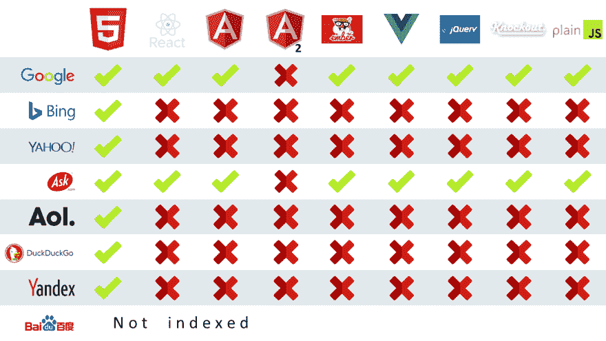

# 通过 Angular Universal 在社交媒体平台上更好地分享

> 原文：<https://dev.to/angular/better-sharing-on-social-media-platforms-with-angular-universal-1d1o>

*最初发布于[https://samvloeberghs . be](https://samvloeberghs.be/posts/better-sharing-on-social-media-platforms-with-angular-universal)2019 年 2 月 24 日*

## 目标受众

这篇关于如何使用 Angular Universal 在社交媒体平台上更好地分享的文章和指南是针对那些至少对 Angular 有基本了解，并且可能已经有了 Angular Universal 实现并正在运行的开发人员的。我们将描述一些高层次的想法和概念，不同的工具和有角度的服务，它们将为脸书、Twitter 和 LinkedIn 等平台提供更好的社交分享。

## 角万能和 SEO 问题与 spa

这不是什么新概念，用 Universal 在服务器上运行 Angular。这个网站的第一个版本是在 2016 年 11 月用 Angular v2 和 Universal concepts 构建的。从那时起，围绕它的工具已经发展了很多，我的网站也随着这些工具的更新而发展。

*如今建立一个 Angular 通用网站或应用程序要容易得多，因为它是[完全记录的](https://angular.io/guide/universal)，并且有许多[示例项目](https://github.com/angular/universal)可用。Angular CLI 还为我们提供了通过使用[简单命令](https://angular.io/cli/generate#universal-command)自动添加该功能的工具。*

事实上**spa 在索引和社交分享方面普遍存在很大的问题**已经成为许多讨论的话题，而且多年来，自从第一个 JS 应用程序建立以来。人们已经考虑了不同的方法，其中一种方法可以归类为[黑帽 SEO](https://www.webopedia.com/TERM/B/Black_Hat_SEO.html) ，比如用 PhantomJS 或 Puppeteer 这样的无头浏览器预渲染应用程序，并为不同的消费者提供不同的内容，机器人与真实访客。

## 搜索引擎对 spa 的索引能力

当您通过 angular-cli 生成 Angular 应用程序时，会生成一个`polyfills.ts`文件。它包括以下内容:

```
// polyfills.ts

/** IE9, IE10, IE11, and Chrome <55 requires all of the following polyfills.
* This also includes Android Emulators with older versions of Chrome
* and Google Search/Googlebot
*/ 
```

这意味着我们的 Angular 应用程序支持 Google Search / Googlebot，即使没有 SSR，如果我们包括那些特定的 polyfills。它没有提到任何其他搜索引擎。其他典型的搜索引擎，如 Bing、Yahoo、DuckDuckGo 等，在解析大量使用 JavaScript 的网站，如 SPAs 或使用 jQuery 等框架的应用程序时都存在问题。

**更新(2019 年 5 月):***Google bot/crawler 现在是最新的 Chromium，会定期更新。你可以在谷歌网站管理员博客上了解更多关于这次更新的信息。*

下面的概述给了我们一个好主意，哪些搜索引擎能够索引 JavaScript 繁重的应用程序，用不同的框架和库构建。

[](https://res.cloudinary.com/practicaldev/image/fetch/s--L6haInKB--/c_limit%2Cf_auto%2Cfl_progressive%2Cq_auto%2Cw_880/https://thepracticaldev.s3.amazonaws.com/i/p4m38v6sw774iknoehpb.png)

如果你想进一步了解这个话题，我建议你阅读[https://moz . com/blog/search-engines-ready-for-JavaScript-crawling](https://moz.com/blog/search-engines-ready-for-javascript-crawling)。博客帖子有点过时，因为爬虫很可能已经进化了它们的能力，例如 Googlebot 解析 Angular v2+应用程序的能力。普遍的问题仍然存在:*搜索引擎，一般来说，在索引*时不太能够呈现 JavaScript。

### 第二波指数化

说温泉没有被指数化是错误的。Google 在第二波索引中做了额外的努力，在这一波索引中，JS 密集型应用程序的解析做得更好。[有关该特定主题的更多信息，请点击此处](http://www.thesempost.com/google-indexes-ranks-javascript-pages-two-waves-days-apart/)。

## 谷歌、必应等并不是唯一的搜索引擎

上面描述的一切对其他爬虫来说也是正确的，比如脸书、Twitter 和 LinkedIn，这只是我认为对我的案例很重要的社交媒体平台中的几个。这些也可以被认为是搜索引擎，因为当他们的用户分享你的内容时，他们解析和缓存你的网站或应用程序的内容。

就像其他典型的搜索引擎一样，大部分(如果不是全部的话)都不能解析 JavaScript，只能依赖静态生成的 HTML。

## 社交媒体平台如何抓取你的页面？

社交媒体平台使用您静态生成的 HTML 在他们的 feed 上共享您的页面时显示预览。因此，它们解析可以在`<head>`标签中找到的`title`和`meta`标签。

```
<!-- static-generated.html -->

<!doctype html>
<html lang="en">
   <head>
      <meta charset="utf-8">
      Sam Vloeberghs - Freelance Webdeveloper &amp; Software Engineer
      <meta name="description" content="Hi there! 👋 Thank you for visiting my website!">
      <meta name="author" content="Sam Vloeberghs">
   </head>
   ... 
```

*这看起来很容易，但要做对却没那么容易。因为**所有不同的社交媒体平台都期望其他`meta`标签**来呈现它们的预览。他们甚至不使用相同的属性来识别正确的`meta`标签。有些使用`name`属性，有些使用`property`属性。这意味着你必须支持大约 15 个不同的`meta`标签，才能获得基本的信息，如标题、图片、描述和作者权利(适用于脸书、LinkedIn 和 Twitter)。*

所有讨论过的社交媒体平台都为我们提供了在分享页面或帖子之前验证它们的工具。一些平台，像脸书和 LinkedIn 缓存所有的共享内容，所以这些工具也允许我们*使缓存的内容*无效。如果您之前已经共享了您的页面，或者如果您想一次性使一组页面的缓存无效，这将非常方便。

### 脸书

为了让脸书正确显示你的内容，你需要实现以下基本的`meta`标签。请注意，脸书使用`property`属性来定义`meta`值的类型，这些类型总是以`og:`为前缀，这是开放图协议的前缀。

```
<!-- static-generated-facebook.html -->

<head>
  <meta property="og:title" content="Sam Vloeberghs - Freelance Webdeveloper &amp; Software Engineer">
  <meta property="og:description" content="Hi there! 👋 Thank you for visiting my website!">
  <meta property="og:url" content="https://samvloeberghs.be/">
  <meta property="og:image" content="/assets/share_img.png">
  <meta property="og:image:alt" content="Sam Vloeberghs - Freelance Webdeveloper &amp; Software Engineer">
  <meta property="og:image:height" content="xxx">
  <meta property="og:image:width" content="xxx">
</head> 
```

开放图协议允许定义更多的`meta`标签。尤其是脸书支持更多，如视频。查看脸书分享的[文档，了解更多信息。](https://developers.facebook.com/docs/sharing/webmasters)

#### 脸书共享调试器

通过[https://developers.facebook.com/tools/debug/sharing](https://developers.facebook.com/tools/debug/sharing)可以验证你在脸书上的帖子预览。脸书还提供了一种使一批页面无效的方法，这也可以通过它们的 API 以编程方式完成。

### 领英

为了让你的帖子在 LinkedIn 上正确显示，你需要实现以下基本的`meta`标签。请注意，LinkedIn 也使用`og:`前缀，但不是所有的值都使用，比如作者`meta`标签。

```
<!-- static-generated-linkedin.html -->

<head>
  <meta property="og:title" content="Sam Vloeberghs - Freelance Webdeveloper &amp; Software Engineer">
  <meta property="og:type" content="website">
  <meta property="og:image" content="/assets/share/home.png">
  <meta property="og:description" content="Hi there! 👋 Thank you for visiting my website!">
  <meta name="author" content="Sam Vloeberghs">
</head> 
```

#### LinkedIn 帖子检查员

通过[https://www.linkedin.com/post-inspector/](https://www.linkedin.com/post-inspector/)可以验证你的帖子或网站的预览，并刷新 LinkedIn 上的缓存。

我唯一不确定的是他们用哪个`meta` `property`或`name`来正确读出“出版日期”。我已经问了这个问题来获得他们的支持，我还在等待他们的回答。遗憾的是，在这个主题上几乎找不到任何文献。

**更新** : *我做了一些反复试验的测试，看起来`meta`标签`<meta name="published_date" content="2019-02-24T11:00:00.000Z">`确实有用。*

### 碎碎念

为了让你的帖子在 Twitter 上以卡片的形式正确显示，你需要实现下面的 meta 标签。请注意，**与脸书和 LinkedIn** 相比，Twitter 使用`name`属性来定义`meta`值的类型，这些类型总是以`twitter` :
为前缀

```
<!-- static-generated-twitter.html -->

<head>
  <meta name="twitter:card" content="summary_large_image">
  <meta name="twitter:title" content="Sam Vloeberghs - Freelance Webdeveloper &amp; Software Engineer">
  <meta name="twitter:description" content="Hi there! 👋 Thank you for visiting my website!">
  <meta name="twitter:image" content="https://samvloeberghs.be/assets/share/home.png">
  <meta name="twitter:image:alt" content="Sam Vloeberghs - Freelance Webdeveloper &amp; Software Engineer">
  <meta name="twitter:site" content="@samvloeberghs">
  <meta name="twitter:creator" content="@samvloeberghs">
</head> 
```

#### 推特卡验证器

通过[https://cards-dev.twitter.com/validator](https://cards-dev.twitter.com/validator)可以验证你在 Twitter 上的帖子预览。

**重要**:*`twitter:image`的值必须是全限定的完整绝对 URL，而不是部分/相对 URL，否则 Twitter 爬虫将无法找到并显示图片。*

## 在 Angular 中使用元和标题服务

为了实现这一切，我们需要使用的唯一两个服务是[标题](https://angular.io/api/platform-browser/Title)和[元](https://angular.io/api/platform-browser/Meta)服务。我们使用它们来动态更新网页的标题，并设置之前描述的所需的 meta 标签。

使用路由器，我们可以附加需要耦合到我们的路由的元数据。如果我们想为一个动态页面设置标题，比如 blogpost，我们需要首先获取数据，然后调用相同的服务来更新`meta`和`title`标签。正如您在下面的示例中看到的，对于“关于”页面，我们已经配置了这些值并将它们附加到路线。

```
// about-routing.module.ts

RouterModule.forChild([{
  path: '',
  component: AboutComponent,
  data: {
    seo: {
      title: `About Sam - ${environment.seo.title}`,
      description: `I'm a 30 year old software engineer living in Belgium.`,
      shareImg: '/assets/share/about.png',
    }
  }
}]) 
```

使用服务，我们可以订阅路由更改，以提取这些数据并更新我们的`title`和`meta`标签。

```
// route-helper.service.ts

@Injectable({
  providedIn: 'root',
})
export class RouteHelper {

  constructor(
    private readonly router: Router,
    private readonly activatedRoute: ActivatedRoute,
    private readonly seoSocialShareService: SeoSocialShareService
  ) {
    this.setupRouting();
  }

  private setupRouting() {
    this.router.events.pipe(
      filter(event => event instanceof NavigationEnd),
      map(() => this.activatedRoute),
      map(route => {
        while (route.firstChild) {
          route = route.firstChild;
        }
        return route;
      }),
      filter(route => route.outlet === 'primary')
    ).subscribe((route: ActivatedRoute) => {
      const seo = route.snapshot.data['seo'];
      // set your meta tags & title here
      this.seoSocialShareService.setData(seo);
    });
  }

} 
```

如上所述，我们所有的社交平台都期待其他的`meta`标签。因此，最好创建一个 SEO 包装服务，从 Angular 注入元服务和标题服务。例如，我将只实现方法来更新页面上的标题值。如果你想看完整的例子，看看我的 SeoService 的[完整实现。](https://github.com/samvloeberghs/kwerri-oss/blob/master/projects/ngx-seo/src/lib/seo-social-share/seo-social-share.service.ts) 

```
// ngx-seo/seo-social-share.service.ts

@Injectable({
    providedIn: 'root',
})
export class SeoSocialShareService {

  constructor(
    private readonly metaService: Meta,
    private readonly titleService: Title
  ) {
  }

  setData(data: SeoSocialShareData) {
    this.setTitle(data.title);
    ... // set all other meta tags
  }

  private setTitle(title: string = '') {
    this.titleService.setTitle(title);
    if (title && title.length) {
      this.metaService.updateTag({name: 'twitter:title', content: title});
      this.metaService.updateTag({name: 'twitter:image:alt', content: title});
      this.metaService.updateTag({property: 'og:image:alt', content: title});
      this.metaService.updateTag({property: 'og:title', content: title});
      this.metaService.updateTag({name: 'title', content: title});
    } else {
      this.metaService.removeTag(`name='twitter:title'`);
      this.metaService.removeTag(`name='twitter:image:alt'`);
      this.metaService.removeTag(`property='og:image:alt'`);
      this.metaService.removeTag(`property='og:title'`);
      this.metaService.removeTag(`name='title'`);
    }
  }

} 
```

## 小心过度优化

当在服务器端生成静态页面时，你也可以考虑优化呈现的 HTML。像 [HTMLMinifier](https://github.com/kangax/html-minifier) 这样的工具消除了 HTML 的所有膨胀，以保持浏览器能够呈现它所需的最低限度。

但是要小心。像 Chrome、Firefox 和其他浏览器能够解析你缩小的 HTML，因为它们非常宽容，可以为我们修复错误。但是，严重依赖结构化 HTML 的解析器，如社交平台使用的解析器，可能无法正确解析 HTML 并获得他们需要的信息。

### 一个简单的例子

下面的 HTMLminifier 选项删除了所有浏览器不需要的东西来正确显示你的页面:

```
// too-much-minify-options.ts

const tooMuchHtmlMinifyOptions = {
    removeComments: true,
    removeCommentsFromCDATA: true,
    collapseWhitespace: true,
    collapseBooleanAttributes: true,
    removeRedundantAttributes: true,
    useShortDoctype: true,
    removeEmptyAttributes: true,
    minifyCSS: true,
    removeAttributeQuotes: true,
    removeOptionalTags: true
};

const minify = require('html-minifier').minify;
const minifiedHtml = minify(html, minifyOptions); 
```

让我们处理下面的 HTML:

```
<!-- too-much-minify-options-input.html -->

<!doctype html>
<html lang="en">
   <head>
      <meta charset="utf-8">
      <meta property="og:title" content="Sam Vloeberghs - Freelance Webdeveloper &amp; Software Engineer">
      ... 
```

结果在

```
<!-- too-much-minify-options-output.html -->

<!doctype html><html lang=en><meta charset=utf-8><meta property=og:title content="Sam Vloeberghs - Freelance Webdeveloper &amp; Software Engineer"> 
```

这对于 LinkedIn 帖子检查器来说，优化太多了。如果仔细观察，您会注意到可选的`<head>`标记被删除了，简单属性值周围的引号(带有一个非空格值)也被删除了。为了能够缩小 HTML 并让 LinkedIn Post Inspector 满意，我们需要稍微改变一下我们的配置。我们希望保留属性引号和可选标签:

```
// good-minify-options.ts

const goodHtmlMinifyOptions = {
    …
    removeAttributeQuotes: false,
    removeOptionalTags: false
}; 
```

现在让我们用上面提到的 HTML 再次运行迷你化器，看看最终结果是什么样子:

```
<!-- good-minify-options-output.html -->

<!doctype html><html lang="en"><head><meta charset="utf-8"><meta property="og:title" content="Sam Vloeberghs - Freelance Webdeveloper &amp; Software Engineer"> 
```

我们保留了`<head>`标签和属性引号。现在 LinkedIn 帖子检查员很高兴😃。

## 结论

并非所有的搜索引擎都以相同的方式运行。**不仅仅是 Google，Bing 等。可以归类为搜索引擎**，但我们必须考虑像脸书、Twitter 和 LinkedIn 这样的社交平台，它们也抓取和缓存外部内容。**每个爬虫的行为方式不同**，它们中的大多数都不能解析 JavaScript 繁重的应用程序。

这意味着我们必须**针对我们想要支持的社交平台的不同爬虫**调整和配置我们的应用。通过使用 Angular Universal，我们能够在服务器上生成应用程序的静态版本，并输出静态 HTML。当缩小这个静态的 HTML 时，我们需要小心并且**保持我们的 HTML 尽可能的严格和结构化**。

## 进一步阅读

*   [谷歌分两次对 JavaScript 页面进行索引和排名](http://www.thesempost.com/google-indexes-ranks-javascript-pages-two-waves-days-apart/)
*   新的常青树谷歌机器人

## 特别感谢

*   [马尔滕·蒂保](https://twitter.com/maartentibau)
*   [扎玛·汗·穆罕默德](https://twitter.com/mohamedzamakhan)
*   瓦西姆·切格姆
*   [安迪·帕波](https://twitter.com/andypiper)

感谢您审阅这篇文章并提供宝贵的反馈！

*最初发布于[https://samvloeberghs . be](https://samvloeberghs.be/posts/better-sharing-on-social-media-platforms-with-angular-universal)2019 年 2 月 24 日*