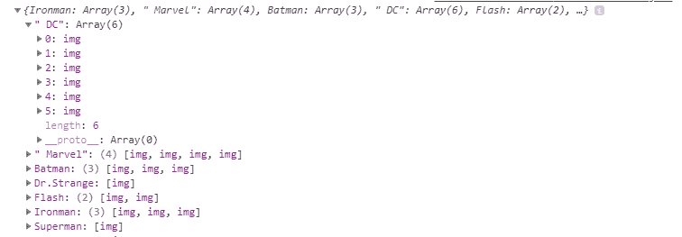
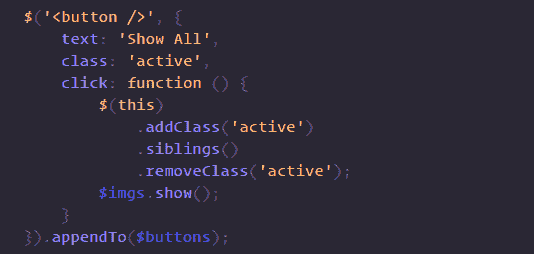
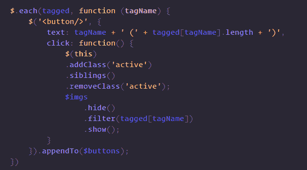

# 所以在学习 javascript 的同时，我使用标签创建了超级英雄图像过滤器。

> 原文：<https://dev.to/raisaugat/so-while-learning-javascript-i-created-superhero-image-filter-using-tags-263m>

这是我们将创造的最终产品。
[https://codepen.io/Raisaugat/embed/eaowpd?height=600&default-tab=result&embed-version=2](https://codepen.io/Raisaugat/embed/eaowpd?height=600&default-tab=result&embed-version=2)

起初 html 的结构会是这样的:

这里的主要技巧是添加这些数据属性。这里，每个 img 标签都有一个带有多个值的 data-tags 属性。

我们 html 部分到此结束。接下来转到 javascript 部分。

## **神奇就发生在这里**

第一件事是创建变量来保存元素。

然后循环遍历每个图像，将相应的标签和 img 元素存储在我们上面创建的 tagged object 变量中。

if 块检查标签，遍历这些标签，并使用标签名称的关键字和相关 img 元素的值创建一个对象。

每个 img 对应 html 上的 img 标签。

### 按钮

下一步是创建按钮。首先，我们将创建“显示所有”按钮

此按钮的主要功能是仅显示所有图像，将活动类别添加到当前类别，并删除所有其他按钮中的活动类别。即兄弟姐妹()。最后，按钮被追加到我们前面创建的 buttons 变量中。

还有一个按钮。

这将是过滤图像所需的最后一个函数。

这个函数将生成一个按钮，其中包含一些相关的图像，并在单击时过滤图像。它遍历标记的变量。标记名是每个标记的名称。因此，按钮文本将是标签的名称。

在 click 事件中，首先所有的图像将被隐藏，然后使用 jQuery 中的 filter()函数进行过滤，在我们的例子中，该函数接受参数 **tagged[tagName]** ，最后显示这些图像。
每个按钮被追加到 buttons 变量中。

最后，整个函数被包装在立即调用的函数表达式(IIFE)中。

建造它的原因是为了了解它的工作机制。这是我的第一个教程博客。希望这有所帮助。
Kudos:)