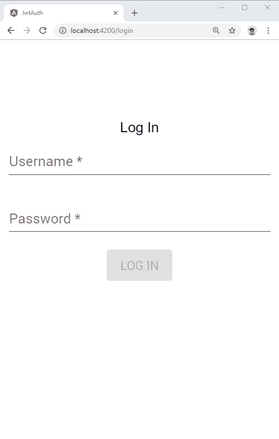

# 角度 JWT 授权

> 原文：<https://dev.to/angular/angular-jwt-authorization-38am>

*本文最初发布于[角形学院](https://angular-academy.com/angular-jwt/)。*

保护单页面应用程序是其实现的一个非常重要的部分，但有时它会带来许多混乱，尤其是当有许多方法可以实现它的时候。在本文中，我将重点介绍利用 JSON Web 令牌(JWT)作为传递用户权限的机制的方法。此外，我将介绍基于 JWT 的安全的好处和潜在的陷阱。

在本文中，您将了解到:

*   如何使用路由器防护装置限制对 Angular 应用程序给定部分的访问
*   如何拦截 HTTP 调用，根据服务器的要求添加访问令牌
*   为什么我们需要刷新令牌，以及如何对用户透明地使用它

## 应用程序设置

让我们考虑一个常见的用例，其中应用程序中的一些页面(路径)只允许授权用户访问。在成功的*认证*之后，例如通过登录表单，用户被授权访问系统的某些受限部分(例如管理页面)。

> **认证**就是证明自己身份的过程。如果我们讨论登录表单，我们假设如果一个人拥有与给定用户名相关联的密码，那么这个人一定就是这个用户名所属的人。
> 
> **授权**在成功认证后发生，并确定给定用户是否被授权访问给定资源(例如 SPA 中的子页)。

为了简单起见，让我们假设我们有一个应用程序，它有一个登录页面，在`/login` route 下可用，还有一个显示服务器生成的随机数的页面，在`/secret-random-number`下可用。随机数页面应该只对授权用户可用。如果我们手动尝试访问`/secret-random-number`，我们应该被重定向回登录页面。

[](https://res.cloudinary.com/practicaldev/image/fetch/s--61dPT-ZD--/c_limit%2Cf_auto%2Cfl_progressive%2Cq_66%2Cw_880/https://thepracticaldev.s3.amazonaws.com/i/s6usixvuld7rxbf9sojz.gif)

## 路由器防护

为了达到限制访问`/secret-random-number`并重定向回登录页面的目的，万一用户没有登录，我们可以利用 Angular 的内置机制`Router Guards`。这些保护允许我们在角度应用中实施管理可能的路线转换的策略。想象一下，当用户试图打开一个他无权访问的页面时。在这种情况下，应用程序不应该允许这种路由转换。为了达到这个目的我们可以利用`CanActivate`卫队。由于`Router Guards`只是简单的类提供者，我们需要实现一个合适的接口。让我们看看下面呈现`AuthGuard`的代码片段。

```
@Injectable({
  providedIn: 'root'
})
export class AuthGuard implements CanActivate {

  constructor(private authService: AuthService, private router: Router) { }

  canActivate() {
    if (this.authService.isLoggedIn()) {
      this.router.navigate(['/secret-random-number']);
    }
    return !this.authService.isLoggedIn();
  }
} 
```

<svg width="20px" height="20px" viewBox="0 0 24 24" class="highlight-action crayons-icon highlight-action--fullscreen-on"><title>Enter fullscreen mode</title></svg> <svg width="20px" height="20px" viewBox="0 0 24 24" class="highlight-action crayons-icon highlight-action--fullscreen-off"><title>Exit fullscreen mode</title></svg>

`AuthGuard`实现`canActivate()`,它告诉 Angular router 它是否能激活特定的路由。要将给定的 guard 附加到它应该保护的路由上，我们只需要将它的引用放在该路由的`canActivate`属性中，如下所示。在我们的案例中，我们希望保护`/login`路线。我们希望允许用户打开这个路由，只要他们没有登录。否则，我们重定向到`/secret-random-number`。相同的方法适用于保护其他路由，对给定的路由实施不同的策略。此外，我们可以注意到下面的 routes 配置中的`canLoad`属性。这种保护使我们能够防止从服务器获取一个延迟加载的路由。通常，`canLoad`守卫执行与`canActivate`守卫相同的策略。

```
const routes: Routes = [
  { path: '', pathMatch: 'full', redirectTo: '/login' },
  {
    path: 'login',
    component: LoginComponent,
    canActivate: [AuthGuard]
  },
  {
    path: 'secret-random-number',
    loadChildren: './random/random.module#RandomModule',
    canActivate: [RandomGuard],
    canLoad: [RandomGuard]
  }
];

@NgModule({
  imports: [
    RouterModule.forRoot(routes)
  ],
  exports: [RouterModule],
  declarations: []
})
export class AppRoutingModule { } 
```

<svg width="20px" height="20px" viewBox="0 0 24 24" class="highlight-action crayons-icon highlight-action--fullscreen-on"><title>Enter fullscreen mode</title></svg> <svg width="20px" height="20px" viewBox="0 0 24 24" class="highlight-action crayons-icon highlight-action--fullscreen-off"><title>Exit fullscreen mode</title></svg>

## JSON Web 令牌

我们已经在应用程序中保护了路线。下一步是考虑应用程序发送给服务器的 HTTP 请求。如果我们只是阻止用户在我们的应用程序中执行被禁止的操作，我们仍然容易受到未经授权的 HTTP 调用，这些调用可能被用户执行，例如使用任何其他 HTTP 客户端。因此，保护 web 应用程序更重要的是确保不允许未经授权的服务器请求。为了使服务器能够识别请求是否来自授权用户，我们可以附加一个额外的 HTTP 头来表明这一事实。这就是 JSON Web 令牌(JWT)发挥作用的地方。

支持 JWT 的一般思想是在各方之间安全地传输信息。在我们的例子中，它是用户的身份及其权利，在客户机(浏览器)和服务器之间传输。当用户登录时，向服务器发送登录查询，他接收回一个由服务器用[私钥](https://en.wikipedia.org/wiki/Public-key_cryptography)签名的 JWT(又名访问令牌)。这个私钥应该只有服务器知道**，因为它允许服务器稍后验证令牌是合法的。当 JWT 在浏览器和服务器之间传输时，它是用 [Base64 算法](https://en.wikipedia.org/wiki/Base64)编码的，这使得它看起来像一串随机的字符(没有什么比这更不真实了！).如果你拿一个 JWT 并用 Base64 解码，你会发现一个 JSON 对象。下面您可以从我们的示例应用程序中找到 JWT 的解码内容。在 jwt.io 上，你可以在线玩 jwt。**

每个 JWT 由 3 块组成:**报头**、**有效载荷**和**签名**。**头**定义了令牌的类型和使用的算法。**有效载荷**是我们放置想要安全传输的数据的地方。在这种情况下，我们有一个用户名、角色、发布时间戳(iat)和到期时间戳(exp)。最后一个块(HMACSHA256 函数)是用 [HMAC](https://en.wikipedia.org/wiki/HMAC) 和 [SHA-256](https://en.wikipedia.org/wiki/SHA-256) 算法生成的**签名**。**签名**不仅保证令牌是由已知方创建的，还保证令牌的*完整性*。

> **完整性**是数据在其生命周期内的准确性和一致性的保证。在 JWT 令牌的情况下，这意味着它在传输过程中没有被改变。

```
{  "alg":"HS256",  "typ":"JWT"  }  {  "username":  "user",  "role":  "admin",  "iat":  1556172533,  "exp":  1556173133  }  HMACSHA256(  base64UrlEncode(header)  +  "."  +  base64UrlEncode(payload),  SECRET!  ) 
```

<svg width="20px" height="20px" viewBox="0 0 24 24" class="highlight-action crayons-icon highlight-action--fullscreen-on"><title>Enter fullscreen mode</title></svg> <svg width="20px" height="20px" viewBox="0 0 24 24" class="highlight-action crayons-icon highlight-action--fullscreen-off"><title>Exit fullscreen mode</title></svg>

当用户成功登录到应用程序并收到一个访问令牌时，它必须以某种方式被应用程序持久化。例如，我们可以使用浏览器的本地存储来保存该令牌。这很方便，也很容易实现，但是容易受到 [XSS 攻击](https://en.wikipedia.org/wiki/Cross-site_scripting)。另一种方法是使用 [HttpOnly Cookie](https://en.wikipedia.org/wiki/HTTP_cookie#Http-only_cookie) ，这被认为比本地存储更安全。一旦 JWT 持久化，我们将把它附加到 HTTP 头中的传出请求。在我们深入这方面之前，让我们先看看 JWT 的另一个重要特征。

在这一点上，有必要仔细看看 JWT 的*自足的*本质。当服务器收到带有 JWT 访问令牌的 HTTP 请求时，它**不需要**向任何持久层(例如数据库)请求用户权限验证。那些权利是**内**的令牌。由于我们保证了访问令牌的真实性和完整性，我们可以信任其中的信息。这是 JWT 的一个非常有趣的特性，因为它为系统更高的可伸缩性打开了大门。另一种情况是需要在后端保存一些会话 id，并在每次需要对请求进行授权时请求它。有了*独立的*访问令牌，我们就不需要*在服务器集群之间复制*令牌或者实现 [*粘性会话*](https://en.wikipedia.org/wiki/Load_balancing_%28computing%29#Persistence) 。

## Http 拦截器

一旦我们在用户登录到应用程序后保存了访问令牌(JWT ),我们就想用它来授权传出的请求。一种方法是简单地更新每个与 API 通信的服务，用额外的 HTTP 头来丰富请求。与使用 HTTP 拦截器的方法相比，这将导致大量重复的代码。HTTP 拦截器的目标是将一些处理逻辑应用于应用程序中的每个传出请求。

创建 HTTP 拦截器与创建路由器防护非常相似。我们需要有一个类，它用所需的方法实现一个特定的接口。这种情况下，用`intercept`方法就是`HttpInterceptor`。看看下面的代码片段，它是我们示例应用程序中的拦截器。首先，我们要检查令牌是否可用于`this.authService.getJwtToken()`。如果我们有一个令牌，我们设置一个适当的 HTTP 头。这段代码还包含错误处理逻辑，这将在本文后面描述。

```
@Injectable()
export class TokenInterceptor implements HttpInterceptor {

  constructor(public authService: AuthService) { }

  intercept(request: HttpRequest<any>, next: HttpHandler): Observable<HttpEvent<any>> {

    if (this.authService.getJwtToken()) {
      request = this.addToken(request, this.authService.getJwtToken());
    }

    return next.handle(request).pipe(catchError(error => {
      if (error instanceof HttpErrorResponse && error.status === 401) {
        return this.handle401Error(request, next);
      } else {
        return throwError(error);
      }
    }));
  }

  private addToken(request: HttpRequest<any>, token: string) {
    return request.clone({
      setHeaders: {
        'Authorization': `Bearer ${token}`
      }
    });
  }
} 
```

<svg width="20px" height="20px" viewBox="0 0 24 24" class="highlight-action crayons-icon highlight-action--fullscreen-on"><title>Enter fullscreen mode</title></svg> <svg width="20px" height="20px" viewBox="0 0 24 24" class="highlight-action crayons-icon highlight-action--fullscreen-off"><title>Exit fullscreen mode</title></svg>

实现了我们的拦截器之后，有必要在 Angular 模块中用`HTTP_INTERCEPTORS`令牌将其注册为提供者。

```
import { HttpClientModule, HTTP_INTERCEPTORS } from '@angular/common/http';

@NgModule({
  // declarations...
  providers: [
    {
      provide: HTTP_INTERCEPTORS,
      useClass: TokenInterceptor,
      multi: true
    }
  ]
  // imports...
})
export class AuthModule { } 
```

<svg width="20px" height="20px" viewBox="0 0 24 24" class="highlight-action crayons-icon highlight-action--fullscreen-on"><title>Enter fullscreen mode</title></svg> <svg width="20px" height="20px" viewBox="0 0 24 24" class="highlight-action crayons-icon highlight-action--fullscreen-off"><title>Exit fullscreen mode</title></svg>

## 刷新令牌

考虑到 JWT 是独立的，我们还需要考虑一件事——没有办法使它无效！如果除了我们之外的其他人得到了令牌，我们对此无能为力。这就是为什么总是给予令牌较短的有效期是一个好主意。令牌应该存在多长时间没有严格的规则，这取决于系统要求。一个好的起点可能是拥有一个仅在 15 分钟内有效的令牌。超过这个时间后，服务器将认为这个令牌无效，并且不会授权使用它的请求。

所以另一个挑战来了——我们不想强迫用户每 15 分钟登录一次应用程序。这个问题的解决方案是一个`Refresh Token`。这种令牌位于服务器端的某个地方(数据库、内存缓存等)，并且与特定用户的会话相关联。重要的是要注意，这个令牌不同于 JWT 在许多方面。首先，它不是*独立的*——它可以像唯一的随机字符串一样简单。其次，我们需要存储它，以便能够验证用户的会话是否仍然有效。这使我们能够通过简单地删除相关联的一对`[user, refresh_token]`来使会话无效。当存在具有已经变得无效的访问令牌的传入请求时，应用可以发送刷新令牌来获得新的访问令牌。如果用户的会话仍然有效，服务器将使用新的有效 JWT 进行响应。在我们的例子中，我们将为用户透明地发送刷新令牌，这样他就不会知道刷新过程。

让我们回到我们的拦截者。如果您还记得前面的代码片段，在 HTTP 401 错误(未授权)的情况下，我们有一个特殊的方法`handle401Error`来处理这种情况。这里出现了一个棘手的部分——我们希望对所有 HTTP 请求进行排队，以防刷新。这意味着，如果服务器响应 401 错误，我们希望开始刷新，阻止刷新期间可能发生的所有请求，并在刷新完成后释放它们。为了能够在刷新期间阻塞和释放请求，我们将使用`BehaviorSubject`作为**信号量**。

首先，我们检查刷新是否已经开始，并将`isRefreshing`变量设置为 true，并将 null 填充到`refreshTokenSubject`行为主题中。稍后，实际的刷新请求开始。如果成功，`isRefreshing`被设置为假，收到的 JWT 令牌被放入`refreshTokenSubject`。最后，我们用`addToken`方法调用`next.handle`来告诉拦截器我们已经处理完这个请求了。如果刷新已经发生(if 语句的 else 部分)，我们希望等到`refreshTokenSubject`包含除 null 之外的值。用`filter(token => token != null)`会使这一招！一旦有了除 null 之外的值(我们希望里面有新的 JWT ),我们就调用`take(1)`来完成这个流。最后，我们可以用`next.handle`告诉拦截器完成处理这个请求。

```
private isRefreshing = false;
private refreshTokenSubject: BehaviorSubject<any> = new BehaviorSubject<any>(null);

private handle401Error(request: HttpRequest<any>, next: HttpHandler) {
  if (!this.isRefreshing) {
    this.isRefreshing = true;
    this.refreshTokenSubject.next(null);

    return this.authService.refreshToken().pipe(
      switchMap((token: any) => {
        this.isRefreshing = false;
        this.refreshTokenSubject.next(token.jwt);
        return next.handle(this.addToken(request, token.jwt));
      }));

  } else {
    return this.refreshTokenSubject.pipe(
      filter(token => token != null),
      take(1),
      switchMap(jwt => {
        return next.handle(this.addToken(request, jwt));
      }));
  }
} 
```

<svg width="20px" height="20px" viewBox="0 0 24 24" class="highlight-action crayons-icon highlight-action--fullscreen-on"><title>Enter fullscreen mode</title></svg> <svg width="20px" height="20px" viewBox="0 0 24 24" class="highlight-action crayons-icon highlight-action--fullscreen-off"><title>Exit fullscreen mode</title></svg>

如您所见，访问令牌和刷新令牌的组合是可伸缩性和安全性之间的折衷。限制访问令牌的有效时间降低了不受欢迎的人使用它的风险，但是使用刷新令牌需要服务器上的*状态*。

## 认证服务

我们的解决方案最后缺少的部分是`AuthService`。这将是我们实现所有处理登录和注销的逻辑的地方。下面你可以找到该服务的来源，我们将一步一步地分析它。

先说`login`法。这里我们使用`HttpClient`来执行对服务器的 post 调用，并使用`pipe()`方法应用一些操作符。通过使用`tap()`操作符，我们能够执行期望的*副作用*。成功执行 post 方法后，我们应该会收到访问令牌和刷新令牌。我们想要执行的副作用是存储这些调用`doLoginUser`的令牌。在这个例子中，我们使用了本地存储。存储后，流中的值被映射为 true，以便该流的使用者知道操作成功。最后，在出现错误的情况下，我们显示警报并返回 false 的可观察值。

> **副作用**是函数式编程中使用的一个术语。这个概念与*功能纯度*相反，功能纯度是指系统中没有状态变化，功能总是根据其输入返回结果(不管系统状态如何)。如果有状态变化(例如变量变化)，我们称之为**副作用**。

除了在请求体内部发送`refreshToken`之外，`logout`方法的实现基本上是相同的。服务器将使用它来识别试图注销的用户。然后，服务器将删除这对`[user, refresh_token]`，刷新将不再可能。然而，访问令牌在过期之前仍然有效，但是我们将它从本地存储中删除。

```
@Injectable({
  providedIn: 'root'
})
export class AuthService {

  private readonly JWT_TOKEN = 'JWT_TOKEN';
  private readonly REFRESH_TOKEN = 'REFRESH_TOKEN';
  private loggedUser: string;

  constructor(private http: HttpClient) {}

  login(user: { username: string, password: string }): Observable<boolean> {
    return this.http.post<any>(`${config.apiUrl}/login`, user)
      .pipe(
        tap(tokens => this.doLoginUser(user.username, tokens)),
        mapTo(true),
        catchError(error => {
          alert(error.error);
          return of(false);
        }));
  }

  logout() {
    return this.http.post<any>(`${config.apiUrl}/logout`, {
      'refreshToken': this.getRefreshToken()
    }).pipe(
      tap(() => this.doLogoutUser()),
      mapTo(true),
      catchError(error => {
        alert(error.error);
        return of(false);
      }));
  }

  isLoggedIn() {
    return !!this.getJwtToken();
  }

  refreshToken() {
    return this.http.post<any>(`${config.apiUrl}/refresh`, {
      'refreshToken': this.getRefreshToken()
    }).pipe(tap((tokens: Tokens) => {
      this.storeJwtToken(tokens.jwt);
    }));
  }

  getJwtToken() {
    return localStorage.getItem(this.JWT_TOKEN);
  }

  private doLoginUser(username: string, tokens: Tokens) {
    this.loggedUser = username;
    this.storeTokens(tokens);
  }

  private doLogoutUser() {
    this.loggedUser = null;
    this.removeTokens();
  }

  private getRefreshToken() {
    return localStorage.getItem(this.REFRESH_TOKEN);
  }

  private storeJwtToken(jwt: string) {
    localStorage.setItem(this.JWT_TOKEN, jwt);
  }

  private storeTokens(tokens: Tokens) {
    localStorage.setItem(this.JWT_TOKEN, tokens.jwt);
    localStorage.setItem(this.REFRESH_TOKEN, tokens.refreshToken);
  }

  private removeTokens() {
    localStorage.removeItem(this.JWT_TOKEN);
    localStorage.removeItem(this.REFRESH_TOKEN);
  }
} 
```

<svg width="20px" height="20px" viewBox="0 0 24 24" class="highlight-action crayons-icon highlight-action--fullscreen-on"><title>Enter fullscreen mode</title></svg> <svg width="20px" height="20px" viewBox="0 0 24 24" class="highlight-action crayons-icon highlight-action--fullscreen-off"><title>Exit fullscreen mode</title></svg>

## 总结

我们已经在 Angular 中介绍了在前端设计授权机制的最重要的部分。你可以在 GitHub 库下找到前端和后端的完整源代码:

*   [https://github.com/bartosz-io/jwt-auth-angular](https://github.com/bartosz-io/jwt-auth-angular)
*   [https://github.com/bartosz-io/jwt-auth-node](https://github.com/bartosz-io/jwt-auth-node)

使用 JWT 作为访问令牌有很多好处，而且实现起来相当简单。但是，您应该意识到局限性和可能的 XSS 攻击。最小化风险的方法是使用 HttpOnly Cookies 来存储令牌。

如果你对更多与角度相关的材料感兴趣，别忘了在 Twitter 上关注我，订阅 T2 的电子邮件简讯和 T4 的角度学院 YouTube 频道。