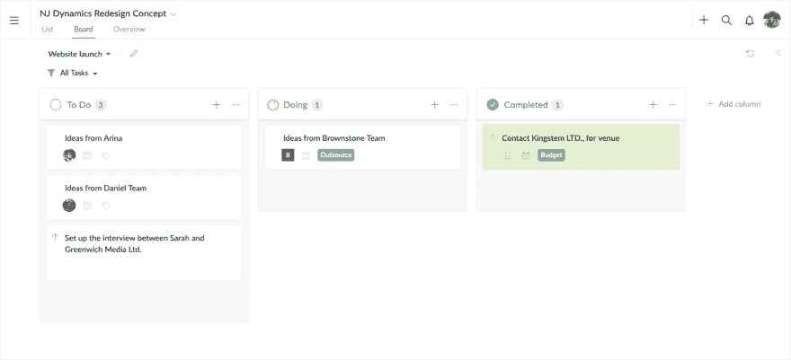

# 3 个行之有效的技巧，告诉你如何用数字待办事项清单进行有效的会议

> 原文：<https://dev.to/juliado75594383/3-proven-tips-on-how-to-run-effective-meetings-with-a-digital-to-do-list-49hk>

你可能要问自己这两个问题:“这周你花了多少时间开会？”以及“你的商务会议有效吗？”如果你认为这些会议很糟糕，是在浪费你的时间，那么，你并不孤单。

根据《哈佛商业评论》上的一项关于量化公司会议实际成本的研究，由于连锁反应，每周一次的会议一年要花费 7000 个小时，一个公司一年仅在会议上就要花费大约 30 万个小时。

时间就是金钱，但是金钱买不回你花费的时间。此外，大量无意义和可怕的会议会在所有员工中留下负面情绪，更不用说会后可能造成不必要的混乱。

是时候停止会议疯狂，从另一个角度寻求改进了:用一个[项目管理软件](https://quire.io/compare/best-project-management-software-reviews-comparisons)或者[待办事项 app](https://quire.io/compare/best-to-do-list-apps) 作为工具来对抗会议，而不是传统的做法。我们为你收集了一些有效开会的技巧。

## 技巧 1:设定明确的目标

一个有效的会议必须服务于一个明确而具体的目标。你不能邀请别人过来，却白白浪费他们的时间。为会议设定一个明确的目标也可以帮助你追踪进展和效率。

《纽约时报》指出“议程为对话提供了一个指南针”，所以如果你不想让与会者不知道刚刚发生了什么就离开会议，最好在发出邀请前清楚地说明会议的目的。

你可以准备一份[待办事项清单](https://quire.io/compare/best-to-do-list-apps)，其中包含你想作为会议议程的每一个主题。尽可能具体，保持一切简单明了。根据你的清单，试着在需要进一步讨论的项目上添加细节或附加附件。

## 技巧 2:坚持时间表，集中注意力

没有什么比参加一个比预期拖得更长的会议更令人讨厌的了，因为所有的事情似乎都无关紧要。考虑到事先准备好的待办事项清单，会议应该根据清单上的每一项任务进行，避免可能破坏议程的即兴讨论。

会议期间做笔记也同样重要。如果任务是时间敏感的，添加[开始日期](https://quire.io/w/Getting_Started_with_Quire/102/Set_start_date_an...)和[截止日期](https://quire.io/w/Getting_Started_with_Quire/29/Set_due_date_and_...)以便跟踪进度和控制将来的截止日期。发挥你的任务列表的创造性，例如，你可以给每个任务添加[标签](https://quire.io/w/Getting_Started_with_Quire/7/Add_edit_or_delet...)以便更好地管理，或者通过[将任务](https://quire.io/w/Getting_Started_with_Quire/3/Assign_a_task_to_...)分配给负责人来直接提示他们。

面对长长的清单，很容易打瞌睡、分心，尤其是在几个小时的会议中。如果你从未听说过[看板](https://quire.io/blog/p/To-Do-List-and-Kanban-What-Project-Management-Did-Wrong.html)，现在是一个了解更多关于这个神奇的板的好机会。看板提供了一个焦点区域，在这里你和你的团队可以在短时间内专注于一些关键任务。

## 提示 3:跟进

不管是虚拟会议还是月度董事会，跟进是跟踪会后情况的关键。为了减少无意义会议的风险，经理们可以随时查看报告，查看项目进展，并在必要时留下评论。

不要等到下一次会议才问进度。经常与团队成员或负责人联系，评估整个项目的进展。沟通是团队协作的关键。有时，提前做好调整和计划对于确保任务顺利进行非常重要。

## 不要把生命浪费在开会的疯狂上。

我们每天至少工作 8 小时，这占了你一天时间的三分之一。不要把你宝贵的时间浪费在只会耗尽你生命的会议上。一份好的待办事项清单可能不足以开一个有效的会议，但是，这是一个好的开始。此外，如果您使用协作或项目管理工具，您甚至可以避免某些类型的会议，这些会议只需要为了跟踪进度而召开。时间就是金钱，不要在无意义的会议上浪费公司的巨大资源。