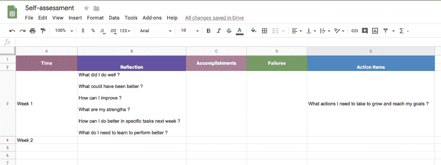

# 喜欢反馈的 3 个步骤

> 原文：<https://dev.to/nazanindelam/3-steps-to-love-feedback-h27>

当被评判时，我们都会感到不舒服，因此，我们不想让自己处于别人评论我们的行为或想法的境地。因此，我们最终很少遇到任何接收反馈的时刻。但如今，360 度年度评估在科技公司越来越普遍，如果你在一家以反馈为导向的公司工作，或者只是一年一次的 360 度评估，你需要对听到别人评价你感到舒服。

听到反馈的不安和恐惧让我们一整年都把年度回顾放在壁橱里，并在截止日期前 3 天开始做。尽可能快地整理出一些东西，一个月后，当我们在审查系统中看到每个人的反馈时，我们开始感到恶心、沮丧、沮丧，然后我们想，让我们忘记它吧，谁在乎呢？！这是非常不幸的，因为我们真的需要关注我们收到的对我们职业发展的反馈，即使这很伤人。

## 反馈的黑暗角落

害怕未知的事物是人类的天性。我们都害怕我们很少置身其中的情况。这和反馈是一样的。我们试图避免反馈，我们害怕是因为我们很少向直接共事的人寻求坦诚的反馈。我们只是不想听到我们的不完美。

随后，这种恐惧和回避会表现为职业破坏性行为，如拖延、嫉妒、否认和许多其他行为，这将降低公司整体文化的健康程度。让我们向你介绍一下我在科技职业生涯中学到的技巧，这些技巧不仅欢迎反馈，还能被反馈所驱动。

## #1 -从内部反馈开始

被自己评判比被别人评判更容易。自我评估可以极大地帮助我们变得熟悉而没有缺点。虽然自我评估在开始时看起来很难。坚持不懈，至少每月评估一次你的工作表现，最好每周评估一次。

从你的表现开始提问，试着找出你的强项和有待改进的地方。对自己诚实、坦率，没有人会听到或看到你。所以不要只是为了取悦自己而不去面对现实。然后记下你的成就和巨大的失败，我称之为伟大是因为你有很好的机会去反思和学习。完成评估后，现在是“行动项目”的时候了。如果没有后续的改进措施，评估就没有任何价值。请记住，我们的目标是让你通过内部反馈获得成长，并实现你的目标。

这是我制作的一份自我评估表样本，可以帮助你快速开始自我评估。

## #2 —建立反馈回路

当你对自己的批判性评价感到满意时，现在是时候拓宽你的反馈回路了。我建议你从那些你感到舒适和情绪安全的人开始，比如你的伴侣或朋友。与他们一起创建反馈会议，并向他们提问。让他们来评判你。在这些对话中做一个倾听者是很重要的。试着记下他们的要点，以便日后思考。

## #3 —拓宽您的反馈回路

最后，开始把你的同事加入到循环中来。从非正式的问题开始，比如:我的项目报告怎么样？我是如何领导这个项目的？这段代码怎么样？我能写得更好吗？请记住，当反馈之后是行动项目时，它是有价值和有效的。记下他们的观点。敞开心扉，试着倾听而不是辩解。

## #4 —与您的经理安排定期反馈会议

经过所有这些步骤，在几个月内，你应该是一个专业的反馈接收。然后，是时候变得更加严肃，与你的经理安排定期反馈会议了。你也可以利用一些常规的一对一会议来讨论反馈。以下是一个会议安排示例:

*   回顾你的自我评估:我建议提前与你的经理分享你的自我评估结果，以便在会议前进行回顾。
*   寻求反馈:为你的经理准备问题。问你做得怎么样？明确任务和项目。以下是一些你可以问经理的问题示例:
    *   这两个月我是怎么过的？
    *   我擅长的领域是什么？
    *   我需要改进哪些方面？
    *   我的行为符合文化吗？
    *   我如何才能在目前的工作中脱颖而出？
    *   我的沟通技巧如何？我表达清楚了吗？
    *   我如何在团队中运作？
*   设定行动项目和目标:根据你从经理那里得到的反馈设定行动项目和目标。

希望这篇文章是有帮助的。在下面给我你的反馈和建议，记住:
<small>反馈是冠军的早餐。——肯尼斯·布朗查德</small>