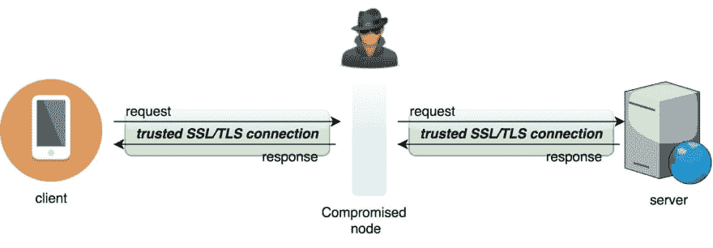

# 如何在 Android 上实现证书锁定的 3 种方法

> 原文：<https://dev.to/netguru/3-ways-how-to-implement-certificate-pinning-on-android-3pk3>

移动开发中最重要的事情之一是安全通信，尤其是在应用程序和它的后端服务器之间。目前，web 服务最常见的架构是基于 HTTP 的 [REST](https://www.w3.org/2001/sw/wiki/REST) 。这种通信模式的最佳保护方法是 [TLS/SSL](https://tools.ietf.org/html/rfc5246) 标准。它可以与 HTTP 协议结合，创建一个名为 [HTTPs](https://tools.ietf.org/html/rfc2818) 的加密变体。HTTPs 确保客户端应用程序和后端服务器之间的安全、加密的通信通道。而且，在 Android 上实现这个安全特性非常简单。你只需要注意一些常见的陷阱。

## 问题

对于开发人员来说，通过 HTTPs 实现通信是非常常见的，但不是以正确的方式。这种不当的实现简化为将 URL 中的协议名称从 *http* 替换为 *https* ，例如【https://www.example.com】T5*T7】。事实上，这样的实现将支持 TLS/SSL 加密(如果后端服务器支持的话)。但是，它不能确保足够好的安全级别。TLS 标准基于 [X509 证书](https://tools.ietf.org/html/rfc5280)和不对称加密。简单地替换协议名称将启用加密，但应用程序将信任服务器颁发的每一个证书。这意味着攻击者可以生成他们自己的假证书。这些证书将允许黑客拦截加密的通信。这种攻击叫做 [**中间人**](https://ieeexplore.ieee.org/document/4768661/?part=1) 。这是您应该多花一点时间和精力来正确实现 HTTPs 配置的主要原因。*

[](https://res.cloudinary.com/practicaldev/image/fetch/s--fmK2HcWi--/c_limit%2Cf_auto%2Cfl_progressive%2Cq_auto%2Cw_880/https://www.netguru.com/hubfs/mitm_diagram.png)

## 解

为了避免这种漏洞，开发者应该实现 [**证书锁定**](https://www.owasp.org/index.php/Certificate_and_Public_Key_Pinning) 。这是一种依赖于客户端服务器证书验证的方法。这种验证要求移动应用预先知道服务器证书或其指纹。当与服务器建立连接时，应用程序应该将指纹与远程服务器的证书进行比较。如果指纹相同，则连接有效，数据传输可以继续。如果指纹不相同，那么应用程序应该立即拒绝连接，因为它已经妥协了。以下 3 种方法是在 Android 应用程序中实现证书锁定的最常用方法。

## 老派的方式——信托经理

[**TrustManager**](https://developer.android.com/reference/javax/net/ssl/TrustManager) 是负责决定 app 是否应该接受对等体提交的凭证的组件。这个机制来自于 [*javax.net.ssl* 包](https://docs.oracle.com/javase/7/docs/api/javax/net/ssl/package-summary.html)，你可以用它来实现 Android 应用中的证书锁定。请继续阅读如何使用该组件实现锁定的分步教程。

1.  将您的证书文件添加到下的应用程序资源中

    /res/raw

2.  从资源中加载带有证书文件的 KeyStore(作为 InputStream)。

    ```
    val resourceStream = resources.openRawResource(R.raw.demo_cert)
    val keyStoreType = KeyStore.getDefaultType()
    val keyStore = KeyStore.getInstance(keyStoreType)

    keyStore.load(resourceStream, null) 
    ```

    我的锅

3.  获取 TrustManagerFactory 并用 KeyStore 初始化它。

    ```
    val trustManagerAlgorithm = TrustManagerFactory.getDefaultAlgorithm()
    val trustManagerFactory = TrustManagerFactory.getInstance(trustManagerAlgorithm)

    trustManagerFactory.init(keyStore) 
    ```

    我的锅

4.  获取 SSLContext 的一个实例，将其与 TrustManager 绑定，并创建一个带有 URL 连接的 sslContext。

    ```
    val sslContext = SSLContext.getInstance("TLS")
    sslContext.init(null, trustManagerFactory.trustManagers, null)
    val url = URL("http://www.example.com/")
    val urlConnection = url.openConnection() as HttpsURLConnection
    urlConnection.sslSocketFactory = sslContext.socketFactory 
    ```

    我的锅

如您所见，上面提出的解决方案相当复杂。它还需要处理与框架 API 直接相关的多个元素。这意味着实现是在相当低的级别上进行的。这可能会导致一些错误，但请保持冷静——有一种更简单的方法来处理证书锁定。

## OkHttp 和 CertificatePinner

Square 的 OkHttp 是一个非常流行的 Java 和 Android 的 Http 客户端库。该库由 Android 中最流行的处理 REST 通信的工具之一使用- [改型](http://square.github.io/retrofit/)。OkHttp 提供了一种机制，使得实现证书锁定变得容易，因为它只需要使用专用的构建器及其相应的指纹来创建一个**Certificate inner**的实例。当然，指纹需要硬编码到应用程序中。就个人而言，我更喜欢在构建过程中注入这样的键，使用 buildConfigField 方法。这比将密钥保存在存储库中更灵活、更安全。然后，您需要用*certificate inner*构建一个 OkHttpClient 实例。下面是怎么做的:

```
val certificatePinner = CertificatePinner.Builder()
       .add(
               "www.example.com",
               "sha256/ZC3lTYTDBJQVf1P2V7+fibTqbIsWNR/X7CWNVW+CEEA="
       ).build()

val okHttpClient = OkHttpClient.Builder()
       .certificatePinner(certificatePinner)
       .build() 
```

我的锅

您可以为不同的域添加多个指纹。多个指纹也会让你的应用更加灵活。您可以添加认证路径中的所有指纹。如果旧证书即将过期，您也可以添加额外的证书。指纹可以直接从证书中检索。您还可以将证书文件导入到 resources 文件夹中，就像在 *TrustManager* 案例中一样。这一次您需要手动编写一个从文件中提取指纹的类。您也可以使用[对等证书提取器](https://github.com/fabiomsr/okhttp-peer-certificate-extractor)来帮您完成这项工作。

## 新鲜事-网络安全配置

Android 平台提供了一个新的、简单的工具来处理网络配置- **[网络安全配置](https://developer.android.com/training/articles/security-config)** (NSC)。从 Android 7.0 开始就有了。通过 NSC，您可以使用 *XML* 文件声明通信方法，包括证书锁定。要启用配置，您需要将配置文件与清单*绑定。要绑定它，使用应用程序标签中的 *networkSecurityConfig* 属性。下面是展示如何处理它的一小段代码:*

1.  在下创建网络安全配置文件

    *RES/XML/network _ security _ config . XML*

2.  将*Android:network security config*属性添加到应用程序标签中。

    ```
    <?xml version="1.0" encoding="utf-8"?>
    <manifest
       xmlns:android="http://schemas.android.com/apk/res/android"
       package="co.netguru.demoapp">
       <application
           android:networkSecurityConfig="@xml/network_security_config">
           ...
       </application>
    </manifest 
    ```

    可扩展标记语言

3.  设置配置文件并添加指纹。

    ```
    <?xml version="1.0" encoding="utf-8"?>
    <network-security-config>
       <domain-config>
           <domain includeSubdomains="true">example.com</domain>
           <pin-set>
               <pin digest="SHA-256">ZC3lTYTDBJQVf1P2V7+fibTqbIsWNR/X7CWNVW+CEEA=</pin>
               <pin digest="SHA-256">GUAL5bejH7czkXcAeJ0vCiRxwMnVBsDlBMBsFtfLF8A=</pin>
           </pin-set>
       </domain-config>
    </network-security-config> 
    ```

    可扩展标记语言

如您所见，这种方法非常容易实现。但是，请记住，它只适用于 API 级别 24 或更高的应用程序。对于较低的级别，您可以使用 NSC 的[后端口版本。](https://github.com/commonsguy/cwac-netsecurity)

## 总结

我介绍了三种实现证书锁定的方法。个人认为最灵活的选择是使用**certificate inner**。这种方法既简短又通用——它开箱即可在所有 Android API 级别上工作。您必须使用 OkHttp 作为 Http 客户端，但是这个库非常容易使用，并且在这一点上几乎是 Android 上的一个标准，所以无论如何还是推荐它。

然而，您将使用哪种实现方法并不重要，但请始终记住，证书锁定是**必须做的**。这是提供真正安全网络的唯一方法，这也是为什么 [**OWASP Mobile**](https://www.owasp.org/index.php/OWASP_Mobile_Security_Project) 推荐证书锁定作为 MiTM 攻击最有效的保护方法。