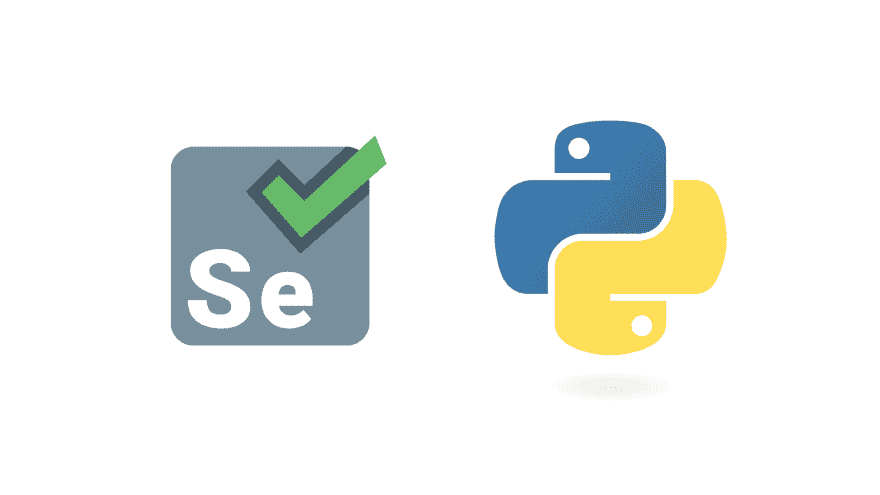

# 自动化工作流程的 4 个基本 Python 技巧

> 原文：<https://dev.to/seattledataguy/4-basic-python-tips-to-automate-your-workflow-3l8l>

自动化。它应该让工作更容易。那么，为什么不帮助它呢？

说实话，即使是简单任务的自动化也需要时间和大量的依赖管理，这会变得非常复杂。尽管如此，将一些简单的任务自动化还是非常有益的。即使更多的是为了好玩。

对于那些已经是 Python 爱好者的人来说，你知道 Python 对于与任何东西进行交互是多么友好。

从发送 HTTP 请求、与 API 交互，到加载和管理数据库。

Python 是自动化的绝佳选择。

这里有五个简单的事情，你可以自动化，可以帮助你的各种工作流程和项目。

### 1。自动移动鼠标，让您的 Skype/Lynk 显示您在工作中的活跃状态

[](https://res.cloudinary.com/practicaldev/image/fetch/s--J9m8rrDy--/c_limit%2Cf_auto%2Cfl_progressive%2Cq_auto%2Cw_880/https://thepracticaldev.s3.amazonaws.com/i/y727u7q8vuqm29zkt3q4.png)

想象一下，在过去的十分钟里，你一直在浏览你最喜欢的社交媒体应用的新闻提要。突然，您的 Lynk 活动符号变成黄色。您不活跃，不在会议中。

你爱管闲事的老板走过来拍了拍你的肩膀。

惊讶之余，你抬头看到他正怒视着你。他有一个坏习惯，就是对你的每一秒钟都进行微观管理。

“嘿，呃，我想让你放松，除了那个模块进展如何，”他问道。你咬紧牙关，礼貌地回答。

“酷，好吧，我只是想确定你正在集中注意力。我们的副总裁贾尼斯非常希望我们能在最后期限前完成任务。”
交互结束。

要是林克没那样叫你就好了。

等等，你可以绕过这个。在谷歌搜索了一会儿之后，你找到了一个移动鼠标的脚本，并开始编写一个每隔几分钟运行一次的任务，以确保你的鼠标在移动。

就 Skype 或 Lynk 而言，鼠标和键盘的这些移动有助于让你看起来像是在积极工作。

自动化运动使用 Python 的 PyAutoGUI 模块。要安装 PyAutoGUI 模块，请运行以下命令:

`pip install pyautogui`

Python 使用屏幕的坐标系来控制和跟踪鼠标。例如，如果您使用 1920x1080 的屏幕分辨率，屏幕的坐标系将如下所示:

PyAutoGUI 模块下有以下函数:
size():size()函数让你知道你的屏幕分辨率。

```
import pyautogui
print(pyautogui.size()) 
```

运行此文件(另存为。py 扩展名)，Python 代码使用 size()函数给出屏幕分辨率的 x，y 格式作为输出:

moveTo():PyAutoGUI 模块中的 move to()函数移动鼠标。下面的代码使用函数，该函数接受 x 和 y 的坐标，以及一个可选的持续时间参数。该函数使用一个指定的持续时间参数将鼠标指针从当前位置移动到 x 和 y 坐标

```
import pyautogui
print(pyautogui.size())
pyautogui.moveTo(150,100, duration = 2) 
```

运行这个 Python 脚本会神奇地将鼠标指针从当前位置移动到坐标(150，100)，完成这个过程需要 2 秒钟。

除了这些基本功能之外，您还可以对单击和键入字符串使用函数，如 click 和 type。所有这些都有助于确保你的老板不会很快发现你偷懒。

### 2。使用 Selenium 自动化网站登录过程

[](https://res.cloudinary.com/practicaldev/image/fetch/s--EKonJaH2--/c_limit%2Cf_auto%2Cfl_progressive%2Cq_auto%2Cw_880/https://thepracticaldev.s3.amazonaws.com/i/c78hmit2idh06ldelyx6.png)

许多网站不赞成使用自动爬虫和程序登录他们的网站。但是，这仍然是一项很好的技能。

Selenium 是一个有用的库，可以被多种语言使用，可以帮助自动化 UI QA，甚至可以通过登录来抓取网站。虽然学习硒需要一些时间，但要从小处着手。搭建一个可以登录自己喜欢的网站的工具就可以了。

首先，你必须安装 Chrome 驱动程序和用于 Python 的 Selenium 库。使用下面的命令添加 Selenium 库。:

`pip install Selenium`

首先，我们需要从 Python 的 Selenium 库中导入一些选定的模块。添加下面的命令:

```
From selenium import webdriver
driver = webdriver.Chrome() 
```

现在，为了自动化登录过程，我们从一个简单的任务开始，比如网站的登录表单。任务需要:

*   导航到网站。
*   查找登录字段(通常是用户名和密码)。
*   填写您的登录信息。
*   提交登录详细信息，让您自动通过登录屏幕。

提示:您可以决定定义一个“方法”(用于频繁登录)，以便在其他测试中重用。

代码行将类似于:

```
From selenium import webdriver
driver = webdriver.Chrome()
def login(url,username,password,submit_button):
   driver.get(url)
   driver.find_element_by_id(username).send_keys("username")
   driver.find_element_by_id(password).send_keys("password")
   driver.find_element_by_id(password).(submit_button).click() 
```

您会注意到，您需要获得想要与之交互的元素。这可以说是创建 web 抓取器或登录网站的自动化脚本最困难的部分之一。有几种方法可以检测 web 应用程序的元素来找到登录字段。

查找元素的常见方法包括 ID(如上例)、CSS 选择器、名称和 XPaths。

在 Selenium 的官方文档中可以找到为登录过程定位元素的另一种方法。一些网站包含更多动态内容(比如几个 JavaScript！).

总的来说，看着 Selenium 自动点击按钮并登录你最喜欢的网站是令人着迷的。没有你的参与，事情就开始运转。

几乎像魔术一样！

### 3。自动文件备份

如果您执行定期备份，创建自动备份文件会非常有用。

您可能熟悉 ZIP 文件(带有。zip 扩展名)。ZIP 文件可以包含几个带有压缩内容的文件。此外，由于 ZIP 文件还可以包含许多文件夹和子文件夹，因此通过将它们打包成一个文件来备份文件是一种便捷的方式。

可以使用 ZIP file 模块中的 Python 函数自动创建一个单独的 ZIP 文件，称为归档文件。

您还可以使用 Python 打开(或提取)ZIP 文件。脚本分享如下。

这个脚本摘自《用 Python 自动化枯燥的东西》一书(如果你想要更多的想法)。

```
import zipfile, os
def backup(folder)
    folder = os.path.abspath(folder)
    offset=1
    while True:
        zip_name=os.path.basename(folder)+'_'+str(offset)+'.zip'
        if not os.path.exists(zip_name):
            break
        offset+=1
        print("Successfully created file " %s" %(zip_name))
        backupzip=zipfile.ZipFile(zip_name,'w')
        for foldername,subfolders,filenames in os.walk(folder):
            backupzip.write(foldername)
        backupzip.close()
        print("done") 
```

### 4。自动将 YouTube 视频发布到 Reddit 线程

我们最近看到的另一个一次性想法是，使用一个脚本向 Reddit 发布多个视频，这是一种有趣的自动化任务的方式。

在 Reddit 线程中发布 YouTube 视频也可以实现自动化。使用 PRAW，一个让你抓取数据的 Python 包装器，可以为你的 Reddit 体验提供更多。

首先，使用 pip 安装 PRAW。

下面的脚本自动将 YouTube 视频发布到 Reddit 线程。

```
import praw
video_url=str(input("Your video url:"))
post_msg = str(input("Your post message"))
reddit=praw.Reddit(client_id="***************",
      client_secret="************",
      user_agent="**********",
      username="************",
      password="***********")
subreddit_list =["Python","PytonProjects","learningprogramming"]
for i in subreddit_list:
    subreddit=reddit.subreddit(i)
    print("Posting video to" + i)
    subreddit.submit(post_msg, url=video_url)
    print("Done") 
```

### 结论

自动化任务会很有趣。看着你的程序自动登录到你最喜欢的网站，或者将数百个文件加载到数据库中，会让你觉得好像重新设计了轮子。

而且，有很多很棒的库可以帮助您轻松地自动化任务。Excel 报表、电子邮件和其他任务可以简化为几行代码。

[通过软件工程师系统设计面试](https://www.theseattledataguy.com/passing-the-system-design-interview-for-software-engineers/)
[Hadoop Vs 关系数据库](http://www.acheronanalytics.com/acheron-blog/hadoop-vs-relational-databases)
[算法如何变得不道德和有偏见](http://www.acheronanalytics.com/acheron-blog/how-do-machines-learn-bias-data-science)
[如何改进您的数据驱动策略](http://www.acheronanalytics.com/acheron-blog/how-to-improve-your-data-driven-strategy)
[如何开发健壮的算法](https://medium.com/better-programming/how-to-develop-a-robust-algorithm-c38e08f32201)
[4 数据科学家必须具备的技能](https://www.theseattledataguy.com/4-skills-data-scientist-must-have/)
[SQL 最佳实践—设计 ETL 视频](http://www.acheronanalytics.com/acheron-blog/sql-best-practices-designing-an-etl-video)