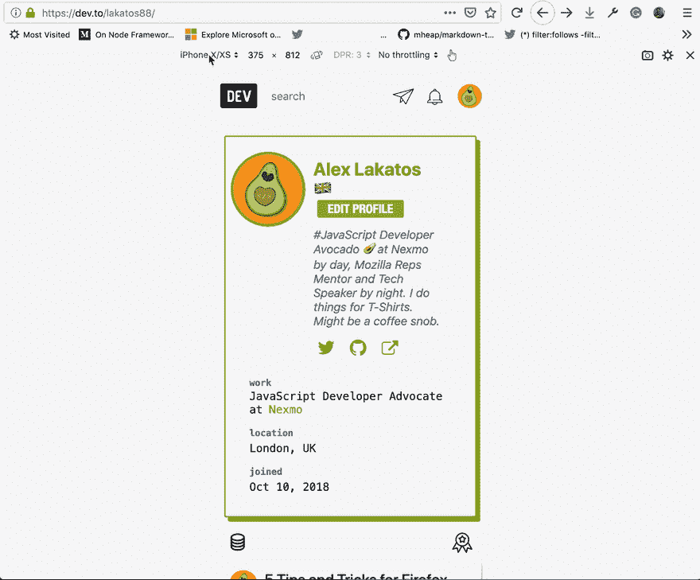
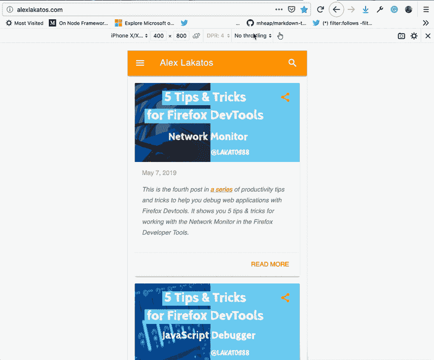
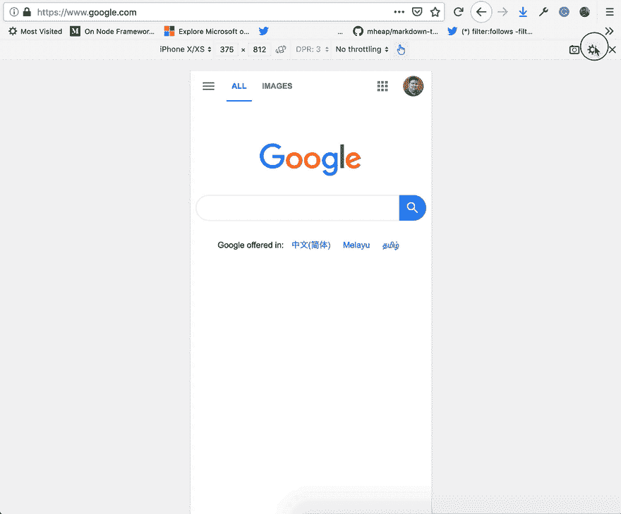

# Firefox DevTools 响应设计模式的 5 个技巧和窍门

> 原文：<https://dev.to/lakatos88/5-tips-and-tricks-for-firefox-devtools-responsive-design-mode-42bj>

这是我努力跟上的一个系列，这些年来我已经收集了很多技巧。如果你喜欢这个或者想看更多，我是推特上的[@ Lakatos 88](https://twitter.com/lakatos88)，跟我去吧！

*这是[系列](http://alexlakatos.com/devtricks/)中的第五篇文章，这是一系列帮助你用 Firefox Devtools 调试 web 应用程序的技巧和窍门。它向你展示了在 Firefox 开发者工具中使用响应式设计模式的 5 个技巧&。*

我使用响应式设计模式作为在移动设备上进行本地测试的快捷方式，而无需进行部署。节流功能、触摸事件和自定义大小使它完美地满足了我的需求。我喜欢这样一个事实，即我让其余的开发工具并行活动，而不必将它们连接到我的手机浏览器，也不必在两个不同的地方进行调试。它不适用于复杂的东西，如平移和缩放，但对于一个手指触摸事件来说已经足够了。有时我使用自定义用户代理只是为了看看一般情况下 UA 跟踪网站都做些什么。我不喜欢自 Firefox 60 以来，用户代理切换或启用触摸事件时不会自动重新加载的事实，但我理解该功能背后的原因。

## 添加自定义设备

你可以在 Firefox 开发者工具的响应模式下编辑显示尺寸，但是如果你想让它成为一个预置，你必须添加一个自定义设备。您可以打开设备下拉列表，并选择“编辑列表”。这为您提供了一个最常见的预置列表，您可以启用/禁用您需要的预置。如果这还不够，您可以添加自己的定制设备。如果你认为默认列表应该有所不同，Mozilla 正在维护一个 [GitHub repo](https://github.com/mozilla/simulated-devices) 为此，请随意提交一份 PR。

## 节流

您可以调节网络请求的速度，并查看您的网站在不同连接上的负载情况。Firefox 有很多对移动设备有用的预置，有一个直观的名字，而不是我必须猜测一个糟糕的 3G 连接会有多快。

## 模拟触摸事件

通过单击小手图标，可以在响应式设计模式下模拟触摸事件。它将禁用拖放选择，并启用触摸事件，包括点击和长时间点击事件。点击事件将被转换为点击事件，长点击事件将被模拟为长点击事件，从而打开上下文菜单。

## 变更用户代理

您可以从 Firefox DevTools 的响应式设计模式中更改用户代理字符串。你必须转到右上角的设置图标，并启用“显示用户代理”，然后你可以在输入字段中更改它。我个人也喜欢设置“当用户代理改变时重新加载”，因为大多数网站在加载时进行用户代理检测。你可以在这里看到当谷歌主页认为我不再是 iPhone，我是 DuckDuckGo 爬行机器人时，它是如何变化的😅。

## 左对齐视口

默认情况下，响应式设计模式是居中的，当我只进行测试时，这一切都很好。但是当我在调试时，我希望能够尽可能多地显示 DevTools 面板屏幕的其余部分。通过启用“设置”菜单中的选项，可以使响应设计视口向左对齐。

