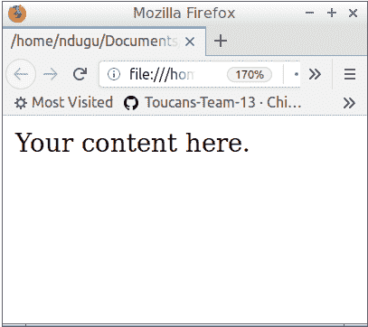
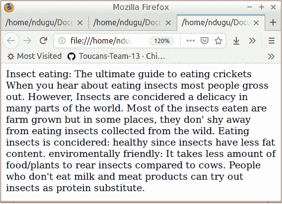
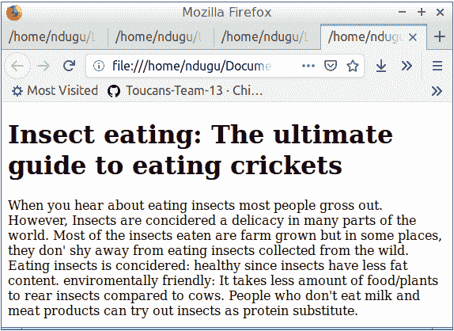
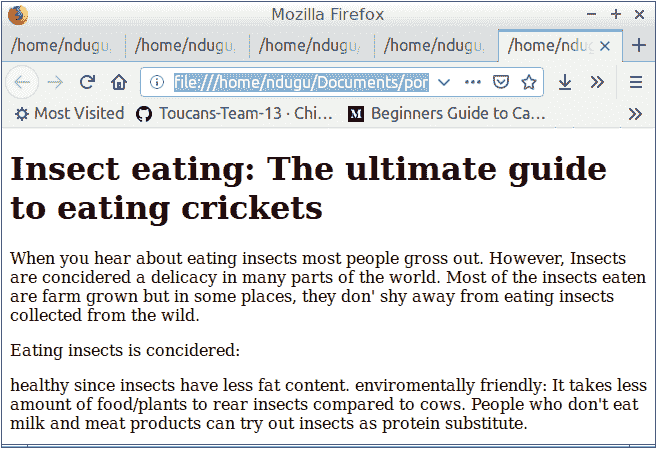
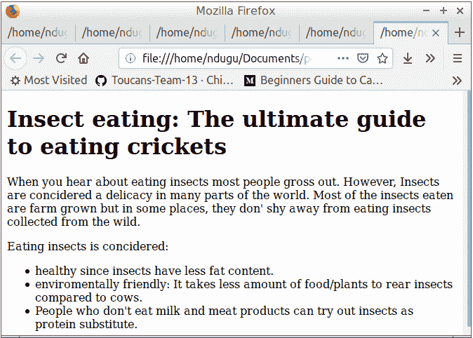
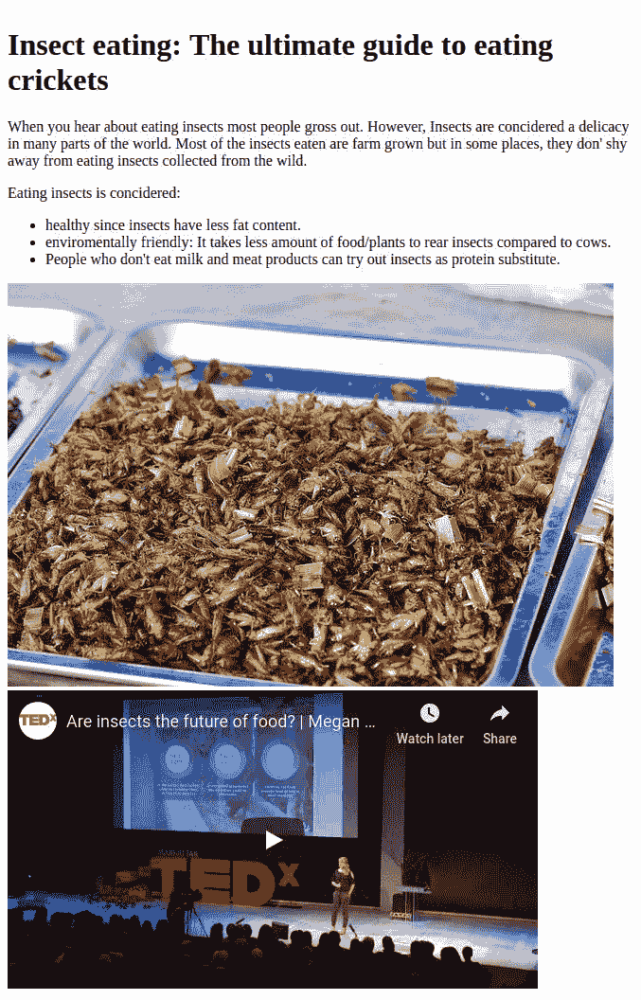
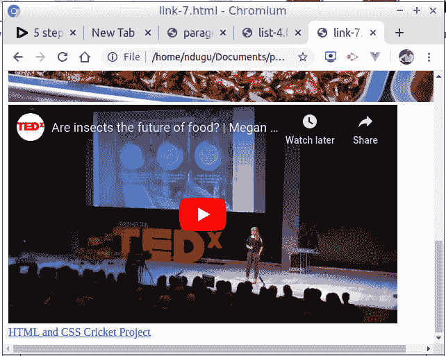

# 使用 HTML 创建网页的 9 个步骤[图解指南]

> 原文：<https://dev.to/avicndugu/9-steps-to-creating-a-web-page-using-html-illustrated-guide-32mg>

如果你曾经想知道 HTML 是如何被用来制作带有图片和视频的网站的，那你就来对地方了。我将带你经历用 HTML 建立一个单页网站的 9 个步骤。如果你能建立一个单页网站，你也能建立一个多页网站。

## 要求

你只需要两样东西:一个文本编辑器和一个浏览器。如果你知道如何使用这两个，跳过需求部分，进入 9 步过程。

### 1。文本编辑器

你需要一个文本编辑器来编写 HTML 代码。每台电脑都有文本编辑器，所以不要急着安装任何东西。你可以在 Windows 上使用**记事本，在 Ubuntu 上使用 Gedit，在 MacOS X 上使用【TextEdit。**

你会听说你应该安装的奇特的文本编辑器。然而，对于你的第一个 HTML 网页，你不需要安装任何东西。使用电脑中已有的文本编辑器。

在建立了你的第一个网页后，你可以检查一下我在制作网页时使用的其他工具，它们会让你的工作更加舒适。

### 2。浏览器

你将使用 **Firefox、Chrome、Chromium、Safari 或任何其他已经安装在你电脑上的浏览器**。

### 3。网页内容

所有网页总是包含各种格式的信息，如文本、图像、视频等。要制作一个网页，你需要添加一些内容或者使用虚拟文本和图像。

如果只是想练习，可以把我已经准备好的内容复制到这里。

如果您想要创建一个独特的网页，您必须:

*   **写内容**

编写或拷贝您将在网页上使用的文本内容，并将其存储在文稿中。如果你从网上其他来源复制了一些内容，记得复制来源的 URL。然后，将它保存在一个文档中。

如果你找不到网页的主题，在 [100 个主题创意中为你的第一个网页](https://devpractical.com/100-html-practice-projects-ideas-for-beginners/)选择一个主题。

*   **下载图片或复制图片网址**

找一些相关有用的图片。一旦你找到它们，下载图片或复制图片的网址并保存在文档中。

一旦有了文本和图像，就该进入下一步了。

### 4。网站设计

对于你的第一个网页，我建议你坚持简单的网页设计。网页设计是网站的外观。记住，你只是在练习如何建立网页，而不是设计网页。

你可以从我准备的这个简单的 html 项目集合中选择。

在本教程中，我们将建立一个关于蟋蟀食物的网页。 [](https://res.cloudinary.com/practicaldev/image/fetch/s--eoxn2qR1--/c_limit%2Cf_auto%2Cfl_progressive%2Cq_auto%2Cw_880/https://avicndugu.github.io/practice-projects-html/cricket-eating/screenshots/with-youtube.png) 

这个网页并不花哨，但却是一个不错的第一个项目。我把它作为一个专栏来让初学者保持友好。

## 创建你的第一个 HTML 网页的 7 个步骤

### 第一步:打开文本/ html 编辑器

还记得我之前提到的文本编辑器吗，是时候打开并使用它了。如果您以前使用过，请跳到下一部分。如果您不知道如何操作，下面的说明将根据您使用的计算机类型为您提供帮助。

*   如何在 Ubuntu 上打开文本编辑器 [Youtube]
*   [如何在 Window 电脑上打开文本编辑器](https://youtu.be/NO6ee3sQmu8) [Youtube]
*   [如何在 Mac 上打开文本编辑器](https://youtu.be/zCN75v4Bbdk) [Youtube]

打开您选择的文本编辑器后，创建一个新文件。然后，您可以进行下一步。

### 第二步:写一些 html 代码

我们现在要添加 HTML 锅炉板代码。这是允许浏览器正确显示您的网页的代码。

将以下代码复制并粘贴到您的文件中。您的文件现在应该是这样的:

```
<!DOCTYPE html>
<html>
  <head>
   
  </head>
  <body>
   Your content here.
  </body>
</html> 
```

按 CTRL + S 保存 html 页面，或者单击文件选项，然后单击保存选项。确保按照以下格式命名文件:“name”，然后是**。html "**index.html、cooking.html 的例子。

命名网页文件时，您可以使用以下两条准则:

*   **使用。html 文件扩展名:**文件扩展名 html 告诉计算机该文件是一个网页，应该用网络浏览器查看。
*   **使用下划线或连字符代替空格:**如果您选择将文件命名为多个单词，请在单词之间使用连字符或下划线。如果在文件名中加入空格，网页浏览器可能找不到该网页。

选择保存文件的位置。选择保存文件的位置后，单击保存。

查看文件。使用文件管理器导航到 HTML 文件所在的文件夹。右键单击该文件并用浏览器打开它。您应该会看到类似这样的内容。

[](https://res.cloudinary.com/practicaldev/image/fetch/s--4wIRTSnC--/c_limit%2Cf_auto%2Cfl_progressive%2Cq_auto%2Cw_880/https://avicndugu.github.io/practice-projects-html/cricket-eating/screenshots/basic-template-view.png)

### 第三步:添加文本内容

复制你之前写的内容或者我安排给你使用的现成内容。将它粘贴到 body 标签之间。

在浏览器上刷新网页。它看起来像一个没有段落或标题的文本块。

[](https://res.cloudinary.com/practicaldev/image/fetch/s--epkt2-WJ--/c_limit%2Cf_auto%2Cfl_progressive%2Cq_auto%2Cw_880/https://avicndugu.github.io/practice-projects-html/cricket-eating/screenshots/with-text-only.png)

### 第四步:添加 html 标签。

#### 标题

首先，我们将讨论标题。检查哪个部分或正文是主要标题。在我们的例子中是“吃昆虫:吃蟋蟀的终极指南”。

将此文本放在 h1 标签之间，如下所示:

```
 <h1>
    Insect eating: The ultimate guide to eating crickets
  </h1> 
```

保存您的工作并在浏览器上检查结果。

[](https://res.cloudinary.com/practicaldev/image/fetch/s--bhW5TZ75--/c_limit%2Cf_auto%2Cfl_progressive%2Cq_auto%2Cw_880/https://avicndugu.github.io/practice-projects-html/cricket-eating/screenshots/with-heading.png)

#### 段落

对于文本段落，将每个文本段落放在`<p></p>` html 标签之间。示例:

```
<p>
  When you hear about eating insects most people gross out. However, Insects are concidered a delicacy in many parts of the world. Most of the insects eaten are farm grown but in some places, they don' shy away from eating insects collected from the wild.
</p>
<p>
  Eating insects is concidered:
</p>
  healthy since insects have less fat content.
  enviromentally friendly: It takes less amount of food/plants to rear insects compared to cows.
  people who don't eat milk and meat products can try out insects as protein substitute. 
```

在浏览器上查看结果。

[](https://res.cloudinary.com/practicaldev/image/fetch/s--aDb_UhZ9--/c_limit%2Cf_auto%2Cfl_progressive%2Cq_auto%2Cw_880/https://avicndugu.github.io/practice-projects-html/cricket-eating/screenshots/with-paragraph.png)

### 第六步:添加列表

列表让我们的眼睛和大脑更容易阅读一组东西。让我们添加一个项目符号类型列表:

```
<ul>
  <li>healthy since insects have less fat content.</li>
  <li>enviromentally friendly: It takes less amount of food/plants to rear insects compared to cows.</li>
  <li>people who don't eat milk and meat products can try out insects as protein substitute.</li>
</ul> 
```

刷新并在浏览器上查看结果。

[](https://res.cloudinary.com/practicaldev/image/fetch/s--4IiTqr_i--/c_limit%2Cf_auto%2Cfl_progressive%2Cq_auto%2Cw_880/https://avicndugu.github.io/practice-projects-html/cricket-eating/screenshots/with-unordered-list.png)

### 第七步:添加图片

记住你保存的网址或图片。现在是释放它们的时候了。

我们将使用 HTML 的 img 标签``在网页上添加你的图片。

如果您只是复制了图像的 URL，您将在 src 属性的引号内添加 URL。记得添加 alt 属性，当图像无法显示时显示。示例:

```
 
```

[](https://res.cloudinary.com/practicaldev/image/fetch/s--ScDvuO50--/c_limit%2Cf_auto%2Cfl_progressive%2Cq_auto%2Cw_880/https://avicndugu.github.io/practice-projects-html/cricket-eating/screenshots/with-image.jpg)

### 第八步:嵌入一段 youtube 视频

在 youtube 上搜索相关视频。找到后，点击分享按钮/链接。你会看到一个弹出窗口。点击嵌入选项。

单击复制按钮复制显示的代码。

将您的代码粘贴到您希望显示视频的网页上。对于我的情况，这是我得到的代码:

```
<iframe width="560" height="315" src="https://www.youtube.com/embed/BwC4WRKi5QY" frameborder="0" allow="accelerometer; autoplay; encrypted-media; gyroscope; picture-in-picture" allowfullscreen></iframe> 
```

在浏览器上查看 html 页面。

[](https://res.cloudinary.com/practicaldev/image/fetch/s--_Fy0IXpw--/c_limit%2Cf_auto%2Cfl_progressive%2Cq_auto%2Cw_880/https://avicndugu.github.io/practice-projects-html/cricket-eating/screenshots/with-youtube.jpg)

如果你已经完成了所有的 8 个步骤，你应该有一个值得骄傲的 HTML 页面。

### 第九步:给你的信息来源添加一个链接

如果您从另一个网页上复制了一些内容，添加一个指向原始信息来源的 URL 被认为是合适的。

您可以使用`<a href="URL">Words explaining what you will find if you click on the link</a>` HTML 标签添加链接。

```
<a href="https://avicndugu.github.io/practice-projects-html/cricket-eating/final/">HTML and CSS Cricket Project</a> 
```

在浏览器上查看 html 页面。你现在应该在底部有一个链接，上面写着:“HTML 和 CSS 板球项目”。

[](https://res.cloudinary.com/practicaldev/image/fetch/s--o1kBqg8M--/c_limit%2Cf_auto%2Cfl_progressive%2Cq_auto%2Cw_880/https://avicndugu.github.io/practice-projects-html/cricket-eating/screenshots/with-link.jpg)

### 附加提示

*   测试您的链接，以确保它们正常工作。你可以通过点击它们来测试你的链接，看看它们是否把你带到了正确的页面。
*   **可选:**在线发布网页。一旦你准备好了，你就可以在网上分享你的作品。您可以使用 github 或 codepen 在线发布您的网页。
*   **可选:**添加一些 CSS，让网页看起来很棒。一旦你完成了 HTML 的工作，你就可以使用 CSS 来设计网页的样式了。以下是一些让网页变得更好的方法:
*   调整文本的字体大小和字体类型。
*   调整图像的大小。如果您下载了图像，我们会将它们放在一个文件夹中。常见的做法是将所有要使用的图像放在一个文件夹中。因此，让我们创建一个名为 img 的文件夹。在此添加您下载的所有图像。