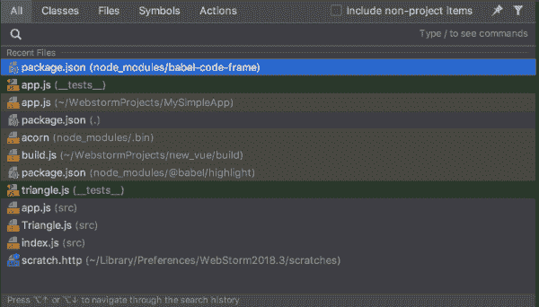
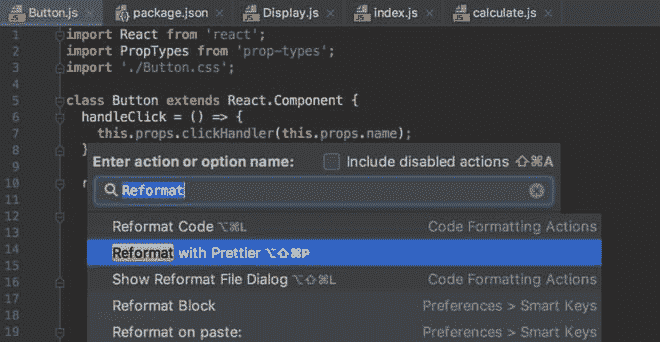
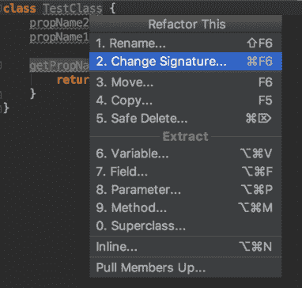
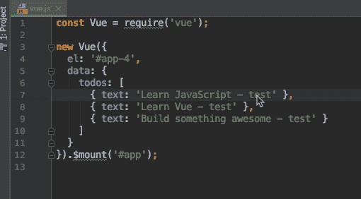
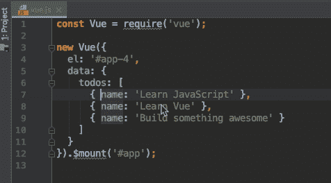
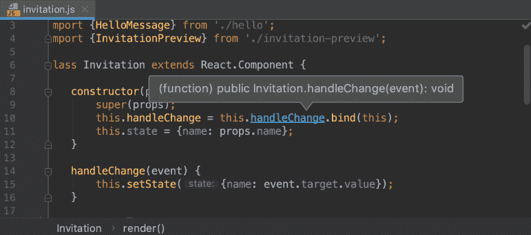
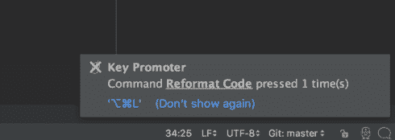

# 9 个 Webstorm 生产力技巧

> 原文：<https://dev.to/vuesomedev/9-webstorm-productivity-tips-4fg>

Webstorm 是一款优秀的 web 开发 IDE。它有许多有用的特性使我们的生活变得更容易，所有这些特性都旨在自动化编码的重复部分。回头看看我几年前的编码速度，好像蜗牛的速度。区别不在于我的打字速度，而在于我对自己使用的工具了解多少。了解这个工具意味着了解它提供的特性。我已经收集了那些对加速最有价值的特性。

### 实时模板

[Live template](https://www.jetbrains.com/help/webstorm/using-live-templates.html)对于快速插入常用代码段很有用。当您键入缩写并点击 tab 键时，编辑器会添加整个模板。模板也可以有占位符:它们必须被填充以完成插入。

让我们看一个例子。我们在 TDD 中开发([测试驱动开发](https://technologyconversations.com/2013/12/20/test-driven-development-tdd-example-walkthrough/))并编写许多测试。使用 Mocha 和 Jasmine 作为测试框架，你必须插入`describe`和`it`块。输入这些方块的每个字符是重复的方式。

快速的方法是为`describe`块(缩写:`de`)创建一个 live 模板。

```
describe('$TESTGROUP$', function() {
  $END$
}); 
```

Enter fullscreen mode Exit fullscreen mode

同样，为`it`块创建一个(缩写:`it`)。

```
it('should $TESTCASE$', function() {
  $END$
}); 
```

Enter fullscreen mode Exit fullscreen mode

占位符以`$`符号开始和结束。占位符`$END$`有一个特殊的含义:这是插入后光标所在的位置。

[](https://res.cloudinary.com/practicaldev/image/fetch/s--5Dn_IvGI--/c_limit%2Cf_auto%2Cfl_progressive%2Cq_66%2Cw_880/https://thepracticaldev.s3.amazonaws.com/i/27yhd9sw3gdcvpim3yy8.gif)

### 到处搜索

在项目文件中搜索文本是大多数 ide 中的一个常见特性，但是在其他编辑器中搜索其他内容，比如菜单栏中的操作或声明，却很少见。最棒的是，你可以用一个命令搜索文件、菜单动作和声明:只需双击`Shift`按钮和[开始搜索所有地方](https://www.jetbrains.com/help/webstorm/searching-everywhere.html)。

[](https://res.cloudinary.com/practicaldev/image/fetch/s--uPYQu7iw--/c_limit%2Cf_auto%2Cfl_progressive%2Cq_66%2Cw_880/https://thepracticaldev.s3.amazonaws.com/i/3k8ow6bpl981zml7tz5c.gif)

### 漂亮些

是一个自以为是的代码格式化程序，支持许多语言，如 Javascript，Typescript，CSS，HTML 等。通过使用它，您可以节省代码格式化的时间和精力。
你可以通过它的插件给网络风暴[添加更漂亮的东西。要使代码格式化自动化，您还必须添加一个文件监视器。这个文件监视器](https://plugins.jetbrains.com/plugin/10456-prettier)将监听保存事件，当它发生时，在保存的文件上运行更漂亮的代码格式。
如果你不喜欢自动代码更新，可以用键盘快捷键手动完成。

[](https://res.cloudinary.com/practicaldev/image/fetch/s--pjCYHJRY--/c_limit%2Cf_auto%2Cfl_progressive%2Cq_auto%2Cw_880/https://thepracticaldev.s3.amazonaws.com/i/djkf62duzm0z7obvbzn9.jpg)

### 重构

当代码变得混乱，或者我们发现重复的部分，我们倾向于进行重构。如果重构后的代码被用在很多地方，这可能是一个容易出错的任务。在这种情况下，Webstorm 通过其内置的重构功能来帮助我们。如果目标是一个变量，我们可以通过单击鼠标来重命名、提取、内联或移动它。方法也是如此。

[](https://res.cloudinary.com/practicaldev/image/fetch/s--1aLPUMEk--/c_limit%2Cf_auto%2Cfl_progressive%2Cq_auto%2Cw_880/https://thepracticaldev.s3.amazonaws.com/i/591fltyi7z28vykg1pu4.png)

### 多光标编辑

大多数时候，我们习惯在光标等待的地方编辑代码。有时候我们不得不在不同的地方做同样的编辑。直接的解决方案是在一个地方编辑它，复制它，然后粘贴到所有位置。更快的方法是通过按 Alt 键(⌥)并单击位置来将光标放置在多个位置。光标出现在我们点击的所有位置，并且在光标所在的位置打字。

[](https://res.cloudinary.com/practicaldev/image/fetch/s--_UrIzlZv--/c_limit%2Cf_auto%2Cfl_progressive%2Cq_66%2Cw_880/https://thepracticaldev.s3.amazonaws.com/i/buxx9i0lgo2aqq4cei8q.gif)

一个特殊的情况是当我们想要编辑的地方在同一列中。此时，我们可以切换到列选择模式:我们可以选择列并编辑这些列中的代码，而不是行。

[](https://res.cloudinary.com/practicaldev/image/fetch/s--nH4VH8JP--/c_limit%2Cf_auto%2Cfl_progressive%2Cq_66%2Cw_880/https://thepracticaldev.s3.amazonaws.com/i/a2dxbcyct51r8emjzbws.gif)

第三个多光标用例是当我们选择所选文本的所有出现的地方(编辑>查找>选择所有出现的地方)并且在任何地方进行键入/删除。

### 代码导航

如果你使用一个库，你想知道那个类/函数是如何工作的，你必须搜索并打开那个文件。Webstorm 让这种导航变得更加容易。按住命令按钮(⌘)会将光标变为显示定义模式。如果您将鼠标悬停在导入的类/函数上，它会显示其接口。单击悬停的元素会导航到定义。按 Command + B 就可以不使用光标进行导航了，现在知道定义了，但是想回到之前的地方。Webstorm 可以导航回上一次编辑的位置(⌘ + ⌥ + ←)，使得代码导航速度极快。

[](https://res.cloudinary.com/practicaldev/image/fetch/s--3BImSrFG--/c_limit%2Cf_auto%2Cfl_progressive%2Cq_auto%2Cw_880/https://thepracticaldev.s3.amazonaws.com/i/a0hf2ne22qii9gy8564u.png)

### 关键发起人

默认情况下，Webstorm 有 100 多个快捷方式，用于几乎所有的操作和代码修改。你都认识吗？我不知道。然而，[key promoter 插件](https://plugins.jetbrains.com/plugin/9792-key-promoter-x)会通知你是否不使用它们。当你用键盘快捷键进行交互时，插件会在右下角告诉你。

[](https://res.cloudinary.com/practicaldev/image/fetch/s--F9d9kpk0--/c_limit%2Cf_auto%2Cfl_progressive%2Cq_auto%2Cw_880/https://thepracticaldev.s3.amazonaws.com/i/4lrnj4uav6039j32hk66.png)

### 键盘快捷键

推动者是一个很好的方式来学习你所使用的东西的捷径，但是那些你不知道的呢？至少通读一遍快捷方式列表是值得的。我已经列出了我认为最有用的东西。

*   删除行(⌘ + ⌫)
*   向上/向下移动线条(⇧ + ⌥ + ↑或↓)
*   显示偏好设置(⌘ +，)
*   重复的线条或选区(⌘ + D)
*   到处搜索(双⇧)
*   扩大或缩小选择范围(⌥ + ↑或↓)
*   列选择模式(⌘ + ⇧ + 8)
*   在路径中查找(⌘ + ⇧ + F)
*   在路径中替换(⌘ + ⇧ + R)
*   重命名定义或变量(⇧ + F6)
*   转到申报(⌘ + B，⌘ +点击)
*   前往上一个编辑位置(⌘ + ⌥ + ←或→)
*   代码完成(⌘ +空格)
*   多个光标(⌥ +点击)
*   表明意图(⌥ + ⏎)
*   触发列选择模式(⌘ + ⇧ + 8)
*   表明意图(⌥ + ⏎)
*   注释/取消注释当前行/选择(⌘ + /)
*   重整码(∞++l)
*   选择所有事件(^ + ⌘ + G)

我已经列出了 Mac 上的默认快捷键。你可以在[参考页](https://www.jetbrains.com/help/rider/Reference_Keyboard_Shortcuts_Index.html)上找到 Windows 和 Linux 的对等物。他们甚至有快捷列表，在那里他们可以比较不同的列表。

### 内置端子

如果 IDE 中有命令行，为什么还要让它使用命令行呢？Webstorm 内置了一个支持多个会话的终端，可以用热键访问。

### 总结

在这篇文章中，我们列出了许多不同的特性，它们可以加速开发，让你更有效率。你是否使用它们取决于你自己。最重要的是了解他们。如果你开始使用一个工具，学习它。如果你用它开发了一段时间，请以有序的方式重新检查它的特性。因为通过掌握你使用的工具，你变得更有生产力。