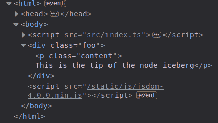

# Preact 初学者教程——第 2 部分:DOM 和 Hyperscript

> 原文：<https://dev.to/solarliner/a-beginners-tutorial-to-preact-part-2-dom-hyperscript-and-jsx-48op>

# 如何从 JavaScript 中诞生 ~~HTML~~ DOM

在我们深入编写“HTML”之前，让我们澄清一些事情。

## 文档对象模型

DOM 实际上是浏览器在将网页加载到内存中时将 HTML 翻译成的内容。DOM 包含当前文档的所有信息。这是一棵树，从一个根元素分支出来(如 HTML 中的`<html>`标记所示)。HTML 是 DOM 的书面表示，JavaScript 操纵 DOM 而不是 HTML，因为修改内容树比编写 HTML 供浏览器再次解析要快。

## 从 JavaScript 创建 DOM 节点

理想情况下，我们需要一种快速的方法来键入我们想要作为可重用元素的一部分插入的 DOM，这些可重用元素将成为我们应用程序的基础。简而言之，必须创建、设置一个 DOM 节点，并将其作为另一个节点的子节点附加到页面上，这样它才能出现在浏览器窗口中。一个普通的 JavaScript 解决方案应该是这样的:

```
const element = document.createElement("div");
element.classList.add("foo");
element.appendChild(document.createTextNode("I am the visible part of the node iceberg");

document.body.appendChild(element); 
```

这将创建以下 DOM(用 HTML 表示):

```
<div class="foo">I am the visible part of the node iceberg</div> 
```

第二个版本在 div:
中嵌套了段落元素

```
const divEl = document.createElement("div");
element.classList.add("foo");
const parEl = document.createElement("p");
parEl.classList.add("content");
parEl.appendChild(document.createTextNode("I am the visible part of the node iceberg"));

document.body.appendChild(element); 
```

将呈现以下 DOM:

```
<div class="foo"><p class="content">I am the visible part of the node iceberg</p></div> 
```

鉴于这是将内容插入页面的典型模式(或者更一般地说，是“DOM 操纵”)，我们显然可以做得更好。

让我们定义一个函数，用给定的标签和类列表创建元素，并返回它。

注意:这些类型来自 TypeScript，我将在本系列中使用它。去掉类型(在冒号之后)使其成为常规的 JavaScript。

```
/**
 * Creates an element and returns it
 * @param tag Tag name, like the HTML tag
 * @param classes List of CSS classes to apply
 */
function createElement(tag: string, classes: string[]) {
  const el = document.createElement(tag);
  for (const klass of classes) {
    if (klass === "" || klass === undefined) continue;
    el.classList.add(klass);
  }

  return el;
} 
```

好吧，但这没用。我们仍然需要手动将它们插入页面。我们可以通过两种方式来实现:要么添加一个父节点作为函数的参数，要么添加一个子节点列表到正在创建的元素中。

第一种解决方案意味着我们需要首先定义父节点，以便将其传递给子节点，避免重复，并确保所有子节点都有相同的父节点。这引入了样板文件。

第二种解决方案没有第一种的缺点；此外，您可以简单地嵌套对`createElement`函数的调用，以同时创建父节点和子节点。对`createElement`的最顶层调用返回的节点可以直接附加到现有节点，将整个子树插入到页面中。

## 如何发短信

DOM 是一个树形结构，这意味着一切都是一个节点。因此，普通的旧文本是一个节点。但是它与 DOM 中的其他节点被区别对待，特别是因为它不能有子节点。

*注意:从技术上讲，TextNode 和其他 HTML 元素几乎没有什么不同，因为 TextNode 继承了`Node`，而`HTMLElement`继承了`Element`，后者继承了`Node`本身。因此，`HTMLElement`最终比 TextNode 更加“丰富”。阅读更多关于[文本](https://developer.mozilla.org/en-US/docs/Web/API/Text)和[html 元素](https://developer.mozilla.org/en-US/docs/Web/API/HTMLElement)T10】*

这意味着我们必须在函数中让路来处理这个特例。我们将允许传递字符串来代替 HTML 元素，HTML 元素将被转换成文本节点。

我们的函数变成这样:

```
/**
 * Creates an element and returns it
 * @param tag Tag name, like the HTML tag
 * @param classes List of CSS classes to apply
 * @param children Children nodes to append into the created element
 */
function createElement(
  tag: string,
  classes: string[],
  ...children: (HTMLElement | string)[]
) {
  const el = document.createElement(tag);

  // Append given CSS classes
  for (const klass of classes) {
    if (klass === "" || klass === undefined) continue;
    el.classList.add(klass);
  }
  // Insert children
  for (const child of children) {
    // Text is special in the DOM, we must treat it accordingly
    if (typeof child === "string") {
      el.appendChild(document.createTextNode(child));
    } else {
      el.appendChild(child);
    }
  }
  return el;
} 
```

我们现在可以用嵌套的`createElement`调用:
从上面重新创建 DOM

```
document.body.appendChild(
  createElement(
    "div",
    ["foo"],
    createElement("p", ["content"], "This is the tip of the node iceberg")
  )
); 
```

这给了我们与先前相同的结果:

[https://codesandbox.io/embed/pkc5e](https://codesandbox.io/embed/pkc5e)

[](https://res.cloudinary.com/practicaldev/image/fetch/s--LqS7E9GJ--/c_limit%2Cf_auto%2Cfl_progressive%2Cq_auto%2Cw_880/https://i.imgur.com/Q1VyPoA.png)

## 图像呢？

然而，我们当前的函数有一个严重的限制，那就是我们不能在标签中包含其他属性。我们需要一般化我们的函数，以便它接受一个属性对象来添加到元素中。

```
/**
 * Creates an element and returns it
 * @param tag Tag name, like the HTML tag
 * @param attrs Object of attributes to add to the node
 * @param children Children nodes to append into the created element
 */
function createElement(
  tag: string,
  attrs: object,
  ...children: (HTMLElement | string)[]
) {
  const el = document.createElement(tag);

  // Append given CSS classes
  for (const key of Object.keys(attrs)) {
    el.setAttribute(key, attrs[key]);
  }
  // Insert children
  for (const child of children) {
    // Text is special in the DOM, we must treat it accordingly
    if (typeof child === "string") {
      el.appendChild(document.createTextNode(child));
    } else {
      el.appendChild(child);
    }
  }
  return el;
} 
```

我们所创造的，或多或少，是**超脚本**。 [Hyperscript](https://github.com/hyperhype/hyperscript) 是一个小库，它做了我们刚刚做过的事情:它将 DOM 元素的创建封装到嵌套的函数调用中。出于这个原因，并且为了缩短函数的名称，让我们将其重命名为`h`，对于`hyperscript`。

完成后，让我们创建一些 DOM 并插入到页面中！

```
const root = h(
  "app",
  { id: "app" },
  h(
    "header",
    {},
    h("h1", {}, "My custom-generated web page"),
    h("h2", {}, "How neat is that?")
  ),
  h(
    "section",
    {},
    h(
      "div",
      { class: "container" },
      h("p", { class: "content" }, "That's pretty neat.")
    )
  )
);

// Prepending here because scripts should ideally be at the end of the body
document.body.prepend(root); 
```

[https://codesandbox.io/embed/ce6pt](https://codesandbox.io/embed/ce6pt)

# 结论

我们现在有了一个强大的通用函数来构造我们想要的任何 DOM 树。在这个`h`函数之上，还有最后一件需要知道的事情，这个函数在几乎所有的 Preact 项目中使用，并且在某种程度上它又回到了原点。