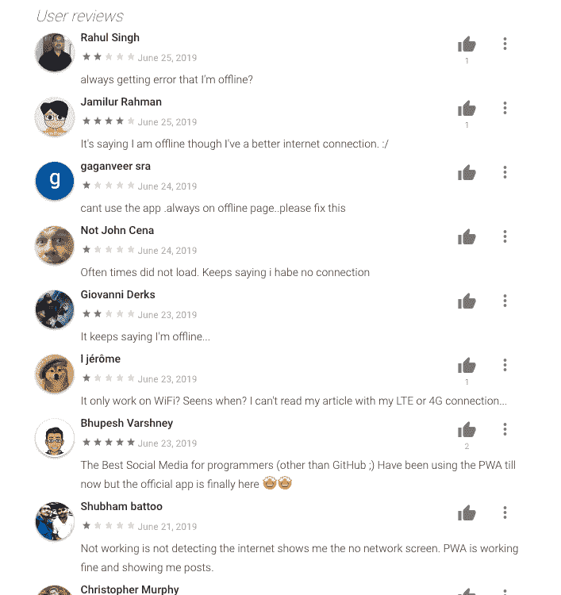

# Chrome 75 中的一个错误导致了随机离线页面

> 原文：<https://dev.to/devteam/a-bug-in-chrome-75-caused-random-offline-pages-4jii>

接近五月底的时候，我们开始收到很多开发者用户的报告，说我们的 Android 应用给他们一个 **`Offline`** 的消息，即使他们有互联网连接。其他报告来自试图从脸书应用内浏览器、DuckDuckGo 浏览器和其他浏览器访问开发文章的用户。这引起了我们的警觉，我们立即着手解决这个问题。几天过去了，我们无法在缓解问题上取得任何进展。

我们根本无法在我的手机或模拟器上重现这个问题。

由于我们在 Android 应用中使用网络视图，这种情况对我们的[谷歌 Play 商店评论](https://play.google.com/store/apps/details?id=to.dev.dev_android&hl=en_US)不利:

我给自己设定了一个隧道，认为只要我自己复制它，就能解决这个问题。刚要放弃求助，就发现了这个 [bug 报告单](https://bugs.chromium.org/p/chromium/issues/detail?id=977784)。

> 从 5 月底开始，我们开始收到零星的读者投诉，称我们的应用程序报告说，由于应用程序离线，某些功能不可用，而实际上是在线的。我们通过发出网络请求，在某些操作之前验证连通性，但这是失败的。

原来这个错误是由他们在 Chrome 75 上进行的一个实验引起的。根据不同的设备，WebView 将依赖于 Chrome 75，因为它仍然是一个实验，它可以随机发生。简单地说，如果`IoThreadClient`为空，web 请求被中止，因此立即离线页面。他们一找到原因，就迅速解决了问题

在这份漏洞报告中，来自知名出版物的工程师们也加入了进来，比如 LinkedIn 和 T2 的《金融时报》。他们还维护依赖服务人员的应用程序，也同样感到沮丧。这些应用程序被数十亿客户集体使用，许多人非常不高兴。这是一个特别具有破坏性的错误，因为他们的应用程序没有做错什么，却遭到了许多糟糕的评级和愤怒的评论。

有[一些报道](https://bugs.chromium.org/p/chromium/issues/detail?id=977784#c111)说这个问题对某些人来说可能还在继续，但是对 Chromium 团队这么快就做出了修复表示感谢。这个问题还没有最终解决，但应该很快就会解决。

对于那些可能仍然遇到这个问题的人，尝试清除一次或两次我们的应用程序的存储/缓存，你应该可以访问我们的应用程序。它可能会产生一个修复，如果没有，它应该有希望很快 100%修复。