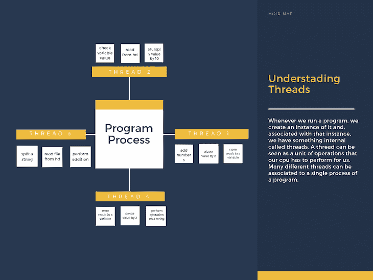
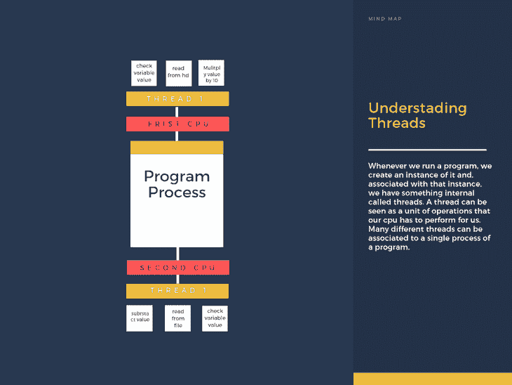
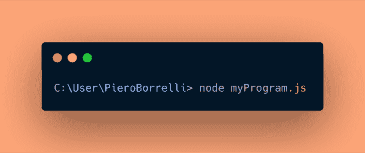
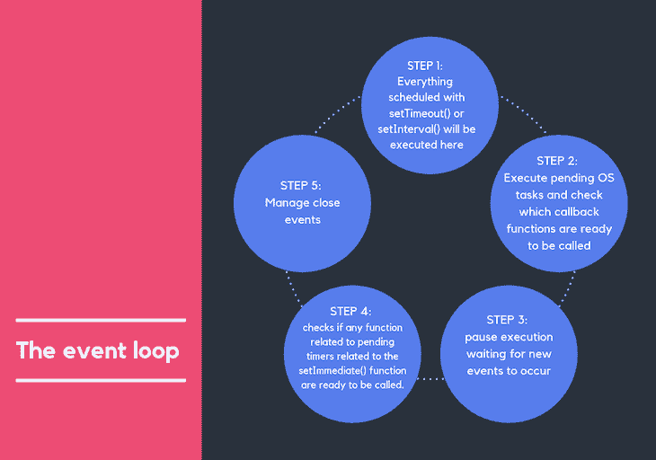

# Node.js 事件循环的完整指南

> 原文：<https://dev.to/bnevilleoneill/a-complete-guide-to-the-node-js-event-loop-1o5h>

每当我听到人们谈论 Node.js 时，就会产生许多关于[到底是什么](https://nodejs.org/it/)，这项技术有什么用，以及[是否有未来](https://medium.com/zerotomastery/want-to-be-a-web-developer-learn-node-js-not-php-dc298154fafd)的问题。

让我们试着解决第一部分。对我来说，回答这样一个问题的最简单的方法是列出技术上节点的许多定义:

*   Node.js 是基于 Chrome 的 V8 JavaScript 引擎构建的 Javascript 运行时环境。
*   Node.js 使用事件驱动的非阻塞 I/O 模型，这使它变得轻量级和高效。
*   节点包生态系统(npm)是全世界最大的开源库生态系统。

但是，所有这些答案都不能让我满意；少了点什么。在阅读了上面的要点之后，您可能会认为 Node.js 只是另一种 JavaScript 技术，但是理解它最重要的部分是通过分析它如何能够是异步的，以及如何拥有一个完全非阻塞的 I/O 系统。

这才是它成为每个 web 开发人员的必备工具的真正原因。

准确理解 Node 在幕后是如何工作的，不仅会增加对这项技术的了解，还会吸引那些还没有使用过它的人真正投入其中并开始学习。

对于所有已经是该领域专业人士的人来说，了解它的来龙去脉将把你变成一个新的、最新的开发者，完全有能力根据你的需要增强它的性能。

因此，为了挖掘 Node 的世界，我们将检查它的核心部分:**事件循环**，事实上，它是负责其非阻塞 I/O 模型的部分。

## 线程上的短暂刷新

在深入事件循环之前，我想花一些时间在**线程**上。如果你想知道为什么这是必要的，我会告诉你，为了更好地理解一个概念，我们必须首先在我们的脑海中形成一个词汇，这将有助于我们认识系统的每个部分。当稍后阅读关于事件循环、它如何工作以及线程的概念如何应用于它时，这最终会有很大的好处。

每当我们运行一个程序时，我们都会创建它的一个实例，并且，与这个实例相关联，我们有一个内部的东西叫做 **[线程](https://en.wikipedia.org/wiki/Thread_(computing))** 。线程可以被看作是我们的 CPU 必须为我们执行的一个操作单元。许多不同的线程可以与程序的单个进程相关联。这里有一个图表可以帮助你在头脑中形成这个想法:

<figure> 

<figcaption>螺纹上的简单图形。</figcaption>

</figure>

当谈到线程时，需要理解的最重要的部分是:**我们的机器如何决定在任何给定的时刻处理哪个线程？**

正如我们所知，我们的机器有有限的资源(CPU、RAM)，所以正确地确定我们将把它们分配到哪里，或者更好地，哪些操作优先于其他操作，是非常重要的。这一切都必须在确保没有人的操作花费太多时间的情况下发生，没有人喜欢速度慢的笔记本电脑。

用来解决分配问题的机制叫做 [**调度**](https://www.tutorialspoint.com/operating_system/os_process_scheduling.htm) ，它由我们的操作系统通过一个叫做 OS 调度器的实体来管理。这背后的逻辑可能非常复杂，但长话短说，我们可以将执行此操作的两种最大方式归为一组:

*   **[多核机器](https://www.machinedesign.com/mechanical/what-s-difference-between-single-and-multiple-core-solvers) :** 给不同的内核分配不同的线程。

<figure> 

<figcaption>多核机器如何处理线程。</figcaption>

</figure>

*   **使用减少停滞时间的优化逻辑:**这是与我们最相关的方法。如果我们仔细看看线程是如何工作的，我们会发现，我们的操作系统调度程序可以识别 CPU 何时在等待其他资源来执行某项任务，因此它可以被分配来同时执行其他操作。这通常发生在非常昂贵的 I/O 操作中，例如从硬盘读取。

## 事件循环

既然我们已经对线程如何工作有了一个健康的更新，我们终于可以处理 **Node.js 事件循环逻辑**。读到这里，你就会明白前面解释背后的原因，每一件作品都会自己走到正确的位置。

每当我们运行一个节点程序时，就会自动创建一个线程。这个线程是我们整个代码库被执行的唯一地方。在它的内部，生成了一个叫做**事件循环**的东西。这个循环的作用是调度我们唯一的线程在任何给定的时间点应该执行哪些操作。

请注意:事件循环不会在我们运行程序时立即生成。事实上，它只在整个程序执行完毕后才运行。

## 详细

现在让我们试着模拟事件循环是如何工作的，以及它是如何让我们的程序工作的。为此，我将假设我正在向 Node 提供一个名为`myProgram`的文件，然后深入了解事件循环将如何处理它的细节。

特别是，我将首先写一个简短的图形解释，说明在任何事件循环周期中发生了什么，然后我将更深入地探索这些阶段。

<figure> 

<figcaption>对事件循环的图形化解释。</figcaption>

</figure>

### 第一步:`performChecks`

我不需要告诉你事件循环实际上是一个循环。这意味着它有一个特定的条件来决定循环是否需要再次迭代。事件循环的每次迭代被称为**节拍**。

#### 事件循环执行滴答的条件是什么？

每当我们执行程序时，都会有一系列需要执行的操作。这些操作可以分为三种主要类型:

*   等待计时器操作(`setTimeout()`、`setInterval()`、`setImmediate()`)
*   挂起的操作系统任务
*   等待执行长时间运行的操作

我们将在后面更详细地讨论这些问题；现在，让我们记住，只要这些操作中有一个挂起，事件循环就会执行一个新的滴答。

### 第二步:执行滴答

对于每个循环迭代，我们可以区分以下阶段:

*   **阶段 1:** 节点查看其内部的未决定时器集合，并检查传递给`setTimeout()`和`setInterval()`的哪些回调函数准备好在定时器到期时被调用。

*   **阶段 2:** 节点查看其内部的未决操作系统任务集合，并检查哪些回调函数准备好被调用。这方面的一个例子可以是从我们机器的硬盘驱动器中完全检索一个文件。

*   **阶段 3:** 节点暂停其执行，等待新事件的发生。对于新事件，我们包括:新计时器完成、新 OS 任务完成、新挂起操作完成。

*   **阶段 4:** 节点检查与`setImmediate()`函数相关的未决定时器相关的任何函数是否准备好被调用。

*   **阶段 5:** 管理关闭事件，用于清理应用程序的状态。

## 关于事件循环的常见问题和误区

### node . js 是完全单线程的吗？

这是对这项技术非常普遍的误解。Node 运行在单线程上，但是 Node.js 标准库中包含的一些函数却没有(例如`fs`模块函数)；它们的逻辑在 Node.js 单线程之外运行。这样做是为了保持我们程序的速度和性能。

### 这些其他线程外包到哪里去了？

使用 Node.js 时，使用一个名为 **libuv** 的特殊库模块来执行异步操作。这个库还与 Node 的后台逻辑一起用于管理一个特殊的线程池，称为 **libuv 线程池**。

这个线程池由四个线程组成，用于委托对于事件循环来说太重的操作。事件循环逻辑中的上述长时间运行的任务表示这里描述的那些操作对于事件循环来说代价太高。

### 所以事件循环是一种类似堆栈的结构？

从这个意义上说，虽然上述过程中涉及到一些类似堆栈的结构，但更准确的答案应该是，事件循环由一系列阶段组成，每个阶段都有自己特定的任务，都以循环重复的方式进行处理。关于事件循环确切结构的更多信息，[请看这篇演讲](https://www.youtube.com/watch?v=PNa9OMajw9w)。

## 结论

理解事件循环是使用 Node.js 的一个至关重要的部分，无论您是试图获得关于这项技术的更多见解，了解如何提高其性能，还是找到一个新的、有趣的理由来学习一种新工具。

这本指南应该有助于你探索这个主题。欢迎在下面留下评论，意见和反馈对帮助大家更好地学习非常有用。

更多类似的内容，请关注我的[推特](https://twitter.com/BorrelliDev)和我的[博客](https://thecoderswag.com/)。

* * *

## Plug: [LogRocket](https://logrocket.com/signup/) ，一款适用于网络应用的 DVR

[log rocket](https://logrocket.com/signup/)是一个前端日志工具，让你重放问题，就像它们发生在你自己的浏览器中一样。LogRocket 不需要猜测错误发生的原因，也不需要向用户询问截图和日志转储，而是让您重放会话以快速了解哪里出错了。它可以与任何应用程序完美配合，不管是什么框架，并且有插件可以记录来自 Redux、Vuex 和@ngrx/store 的额外上下文。

除了记录 Redux 动作和状态，LogRocket 还记录控制台日志、JavaScript 错误、stacktraces、带有头+体的网络请求/响应、浏览器元数据、自定义日志。它还使用 DOM 来记录页面上的 HTML 和 CSS，甚至为最复杂的单页面应用程序重新创建像素级完美视频。

[免费试用](https://logrocket.com/signup/)。

* * *

帖子[node . js 事件循环的完整指南](https://blog.logrocket.com/a-complete-guide-to-the-node-js-event-loop/)首先出现在 [LogRocket 博客](https://blog.logrocket.com)上。